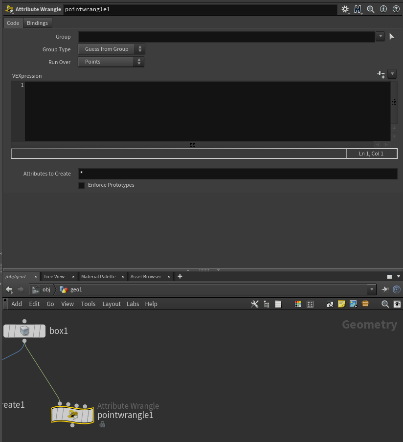
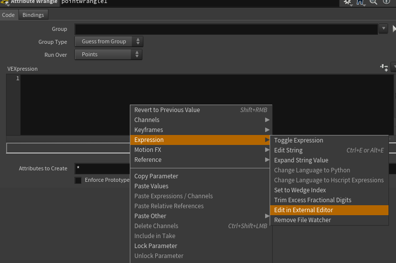
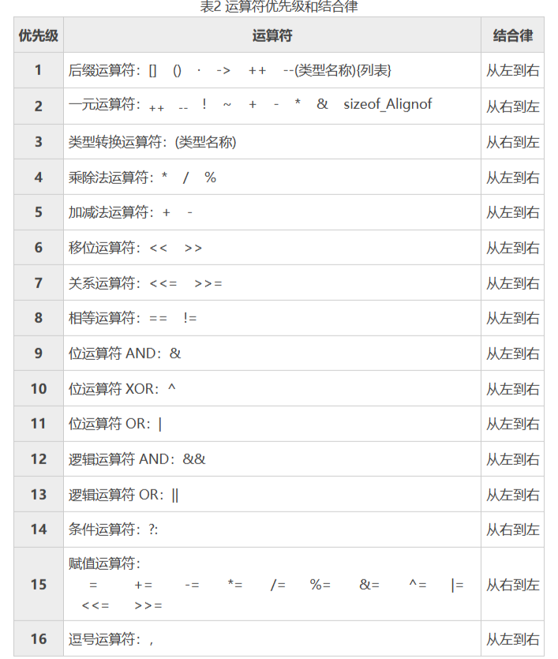
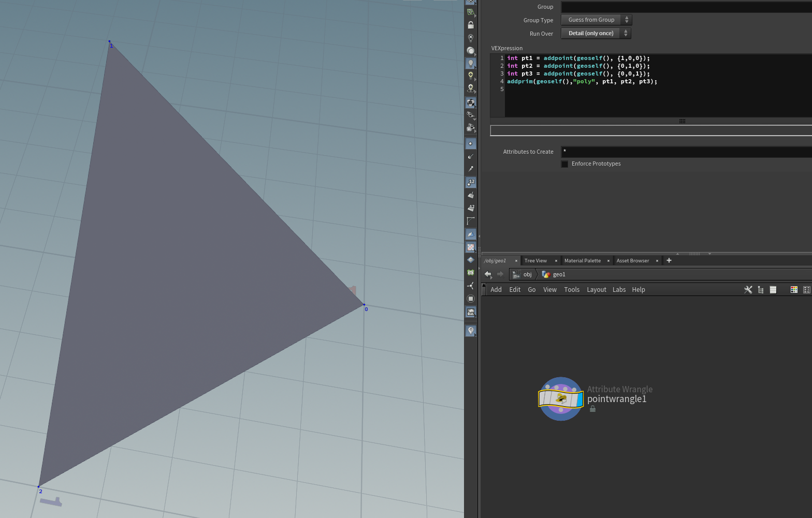
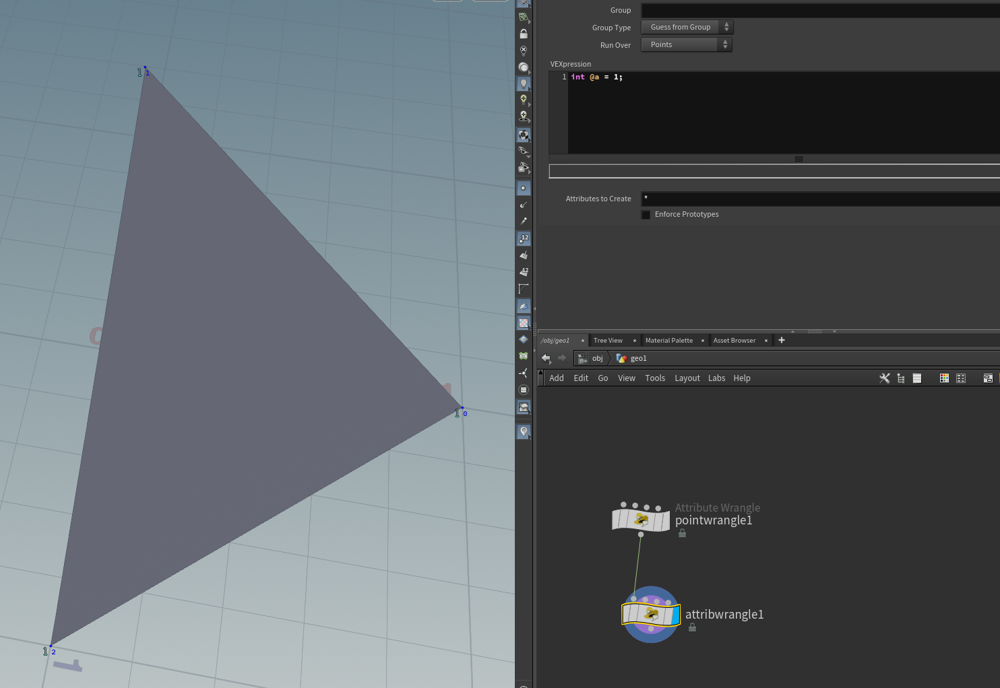
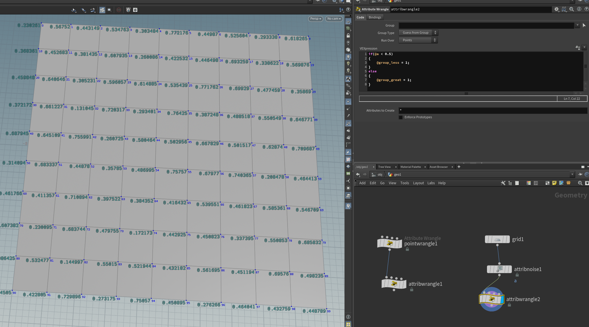
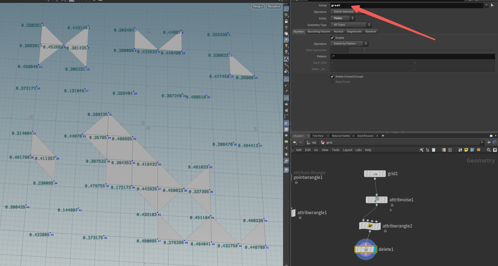
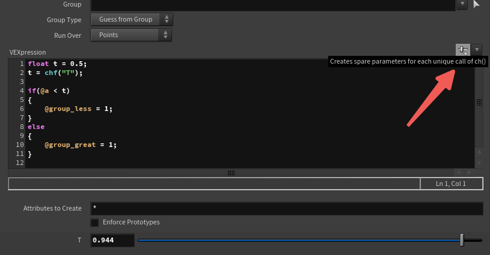
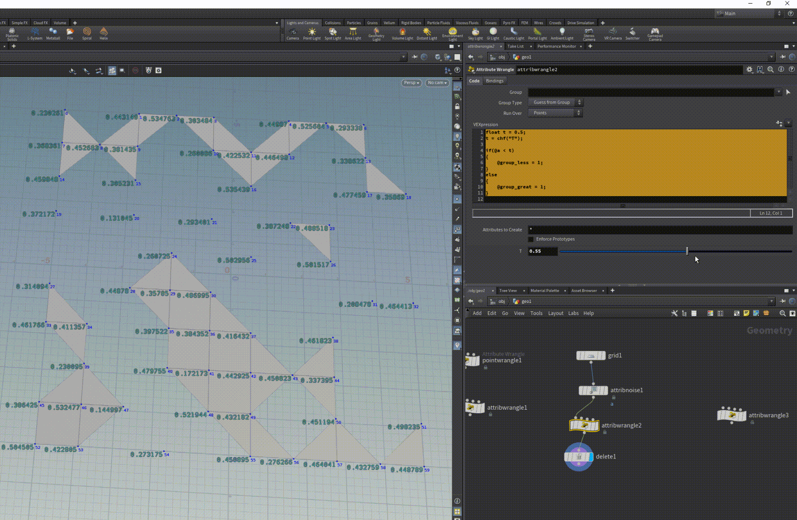

# Vex学习（一）

主要通过代码来提高制作效率,推荐在vscode里编辑可以高亮语法，另外，也可以把Vop转换为Vex。

初始节点:**wrangle**





## 基本语法

**常用数据类型：**

- 整型 integer（32位）

- 浮点型 float

- 向量 vector

- 字符串 string

- 矩阵 matrix(2x2,3x3,4x4)

- 数组 array

- 结构体 struct

- - struct *结构体名称* { *成员变量；成员函数；* }
  - 结构体自动生成隐式构造函数，分别是有无设置默认值的构造函数

- 双向漫反射分布函数bsdf [Writing PBR shaders in VEX](https://www.sidefx.com/docs/houdini/vex/pbr.html)

**声明属性：**

*数据类型*@*属性名*

```text
f@name / u@name / i@name 
float @mass = 1; 
vector @up = {0,1,0};
 i[]@connected_pts 
```

> 已知的全局属性（见下文）可以不用声明类型

**引用属性：**

@*属性名*

> 属性的前缀@只在Wrangle节点里使用，纯粹的Vex代码是没有这种前缀的

**声明变量：**

*数据类型 变量名*

**赋值：**

左值 = 右值;

```text
t = {0,1,0}; 
```

> 变量默认值不可以使用表达式

**注释：**

// 或者 /*...*/

**获得成员：**

```text
@v.x - 变量v（float3类型）的x 
```

> vector2可使用.xy或.uv，vector4可使用.xyzw或.rgba（但一次用'.'运算符取多个成员的写法是只读的，不能用在等号左侧）

**获得多个输入的属性：**

opinput*输入编号*_*变量名*

```text
v@opinput1_P - 获得输入编号为1的相同元素上读取P属性 
```

> 相同元素指其他输入上具有同样索引的元素，"Attribute to Match"可以影响索引

**声明/定义函数：**[VEX language reference](https://www.sidefx.com/docs/houdini/vex/lang.html#functions)

```text
 int test( int a, b; string c){
          if (a>b)
            { printf(c); } 
} 
```

> 同类参数可以用逗号分隔，不同类参数需要用分号分隔
> 支持函数重载，必要时为避免歧义可以在函数前加function前缀
> 用户定义函数需要在调用前声明
> 函数会被编译器自动in-line，所以无法递归（需要用[shader calls](https://www.sidefx.com/docs/houdini/vex/shadercalls.html)）
> 函数参数都是通过引用传递的
> 在着色器范围内，几何体属性被描述为‘const’，如果想要编辑几何体，应该用‘export’关键字标识该参数（个人理解，可能有误，详见官方文档[VEX language reference - Main(context)function](https://www.sidefx.com/docs/houdini/vex/lang.html#functions)）

**编辑用户界面（修改变量在UI上的表现，如滑块、取色器）：详见** [User interface compiler pragmas](https://www.sidefx.com/docs/houdini/vex/pragmas.html)

```text
#pragma opname noise_surf 
#pragma oplabel "Noisy Surface" 
#pragma label clr "Color" 
#pragma label frequency "Frequency" 
#pragma hint clr color #pragma range frequency 0.1 10 
```

### **类型转换：**

**变量转换：**

```text
int a, b;
float c;
c = (float)a / (float)b;
```

**函数转换：**

```text
n = noise( vector( noise(P) ) );
```

### 运算符：

**算数运算符：**

与C语言具有同样的运算符和优先级

定义了向量间乘法和点（point）间乘法，即成员对应相乘（并非点乘或叉乘）

很多运算符是为非标量数据定义的，在模糊语境下，两个不同数据类型进行运算，结果将与运算符右侧数据一致

**比较运算符（==,!=,<,<=,>,>=）：**

逻辑运算符：被定义在左右数据类型相同的情况下，运算的结果是整型

字符串匹配运算符：'~='只定义了左右都是字符串的情况下，等同于调用'match'函数

**逻辑运算符(&&, ||, !) 及位运算符(& |, ^, ~)：**

仅为整型定义


**附优先级顺序表：**



运算符优先级顺序表

> 在float与int运算中使用运算符，结果将与运算符左侧值类型相同
> 用标量与向量进行算术运算时，VEX会返回同样维度的向量，向量成员与标量逐个相乘
> 不同维度的向量相乘，VEX会返回维度更高的向量，低维度向量将会被像{0.0，0.0，0.0，1.0}这样的向量填充，这会导致{1.0, 2.0} + {1.0, 2.0, 3.0, 4.0} == {2.0, 4.0, 3.0, 5.0}情况的出现

**保留关键字：**

break,bsdf,char,color,const,continue,do,else,export,false,float,for,forpoints,foreach,gather,hpoint,if,illuminance,import,int,integer,matrix,matrix2,matrix3,normal,point,return,string,struct,true,typedef,union,vector,vector2,vector4,void,while

------

### **常用GeometryVop全局属性（大小写敏感）：[Using VEX expressions](https://www.sidefx.com/docs/houdini/vex/snippets.html#known)**

> '*'为补充描述，'*'后为空的是待补充描述的属性，另附官方文档链接，方便查阅

- **向量（float3）- 来源：**[Geometry attributes](https://www.sidefx.com/docs/houdini/model/attributes.html#p)、[VolumeWrangle](https://www.sidefx.com/docs/houdini/nodes/sop/volumewrangle.html)

- - @P - 位置
  - @v - 速度
  - @force - 力    该点的受力（用于particle DOPs）
  - @Cd - 颜色
  - @uv - UV
  - @N - 法线
  - @scale - 规模
  - @rest - 静止位置 **顶点的静止位置，用于顶点变形后维持纹理*
  - @torque - 扭矩    用于在**Torque DOP**旋转粒子
  - @up - 上方向    粒子局部空间的上**方向向量**（可覆写）
  - @center - 中心    SOP空间中体积的中心
  - @dPdx，dPdy，dPdz - 体素三维参数给出第0体素的x、y和z边的长度和方向的向量

- **向量（float4） - 来源：**[Geometry attributes](https://www.sidefx.com/docs/houdini/model/attributes.html#orient)

- - @orient - 朝向	粒子的**四元数**朝向
  - @rot - 旋转    在应用所有其他属性之后附加的四元数偏移量

- **浮点型：**

- - @age - 年龄 *
  - @life - 生命 *
  - @Time - 时间 **与时间轴上的数值一致 24FPS*
  - @TimeInc - 时间增量
  - @Frame - 当前时间（帧）

- **整型 - 来源：**[Geometry attributes](https://www.sidefx.com/docs/houdini/model/attributes.html#orient)、[Indexing variables](https://www.sidefx.com/docs/houdini/vex/snippets.html#indexing)、[Accessing group membership](https://www.sidefx.com/docs/houdini/vex/snippets.html#groups)、[Volume Wrangle](https://www.sidefx.com/docs/houdini/nodes/sop/volumewrangle.html)

- - @id - ID **唯一的元素ID（和点的编号不同，它表示选定的唯一对象，即使在点的编号变化时也保持选定对象）*
  - @nextid - 尾部ID **最大的粒子ID，便于Houdini新建粒子id*
  - @pstate - 粒子状态 **编码有关粒子状态的不同信息片段的一个字节，具体每一位是什么意义可查阅文档*
  - @elenum - 元素编号
  - @numelem - 元素总数
  - @ptnum - 点编号
  - @primnum - 图元编号
  - @vtxnum - 顶点编号
  - @numpt - 点总数
  - @numprim - 图元总数
  - @numvtx - 顶点总数
  - @group_*groupname* - 组
  - @ix，iy，iz - 体素的整型索引
  - @resx，resy，resz - 分辨率 **当前体积图元的分辨率，在VDB中表示启用的体素域的大小*

> 顶点和点的区别在于内存中的存储形式，point（点）仅仅存储局部空间下（即在所属图元中）的位置信息；而顶点遵循obj/fbx的存储习惯，可以存储位置、uv、和其他顶点信息。

- **字符串 - 来源：**[Geometry attributes](https://www.sidefx.com/docs/houdini/model/attributes.html#name)

- - @name - 名称 **可以设置给图元的名称，比如体积或者一组图元，可以在代码里获取*
  - @instance - 实例 **当前点的实例属性，保存了在该点实例化的几何体的路径，可以实指向几何体文件的文件路径也可以是几何体的相对路径或者几何体节点，可以覆写*

### Mantra的预定义[结构体类型](https://zhida.zhihu.com/search?q=结构体类型&zhida_source=entity&is_preview=1) ：[Mantra Specific Types](https://www.sidefx.com/docs/houdini/vex/lang.html#functions)

- light
- material
- lpeaccumulator **光路径表达式累积器（？）*

### VFX函数 / Geometry functions

[VFX Functions](https://www.sidefx.com/docs/houdini/vex/functions/index.html)

[Geometry functions](https://www.sidefx.com/docs/houdini/vex/geometry.html)

### VFX语境 ： [VEX contexts](https://www.sidefx.com/docs/houdini/vex/contexts/index.html)

> 语境决定了函数的使用和全局变量

- 渲染语境

- - displace
  - fog
  - light
  - shadow
  - surface

- 其他语境

- - cvex
  - chop
  - cop2

## 示例

1.Geometry创建



添加属性



2.判断：有一些0-1的随机数属性a的点，以0.5为阈值把这些点分别打组



```python
if(@a < 0.5)
{
    @group_less = 1;
}
else
{
    @group_great = 1;
}
```

:heart: 注意打组的代码：`@group_组名 = 1;`值为非0值即把元素放入组中，值为0视为从组里删除

验证



添加滑块交互UI

```python
float t = 0.5;
t = chf("T");

if(@a < t)
{
    @group_less = 1;
}
else
{
    @group_great = 1;
}
```



按这里创建UI

