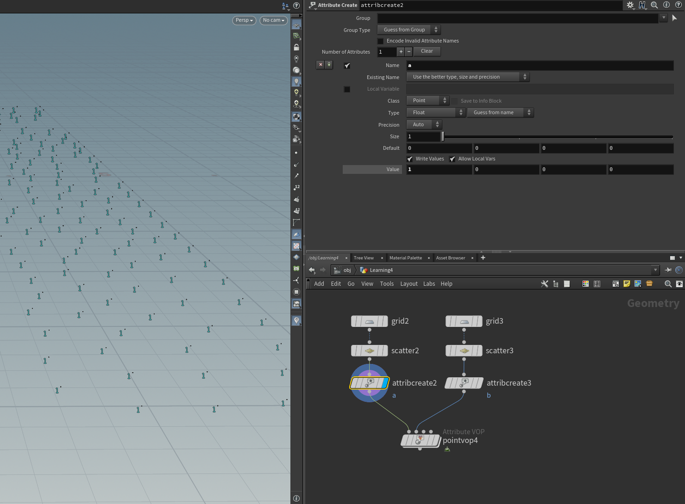

# VOP学习（一）

## vop常用节点

### Attribute vop

作用范围分为点、线、面、detail层级等

内部结构

### 通用节点

### convert节点

各个属性间的转换

### 数学运算节点

### 逻辑运算节点

### 矩阵节点

### 几何节点

## 示例

eg1.使物体Y轴加上一个常数，对物体p属性进行操作

把参数放到sop层级，对着想要变为参数的pin按鼠标中键

eg2.对属性的操作，添加属性a，在vop中通过**bind**和**bind export**来对物体的自定义属性获取和输出

同样也可以把变量转移到sop层

另一种方法：用**getattribute**节点获取属性，也可以实现，不同的是这个节点可以灵活选择输入的pin，而Bind节点只能默认获取vop节点Opinput1（最左侧）的pin中的属性。

eg3.遇到某些数值散乱的情况，如下：物体的pscale值被打乱，若要修改则需要在vop层映射操作

在vop里获取pscale并用**Fit Range**节点进行映射。

这里只是常数的映射，若要通过曲线，来线性的映射可以使用**Ramp**节点，此外这个节点也可以用来映射颜色

eg2.逻辑运算，有两批点，一个有属性a = 1，另一个有属性b = 2。

简单版：使用myth节点中的max或min筛选最大、最小值

**Compare**节点比较输入的两个值，根据结果输出0、1

**TwoWaySwitch**输入一个bool值，为1则输出input1，0则输出input2

**if Block**执行if判断，通过则继续执行block内的节点，否则跳过直接输出input值

