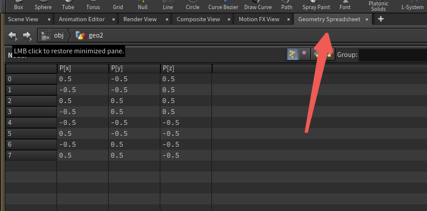
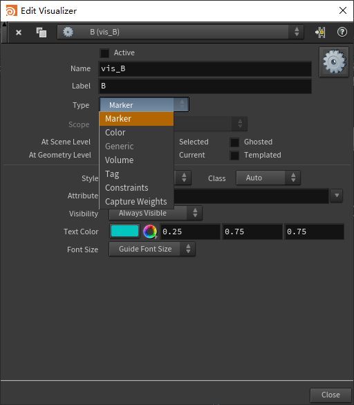

# Attribute属性

Houdini每个层级都有属性用来计算,如点、顶点、边、面、detail等，在Geometry SpreadSheet里可以详细查看。注意，若几条边没有形成一个面，则每个边都是单独的Primitive

 

显示顶点序号（显示边和面在下面）

## AttribCreate创建属性

创建一个属性，可以设置名字、层级、类型、数值

修改过后可以看到

在视图里显示，并设置如何显示

## AttribRandomize属性随机化和归一化

可以选择随机哪种属性和随即范围，以及随机方式

## AttribAdjust调整属性

对各个类型的属性值进一步调整

## AttribNoise利用噪声调整属性

类似AttribAdjust，但这是利用噪声调整属性值

## AttribPromote转移属性值

把属性从一个层级转换到另一个层级，如点的属性转移至面上。

## AttribTransfer属性值迁移

把一个物体的属性值转移到另一个物体，可以在Conditions里设置传递范围，阈值。如下图把球上的point层的float属性A转移到一个平面上

也有根据UV转移的方式

## AttribDelete删除属性

顾名思义

## AttribPaint笔刷绘制属性

用笔刷绘制已有的或者新的属性值，可以绘制顶点贴图（mask）。

## 属性的显示方式

控制显示属性总开关

设置显示方式

Marker：数字、矢量等标记显示
Color：颜色显示（更直观）常用渐变模式

## Houdini自带的特殊的属性

在属性名称里直接输入可以识别

P：点，每个物体都会自带

pscale：点半径

Cd：颜色（rgb）

alpha：透明度

orient：点代理物方向（四元数）点的初始方向，在属性设置里类型为float，size为4

width：线宽度