# Poly(建模)相关节点

## 操作

**临时改变物体轴点（pivot）**，首先在控制手柄上右键取消勾选Attach to Geometry，分离手柄和物体

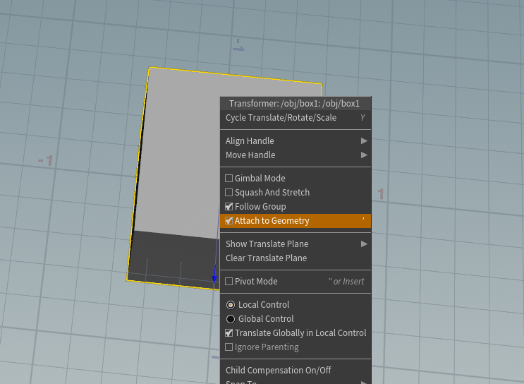

然后按住x可以选择吸附模式

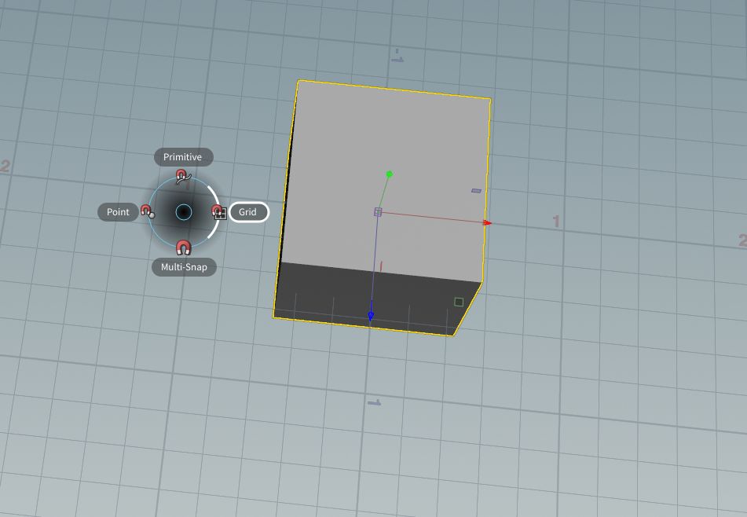

然后在手柄中心按住左键即可移动轴点。这只是临时的，取消选择后再次选择会复原

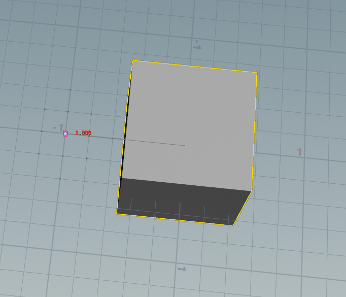

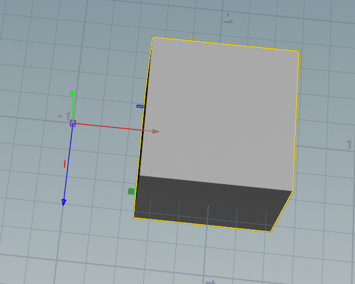

**物体对齐**，在手柄上右键选择对齐（或快捷键）进入对齐模式，可以对齐到任意目标物体的点线面（移动并旋转或只旋转对齐）。

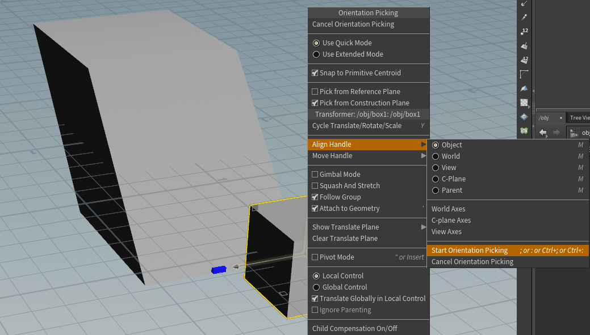

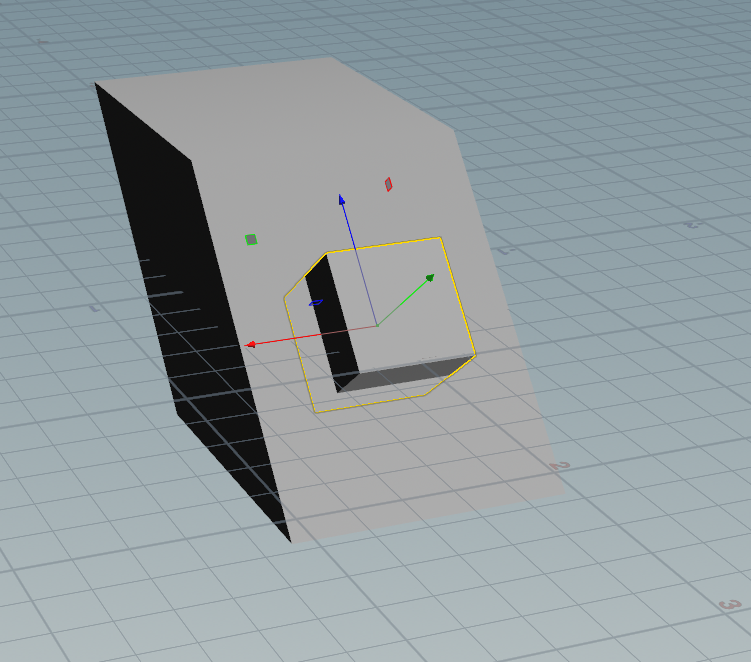

在对齐模式下ctrl+左键选择一个主轴，然后左键单击另一个轴作为副轴，然后通过ctrl+shift+点击目标位置可以实现改变物体朝向（围绕主轴旋转，让副轴对向目标点）

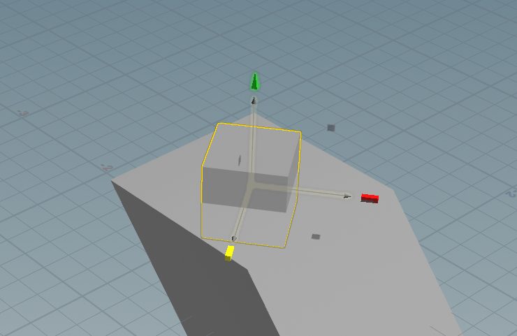

## PolyExtrude挤出

功能：挤出距离，内嵌，扭曲，细分

使用：与面组连接或选择挤出面

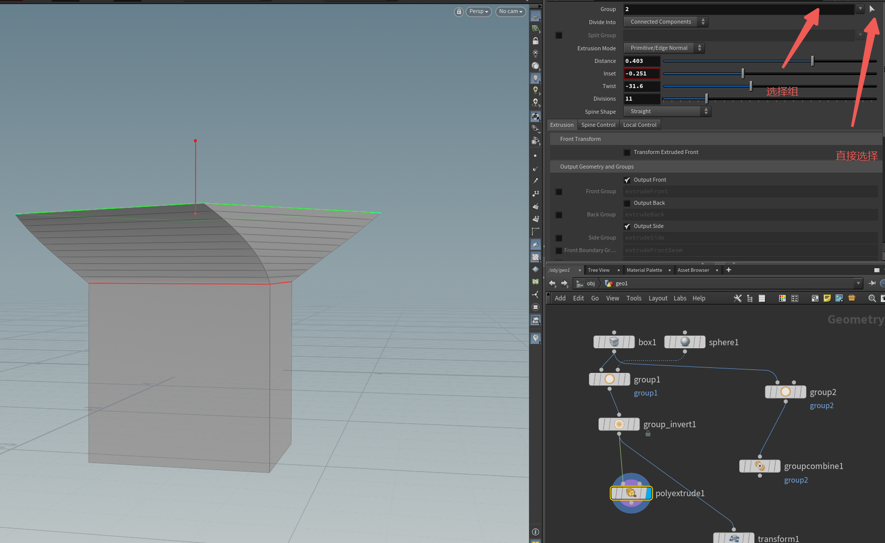

## PolyBevel倒角

顾名思义

## TopoBuild拓扑操作

实现拖拽、切边等功能

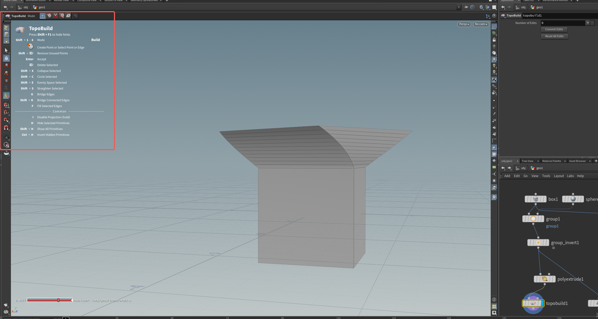

## Curve曲线建模

可选多边形和贝塞尔

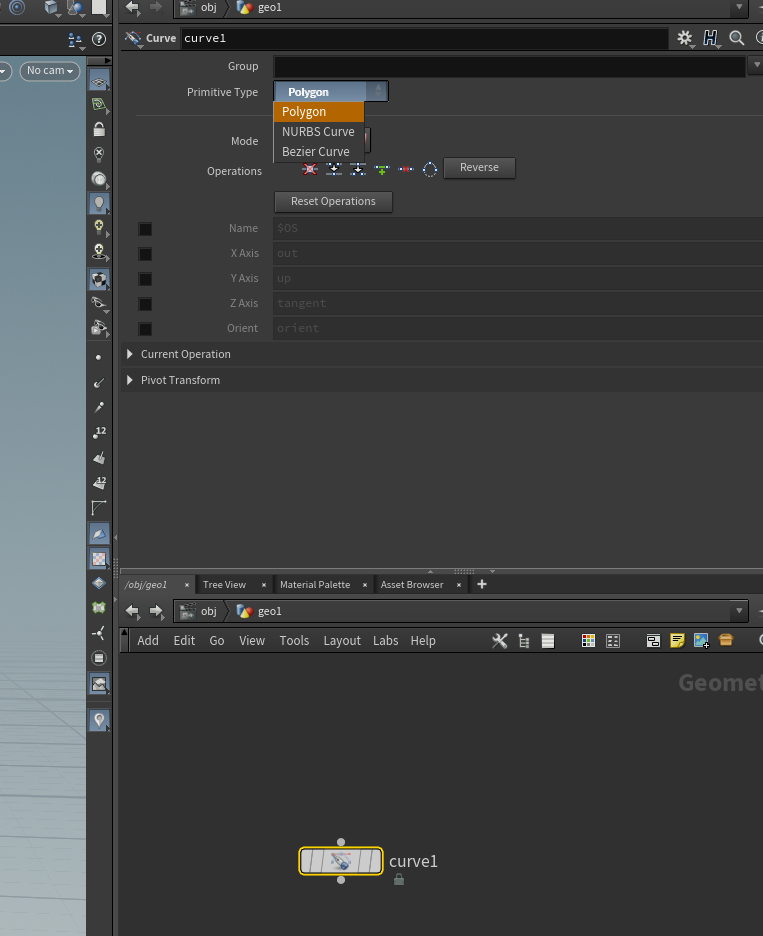

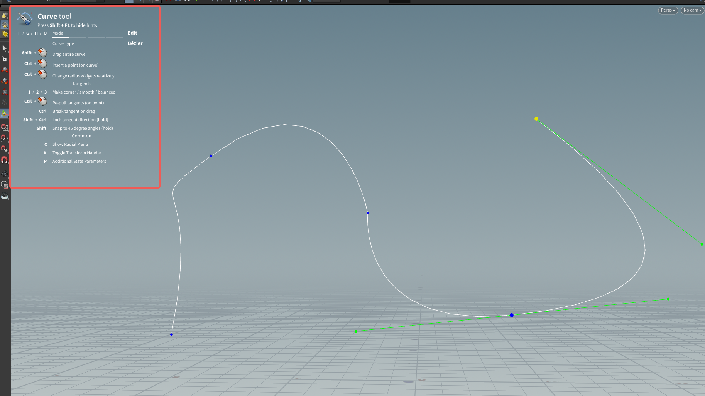

## PolyWire管状

1.直接连接多边形曲线，变成管道

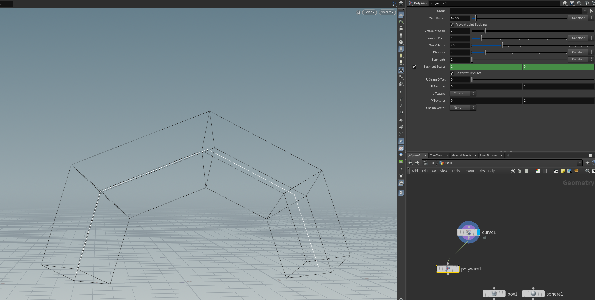

2.贝塞尔曲线通过**Convert**节点连接

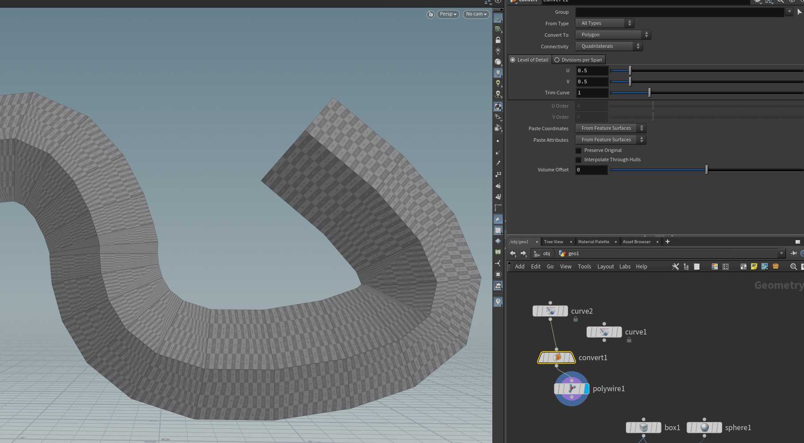

## CopyToPoint

把模型生成在点上

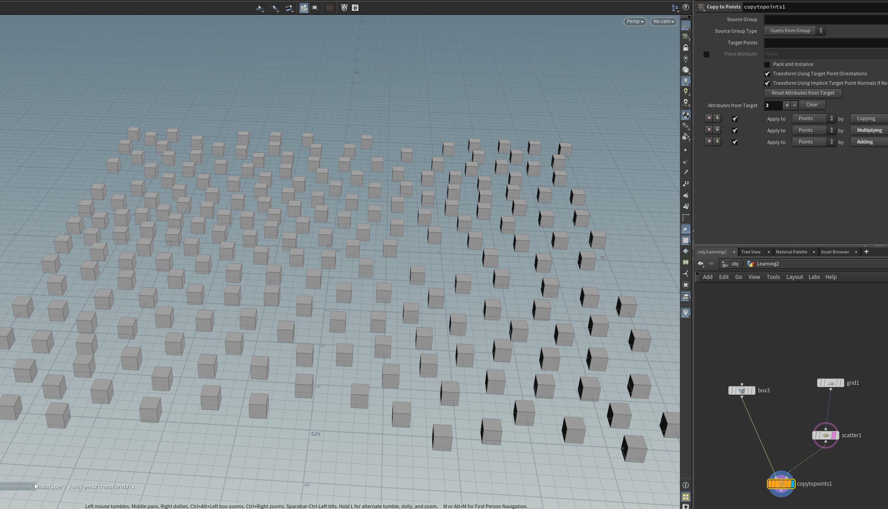

## CopyToCurve

原理同CopyToPoint