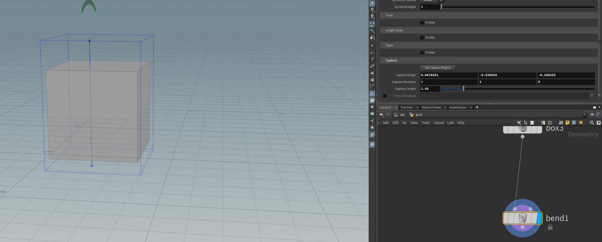

# 变形器相关节点

## Bend扭曲

构造变形区域

调整方向向量

弯曲操作

Twist：扭曲
Length Scale：伸缩
Taper：顶端变形

## PathDeform曲线变形

Mappings：沿曲线延申/前进
Geometry Deformations：控制缩放等形变相关

调整前进方向

## Lattice晶格变形

同建模软件内的操作

注意，这里需要切换为point模式

## PointDeform点变形（常用）

当对物体进行了deform操作和scatter操作后，若想让散点也进行deform并保持稳定需要用到此节点，直接将deform和scatter进行连接会让散点每帧重新计算从而出现闪烁的问题

