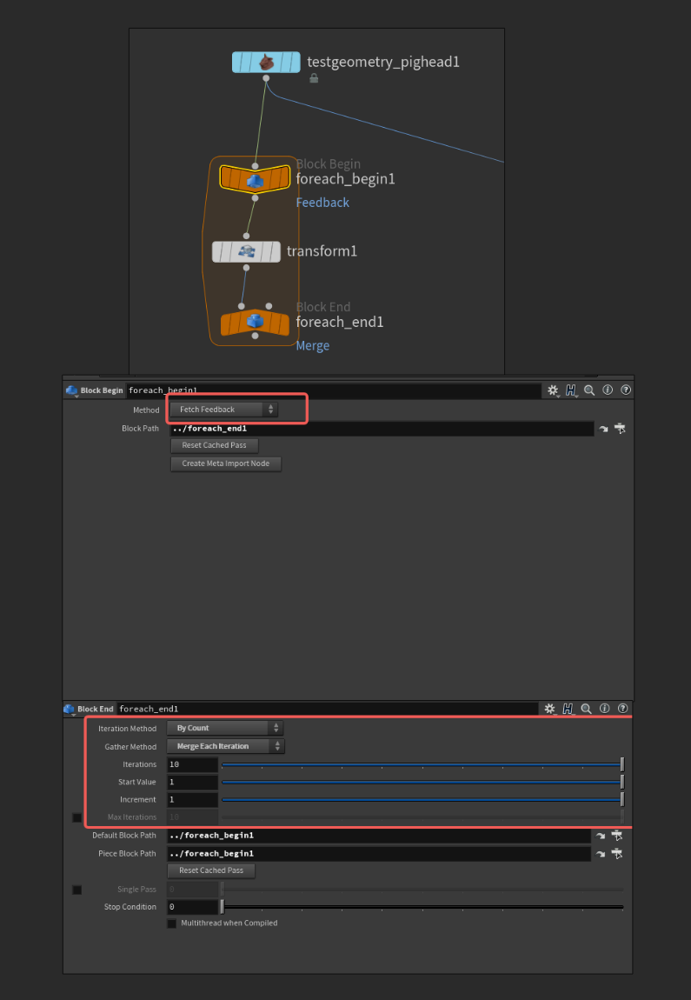
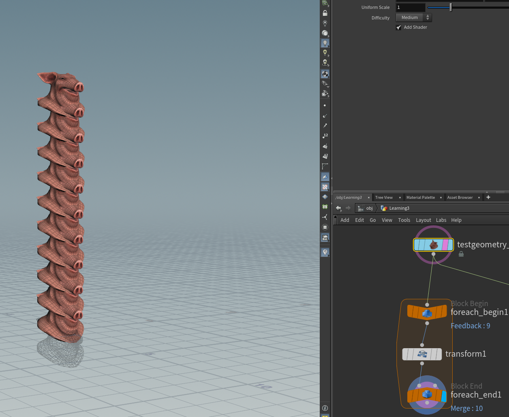
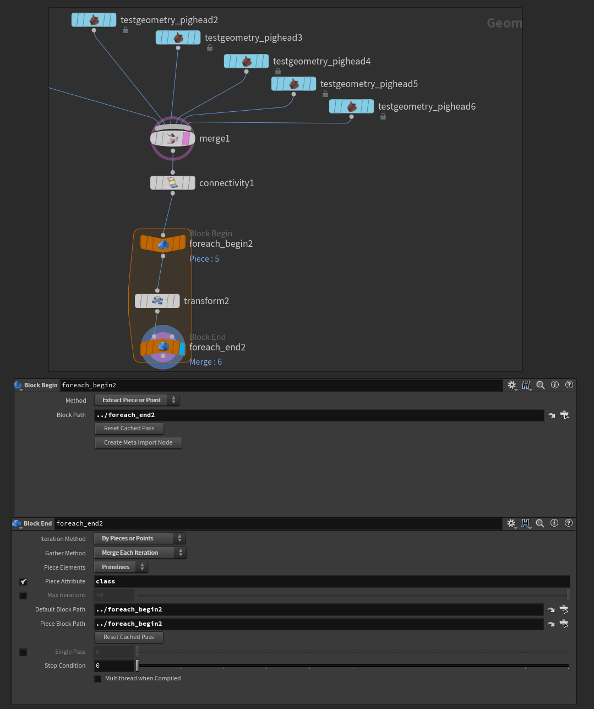
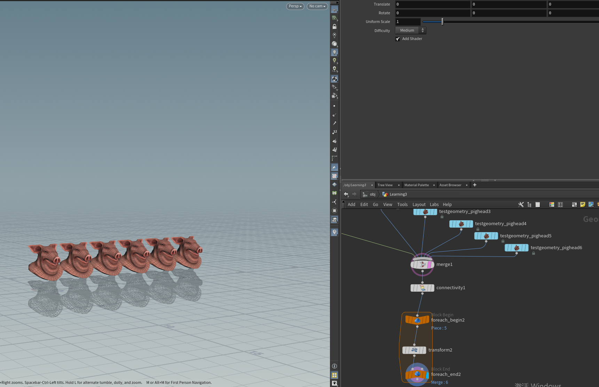
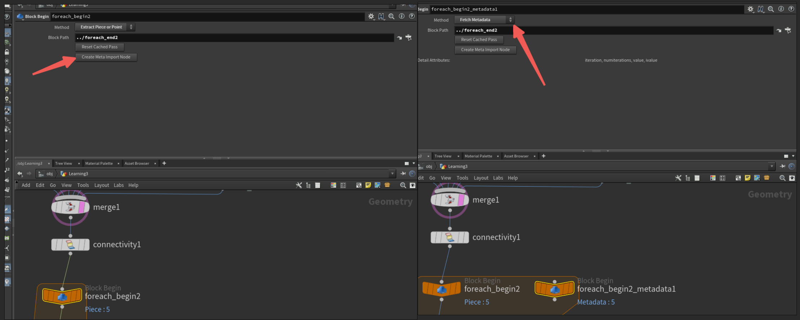
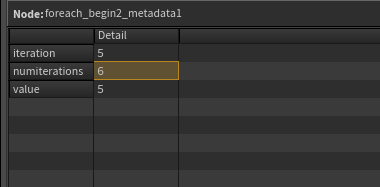
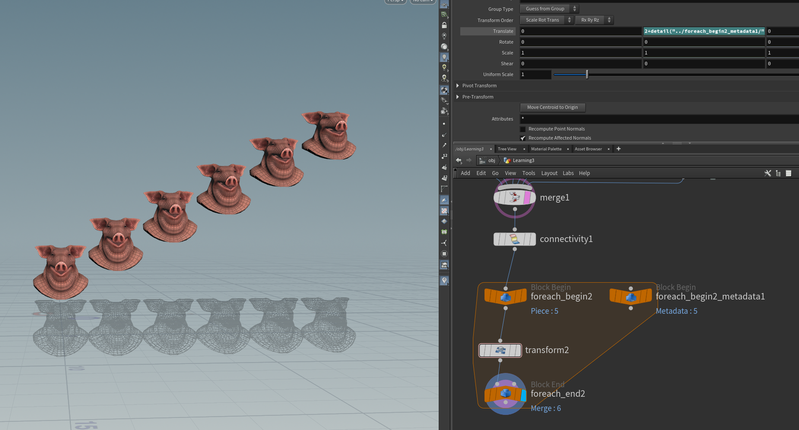

# 循环节点

## 判断

For：对一个物体多次操作

For Each：对多个物体逐个进行一次操作

## 输入端Block Begin

循环方式：
Fetch FeedBack：每次计算循环基于上一次的结果 - For
Extract Piece or Point：每次循环计算基于每个元素 - For Each
Fetch Metadata：标记处循环次数等相关属性数值（辅助）
Fetch Input：每次循环计算基于原始 - For

## 输出端Block End

Iteration迭代方式：
Auto Detect from Inputs：根据输入自动选择
By Pieces or Points：根据点、线、面等元素决定循环次数 - For Each
By Count：定义循环次数 - For

Gather输出方式：
Feedback Each Iteration：每次循环单独输出结果
Merge Each Iteration：输出合并结果

## 变化

在循环体中增加一个Fetch Metadata的Begin节点，用于标记循环次数

其属性iteration：当前循环次数（从0开始计），numiterations：总循环次数（从1开始计）

---

例子：

**For**

把一个物体连续做Transform变换，通过常数控制循环次数。

```C++
for(int i = 0;i<10;i++)
    obj.y += 2;
```





**For Each**

把5个猪头合并后接入循环，结束循环节点的Pieces属性会自动分类

```c++
std::Vector<Geometry> objs = {pig1, pig2, pig3, pig4, pig5};
for(Geometry obj : objs)
    obj.y += 2;
-----------------------------Houdini Foreach----------------------------------
for(int i=0;i<6;i++){
    objs[i].y += 2;
}

```





**变化**

在以上例子中加入变化让猪头按顺序从前到后依次Y轴加2。首先创建metadata节点，然后在循环体transform节点的Translate-Y输入框里输入：

2+detail("../foreach_begin2_metadata1/","iteration",0)

> 注：此处使用的detail函数说明-按F1打开帮助窗口
> float detail (string, string,float)
> PYTHON EQUIVALENT
> hou.Geometry.attribValue()
> Returns the value of a detail attribute.
> USAGE
> detail(<surface_node>, <attrib_name>, <attrib_inde>(>)
> TIP
> This expression may not work if <surface_node> is thecurrently
> cooking node.Try specifying an upstream node.
> This can also be used to read the value of a detaiL intrinsic by
> specifying "intrinsic:name_of_intrinsic" insteead of an attribute name.
> Components of dictionary attributes can be resolvedd using
> for example
> "param.key" will return the value of key in the dictionary attribute
> param.
> detail函数的括号中有两个字符串（string）和一个浮点数（float）。两个字符串分别是节点名称和属性名称，都要加引号；一个浮点数一般起保险作用，如果没有这个属性，返回值就为0。





