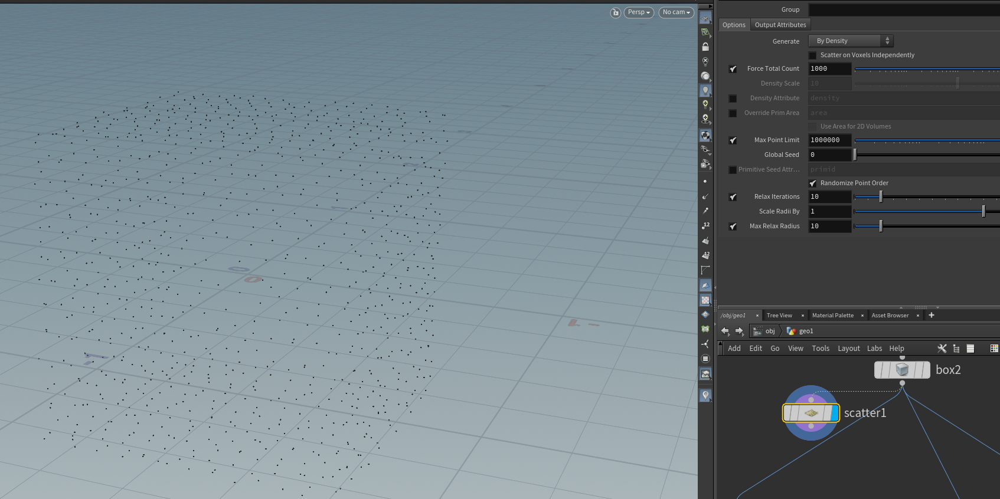
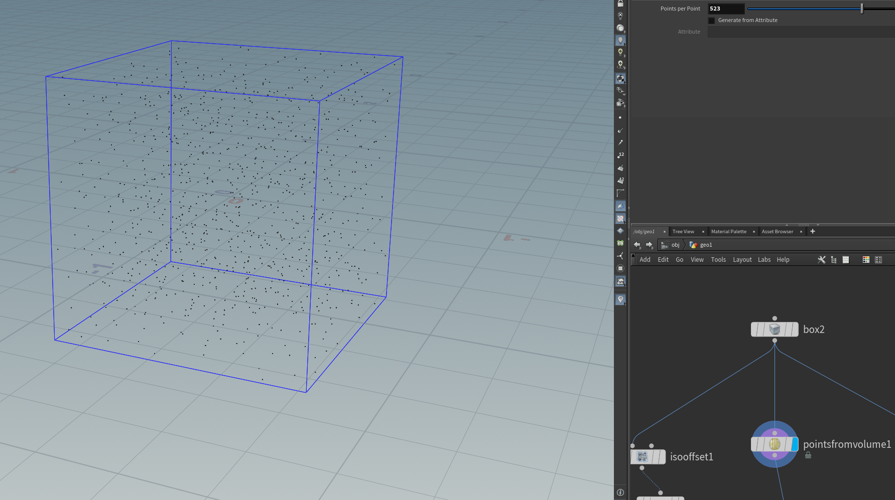
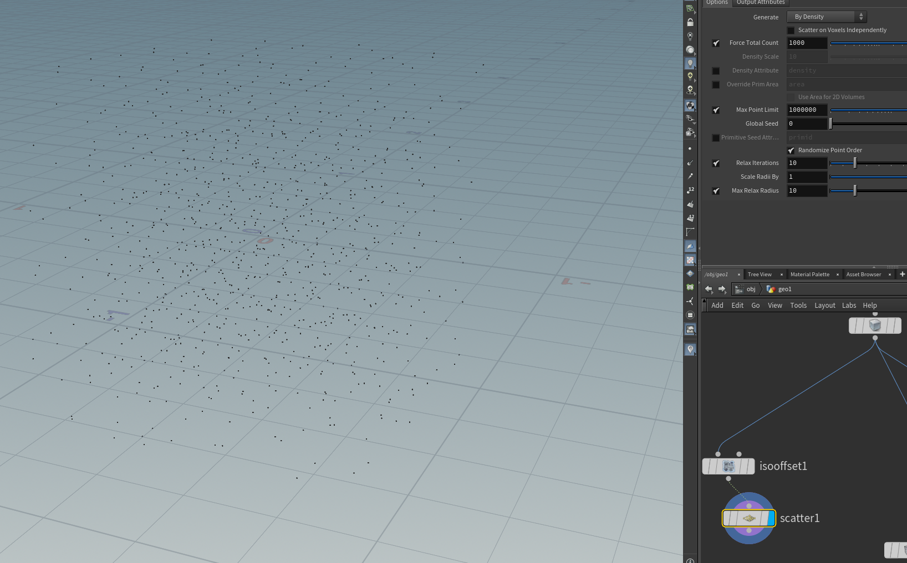
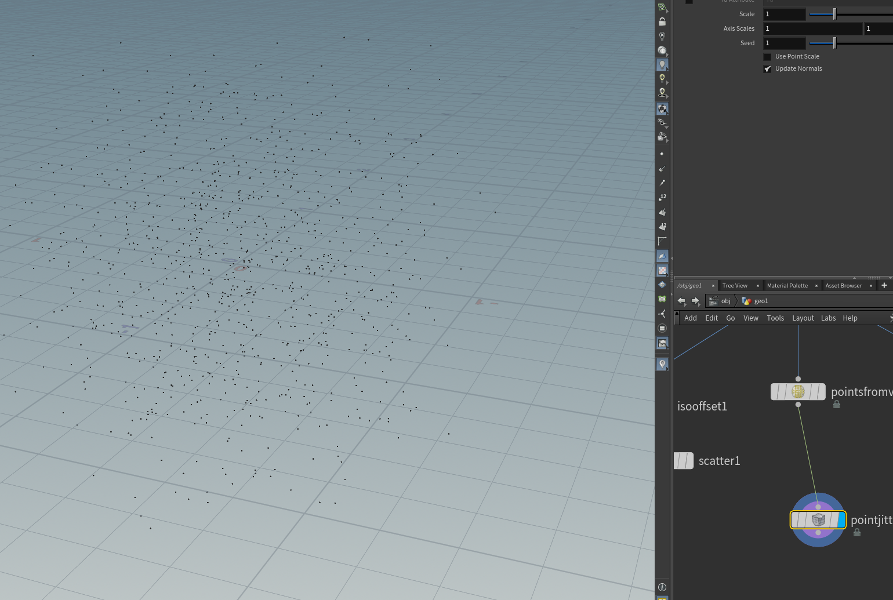
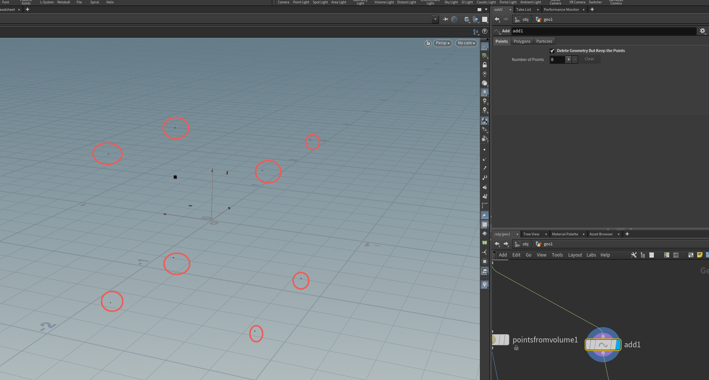

# 点相关节点

暂且用的不是很多，仅作举例

## Scatter

在表面散布点

## PointsFromVolume

在体积内生成

效果等同于**Scatter**加上**isooffset**

## PointJitter

让点更加散乱

## Add_Point

常用节点之一，point模式是保留物体的顶点

## PointReplicate

在点的周围生成复制点，可以调整生成体积的各项参数

