# 通用节点

## File

从本地加载

## FileCache

把一些帧缓存到硬盘（多用于动画，这样播放不会卡顿），可以用File节点调用

## Connectivity分类节点

例：几个物体通过merge节点后会被视为一个物体，后续若要区分处理，需要Connectivity节点。

Connectivity节点通过class属性给物体分类，可以通过Type选择分类的层级

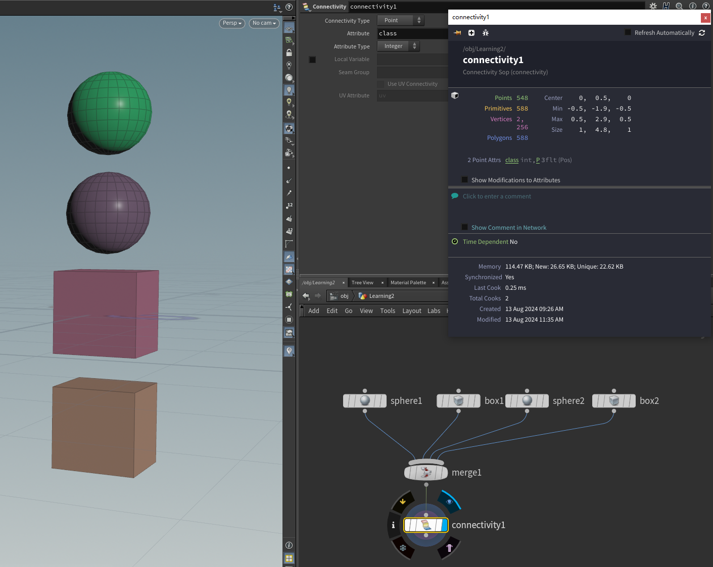

使用情况：

如图下情况，无法区分散点上的两个物体。

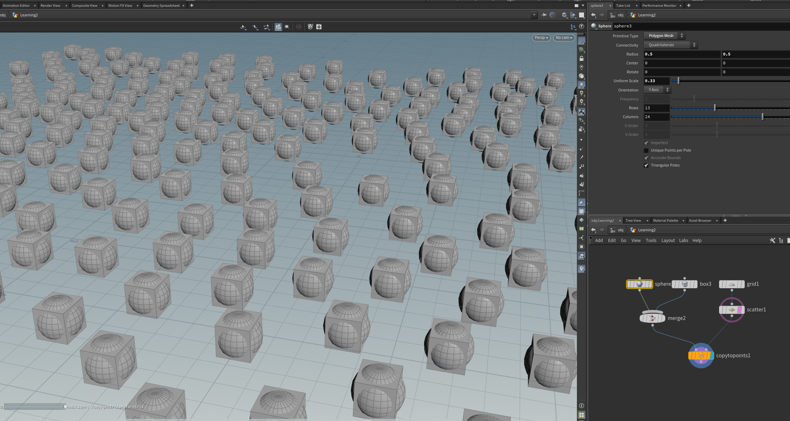

若想让一部分散点生成球，另一部分生成正方体，需要使用分类节点。

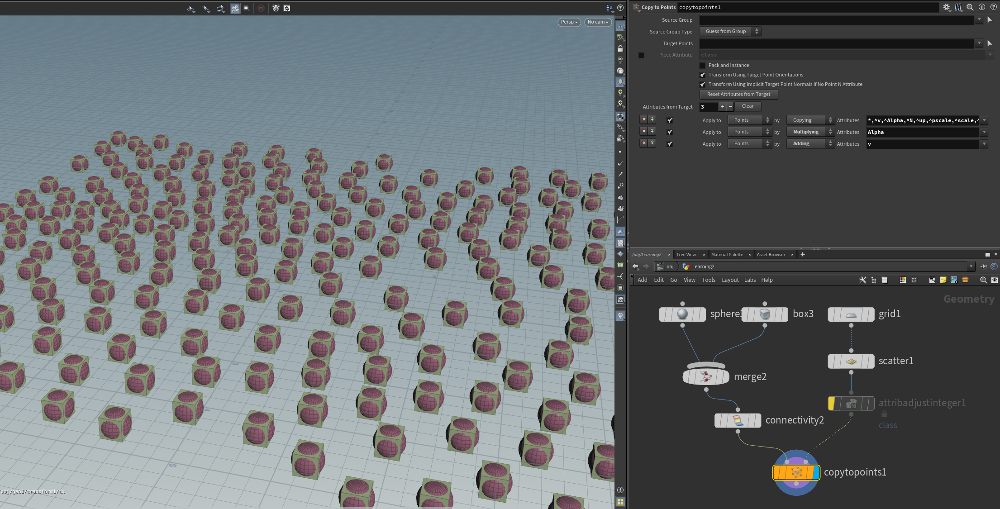

为散点添加属性class，并设置为随机整数0、1，对应分类里的0、1.

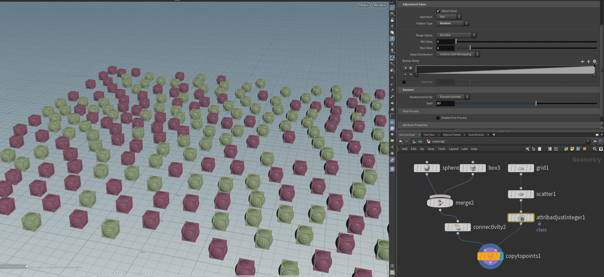

最后，在CopyToPoints节点里设置根据属性分开复制模型。

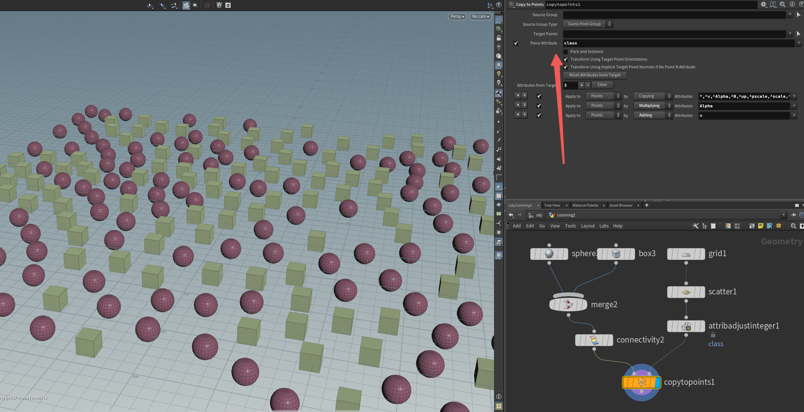

## Pack and Instance

pack打包，即把物体视做点，只保留渲染外观。在渲染大批量物体时可以节约性能，但打包之后就无法进行Scatter等二次加工操作。在刚体模块或是地形植被等大批量渲染用的比较多

Unpack解包

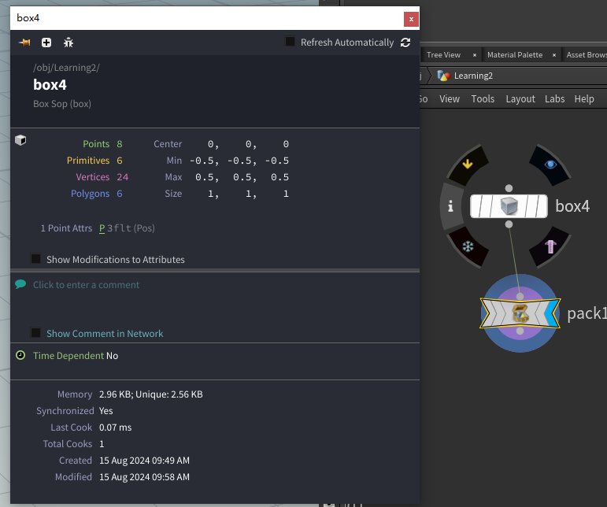

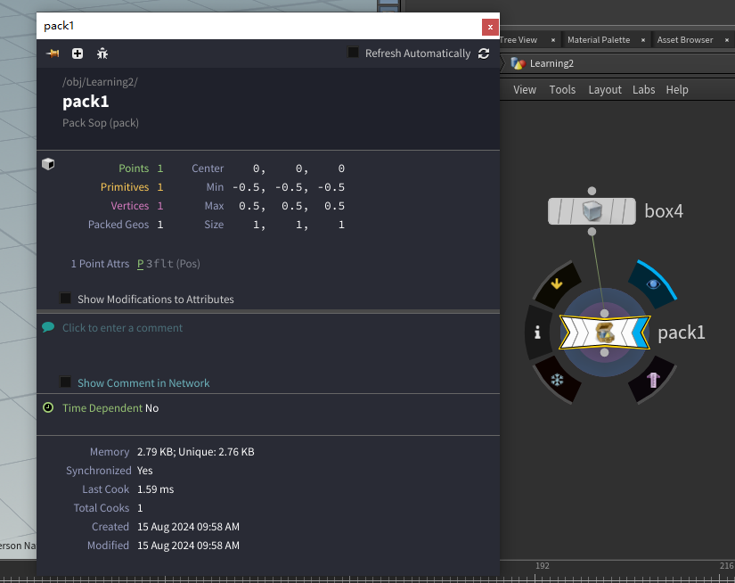

## Delete

顾名思义，删除点线面等，有多种删除方式，可以叠加使用。Operation里可以选择反选。

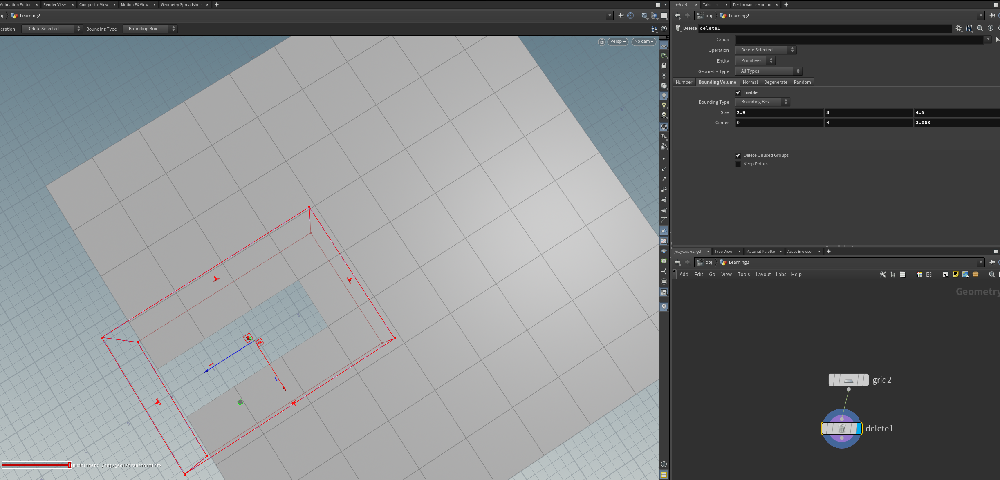

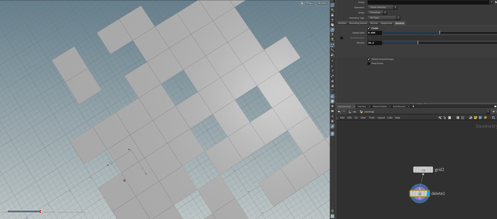

Blast节点：通过组删除

## Ray

把点或面投射到一个面上，投射物的投射方向可以选择向量、法线或其自身的属性。也可以选择投射方式和距离。也可以通过创建Hit Group来筛选击中点

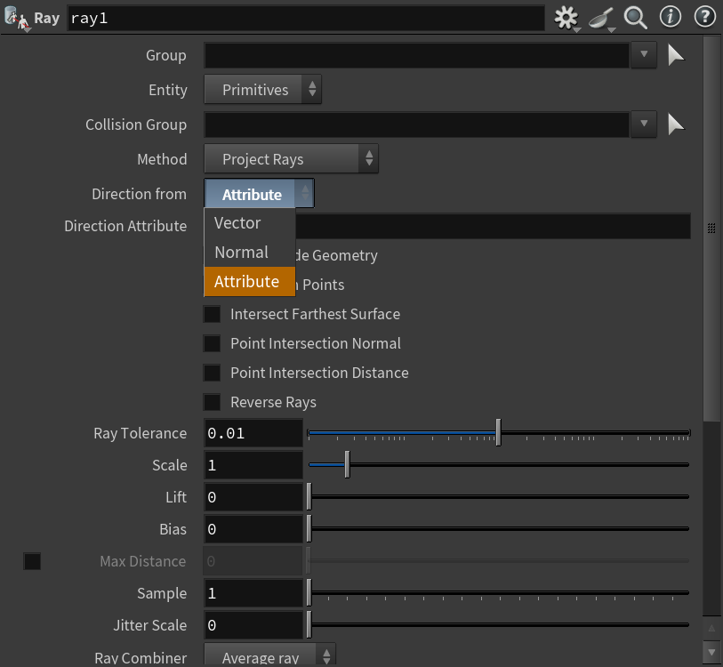

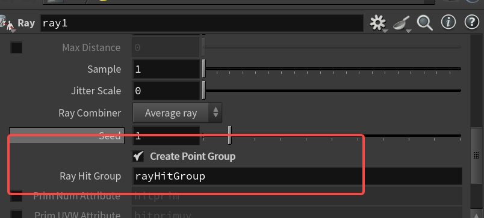

## UV

**UV Texture节点**

自动展开UV，可以选择映射方式

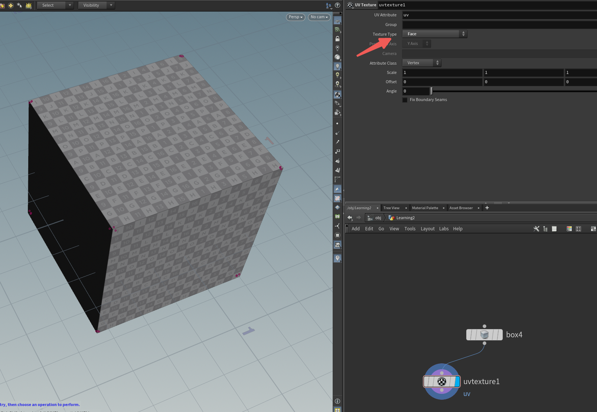

**Auto UV节点**

自动展开UV

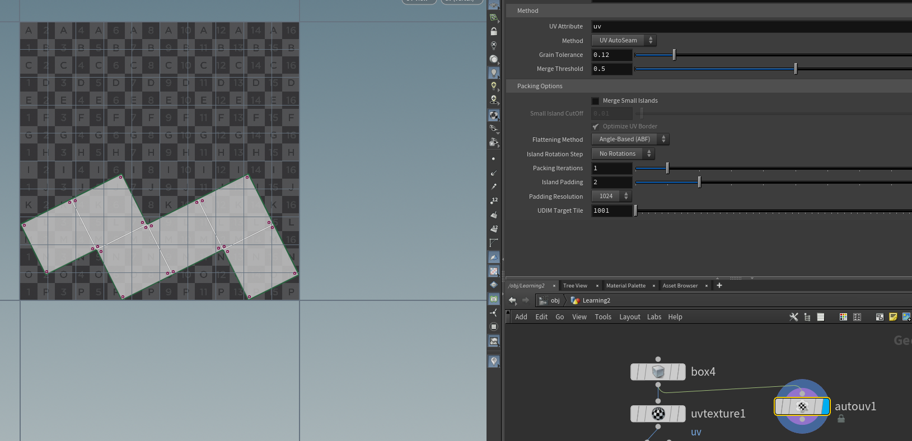

**UV Project节点**

自动展开UV，不太好

**UV Flatten节点**

手动展UV，处理复杂UV。选择边拆分，后续再调整

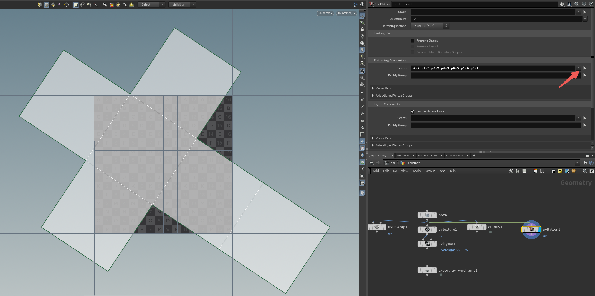

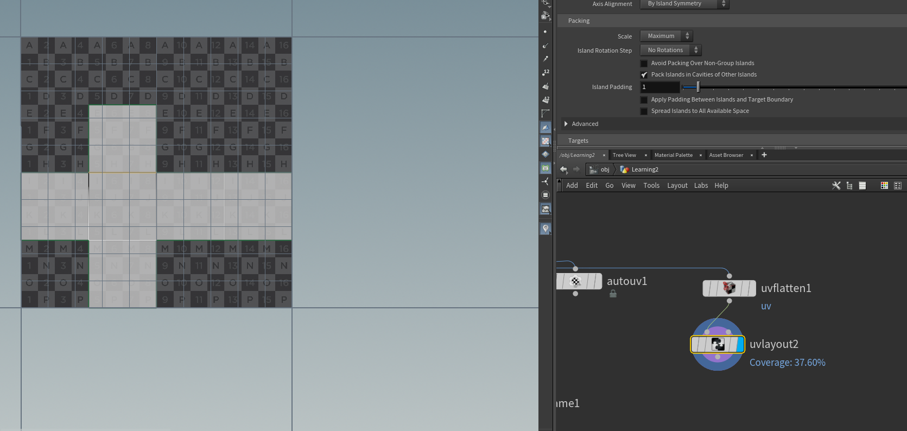

**UV Layout节点**

uv自动排列。不仅可以用来分UV也可以用来排布物体。

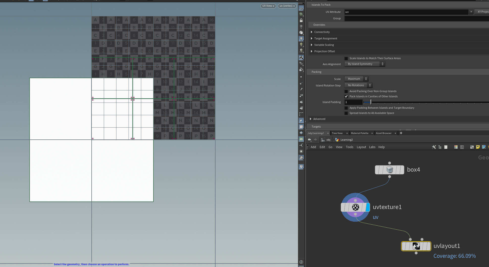

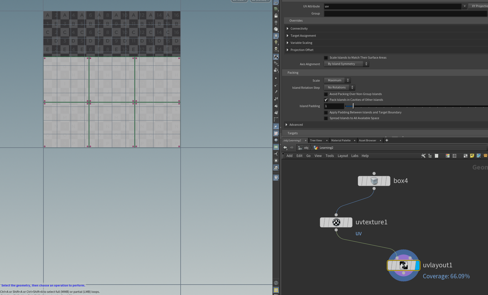

**UV Transform节点**

移动UV

**UV Unwrap节点**

UV分区，调整间隔（也会默认自动展开）

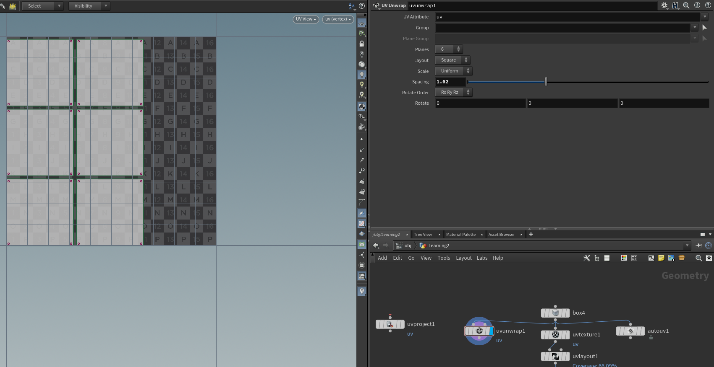

**Export UV Wireframe**

导出UV线框

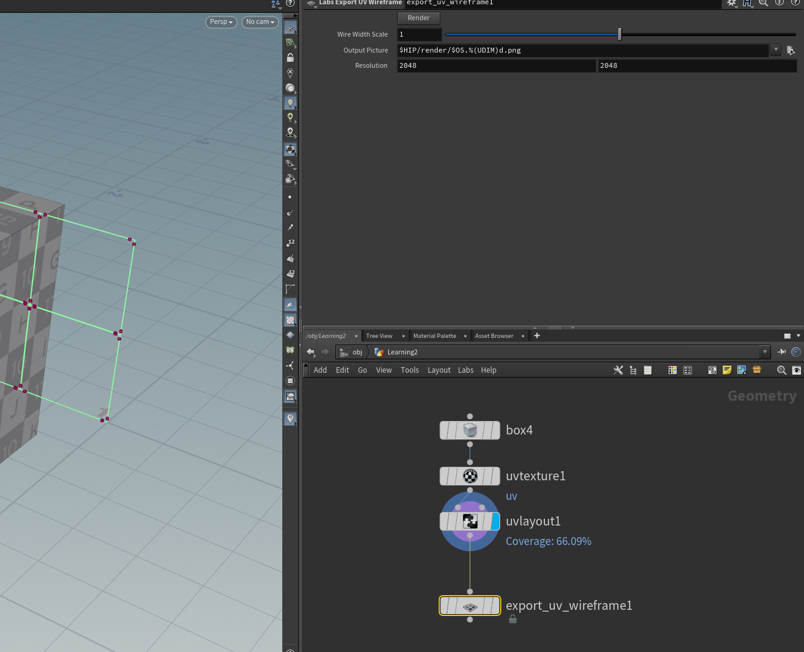