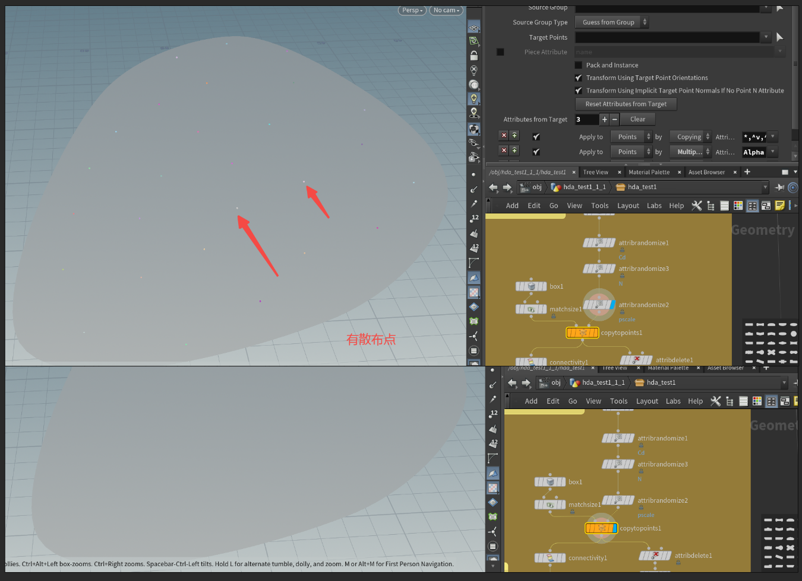
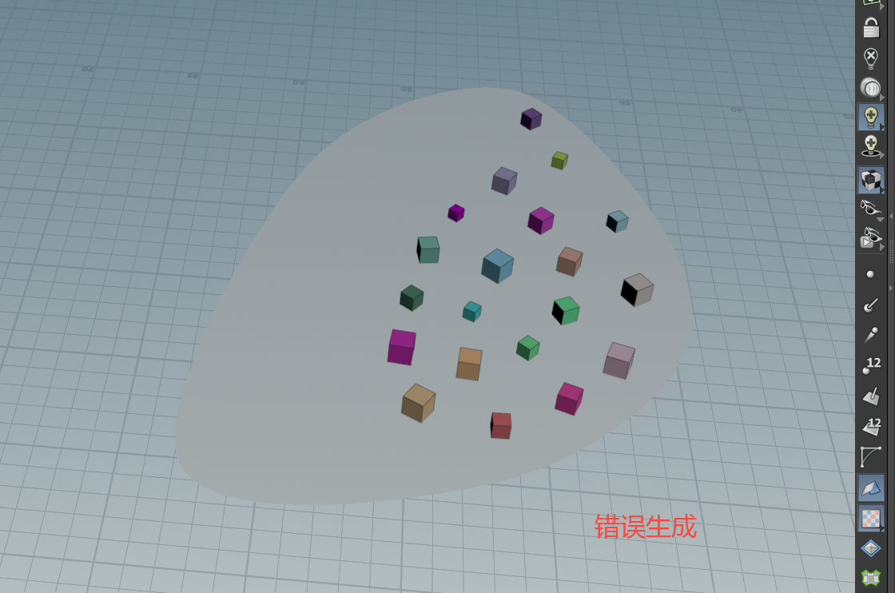

# Houdini To UE

## 一.打包

选择所有需要打包的节点后，点击打包按钮

这时Geo层节点会变成subnet

打开subnet节点层，里面包含刚刚选择的所有节点以及input和output

## 二.创建HDA

右键创建Digital Asset

设置命名格式和路径

HDA设置，可以先点击apply然后在houdini里预览，确定后再点Accept。制作hda的目的是在UE里传入参数，所以输入端的设置应考虑具体哪些数据需要从UE获取

示例：此案例中若要让这个曲线从UE中输入，则要把它替换为input，然后从外部把曲线连入

## 三.连接UE

安装Houdini Engine插件，目录:（引擎目录\UE_5.4\Engine\Plugins\Runtime）

导入资源后需要出现Ready才能使用

设置简介
Recook、ReBuild：重新生成
Bake：把HDA内容烘焙到引擎里调用
Inputs：即在houdini中设置的输入项（关键）

可以在Input里选择Houdini的曲线测试输入：

用UE的曲线测试：创建Spline后，在HDA里选择world input，选择这个样条线，发现明显坐标有问题

## 四.HDA实时调试

成功后会有提示

打开初始状态和原先工程内不同

回到UE里在场景的hda里点击**Rebuild**，houdini里面就会出现输出的HDA。打开后点击解锁修改，即可实时调试HDA

### Houdini和UE的区别

可以看到这个例子中，copy to points这步以及生成的位置出现了错误。

原因是这里的目标点是UE中传入的（关闭这个开关可以验证），UE传入的点会带有奇怪的属性，可以在Input位置删除它们

删除后结果

### 位置修正

这里缩放时没有依据几何中心，而是样条线的起点。

变换轴心点，使用**centroid**表达式

### 获取landscape数据

同上使用第二个输入接口传入地形数据

用这个地形取代原先的skin节点，连到ray上。

### 道路生成和自定义参数

修改输入节点和制作基本道路

剔除道路上的房子：使用Ray节点即可（同房屋的剔除）

自定义参数：在此界面拖动即可添加

注意命名

调用参数：`ch(' ')`，这里`../`表示上一级也就是刚刚自定义参数的作用域层级。

设置默认值和范围

在UE中调试

## 五.保存HDA

调整好后在这里保存HDA

然后再UE里重新导入

