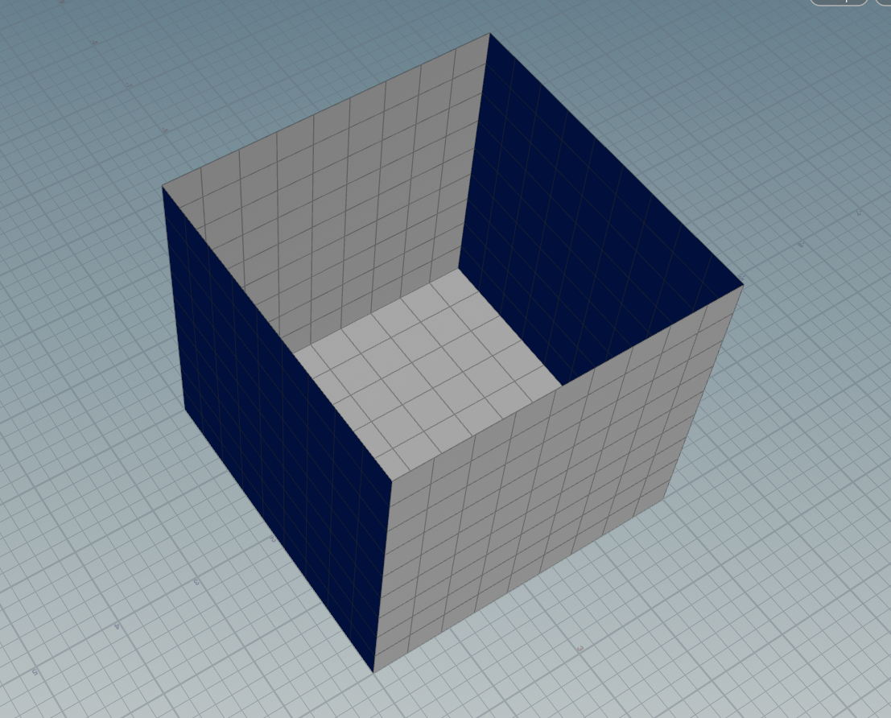

# 程序化建筑Note

Houdini自带的table import：读取csv文件

这里使用对美术更友好的excel文件

## 一.基础建筑模块规划

### 1.墙体

墙体的结构为5面正方体

其中把地板作为基础模块命名empty

其余的按照墙的面数依次命名  -  **模块名_ 面数_ 长高宽_ (变体)编号**         如：**wall_1b_400x350x400_01**、**wall_2b_400x350x400_01**

注意：两面墙的情况有相对、左相邻、右相邻三种情况