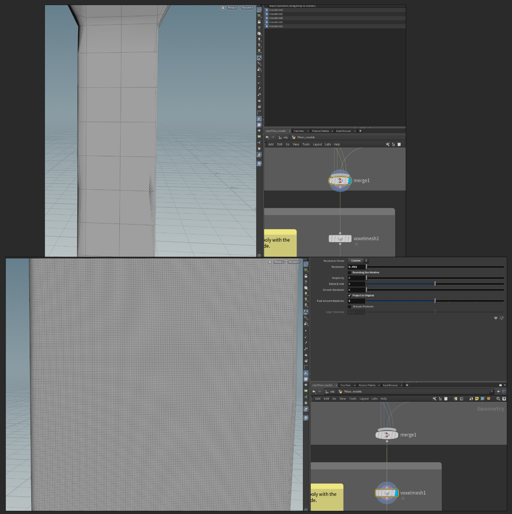
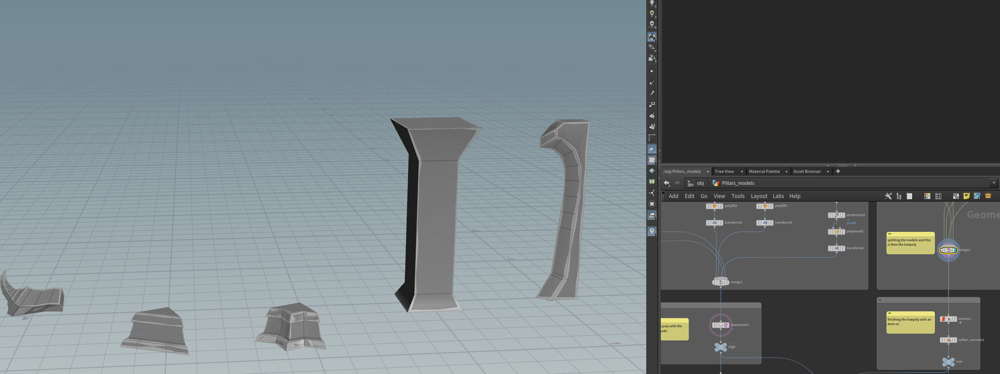
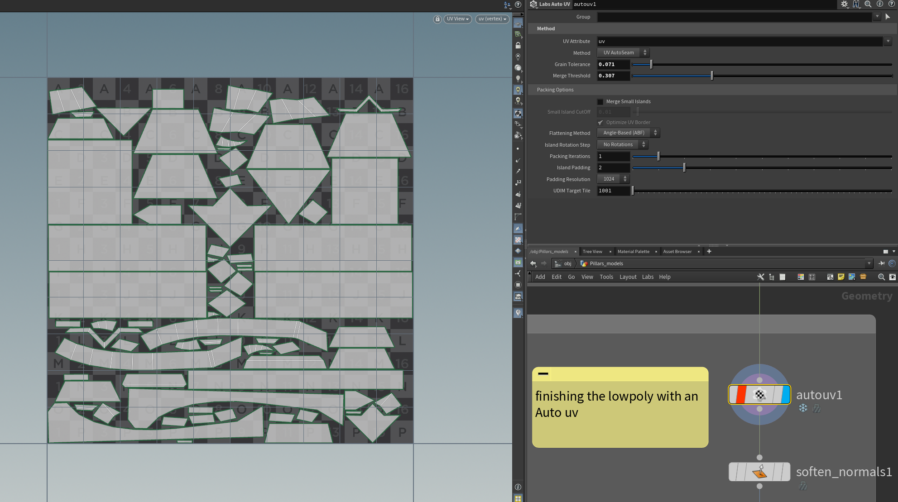
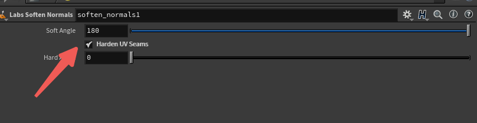
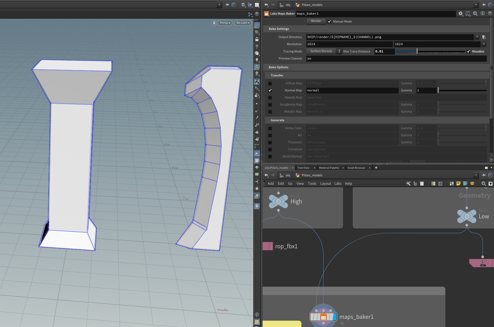

# 烘焙与文件操作

## 烘焙操作

### 1.体素化节点Labs_Voxelmesh

模型处理好后添加Labs_Voxelmesh节点，让模型变为高模

### 2.保证低模和高模位置一致，然后展开低模UV，最后添加法线

若使用软法线，记得勾选硬化UV边缘选项，开启后会硬化UV接缝顶点部分的法线。这是烘焙纹理以防止UV接缝周围出现伪影的一个非常重要的步骤。

3.烘焙法线

使用**Maps_Backer**节点

