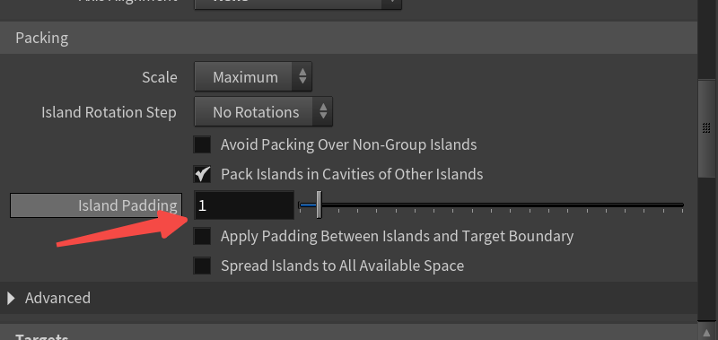
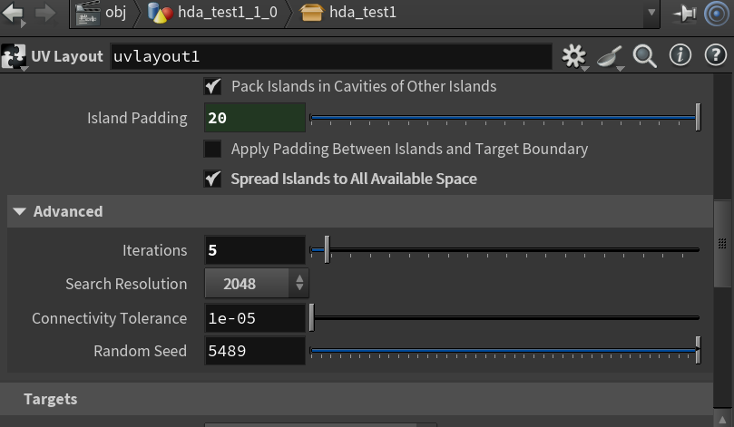
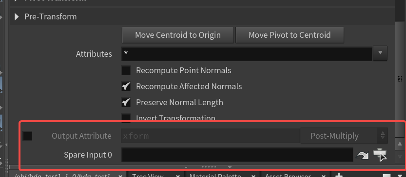
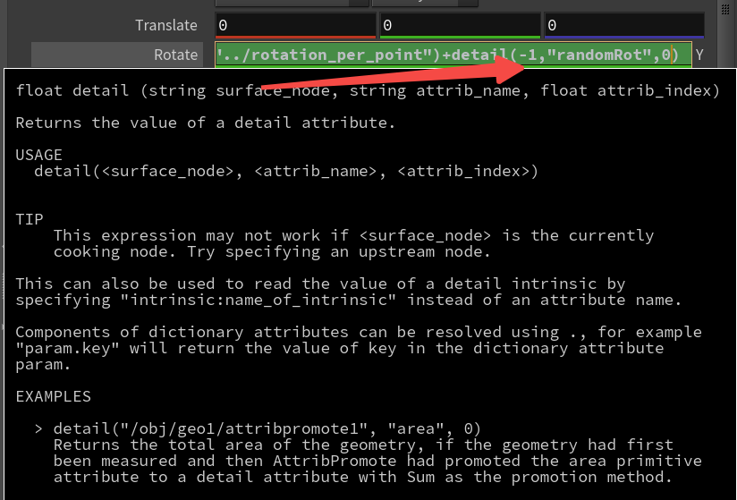
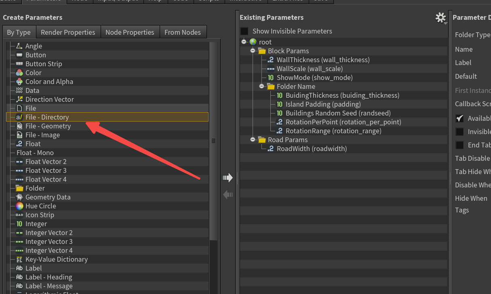
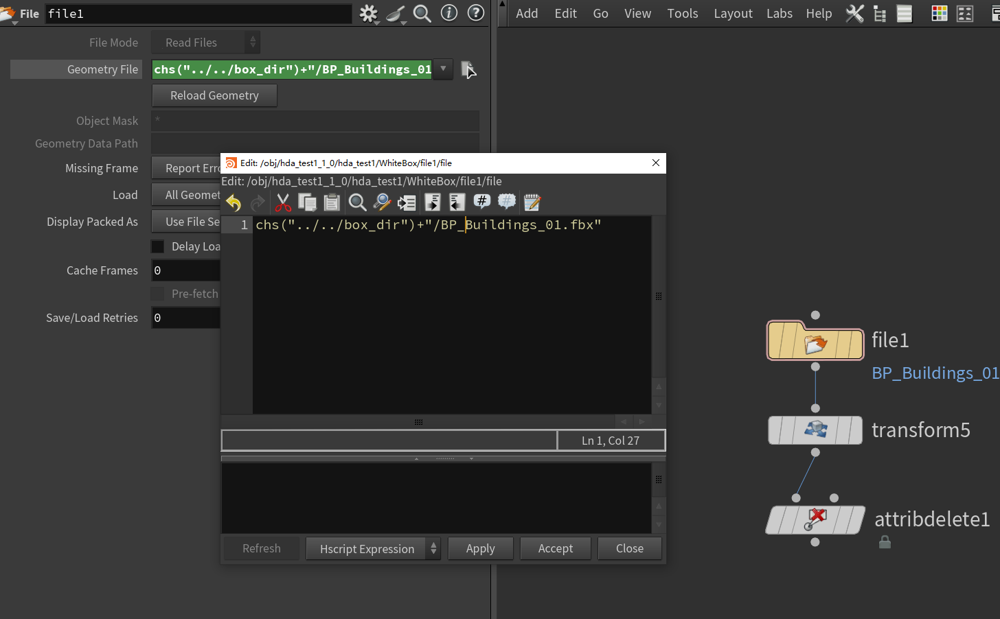

# 程序化专题（一）

## 1.使用UVlayout排布物体

使用uvlayout来排布物体需要把这里attribute换成位置。输入1：排布的物体，输入2：排布区域，修改投射方向：ZX

排布结果

注意：如果之前做了旋转等操作，uvlayout需要取消轴对齐。其次，UVlayout没有法线属性，需要提前给一个法线属性。

取消缩放影响：多余的点可以后期剔除

控制间隔：Island Padding，可以同时勾选下面的均匀填充（Spread Islands to All Available Space）

随机排布：Iteration为1时不生效

## 2.为节点添加输入

在使用时，其对应接口值是-1

## 3.用目录读取fbx

创建目录

使用：dir + 具体文件名

