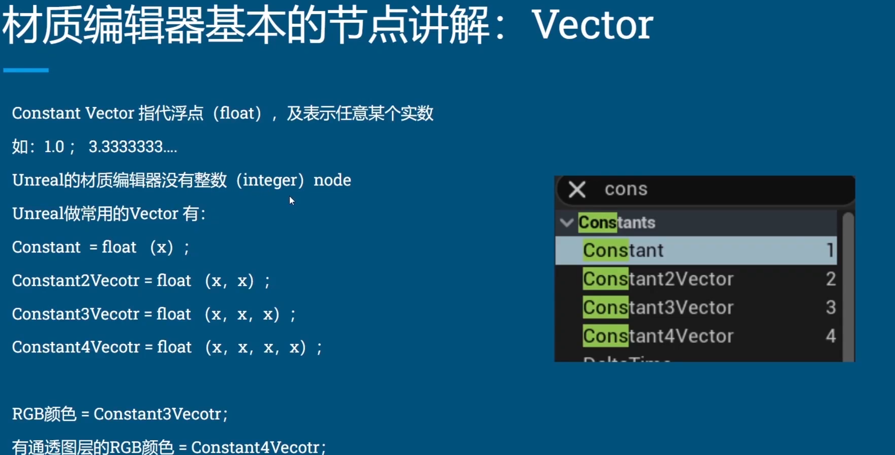
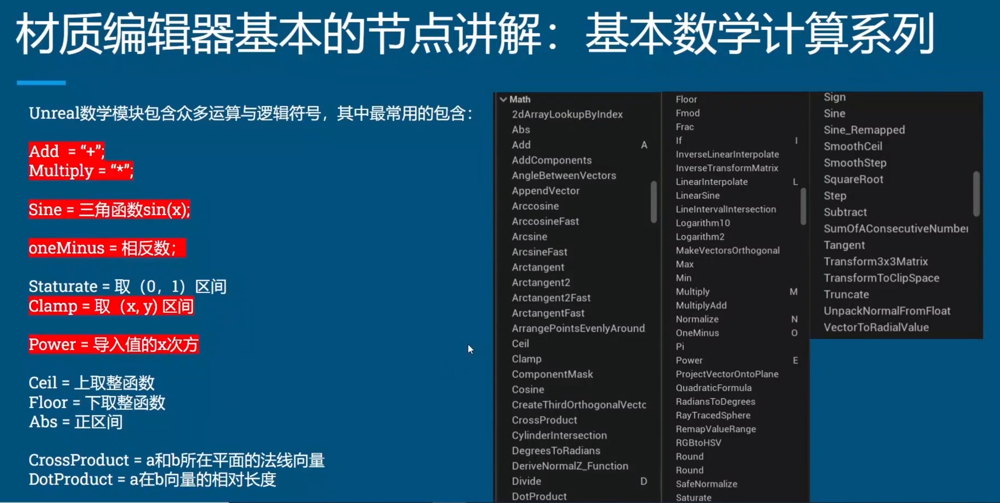
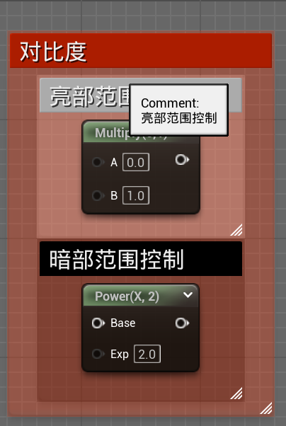
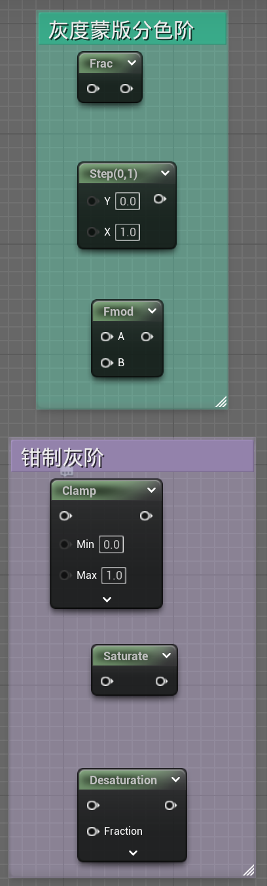
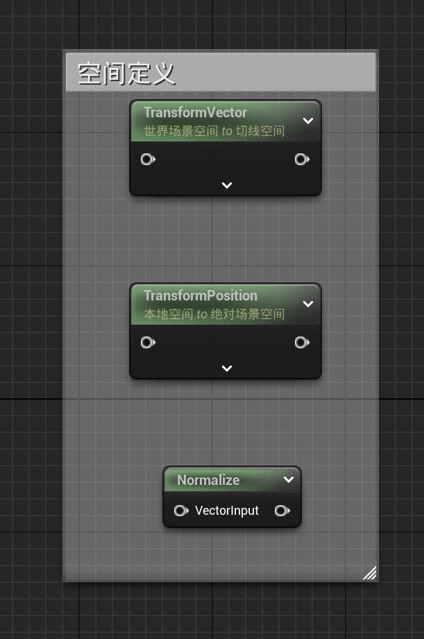

# UE 材质学习（一）

## **Constant (vector)**

---

## **Math**运算节点

用于数学计算  [文档](https://dev.epicgames.com/documentation/zh-cn/unreal-engine/math-material-functions-in-unreal-engine)

常用：

floor是去掉小数点后取比他小的整数,
truncate是去掉小数点取整数。
他们两的的区别在于如果是负数的情况下,例:-1.62用floor之后得出-2,但用truncate之后会得出-1。

---

## Space & Texture空间和纹素

### 空间

主要涉及坐标系转换

原理见

[LearnOpenGL-坐标系](https://learnopengl-cn.github.io/01%20Getting%20started/08%20Coordinate%20Systems/)

[空间坐标系](E:/GitRepo/TA_Review/CG/基础/空间坐标系.md)

