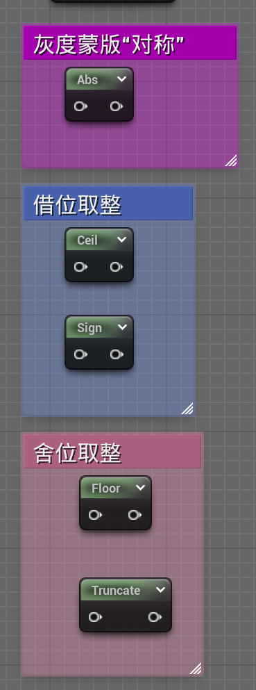

# UE 材质学习（一）

## **Constant (vector)**

---

## **Math**运算节点

用于数学计算  [文档](https://dev.epicgames.com/documentation/zh-cn/unreal-engine/math-material-functions-in-unreal-engine)

常用：

floor是去掉小数点后取比他小的整数,
truncate是去掉小数点取整数。
他们两的的区别在于如果是负数的情况下,例:-1.62用floor之后得出-2,但用truncate之后会得出-1。

Fmod同样是求余数，但是输出的是所有取余的循环，类似2、1、0、2、1、0

---

## Space & Texture空间和纹素

### 空间

主要涉及坐标系转换

原理见

[LearnOpenGL-坐标系](https://learnopengl-cn.github.io/01%20Getting%20started/08%20Coordinate%20Systems/)

[空间坐标系](E:/GitRepo/TA_Review/CG/基础/空间坐标系.md)

注：三维空间中UV空间相当于切线空间

### 纹素

基本以纹理大小为准，是个固定单位（如2048*2048）

补充：

BreakOut节点也可以分离通道

**Texture Sample**

采样贴图

可以调整UV和MipMap Level

**Panner**也可以改变，但是是根据时间的平移运动

**Rotator**根据时间的旋转运动

---

## 图像运算（核心）

三角函数和向量运算、判断逻辑运算（三角函数的值域映射到灰度图上）

点乘节点常用案例：Fresnel

TwoSidedSign：法线正方向输出1，反之输出-1（常用于矫正植被）