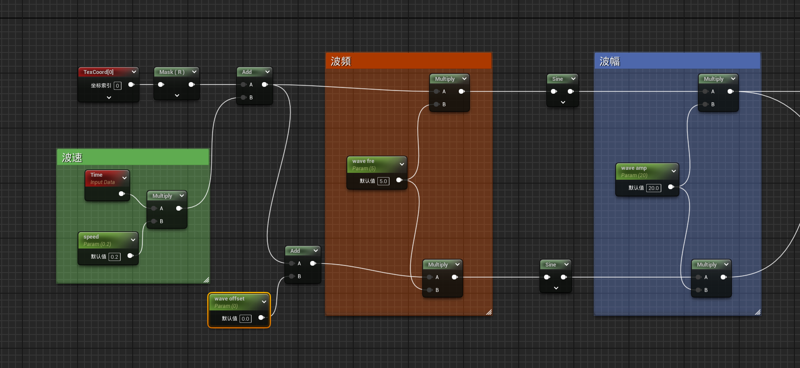
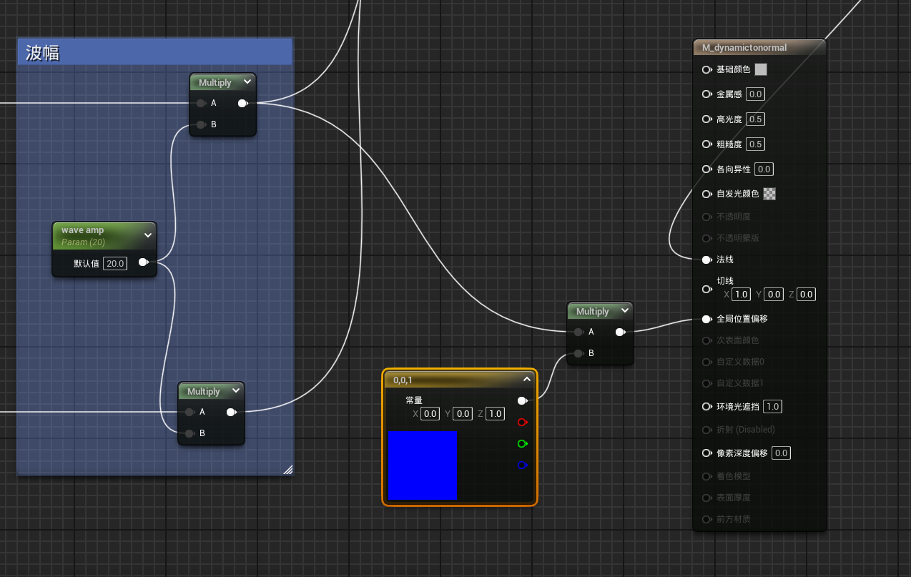
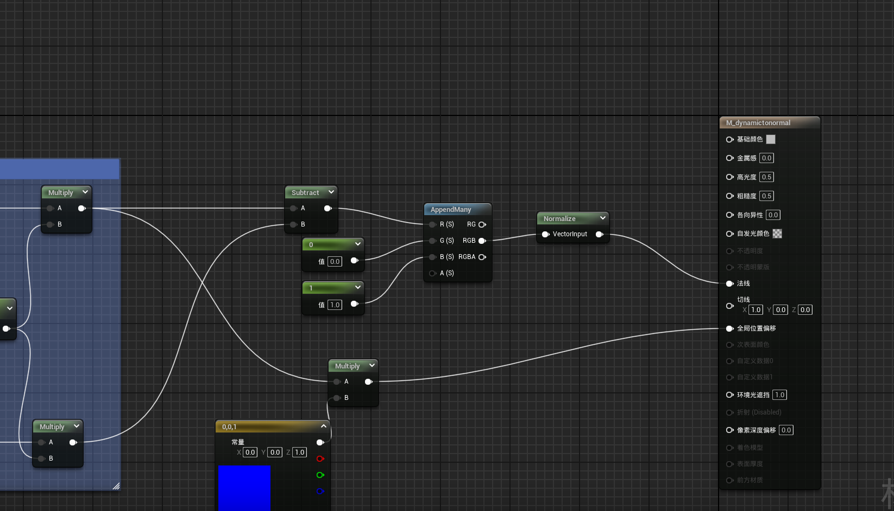
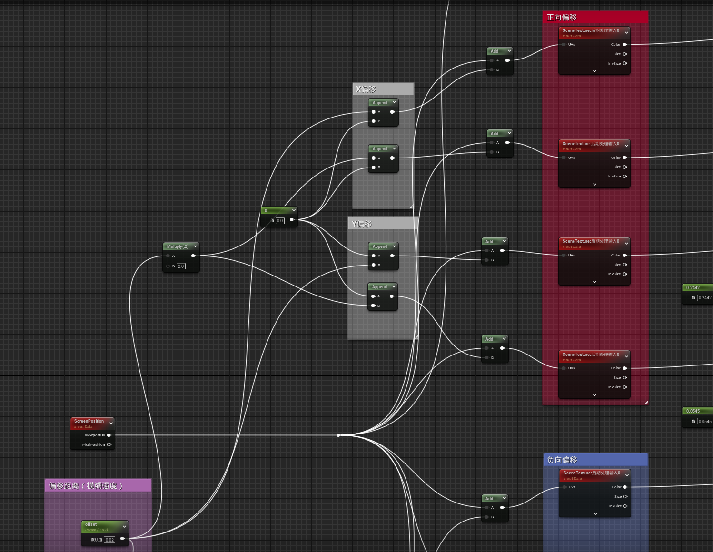
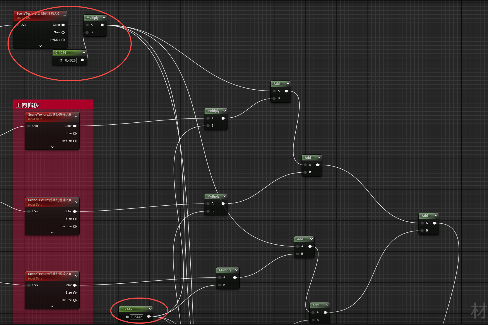

# 材质初探（一）

## 1.随时间变化的正弦波动画运用

**生成正弦波**

本质是游戏时间与UV坐标叠加后传入正弦函数生成波动，具体属性参考下图，下面一排是用于控制法线（注意，改变的是UV空间而非贴图）

**在物体中显示，全局位置偏移**

全局位置偏移需要传入三维向量，而三角函数输出的是一个float值，所以必须让它与一个向量相乘，确定其方向。

添加法线

Subtract是减法，此处即第一步设置的世界法线偏移值变量wave offset，用于法线的R通道（法线贴图的RGB分别表示XYZ轴的偏移值）

## 2.后处理材质重影模糊

核心逻辑：通过偏移叠加不同强度值的屏幕颜色制造重影

偏移：某像素的屏幕空间位置 + 偏移向量

把原始图像和偏移后的图像分别乘以一个权重（防止过曝）来叠加最终图像

