## PBR中的两大工作流程（Metal/Roughness and Specular/Glossiness）

两大工作流有其独特的两种贴图，而法线贴图、AO贴图、高度贴图在两种工作流中是通用的。

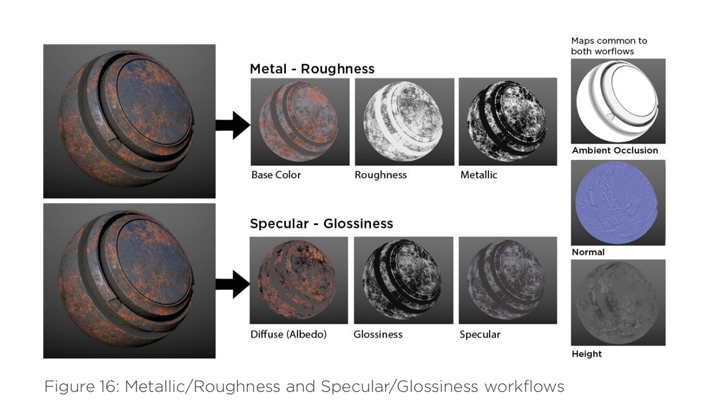

图片来源：PBR-Guide

## （一）Metallic/Roughness工作流

首先介绍一下现在使用更加广泛的金属度和粗糙度配合使用的工作流程，其主要原因是贴图占用内存更小，且比较符合物理世界中形成的直觉，调参更加方便，但没办法调节非导体的F0值，导致可控性减小但绝对能量守恒。（F0的解释:Fresnel Reflectance at 0 Degrees，指在0度的菲尼尔反射率，通俗来说指当光线笔直或垂直（以0度角）撞击表面时，该光线的一部分会被反射为镜面反射。使用表面的折射率（IOR)，可以推导出反射量。这被称为F0。）缺点是在低分辨率贴图中边缘瑕疵问题会比较明显。

小Tips：UE中可以通过Specular属性控制金属度流程中的F0值，感觉非常神奇，但不知道深层的原因。

金属/粗糙度工作流程的贴图有基础颜色，金属纤维和粗糙度。详细介绍可以看Substance的PBR指南，这里我简单总结一下金属/粗糙度流程中贴图中的信息与注意事项。

下面介绍此流程中BaseColor/Metallic/Roughness三个贴图

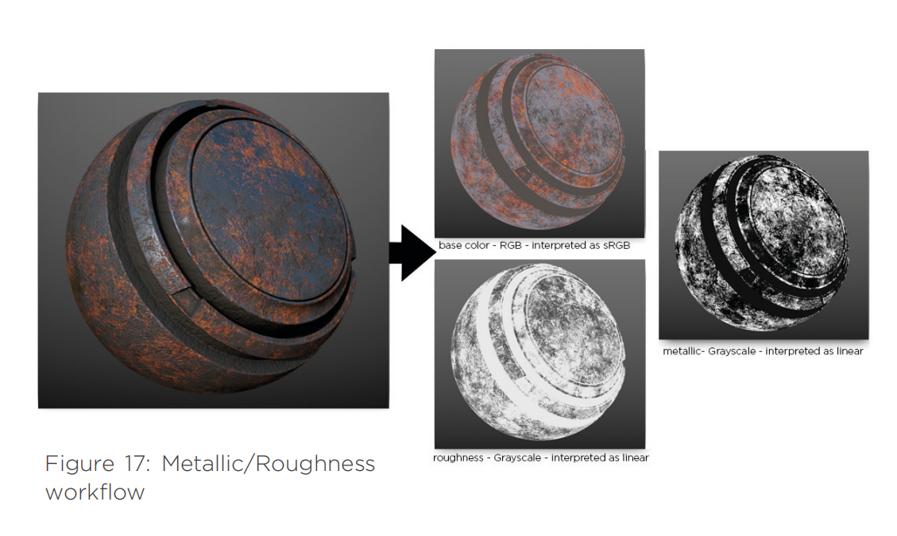

### 1.Base color（RGB贴图）：

**Base Color**是把颜色贴图剔除光影变化后，我们看到的最基础的颜色。

储存数据：非导体（电解质）的漫反射色/反照率颜色（Diffuse Reflected Color/Albedo，为sRGB）和金属导体的镜面反射的F0值。需要配合Metallic贴图使用

非导体使用4%的F0反射值 混合材质（即非导体和金属导体的混合材质）则可以认为是同时储存了这两种数据

因为金属完全吸收了折射进材料内部的光线 所以漫反射消失了，金属呈现出的是反射率颜色，可以理解为BaseColor储存了金属和非金属的两种颜色，且不应该带有光影信息（除非有一些微小AO（Micro-occulusion）的信息需要储存）

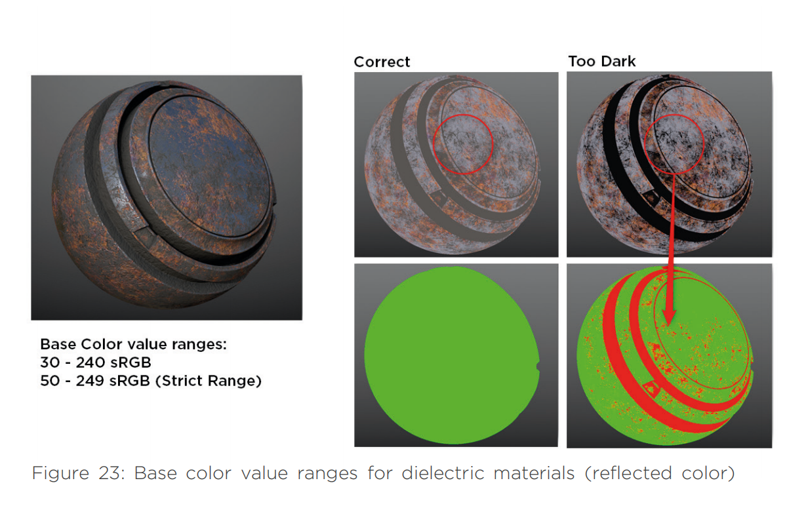

电介质材质基础色值范围(反射光颜色)

非导体的暗部尽量不要低于30-50sRGB，严格情况下不低于50不高于240

导体（金属）的反射值：一般有70-100%的镜面反射，映射到sRGB大概180-255，在SD中可通过PBR BaseColor Metallic Validate节点来验证是否在正确范围

### 2.Metallic（灰度贴图）：

**Metallic**（金属贴图）起到类似于蒙版的作用，区分固有色贴图中的金属和绝缘体数据。

是一张灰度贴图-Linear，对应区域的金属度。储存的信心会告诉着色器应该如何去解读BaseColor贴图中的RGB信息，0为非金属1为金属，0-1之间的值可以用来表现如生锈程度（氧化和污垢）等信息。

注意点：贴图颜色代表非金属材质反射率和金属材质反射率值。

- 除微观遮蔽外，基础色没有布光信息。
- 暗调最低值不低于30 sRGB,严格讲应该为50 sRGB。
- 亮调值应该不高于240 sRGB.
- 原材质反射率会高一些，范围是高光反射70-100%，我们可以将其映射到180-255sRGB.

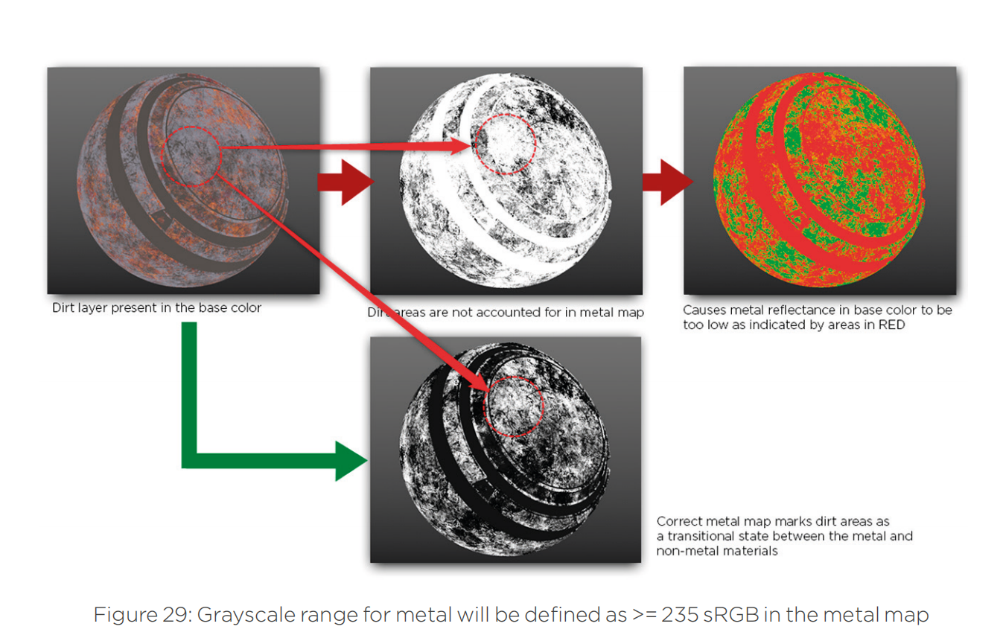

材质颜色混合。金属纤维值较低表示灰土层薄。（灰土和金属的过渡状态。）

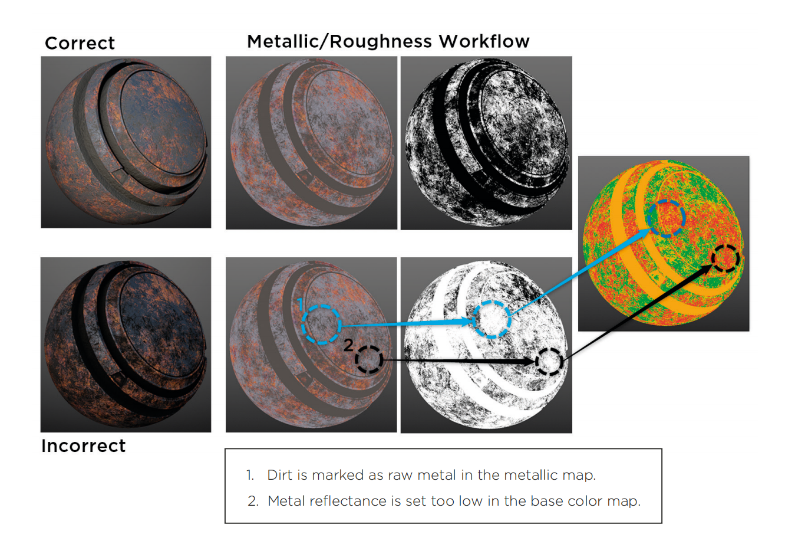

### 3.Roughness（灰度贴图）：

粗糙度是指造成光漫射的表面不规则状况，反射方向根据表面粗糙度自由变化。这改变了光的方向，但是光强度保持恒定不变。表面越粗糙，高光越散越暗。表面越光滑，高光反射集中，尽管反射的光的总量是一点的，表面也会更亮，光会更强。

0为平滑，1为粗糙。粗糙度贴图用于描述一个表面的不规则度，这种不规则度会造成光的漫射，光会局域表面的粗糙度，进行方向随机的反射，虽然在这个现象中光的方向被改变，但是光的强度是恒定的，越粗糙的表面拥有越大越暗的高光，而越光滑的表面就越能将镜面反射聚拢让高光看上去更亮更强。最有创造力的贴图，允许工作者从视觉上定义一个表面的特性。

粗糙贴图是最有创意的贴图，美术可以从视觉上确定表面特征。

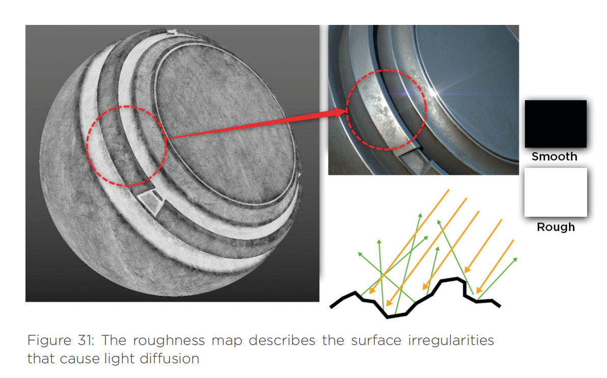

### 4.流程缺陷

使用金属/粗糙度工作流程的产物就是出现白框：

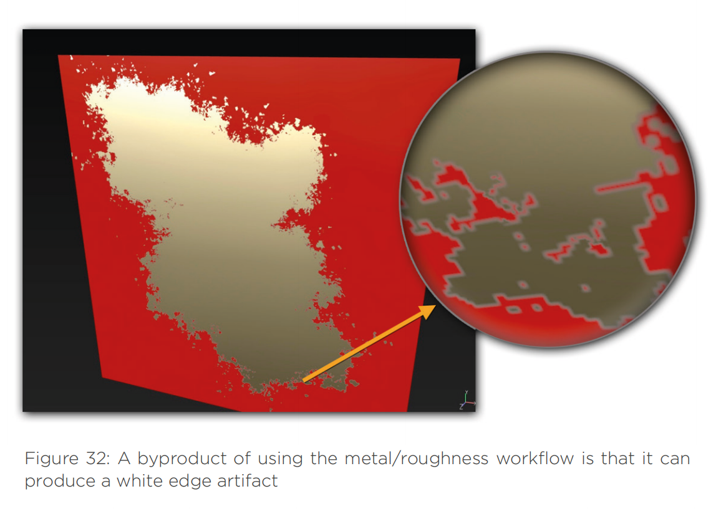

解决方法：文件分辨率和Texel密度直接影响边界伪影的可见度。例如，如果使用硬边刷子创建金属和非金属过渡区域，文件低分辨率仍将会软化边缘扩大伪影。之所以分辨率低是因为UV不能根据文件分辨率提供足够的Texel 密度。UVs的Texel密度良好是边界伪影最小化的最佳方式。

最后再重复总结一下金属/粗糙度流程的优缺点：

优点

- 比较容易创建，不易因提供的电介质F0数据出错，产生的错误率低。
- 金属纤维和粗糙度都是灰度贴图，使用纹理内存较小。
- 适用性比较广泛。

缺点

- 贴图创建中无需控制电介质F0。但是，多数操作的实现需要高光反射控件，控制4%的基础值。
- 边界伪影可见度较高，特别是分辨率低时尤其如此。

## （二）Specular/Glossiness工作流

针对高光反射、光泽度工作流程的贴图是漫反射，高光反射和光泽度。在这个工作流程中，金属反射率值和非金属材质F0都设置在高光反射贴图中。对于高光反射/光泽度工作流程我们有两种RGB贴图：一个是漫反射颜色（反射率），另一个是反射率贴图（高光反射）。有了高光反射贴图，可以在贴图本身内部控制电介质材质F0.F0的控制意味着能量守恒有可能被打破。

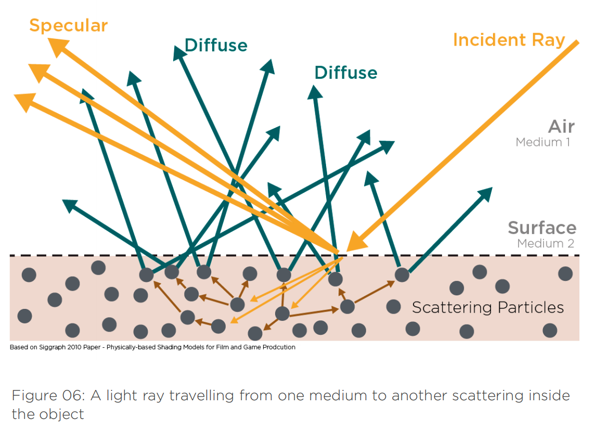

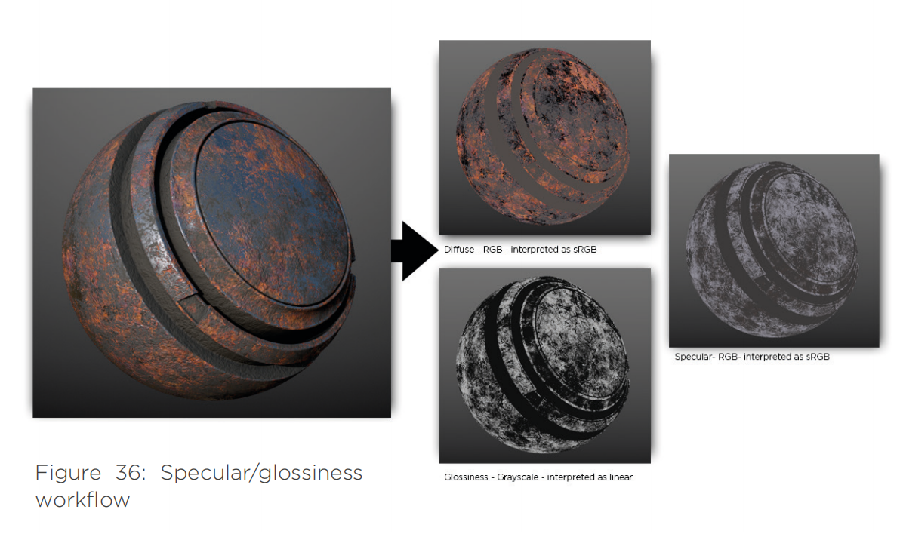

### 1.Diffuse（sRGB贴图）

这个流程中的漫反射贴图没有储存导体情况下的F0值，而是储存了漫反射颜色（Albedo）。

改贴图的注意事项如下：粗金属没有漫反射颜色，就色调而言，漫反射贴图的指导原则与基础色贴图的指导原则相同。但不适用下面这种情况：如果有粗金属，其色调值可以是0.0（暗调），不遵循暗调范围的指导原则。如果有氧化现象，金属区域就会有颜色，因为这个区域不再是粗金属。

- 非金属材质的色调为白色，粗金属为暗调（0.0）。
- 除微堵塞外，基础色没有布光信息。
- 粗金属为暗调情况除外，暗调值最低不能低于**30 sRGB，**严格而言，**应该为50 sRGB.**
- 亮调值不应超过**240 sRGB**

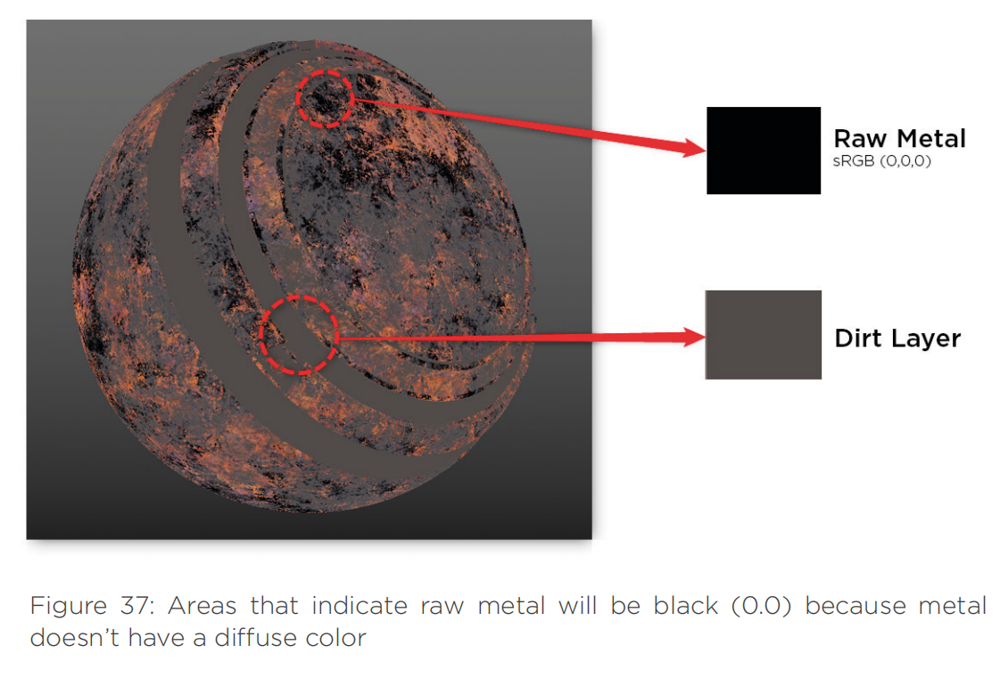

### 2.Specular（sRGb值）

高光贴图记录了金属的反射率值和非金属的F0（0度菲尼尔反射值），都是基于真实空间测量的，尽量不要使用反常规的数值，因为可能会破坏能量守恒，严谨一些可以查表，要注意线性空间与sRGB的转换。

总结一下Specular贴图的几个要点：

- 镜面反射（Specular）贴图包含F0值。
- 普通的非导体的反射值在2-5%之间，转换成sRGB值大约为40-75。
- 普通宝石的反射值范围在0.05-0.17之间（线性空间）。
- 普通液体的反射值范围在0.02-0.04之间（线性空间）。
- 原始金属的镜面反射值在70-100%之间，转换成sRGB大概为180-255.
- 如果无法确认某个材质的反射率（IOR），可以先将F0假设为塑料的F0值：4%。

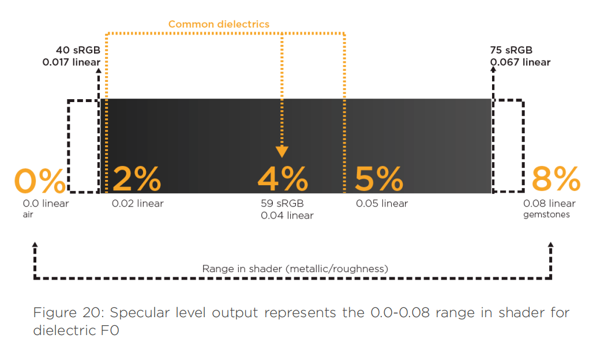

电解质反射值范围

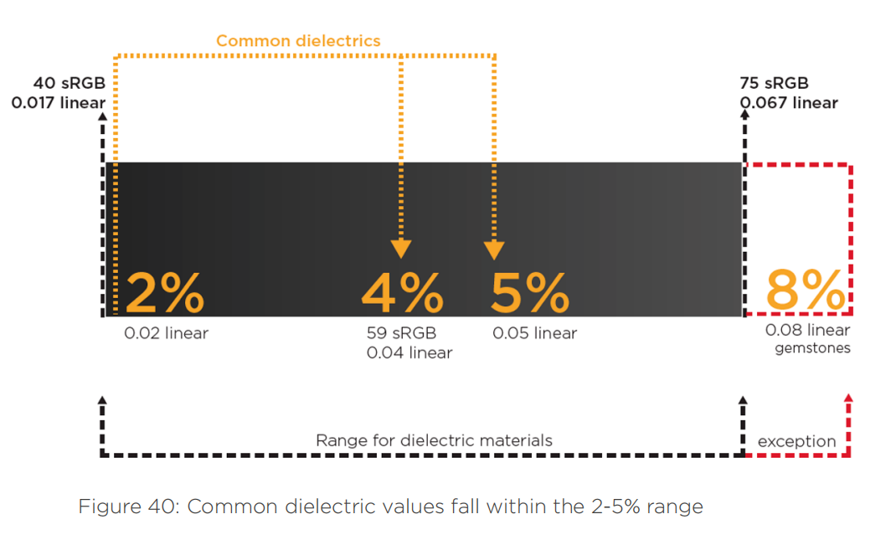

### 3.Glossiness（灰度贴图）

光泽度贴图指的是造成光漫反射的表面不规则现象。在贴图中暗调（0.0）表示表面粗糙，亮调（1.0）表示表面光滑。这是金属/粗糙度工作流程中粗糙度贴图的反面。该贴图与上面的粗糙度贴图部分中的美术指导原则相似。

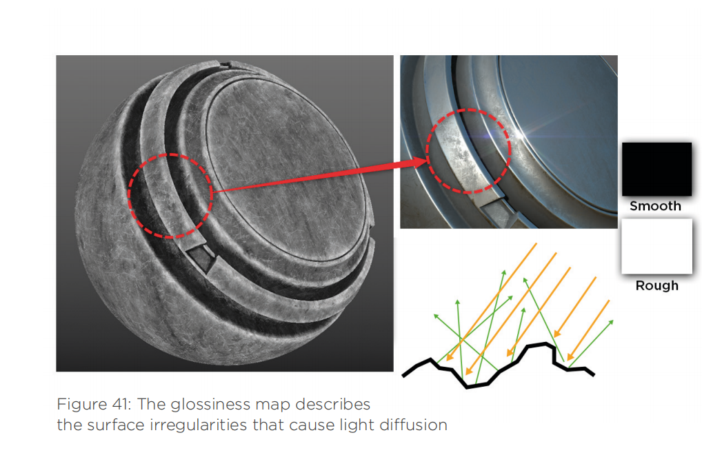

光泽度贴图是指造成光漫反射的表面不规则状况。

### 4.流程缺陷

就高光反射/光泽度流程而言，粗金属没有漫反射颜色，漫反射贴图有暗调。暗调值插入非金属漫反射颜色，就会出现暗调边框。

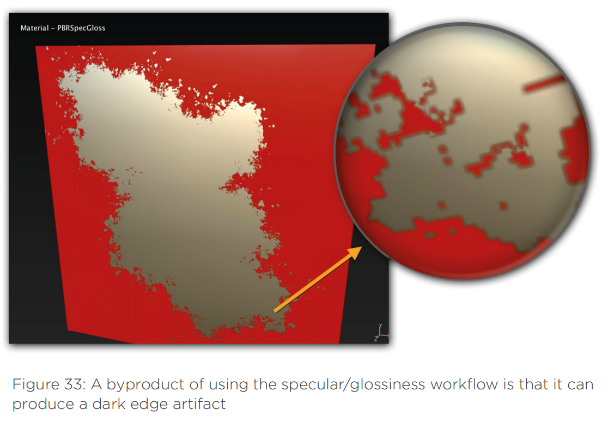

解决方法：如果使用硬边笔刷创建位于金属和非金属之间的过渡区域，分辨率低的文件会软化边界进而扩大伪影。分辨率低的原因是， 与文件分辨率相比，不能提供充足Texel密度的UVs造成的。为UVs提供合理的Texel密度并提高贴图分辨率是解决这个问题的最佳方式。

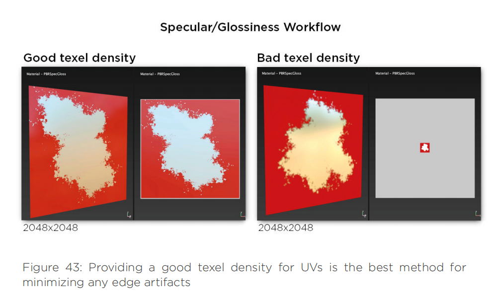

最后再总结一下Specular/Glossiness流程的优缺点：

优点

- 边界伪影清晰度下降。
- 在高光反射贴图中控制电介质F0.

缺点

- 因为高光反射贴图可以控制电介质F0，所以更容易用错数值。如果在着色器中处理不当，可能违反能量守恒定律。
- 对于增加的RGB贴图，要使用更多的纹理内存。
- 传统的工作流程使用类似的术语但数据不同，因此更易混淆。同时也需要运用更多基于物理的指导原则，例如电介质F0，粗金属漫反射颜色的暗调，如果不在着色器中操作可能会遵守能量守恒定律。

## 三、两个流程之间的转换

现在很多软件中都提供两个不同流程中的贴图转换功能，有兴趣可以查一下八猴和SD、SP中的转换步骤。PS当中也可以转换。下次有时间总结一下思路和实操步骤。

