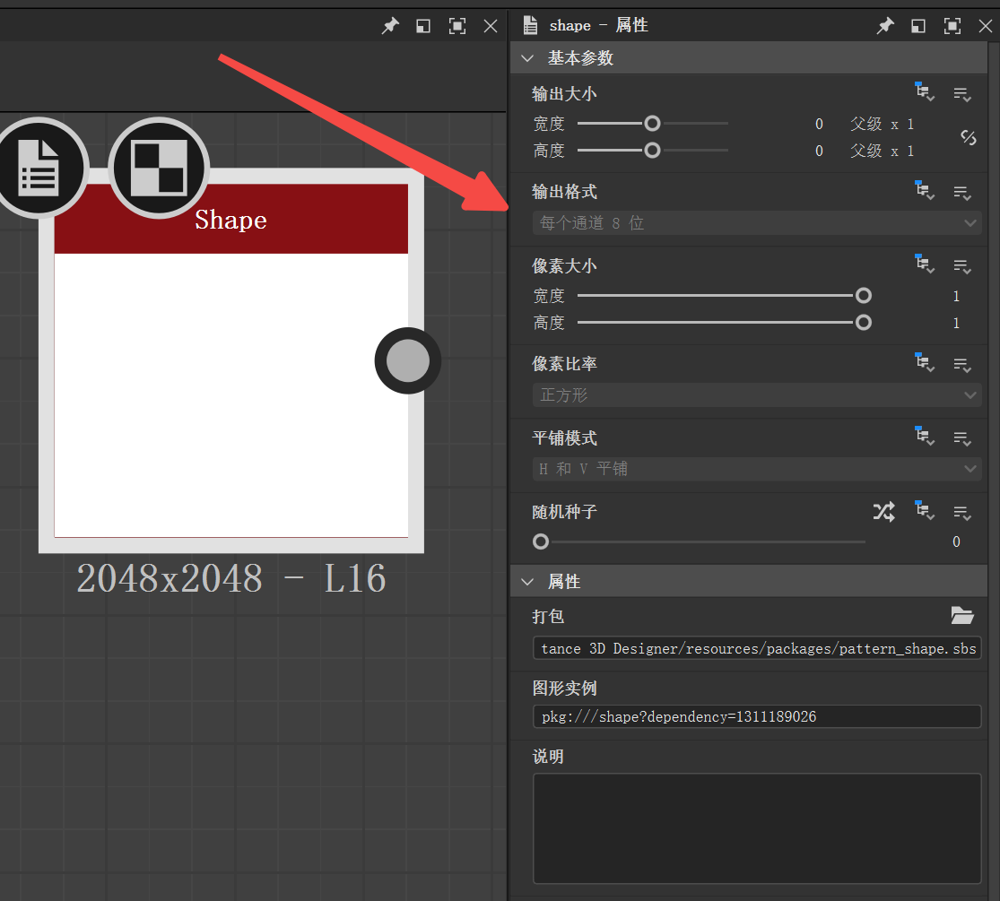
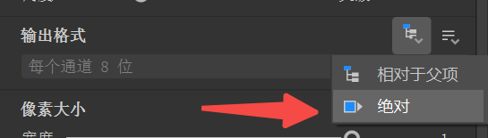
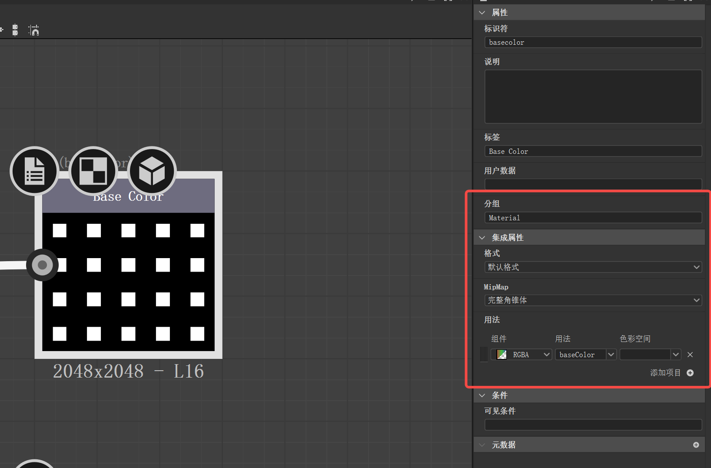
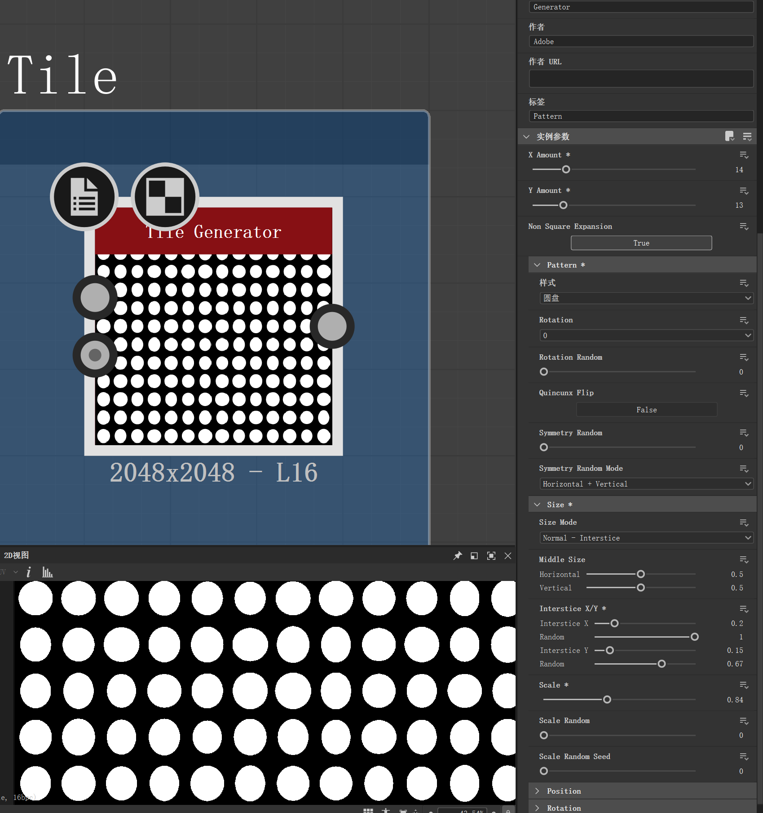
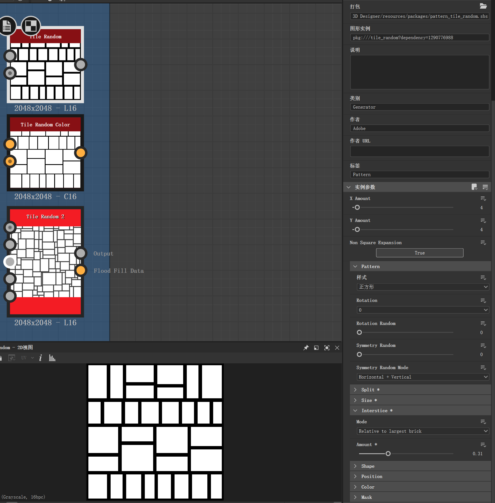

# SD基础学习

## 一.基础

### 输出格式

项目内的各个节点输出格式需要保持统一，节点的输出格式设置为Absolute后可以调整。

### 输出节点设置

## 二.常用节点

### Tilling

用于构造重复图案

**Tile Generator**

生成平铺图案，用过可以调整样式、大小、位置、旋转、颜色，也可以产生随机效果。

**Tile Random**

随机平铺图案，用过可以调整样式、分离方式、大小、间隙、位置、旋转、颜色，也可以产生随机效果。

