# WorldCreator初探

[UE地形标准](https://dev.epicgames.com/documentation/zh-cn/unreal-engine/landscape-technical-guide-in-unreal-engine)

## 重要功能（2023.1）

与2.4.0的区别：

植物系统删除

### 群落 - Biomes

地形模拟的最终结果

#### 全局设置

用于调整全局地形，主要设置地形强度（Strength）、随机种子、地形类型等等。

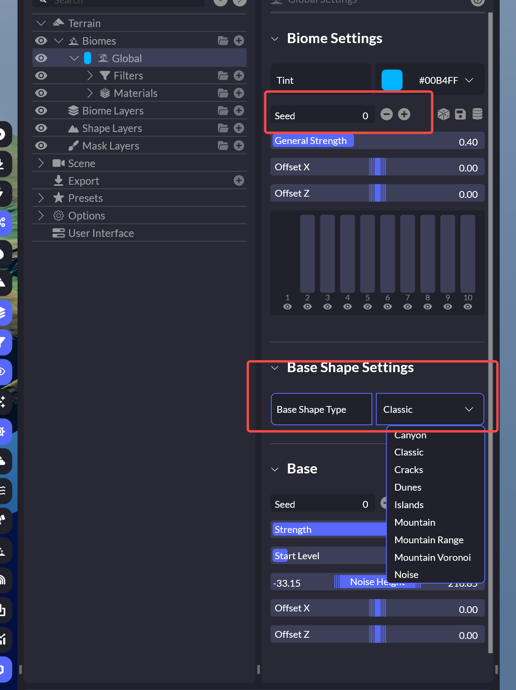

#### 过滤器-filter

地形地貌的侵蚀、风化效果都需要依托于过滤器

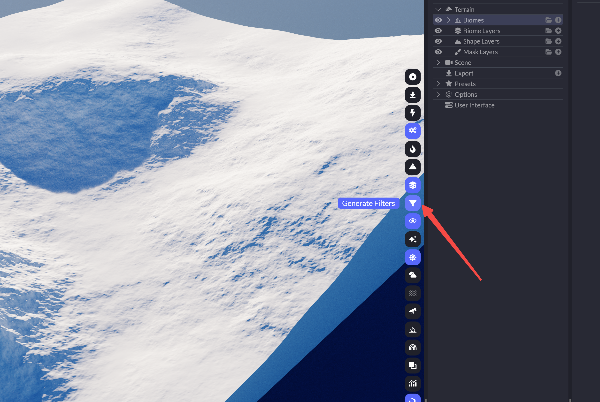

滤镜种类

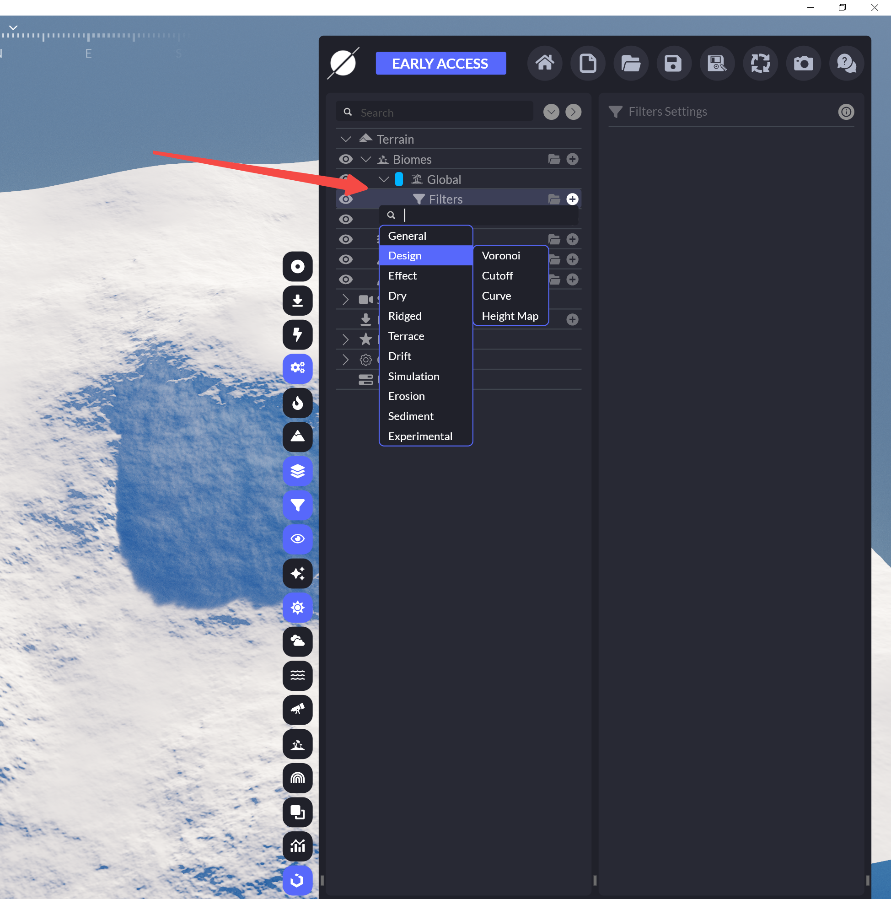

| General 常规     | Design  设计      | Effect  效果         | Dry硬                | Ridged      山脊类 | Terrace           阶梯形状 | Drift   偏流       | Simulation    模拟 | Erosion    侵蚀     | Sediment       沉积 | Experimental         实验功能 |
| ---------------- | ----------------- | -------------------- | -------------------- | ------------------ | -------------------------- | ------------------ | ------------------ | ------------------- | ------------------- | ----------------------------- |
| Add/Set          | Voronoi泰森多边形 | Crater坑             | Canyon峡谷           | Ridged山脊         | 陡峭Steep                  | Wind风化           | Hydraulic栅格模拟  | Rocky岩石侵蚀       | FillSoft填充        | sand沙地                      |
| ZeroEdge平坦边缘 | Cutoff截断        | AngleBlur角度模糊    | RockeySharp锐利岩石  |                    | 不规则Irregular            | AngleBreak角度断开 |                    | SoftFlows河流侵蚀   | Talus               | ParticleSediment              |
| Flatten平整      | Curve曲线         | SmoothRidged平滑山脊 | RockeyHard硬岩石     |                    | 简单Simple                 |                    |                    | WideFlows山脉侵蚀   | Mud复合沉积         | HydraulicSediment             |
| BorderBlend      | HeightMap高度图   | Blocks块状           | RockeyWide山脉       |                    |                            |                    |                    | ThinFlows稀薄侵蚀   |                     | ModifySediment                |
|                  |                   | Deflate压缩          | RockeyPlateaus裂断   |                    |                            |                    |                    | RidgedFlows流水侵蚀 |                     | SimulateFluid                 |
|                  |                   | Denoise降噪          | RockeyCliffs多坑悬崖 |                    |                            |                    |                    |                     |                     |                               |
|                  |                   | Distortion扭曲       |                      |                    |                            |                    |                    |                     |                     |                               |
|                  |                   | Rugged崎岖           |                      |                    |                            |                    |                    |                     |                     |                               |
|                  |                   | Balloon气球形        |                      |                    |                            |                    |                    |                     |                     |                               |
|                  |                   | Inflate膨胀          |                      |                    |                            |                    |                    |                     |                     |                               |

细节设置

强度、等级阶梯等

Distribution（分布）

选择过滤器的生成位置和方式

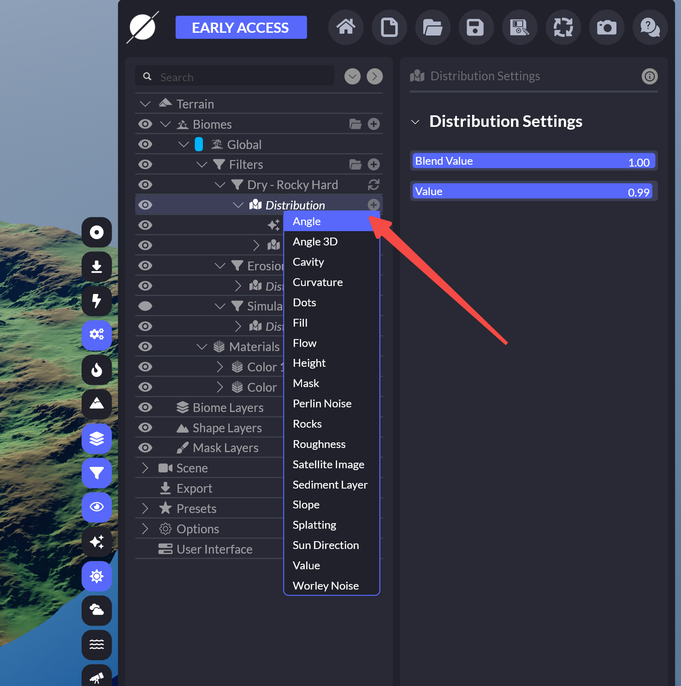

这里可以一直细分

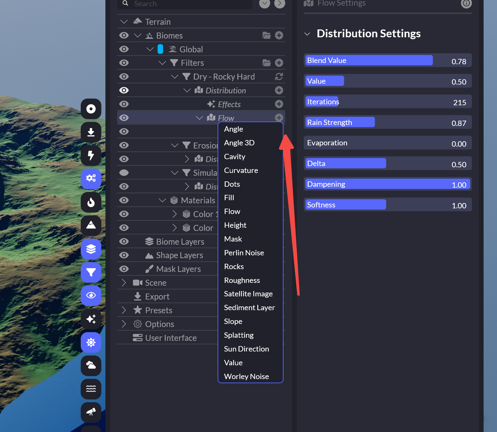

#### **Filter使用小技巧**

1.Voronoi泰森多边形

给地形添加一些高度分块，适用于平原上的高度起伏

### 材质

可以选择不同的材质类型

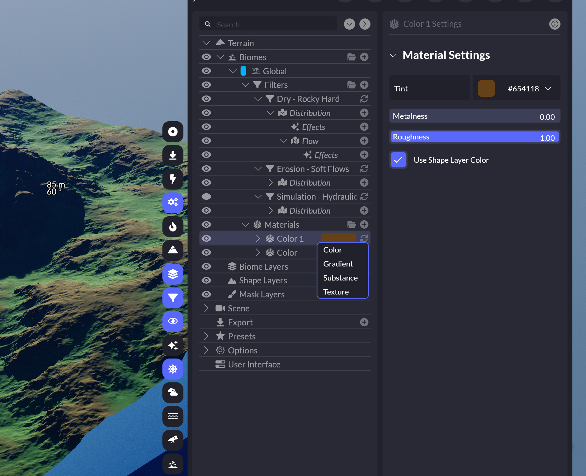

材质的Distribution（分布）和过滤器效果相同

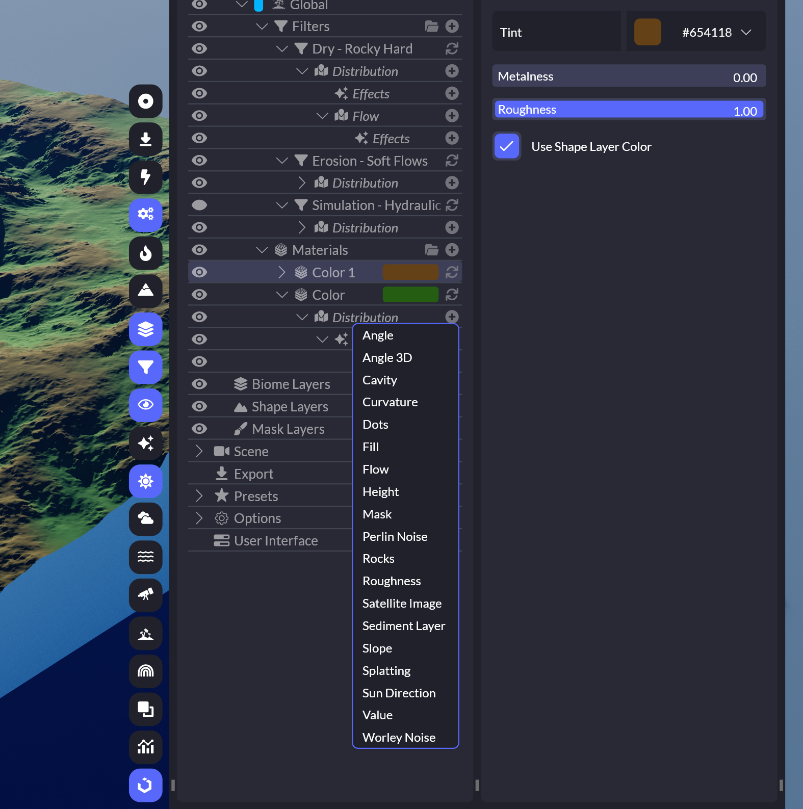

### 形状图层

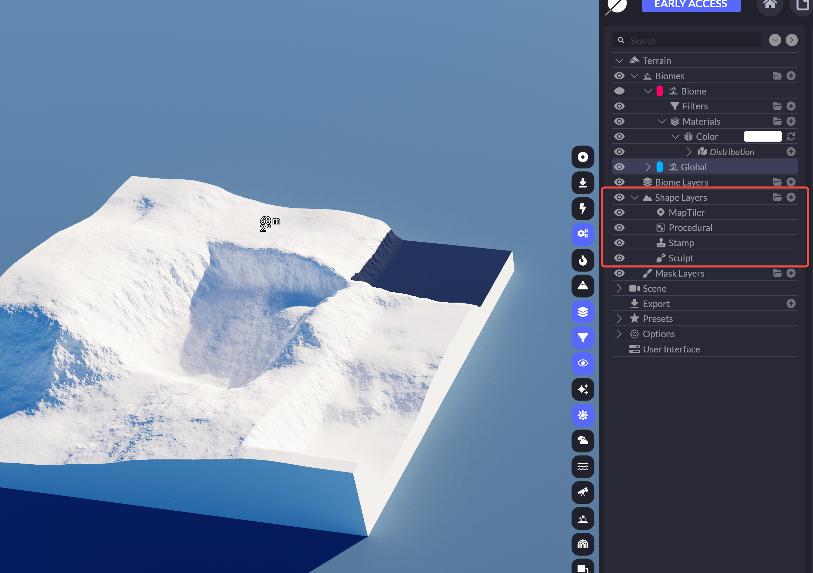

MapTiler		     使用真实地图

Procedural		 程序化生成

Stamp			类似印章（小区域）

Sculpt			 雕刻

Edit中可以使用笔刷，但这里的笔刷工具不算太精细

### Mask图层

主要应用于Filters

使用步骤：1.先创建好Mask，绘制区域 2.在需要调整的过滤器下添加Distribution：Mask，并选择刚刚创建的Mask

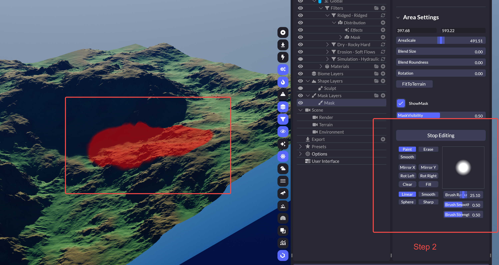

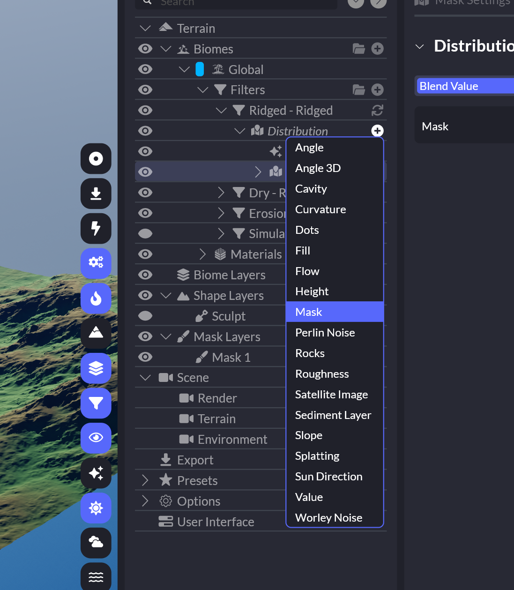

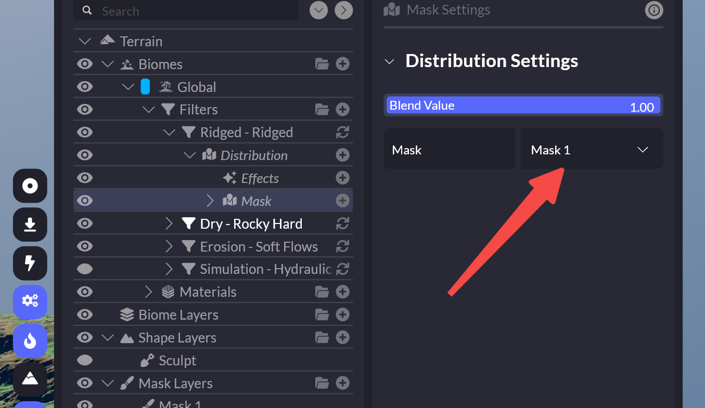

