# Real-Time Shadows

## 目录
+ [Shadow Mapping](#shadow-mapping)
+ [The math behind shadow mapping](#the-math-behind-shadow-mapping)
+ [Percentage Closer Soft Filtering](#percentage-closer-soft-filtering)
+ [Variance Soft Shadow Mapping](#variance-soft-shadow-mapping)
+ [Moment Shadow Mapping](#moment-shadow-mapping)

## Shadow Mapping
贴一下 Games101 的 [Shadow Mapping](https://github.com/HL0817/Games101Notes/blob/main/Notes/7_8_9_Shading/Shading.md#%E9%98%B4%E5%BD%B1%E8%B4%B4%E5%9B%BE)
### SM 简介
+ A 2-pass Algorithm
    + The light pass generates the SM
    + The camera pass usrs the SM
+ 优缺点
    SM 是完全的图形空间算法
    + Pro: SM 可以作为场景中的几何表示来标记阴影关系，不在需要场景中的几何信息
    + Con: causing self occlusion and aliasing issues
+ SM 是一个非常出名的算法
    在光追能被离线渲染使用之前（离线渲染能容忍光追耗时之前），Toy Story(玩具总动员) 就使用 SM

### 基本过程
+ Pass 1:Render form light
从光源位置出发，沿着光照方向记录每一个像素的场景最近深度，写入贴图中

    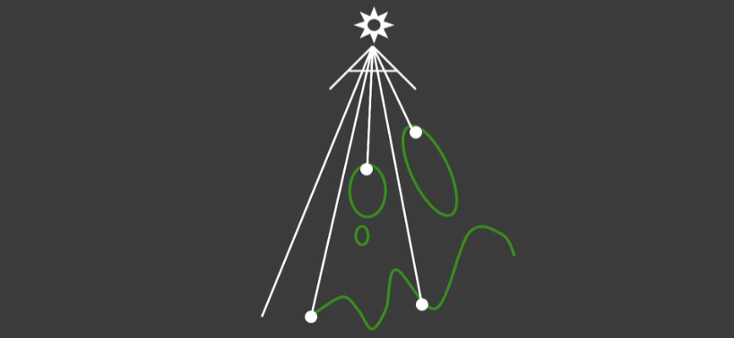

+ Pass 2:Render from Eye
从相机位置出发，渲染场景中的物体，将每个着色点在光源空间深度和 SM 中记录的最小深度作比较，着色点在光源空间深度更大时，着色点就在阴影中

    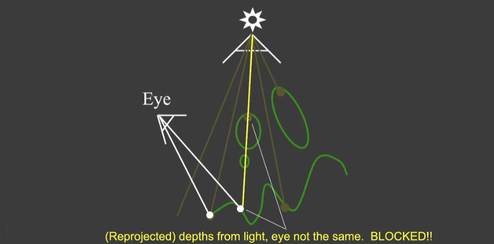

    这里有个注意点，因为光源空间和相机空间的 MVP 不一样，需要在比较深度时做统一，通常是转换到光源空间作比较（在做投影时，挤压过程会将着色点推向远平面）

### SM 的结果
+ Compare with and without shadows

    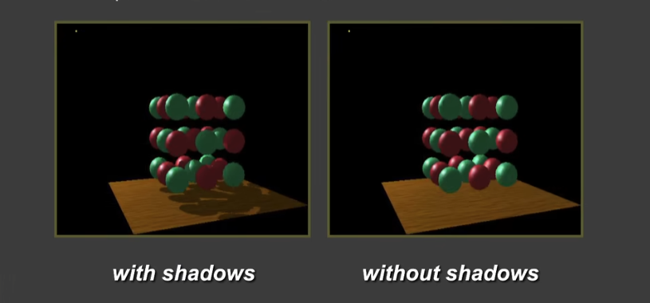

+ The scene form the light's point-of-view 同场景下，光源空间的观察结果

    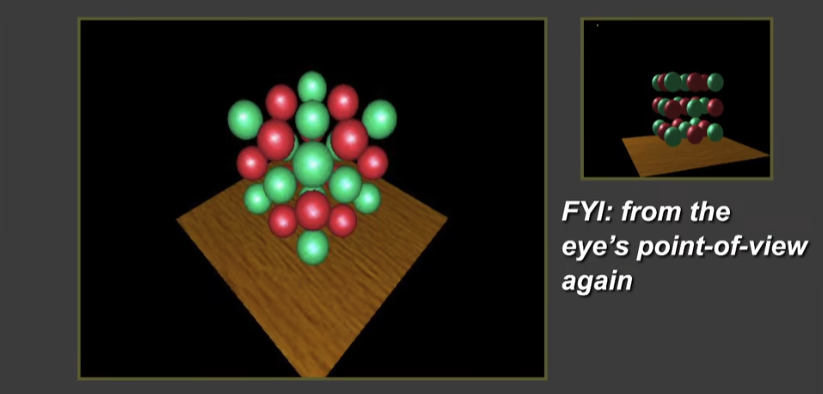

+ The depth buffer form the light's point-of-view 阴影贴图的输出结果
颜色越深，表示离光源越近

    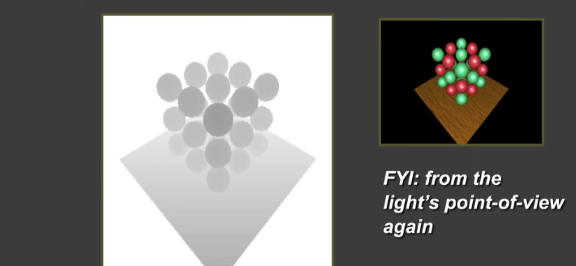

### Issues in Shadow Mapping
#### Self occlusion
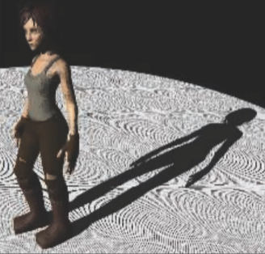

原始的 SM 会在地板上产生一圈一圈的纹路

原因很简单， SM 的这张贴图是有分辨率限制，每个像素都会表示场景中一块区域的深度，这块区域的深度被固定为了一个常数
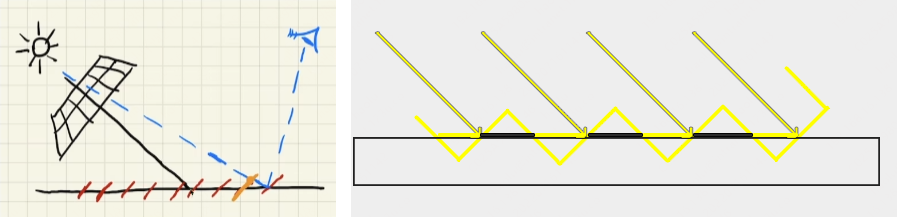

在场景中连续的深度关系被离散成了块状的常数深度关系，那么相邻块之间就有可能产生深度差，从而导致自遮挡（self occlusion）

一句话概括， SM 是离散的深度值，无法表示真实空间内连续的深度值

+ Bias and Peter Panning

    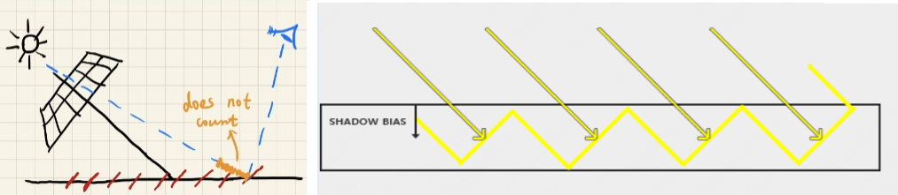

    设置 bias 解决 Self occlusion 问题，我们人为的给相邻块的深度差设置一个容忍值 bias ，只要深度差小于 bias ，就认为没有出现遮挡（光照方向的夹角越小，自遮挡问题越严重，可以根据夹角大小灵活设置 bias）

    Bias 可以解决自遮挡产生的条纹，但是， Bias 可能会造成新的问题 —— Peter Panning
    
    因为 bias 设置过大，会使物体和阴影产生分离

    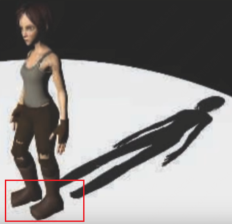

    工业界没有真正解决这个问题，而是在场景中寻找合适 bias 值去减小问题，让阴影不和物体分离，且不会产生自遮挡

+ Second-depth shadow mapping
记录最小深度和次小深度解决 Self occlusion 问题

    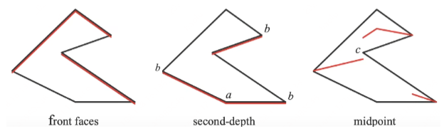

    最小和次小深度做平均，将均值作为场景深度比较的依据

    和原本的算法比，这个算法多了一次寻找次小深度的开销，算法的时间复杂度虽然仍是 O(n) 但是像素太多了，并不能被实时的要求给接受，**实时渲染不相信复杂度（RTR does not trust in COMPLEXITY）**

#### Aliasing
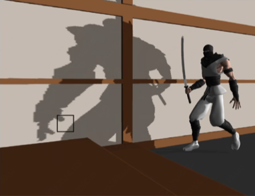

如果 shadow map 的精度不够，就会发生阴影走样

工业界有 Cascaded 方法，通过级联的方式减弱阴影的锯齿，但课程不涉及

## The math behind shadow mapping
### Calculus
+ 微积分中有许多有用的不等式

    如果 $f(x)$ 和 $g(x)$ 在 $[a, b]$ 上都可积，那么有：
    （Schwarz不等式）$\large \displaystyle [\int_{a}^{b}f(x)g(x)dx]^2 \leqslant \int_{a}^{b}f^2(x)dx \cdot \int_{a}^{b}g^2(x)dx$
    （Minkowski不等式）$\large \displaystyle \{\int_{a}^{b}[f(x) + g(x)]^2dx\}^{\frac 1 2} \leqslant [\int_{a}^{b}f^2(x)dx]^{\frac 1 2} + [\int_{a}^{b}g^2(x)dx]^{\frac 1 2}$

+ Approximation in RTR

    在 RTR 领域里，我们更关注不等式中相等或近似相等条件，即把不等式当做近似相等来使用（在一些条件下）

+ An important approximation throughout RTR

    介绍一种 RTR 领域重要的常用的不等式，将乘积的积分近似为积分的乘积
    $\large \displaystyle \int_{\Omega}f(x)g(x)dx \approx \frac {\int_{\Omega}f(x)dx} {\int_{\Omega}dx} \cdot \int_{\Omega}g(x)dx$
    + 分母的意义是什么？

        为了将两边的数量级约束在同一个水平内（保证大致能量守恒或保证数量级上能量相似），给近似式一个常数约束
        举一个例子，如果 $f(x) = 2, 积分限[a, b] = [0, 3]$ 那么 $\int_{0}^{3}2g(x)dx = 2\int_{0}^{3}g(x)dx = \frac {\int_{0}^{3}2dx} {\int_{0}^{3}dx} \cdot \int_{0}^{3}g(x)dx = \frac{6}{3}\int_{0}^{3}g(x)dx = 2\int_{0}^{3}g(x)dx$
    + 近似式的准确的条件
        + 积分域（support）小
        + $g(x)$ 在积分域内足够光滑，变化不大

+ 对渲染方程做近似，将可见性分离到着色之外

    $\displaystyle L_o(p, \omega_o) = \int_{\Omega+}f_r(p, \omega_i, \omega_r)L_i(p, \omega_i)\cos\theta_iV(p, \omega_i)d\omega_i$
    
    近似可得：$\displaystyle L_o(p, \omega_o) \approx \frac{\int_{\Omega+}V(p, \omega_i)d\omega_i}{\int_{\Omega+}d\omega_i} \int_{\Omega+}f_r(p, \omega_i, \omega_r)L_i(p, \omega_i)\cos\theta_id\omega_i$

    这样我们可以不考虑可见性对着色点直接做 shading ，在最后才考虑可见性

    渲染方程准确近似的条件：
    + Small support (point / directional lighting)
    + Smooth integrand (diffuse bsdf / constant radiance area lighting)

## Percentage Closer Soft Filtering
### From Hard Shadows to Soft Shadows
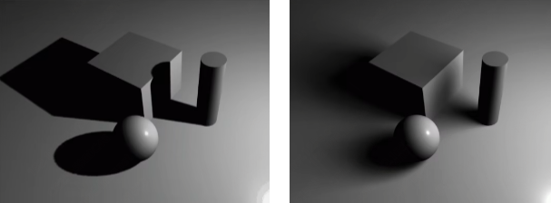

面光源会对物体产生一个半阴影区域，而这个区域就算软阴影区域

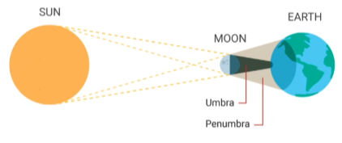

### Percentage Closer Filtering(PCF)
#### PCF 简述
PCF 最开始是作为阴影边缘抗锯齿的手段而提出，PCSS才是为了实现软阴影被提出的
#### PCF 基本过程
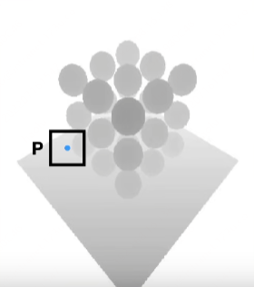

PCF是平均的思路，但不是对生成的 SM 做平均，也不是对着色点周围的深度做平均，而是在计算阴影时，对着色点周围深度比较后的结果做平均
+ Perform multiple depth comparisons for each fragment

    对于这个着色点，采样周围的深度并分别做深度比较

+ averages results of comparisons

    将周围所有深度比较的结果做平均，得到着色点的阴影均值

+ e.g.
    + 对着色点周围 $3 \times 3 $的像素做深度比较
    + 得到一组 $3 \times 3$ 的深度比较结果
    $\begin{pmatrix} 1 & 0 & 1 \\ 1 & 0 & 1 \\ 1 & 1 & 0 \end{pmatrix} $
    + 对深度比较结果做平均得到着色点的阴影值

+ PCF 的抗锯齿结果

    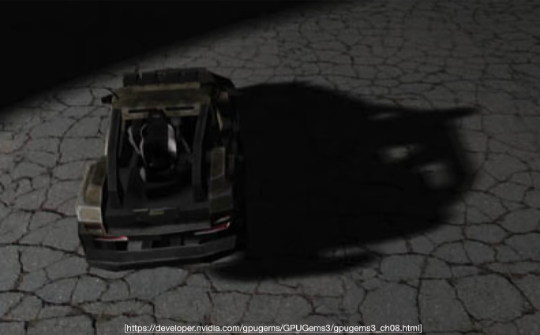

### Percentage Closer Soft Filtering(PCSS)
#### From PCF to PCSS
在实际使用 PCF 的过程中，我们会发现 filter size 是非常重要的
+ 小尺寸会使阴影变得锐利（棱角分明）
+ 大尺寸会使阴影变得柔和（棱角模糊）

如果对 PCF 做一些改进，就能实现软阴影 —— 对阴影使用不同尺寸的 filtering

分析一下什么时候使用软阴影，什么时候使用硬阴影

+ 阴影的接收物离阴影的投射物越近，阴影越硬
+ 阴影的接收物离阴影的投射物越远，阴影越软

那么，阴影的软硬和遮挡物的距离有关

用数学语言表示，$\large w_{Penumbra} = (d_{Receieve} - d_{Blocker}) \cdot w_{Light} / d_{Blocker}$

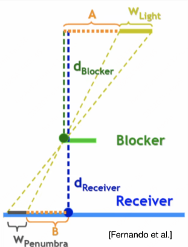

$\large w_{Penumbra}$ 表示阴影的柔和程度，越大越软

#### PCSS 基本过程
+ Step 1:Blocker search
在光源和着色点连线周围记录遮挡物的深度，并取出平均值
+ Step 2:Penumbra estimation
使用遮挡物平均深度算出这个着色点的 filter size
+ Step 3:Percentage Closer Filtering

为了算着色点的 filter size 我们在第一步中取了某个 size 来算计算遮挡物的平均深度，实际消耗上来说， PCSS 比固定大小的 PCF 更消耗性能一些

那么 blocker search 的 size 怎么取呢，我们使用一种启发式的方法来选取

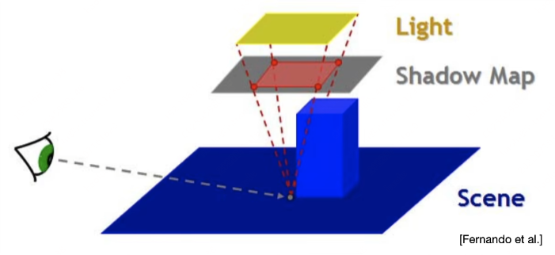

着色点连到光源，在 SM 上投影出来的 size 作为 blocker search 的范围

PCSS 的结果还是不错的

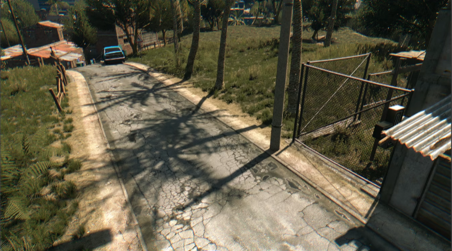

### The math behind PCF / PCSS
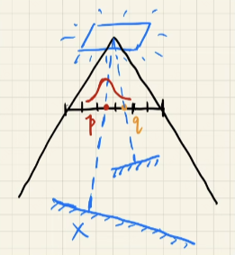

Filter / convolution 的数学表达格式
$\large \displaystyle [w * f](p) = \sum_{q \in \Nu(p)} w(p, q)f(q)$
对图像做 filtering （加权平均） 就是对图像做卷积
+ $p$ 选取的点
+ $q$ 选取的点的邻域
+ $[w * f]$ 指对函数 $f$ 做 $w$ 卷积
+ $w(p, q)$ 指函数 $f$ 每一项的权重

带入到 PCF / PCSS ，其数学表达如下：
$\large \displaystyle V(x) = \sum_{q \in \Nu(p)} w(p, q) \cdot \chi^+[D_{SM}(q) - D_{scene}(x)]$
+ $\chi^+(value)$ 阶梯函数，$vauel > 0$ 函数值取 $1$ ，否则就取 $0$

可以从数学公式中看出 PCF / PCSS 不是对 SM 做 filtering
$V(x) \not= \chi^+{[w * D_{SM}](q) - D_{scene}(x)}$

也可以看出 PCF / PCSS 不是对图像的结果做 filtering ，即不是在图像空间做模糊来做 AA
$\displaystyle V(x) \not= \sum_{y \in \Nu(x)} w(y, x)V(x)$

### PCSS 的缺点或优化思路
#### 缺点
PCSS 跑得比较慢，其 step 1 和 step 3 查询区域内所有像素的深度值非常耗时
而且想要好的软阴影效果，filtering 的区域就设置较大，对应的耗时就很高

#### 优化思路
在区域内随机的取一些数量较少的样本来近似取全量样本的结果（蒙特卡洛的思想？）
得到的结果肯定有噪声，但是随着降噪的技术的开发，用降噪后的结果来代替全量样本的结果，从而节省性能

## Variance Soft Shadow Mapping
VSSM(VSM) 是另一种解决 PCSS 缺点的思路 —— 对 PCSS 的 step 1 和 step 3 进行加速

### 基本思路
以 step 3 为例，对 “percentage closer” 进行拆解

percentage closer 的本质是 PCF 阶段在 SM 所选采样范围内，统计纹素深度比着色点深度小的占比

可以理解为计算给定范围内有多少纹素比给定值 t 更近

有一个非常形象的例子进行解释：计算在一场考试中有多少学生的成绩比自己高，即统计自己成绩是百分之多少

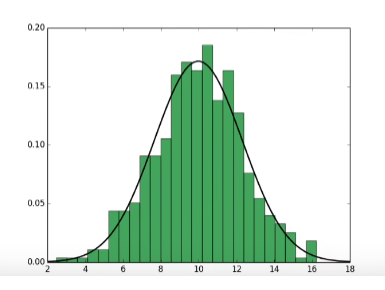

如果我们有考试成绩的直方图，可以很快算出自己成绩的排名

如果将直方图转换成正太分布，可以计算出自己成绩排名的近似值

计算排名就是以成绩为界限计算面积（计算分布的面积等价于概率中的概率密度函数（PDF），给定值和对应面积之间的关系被称为 累计分布函数（CDF））

*题外话*

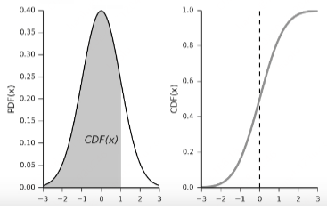

*CDF 没有解析解，只有数值解*
*高斯分布的 CDF 有对应的精确数值解的表，被称作 ErrFunction ， C++ 中有对应函数叫 erf()*

回到 VSSM 话题里来，我们可以估算给定值 t 在阴影深度的分布的 PDF

使用切比雪夫不等式对给定值 t 的 PDF 进行快速估计

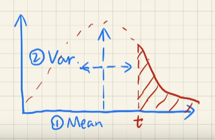

**Chebychev's Inequality:**$\Large \displaystyle P(x > t) \le \frac{\sigma^2}{\sigma^2 + (t - \mu)^2}$
+ $\mu$ 期望
+ $\sigma$ 方差
+ 约束条件 单峰 + $t > \mu$
+ 对于任意分布都有效，即对于任意分布，$x > t$ 的概率的上界可以由期望和方差计算出来

我们将切比雪夫不等式当做等式来使用，假设 $\displaystyle P(x > t) \approx \frac{\sigma^2}{\sigma^2 + (t - \mu)^2}$

如何快速计算期望和方差
+ Mean(averrage)
    + Hardware MIPMAPing 不准确的（近似的）范围查询
    + Summed Area Tables(SAT)
+ Variance
    + $Var(X) = E(X^2) - E^2(X)$
    计算方差必须知道 $E(X^2)$ ，所以我们在存储深度值的同时，还需要存储深度值的平方（在同一张 SM 的不同通道里进行记录）

使用切比雪夫不等式近似法解决了 step 3 PCF 的效率问题，现在回过头来解决 step 1 Blocker Search 的效率问题

假设着色点深度为 $t = 7$ ，蓝色表示遮挡物深度，红色表示非遮挡物深度

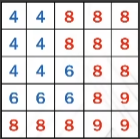

$\Large \displaystyle \frac{N_1}{N}z_{unocc} + \frac{N_2}{N}z_{occ} = z_{avg}$
+ $z_{unocc}$ 非遮挡物的平均深度
+ $z_{occ}$ 遮挡物的平均深度

可以使用切比雪夫近似得到 $P(x > t) = N_1 / N$
那么 $1 - P(x > t) = N_2 / N$

最后对非遮挡物的平均深度进行假设 $z_{unocc} = t$
得到遮挡物的平均深度 $\large z_{occ} = \frac {z_{avg} - (N_1/N)z_{unocc}}{1 - N_1/N}$

得到遮挡物的平均深度后，就得到了 step 1 的结果

### 基本步骤
+ Shadow map generation
    + 记录 $depth$ 和 $dpeth^2$
    + SM mipmap
+ Runtime
    + Mean of depth in a range O(1)
    + Mean of depth square in a range O(1)
    + Chebychev O(1)
    + 根据 $P(x > t)$ 计算出遮挡物平均深度
    + 根据遮挡物平均深度和光源信息计算出 filter size
    + Mean of depth in a new range(filter size)

### 结果

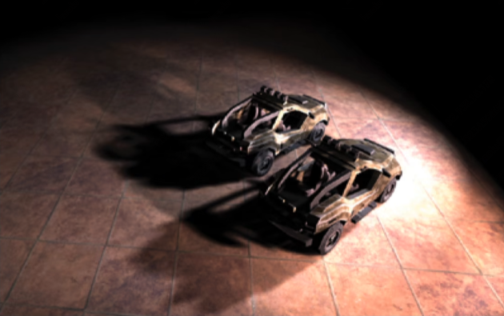

由于一些降噪技术的进步，以及一些时域上的技术的开发，带噪声的快速 PCSS 渐渐以及开始取代 VSSM

### VSSM 的其他细节
将 VSSM 的核心数学思想抽取出来

$\Large \displaystyle P(x \ge t) \le p_{max}(t) \equiv \frac{\sigma^2}{\sigma^2 + (t - \mu)^2}$

使用切比雪夫不等式快速近似得到 $P(x \ge t)$ 的概率密度（PDF）或面积

因此需要快速得到均值和方差，即需要快速得到一张图的平均值，列举两张方法
+ Mipmap
+ SAT

#### Mipmap
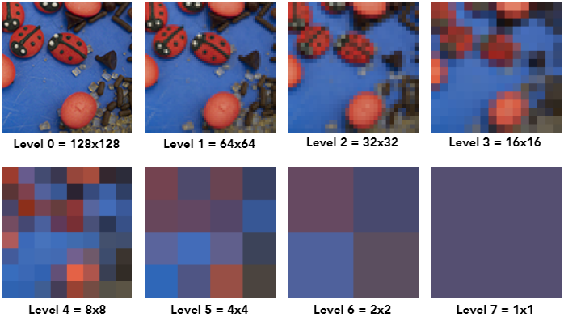

Mipmap 有三个特点 —— fast, approx, square ，即 Mipmap 是快速、近似、方形的区域查询

#### SAT
在范围内求平均等价于范围内求和（知道个数的前提下），SAT 本质就是求某个范围的和来得到这个范围的平均

SAT 使用被称为前缀和（prefix sum）的数据结构和算法来快速获取某个范围的总和

以 1D 的数组来介绍前缀和思想

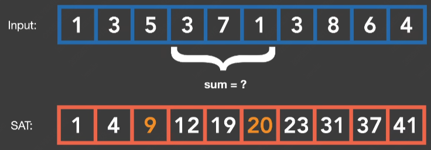

+ Input 表示一个 1D 的数组
+ SAT 是预处理得到的前缀和，每个元素表示原始的 1D 数组从下标 0 到当前元素下标的总和
    + 取原数组中间某一段 ab 的和等价于 b 的前缀和减去 a 的前缀和
    即 $sum_{ab} = SAT(b) - SAT(a)$

现在推广到 2D

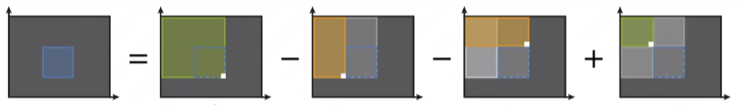

$SAT(x)$ 表示从左上角到对应点 x 的区域内所有值的累加和

如果所示，蓝色区域的的累加和 = 右下点的SAT - 左下点的SAT - 右上点的SAT + 左上点的SAT（左上点的SAT被减去了两次，需要补回来）

SAT 是准确的范围查询算法，但它需要 $O(n)$ 的时间和 $O(n)$的空间消耗
存储应该没有问题，但是似乎不能做到很快的建立 SAT

### VSSM 的问题
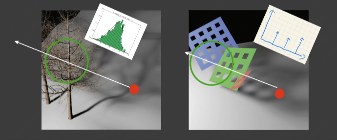

VSSM 用切比雪夫不等式估计了阴影深度真实分布的 CDF 函数。对于左图这样的较为均匀的树枝（类似高斯分布）来说，估计较为准确（或者说缺陷不明显）；但对于右图这样，深度关系简单且差异巨大的深度分布来说，近似出来的 CDF 函数就非常不准确了（右图的三种深度关系具有不同的深度分布的峰值）。

近似得到的 CDF 如果不准确，可能会造成两种错误情况：
+ Overly dark / 过黑：但阴影中黑一点，瑕疵不明显
+ Overky bright / 过亮：在阴影中有亮点或亮线，非常明显
    过亮的根本原因如下图，估计出来的 $P(x \ge t)$ 远大于真实情况下的对应值

    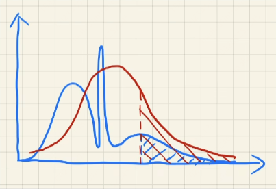

瑕疵的表现被称为 Light leaking ，如下图所示

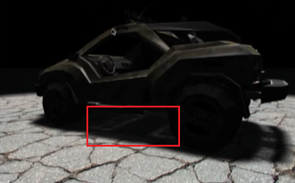

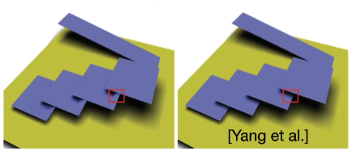

## Moment Shadow Mapping
MSM 主要解决 VSSM 的深度分布不够精确，导致最后计算误差较大的问题
### 简介
+ 目的
    + 使用更准确的阴影深度分布来进行 CDF 计算
+ 思想
    + 使用更高阶的矩（higher order moments）来表示阴影深度分布
+ Monments / 矩
    + 有很多不同的定义
    + 使用最简单的矩
    $x, x^2, x^3, x^4, ...$
    + VSSM 就是使用前两阶的矩来近似得到 CDF

矩的作用：可以使用前面 $m$ 阶的矩来表示一个函数 $m/2$ 个阶跃（这里可以理解成峰值？）
通常使用4阶矩就足够近似出比较准确的阴影的深度分布的 CDF

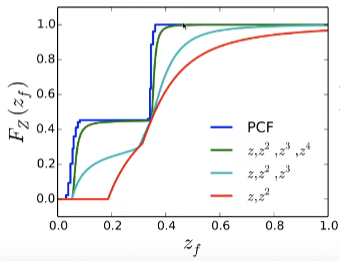

由图可以看出 4阶矩的近似 CDF 的大致形状

可以把 m 阶矩看成 m 阶展开，展开的数量越多（矩越多）表示的原函数越精确

### 基本步骤
+ 其他步骤和 VSSM 相似
+ 在生成 SM 时，需要存储 $z, z^2, z^3, z^4$
+ 4阶矩计算

### 优缺点
+ Pro: very nice results

    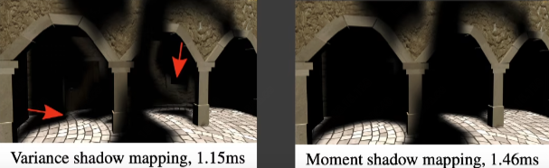

+ Cons
    + 需要额外的存储
    + 计算比较复杂

## Distance Field Soft Shadow
距离场阴影，是一种快速但存储空间要求较高的阴影技术，它的阴影效果如下图

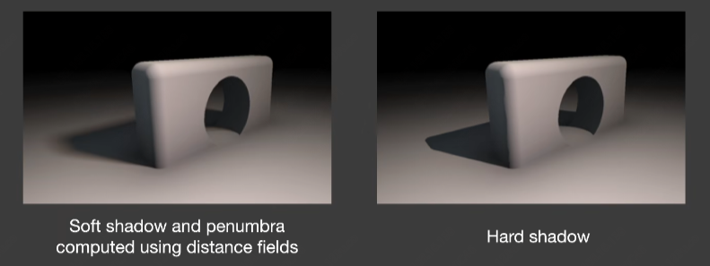

### Distance Functions
距离场阴影的核心就是 Distance function(Signed Distance Function / SDF)

可视化一个场景的 Distance Field

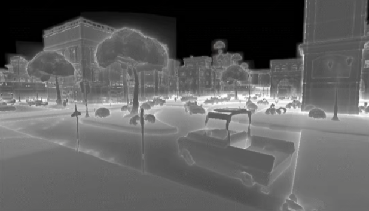

SDF 是记录离物体最近的其他位置的距离的标量场

字母 A 在图像空间中的 SDF 的可视化如下图：

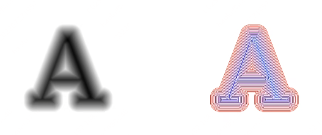

可以理解成字母 A 周围的等高线图

以 e.g. Blending(linear interp.) a moving boundary 为例理解 Distance function 的作用

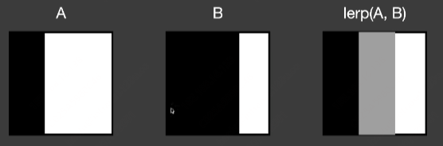

A 和 B 分别表示同一个物体在时刻 A 和时刻 B 的运动状态，对 A 和 B 进行线性插值得到了 lerp(A, B)

对 A 和 B 进行插值的本意是得到物体从时刻 A 到时刻 B 的运动状态的变化值，但直接进行线性插值，得到的结果并没有什么实际含义

我们可以使用 SDF 对两个不同时刻进行插值，来获得物体在两个时刻间运动状态的变化值，如下图：

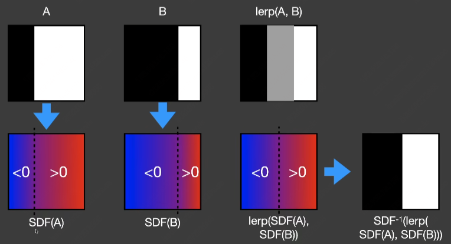

我们分别获取时刻 A 和时刻 B 物体的 Distance function ，然后对 SDF(A) 和 SDF(B) 插值得到中间状态的 SDF(A->B) = lerp(SDF(A), SDF(B)) ，然后重新将 SDF(A->B) 的运动状态给还原出来

Distance function 可以做任何形状的 blending 而不去关注他们的拓扑结果

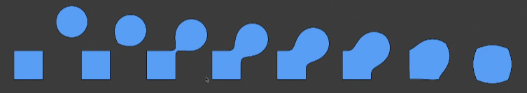

### The Usages of Distance Fields
#### Ray Marching
SDF 被广泛的应用于 Ray marching（或者被称作 Sphere tracing）

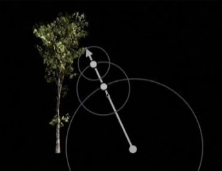

现在已知光线起点和它的步进方向，同时知道这个点的 SDF

光线在步进距离选取时，可以根据距离场得到一个离光线起点最近物体的距离值

这个距离可以被理解为以光线起点为球心，以最近距离为半径的球体内，没有任何其他物体与光线起点相交，我们不妨称这段距离为安全距离

将安全距离作为此次步进的距离，按照步进方向和步进距离得到下一个迭代后的光线起点

以 SDF 确定出来的安全距离作为步进距离，大大缩短了 Ray marching 步进的次数

#### Shadow
用 SDF 可以生成 Soft shadow

核心思路是用 SDF 来估计着色点的被遮挡信息

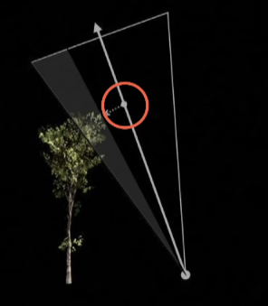

对于一个面光源来说，着色点和面光源的连线形成的夹角是面光源对着色点的最大可视角度

我们可以从着色点往面光源发射一根光线，在光线上对它的一些列点做 SDF 取值，可以得到一个最小安全距离

这个安全距离，我们稍作转换，将它所在的安全球体与着色点做连线，得到安全球体与着色点的夹角（3 维空间就是立体角），将这个夹角称为安全可视角度

我们近似的将安全可视角度与最大可视角度的比值看做是着色点的非遮挡区域的占比

那么自然可以得到面光源在着色点的被遮挡占比，然后用来对阴影做计算

取 SDF 的过程仍然是 Ray marching ，即从着色点出发沿着面光源的中点做光线步进

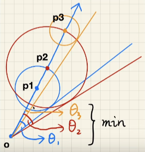

找出步进方向上最小的安全可视角度，作为真正使用的安全可视角度

图中可以看出 $\cos\theta = \frac{SDF(p)}{OP}$ ，$\theta = \arccos \frac{SDF(p)}{OP}$

这里可以避免做复杂的 $\arccos$ 操作，直接以 $min\{ \frac{k \cdot SDF(p)}{OP} , 1.0\}$ 作为阴影的计算信息

解释一下这里的 $k$ 的作用，用来表示阴影的软硬程度， $k$ 越大阴影越“硬”

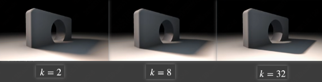
### Pros and Cons of Distance Field
+ Pros
    + Fast —— 做 Ray Marching 或者做 Soft Shadow 非常快
    但是这是不考虑生成 SDF 的情况下（不考虑生成 SM 的时间，Shadow Map 方案做阴影也很快）
    + High quelity —— 由于距离场的原因，阴影质量也很高
+ Cons
    + Need precomputation —— 生成 SDF 需要预计算
    + Need heavy storage —— SDF 数据量麻烦，需要占用大量存储空间
    运动物体、形变物体难以处理
    + Artifact —— 接缝之类的问题
    + SDF 生成的物体非常不好处理贴纹理的问题（距离场阴影不需要考虑这种问题）

### 优化思路
SDF 在3维空间下，需要海量的存储空间，空间中每一个点都需要计算一个最小距离并存储

但肯定不能存储每一个点，需要特别的存储结构

这里可以类比光线追踪的求交优化，对空间进行划分（8 叉树之类的），从而进行存储优化

但是深度学习的压缩 SDF 数据并不合适，实时状态下无法使用压缩解压缩的模型过一遍神经网络才解算出 SDF