# Real-Time Environment Mapping

## 目录
+ [Recap:Environment Lighting](#recapenvironment-lighting)
+ [Image-Based Lighting](#image-based-lighting)
    + [近似渲染方程](#近似渲染方程)
    + [光线积分简化和预处理](#光线积分简化和预处理)
    + [BRDF 积分简化和预处理](#brdf-积分简化和预处理)
    + [结果](#结果)

## Recap:Environment Lighting
环境光的定义：来自各个方向的远距离光照

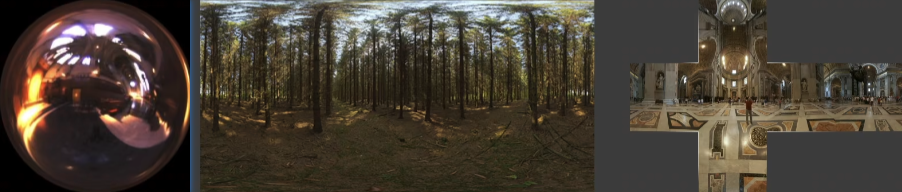

由于被定义为远距离，所以对于所有着色点而言，这个光照的距离是固定的

因此，使用一个球形区域的表面来表示着色点不同方向的光照信息

一般使用 Spherical map 或 Cube map 来存储

## Image-Based Lighting
使用 Environment Lighting 对着色点进行着色，在工业界被称为 IBL(Image-Based Lighting)

### 近似渲染方程
还是从渲染方程出发，进行分析

$$\Large L_r(p, \omega_r) = \displaystyle\int_{H^2}f_r(p, \omega_i \rightarrow \omega_r) L_i(p, \omega_i) \cos\theta_i V(p, \omega_i) d\omega_i$$

首先不考虑阴影，只考虑着色本身

遮挡关系由 $V(p, \omega_i)$ 决定，我们先将这一项从渲染方程中摘出来，只考虑剩下的部分如何计算

$$\Large L_r(p, \omega_r) = \displaystyle\int_{H^2}f_r(p, \omega_i \rightarrow \omega_r) L_i(p, \omega_i) \cos\theta_i d\omega_i$$

剩下公式中表示，我们需要在着色点朝外的半球中积分 $L_i(p, \omega_i)$ 得到来自上半球各个方向的光线和 BRDF 项的相互作用

可以使用渲染方程求解的通用的解决方案 —— 蒙特卡洛积分，对着色进行计算
+ 无偏（Numerical）的求解方法
+ 需要大量的样本（样本越高，蒙特卡洛积分得到的数值越精确）

但蒙特卡洛积分并不能放到 shader 里进行积分求解（一般来说，靠样本采样的方法并不适合放到 shader 中做计算）

所以现在使用 IBL 的计算方法来对渲染方程做计算

对于渲染方程的 BRDF 项来说，其分布具有一定特殊的分布
+ glossy —— small support
+ diffuse —— smooth

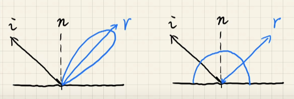

毛玻璃材质的积分域比较集中，漫反射材质的积分函数比较平滑

这个特质非常适合使用一个近似式子

$$\large \displaystyle \int_{\Omega}f(x)g(x)dx \approx \frac {\int_{\Omega}f(x)dx} {\int_{\Omega}dx} \cdot \int_{\Omega}g(x)dx$$

BRDF 非常符合近似式的精确条件，所以使用它对渲染方程做近似分解

$\large \displaystyle L_r(p, \omega_r) \approx \frac {\int_{\Omega_{f_r}}L_i(p, \omega_i)d\omega_i} {\int_{\Omega_{f_r}}d\omega_i} \cdot \int_{\Omega^+}f_r(p, \omega_i \rightarrow \omega_r) \cos\theta_i d\omega_i$

其中 $\displaystyle L_i(p, \omega_i)$ 表示光照的输入（Environment Lighting）
$f_r(p, \omega_i \rightarrow \omega_r)$ 表示 BRDF 的分布

我们现在将 Environment Lighting 和 BRDF 给分开了

### 光线积分简化和预处理
对于 $\displaystyle L_r(p, \omega_r) \approx \frac {\int_{\Omega_{f_r}}L_i(p, \omega_i)d\omega_i} {\int_{\Omega_{f_r}}d\omega_i} \cdot \int_{\Omega^+}f_r(p, \omega_i \rightarrow \omega_r) \cos\theta_i d\omega_i$ 来说

其中的 $\displaystyle \frac {\int_{\Omega_{f_r}}L_i(p, \omega_i)d\omega_i}{\int_{\Omega_{f_r}}d\omega_i}$ 就表示对 Environment Lighting 的积分并归一化

也就是对 Environment Lighting 的那张图做模糊处理

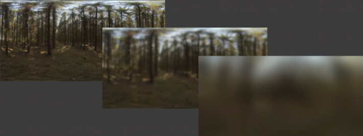

我们可以对 Environment Lighting 这张图做滤波处理
+ 预生产不同 filtering size 的 environment lighting
+ 然后在实时计算中根据 size 三线性插值出需要的 environment lighting （这里类似 Mipmap 的思想）

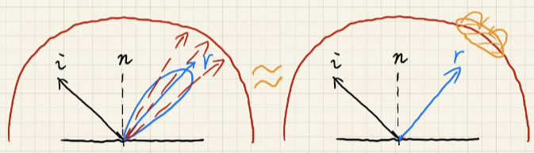

根据着色点的法线分布计算出来反射范围，然后使用这个反射对 environment lighting 进行查询并积分的过程，可以近似成对 environment lighting 做 prefiltering （做模糊）然后对结果做范围查询

对 environment lighting 做多次查询并积分 等价于 对 environment lighting 做 prefiltering 然后进行单次范围查询

最后根据反射方向对预处理后的 environment lighting 进行查询
+ 查询方向：镜面反射方向
+ 查询范围：实时计算出的 BRDF 的反射分布所覆盖的区域（这也是提前对 Environment Lighting 做 prefilter 的原因，区域查询时可以直接快速得到数值）

### BRDF 积分简化和预处理
回到近似后的渲染方程中来

$$\displaystyle L_r(p, \omega_r) \approx \frac {\int_{\Omega_{f_r}}L_i(p, \omega_i)d\omega_i} {\int_{\Omega_{f_r}}d\omega_i} \cdot \int_{\Omega^+}f_r(p, \omega_i \rightarrow \omega_r) \cos\theta_i d\omega_i$$

我们已经完成了第一部分（环境光照的归一化积分）的处理，现在来考虑近似后的渲染方程的第二个部分 —— BRDF 的积分

$\displaystyle \int_{\Omega^+}f_r(p, \omega_i \rightarrow \omega_r) \cos\theta_i d\omega_i$ 是物体表面的 BRDF 的积分，我们同样不能实时的使用蒙特卡洛采样来进行计算

和 Environment Lighting 的思路一样，还是寻求预计算来避免样本采样

我们可以假定着色对象的材质是固定的（比如玻璃、金属、毛玻璃等等），他们的 BRDF 由不同参数，如 roughness, color, Fresnel term, etc ，组成

如果我们有对应的这么多个表来查询所有不同参数组合出来的 BRDF 积分值，那么就可以快速计算出着色点的 BRDF 的积分值

但是参数维度过多，导致组合出来的需要预计算的 BRDF 积分值太多了（roughness * color * fresnel 就已经有 5 维了），因此我们需要对原积分式做简化

对微表面（Microfacet） BRDF 做简单的回顾

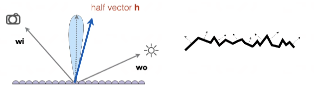

对于微表面模型来说，它的 BRDF 为 $\displaystyle f(\mathbf{i}, \mathbf{o}) = \frac {\mathbf{F(i, h)G(i, o, h)D(h)}}{4\mathbf{(n, i)(n, o)}}$

其中，
$\mathbf{F(i, h)}$ 是微表面模型的菲涅尔项，主要会决定物体的颜色
$\mathbf{G(i, o, h)}$ 是微表面模型的几何项，表示物体微小细节的几何信息，主要决定物体颜色的亮度（可以使用 AO 的想法来认识这一项），文中不提这个项的细节
$\mathbf{D(h)}$ 是微表面模型的法线分布（NDF），模型整体的法线分布由微表面的分布的大致走向所组成

菲涅尔项有一个经典的近似 —— The Schlick's approximation
$R(\theta) = R_0 + (1 - R_0)(1 - \cos\theta)^5$
$\displaystyle R_0 = (\frac {n_1 - n_2}{n_1 + n_2})^2$ 表示不同材质间的菲涅尔项的初始值
如下图（左）所示

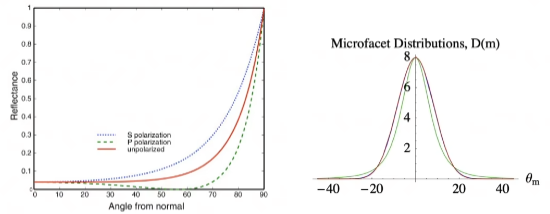

NDF 项也有描述分布 —— e.g.Beckmann distribution
$\displaystyle D(h) = \frac {e^{-\frac{\tan^2 \theta_h}{\alpha^2}}}{\pi \alpha^2 \cos^4 \theta_h}$
$\alpha$ 表示这个分布的宽度（这个峰胖还是瘦），即材质粗糙还是光滑
类似于高斯分布，如上图（右）所示

对于不同的材质，可以只描述 $R_0$ 、 $\alpha$ 、 $\theta$ 来表示材质的整个 BRDF ，对这 3 个参数做组合预计算就可以从 5 维以上的组合降低到 3 维

再进一步，对 The Schlick approximation Fresnel 项做处理想办法把组合计算的维度给降低

$\displaystyle \int_{\Omega^+}f_r(p, \omega_i, \omega_o) \cos\theta_i d\omega_i$
$\displaystyle \approx \int_{\Omega^+} \frac {fr}{F}(R_0 + (1 - R_0)(1 - \cos\theta_i)^5) \cos\theta_id\omega_i$
$\displaystyle = R_0\int_{\Omega^+} \frac {fr}{F}(1 - (1 - \cos\theta_i)^5) \cos\theta_id\omega_i + \int_{\Omega^+} \frac {fr}{F}(1 - \cos\theta_i)^5 \cos\theta_id\omega_i$

我简单推一下这几步，首先假设子项也是可积的，令 $t = (1 - \cos\theta_i)^5$
$\int_{\Omega^+} \frac {fr}{F}(R_0 + (1 - R_0)(1 - \cos\theta_i)^5) \cos\theta_id\omega_i$
$= \int_{\Omega^+} \frac {fr}{F}(R_0 + (1 - R_0)t) \cos\theta_id\omega_i$
$= \int_{\Omega^+} \frac {fr}{F}(R_0 + t - tR_0) \cos\theta_id\omega_i$
$= \int_{\Omega^+} \frac {fr}{F}(R_0 \cdot (1 - t) + t) \cos\theta_id\omega_i$
由于子项可积分，可得原始
$= \int_{\Omega^+} \frac {fr}{F}(R_0 \cdot (1 - t)) \cos\theta_id\omega_i + \int_{\Omega^+} \frac {fr}{F}(t) \cos\theta_id\omega_i$
$= R_0 \cdot \int_{\Omega^+} \frac {fr}{F}((1 - t)) \cos\theta_id\omega_i + \int_{\Omega^+} \frac {fr}{F}(t) \cos\theta_id\omega_i$
把原式带入就得证

现在将 $R_0$ 拆到了积分之外，所以 BRDF 积分的组合计算的维度再降低 1 维，现在只需要 roughness（上文中的 $alpha$ 的所在项）和 $\cos\theta_i$ 的所有组合的积分值，就可以快速得到 BRDF 的值，2 维的组合表就是一张图片

$\displaystyle \int_{\Omega^+}f_r(p, \omega_i, \omega_o) \cos\theta_i d\omega_i \approx R_0\int_{\Omega^+} \frac {fr}{F}(1 - (1 - \cos\theta_i)^5) \cos\theta_id\omega_i + \int_{\Omega^+} \frac {fr}{F}(1 - \cos\theta_i)^5 \cos\theta_id\omega_i$

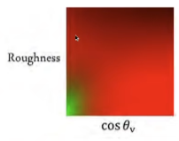

两个积分项，分别对应预计算的两张 $Roughness · \cos\theta_i$ 的数值表，一般使用 2D 的图片进行存储（用一张图片的2个通道也可以）

### 结果
我们已经对渲染方程的近似式的两个部分都做了简化和预处理，将大量组合计算放到了离线去做，在实时计算光照的过程中已经去掉了耗时的样本采样，能快速计算出与完整计算结果相近的光照效果

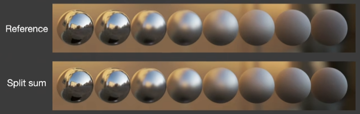

渲染方程中对两个函数乘积的积分近似成两个函数分别积分之后的乘积的做法，在工业界有对应的称呼 —— The Split Sum Approximation

$$\displaystyle \frac{1}{N} \frac{L_i(\mathbf{I}_k) f(\mathbf{I}_i, \mathbf{v}) \cos\theta_{\mathbf{I}_k}}{p(\mathbf{I}_i, \mathbf{v})} \approx \Big( \frac{1}{N}\sum_{k = 1}^{N} L_i(\mathbf{I}_k)\Big) \Big( \frac{1}{N} \frac{ f(\mathbf{I}_i, \mathbf{v}) \cos\theta_{\mathbf{I}_k}}{p(\mathbf{I}_i, \mathbf{v})} \Big)$$

工业界里做积分，就是做 $N$ 个样本的求和

### 阴影处理
环境光来自于四面八方，那么处理阴影也有两种思路
+ 将环境光当做多光源问题进行处理
    每个光源都需要做一次 SM ，整体耗费和光源数量成正比
+ 将可见性 $V$ 的计算放到渲染方程计算过程中，用蒙特卡洛方法采样
    $V$ 项是最难以计算的，对于着色点来说，不同方向的光有着不同的可见性

游戏行业通常的做法 —— 为最亮的一个多个光源生成阴影

环境光阴影处理的相关研究（有时间可以看看）
+ Imperfect shadow maps
+ Light cuts
+ RTRT
+ Precomputed radiance transfer

## Precomputed Radiance Transfer
### Recap
[Fourier Transform and Fourier Series Expansion](https://github.com/HL0817/Games101Notes/blob/main/Notes/6_Antialiasing_and_Visibility/Antialiasing_and_Visibility.md#%E9%87%87%E6%A0%B7%E7%9A%84%E7%90%86%E8%AE%BA%E5%9F%BA%E7%A1%80)

$f(x) = \frac A 2 + \frac {2A\cos(t\omega)} {\pi} - \frac {2A\cos(3t\omega)} {3\pi} + \frac {2A\cos(5t\omega)} {5\pi} - \frac {2A\cos(7t\omega)} {7\pi} + \cdot\cdot\cdot$

任何一个函数都可以做傅里叶级数展开，也就是每个函数都可以写成 $\sin \cos$ 的线性组合

函数由一系列低频到高频的信息组成，而傅里叶级数展开的不同级数及其系数表示了不同频率的信息，也就是级数越高，越能还原原函数的高频细节

一个函数可以被表示为某一类函数的线性组合，这一类函数被称为基函数（basis function），这些基函数的前面都有各自的系数

[卷积和滤波](https://github.com/HL0817/Games101Notes/blob/main/Notes/6_Antialiasing_and_Visibility/Antialiasing_and_Visibility.md#%E5%8D%B7%E7%A7%AF%E4%B8%8E%E6%BB%A4%E6%B3%A2)
时域做卷积等价于在频域上做乘积

将对卷积和滤波的理解放到渲染方程的处理中了来

$$\displaystyle \int_{\Omega}f(x)g(x)dx$$

对于两个函数乘积+积分的操作，可以看做是两个函数在做卷积，也就是在做滤波操作

函数是低频信号，就意味着函数是平滑的或者值域变换较小的函数

两个函数对应的频谱，只要有一个是低频的，那么他们卷积之后的结果也是低频的

推到两个函数乘积后做积分的过程中来，乘积后做积分结果的频率由两个函数中频率较低的那个函数决定

**Basis Functions**
可以被用来表示其他函数的一系列函数集合被称为基函数，通式
$$f(x) = \sum_i c_i \cdot B_i(x)$$

前面提到的傅里叶级数，展开式中的一系列函数就是一种基函数

多项式级数展开式的一系列函数也是一种基函数

### Spherical Harmonics
球面谐波函数，[点击详细了解（知乎）](https://zhuanlan.zhihu.com/p/153352797)，简称球谐，接下来对球谐函数进行简单理解

简单理解球谐函数是被定义在球面上的一系列 2 维的基函数 $B_i(\omega)$
+ 2 维指极坐标下，球面的任意位置可以用两个参数来表示（可以类比地球的经纬度，任意经纬度可以定位地球表面的任意位置）

球谐基函数可以类比到傅里叶级数展式中的基函数

最常见的球谐可视化

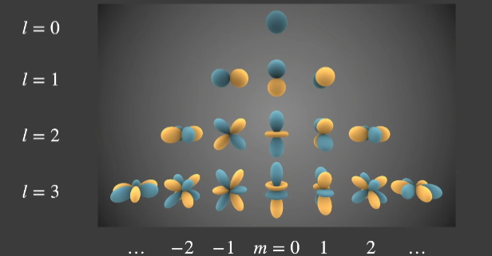

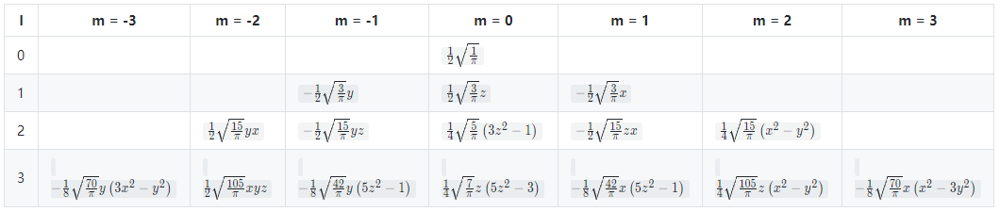

$l$ 表示球谐基函数的级数（degree），即对应原函数的频率（由低到高）
$m$ 表示球谐基函数的阶数（order），即对应级数的基函数的次方（应该可以这样理解吧，m阶指连带勒让德公式的阶数，主要决定递归式里次方项）
其中我们需要关注的：(1) $m = 2l + 1$ (2) 前 l 次累计有 $2^l$ 项

为什么不用傅里叶级数展开或者多项式级数展开？
答：其他展开式可能导致还原的函数不连续，对应到图像上就是有缝；而球谐函数本身就是在球面上定义的函数，不会有不连续的问题

球谐函数由原函数化简转换为 $I$ 次连带勒让德方程，求解得到，这里比较数学，可以参考前文参考链接中的推导过程

我们只需要知道一点，$\displaystyle f(x) = \sum_{l = 0}^{\infty} \sum_{k = -l}^{l}P_{lm}(\cos\theta)e^{im\varphi} = \sum\sum K_l^mY_{lm}$

$K_l^m$ 是球谐系数，这里将它记作 $c_i$
$Y_{lm}$ 是球谐基函数，这里将它记作 $B_i(\omega)$

**球谐函数具有正交完备性，球谐基函数组是正交归一化的**，如果将原函数 $f(\omega)$ **投影**到球谐基 $B_i(\omega)$ 上，就可以得到唯一的球谐系数 $c_i$ ，即 $\displaystyle c_i = \int_{\Omega}f(\omega)B_i(\omega)d\omega$

（投影可以类比向量在正交的坐标系内的坐标值，向量分别朝向不同坐标轴投影得到向量在这个坐标系内的系数，也被称作坐标值）

在球谐基不变时，只要知道球谐系数，就能恢复出来唯一的一个原函数（是近似的原函数，因为展开过程就是近似过程，除非级数无穷大才能完全恢复）

球谐系数越多（阶数越多），反算出来的原函数越精确，或者是包含的频率信息越高，大多情况只取了前 2 或 3 阶进行处理

**球谐函数具有旋转不变性**，如果原函数 $f(\omega)$ 可以被某个球谐基表示，那么这个原函数旋转之后的新函数 $g(\omega)$ 仍可以用同一个球谐基表示，且对球谐系数进行旋转就能得到旋转后新函数的球谐系数

也就是 $\displaystyle f(\omega)= \sum c_iB_i(\omega)d\omega$ 和 $\displaystyle g(\omega) = f(R(\omega))= \sum d_iB_i(\omega)d\omega$

对于旋转球谐系数有两种理解：
+ 球谐基不变，原球谐系数旋转得到新球谐系数
+ 球谐系数不变，
    + 将原球谐基进行对应旋转得到新的球谐基
    + 将新的球谐基投影到原球谐基上，得到旋转球谐基所生成的旋转系数
    + 原球谐系数和旋转系数相乘得到旋转后的新球谐系数

### Lighting with SH
回到渲染领域来， Prof. Ravi Ramamoorthi 把 SH 给引入到了图形学中

前文在对 environment lighting 做积分和归一化时提到了，对 environment lighting 做多次查询并积分 等价于 对 environment lighting 做 prefiltering 然后进行单次范围查询

也就是 no filtering + multiple queries = prefiltering + single query

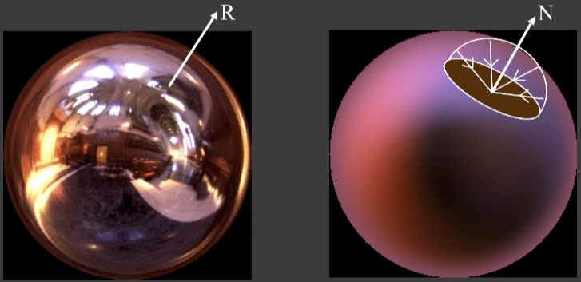

Ravi 对 Diffuse BRDF 做了观察，发现在渲染方程中， Diffuse BRDF 和光线做乘积然后积分起来就相当于对光线的函数做卷积，即对光线做滤波操作，而 Diffuse BRDF 具有平滑的分布，那么整个过程就相当于对光线做低通滤波

既然 Diffuse BRDF 是低频分布的函数，那么使用 SH 对函数做了处理之后，就可以只使用少量（低阶）的球谐系数来存储 Diffuse BRDF 的绝大部分信息

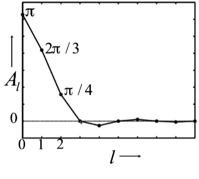

像 $E_{lm} = A_l L_{lm}$ 这样将 BRDF 项投影到基函数上得到上图的各个不同阶的球谐系数，可以看见 BRDF 项的大部分信息都只包含在前三阶的系数中，第四阶往后的系数基本为 0 （其中 $\displaystyle A_l = 2\pi \frac{(-1)^{\frac{l}{2} - 1}}{(l + 2)(l - 1)} [\frac{l!}{2^l (\frac{l}{2} !)^2}]$ ）

在回顾章节中，我们知道了两个函数卷积之后的频率由卷积前的较低频率的函数决定，那么低频的 Diffuse BRDF 和高频的光线函数卷积之后得到的低频的光照信息（显然的，Diffuse 的物体反射出来的光就不可能很复杂）

Diffuse BRDF 本身就只包含前三阶的低频信息，那么卷积后的结果也应该只包含前几阶的低频信息

**既然渲染的整体结果都只包含低频信息，那么光照本身就不需要完整的保存，我们同样可以使用前 n 阶的 SH 来近似原本的光照**

下面给出前 3 阶 SH 描述光线之后的着色结果
+ order 0 1 term RMS Error = 25%

    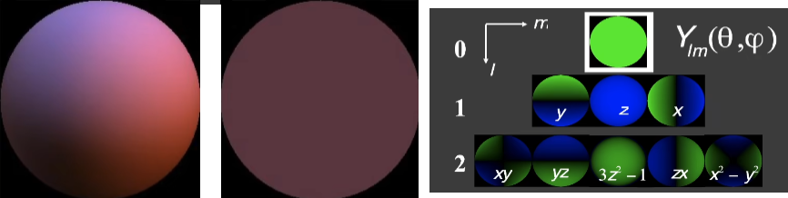

+ order 1 4 terms RMS Error = 8%

    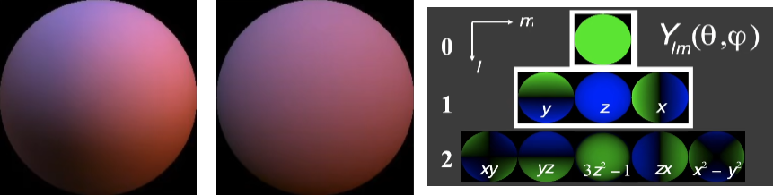

+ order 2 9 terms RMS Error = 1%

    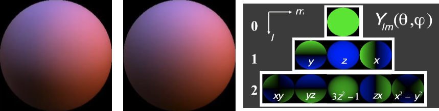

可以看到前三阶 SH 近似描述光线之后（仅在 Diffuse BRDF 材质上）的着色结果已经几乎一致了

其他学者已经证明了在 Diffuse BRDF 材质条件下，任何光照在 3 阶 SH 的近似描述下，平均误差 $error < 3%$

通过对 Diffuse BRDF 渲染过程及结果的分析，可以最终确认使用前 3 阶 SH 对光照进行处理

### PRT
在之前的小节里，知道了什么是卷积、球谐以及卷积和球谐如何运用到环境光照中，本节将通过“球谐处理后的光照结合渲染方程进行后续”的整个过程，来说明什么是 PRT

对于带可见性的渲染方程 $\displaystyle L(\mathbf{o}) = \int_{\Omega} L(\mathbf{i})V(\mathbf{i})\rho(\mathbf{i}, \mathbf{o})max(0, \mathbf{n} \cdot \mathbf{i})d\mathbf{i}$ 来说
我们将 $L(\mathbf{i})V(\mathbf{i})\rho(\mathbf{i}, \mathbf{o})max(0, \mathbf{n} \cdot \mathbf{i})$ 看做不同的三个部分，在实时的情况下，并不能直接搞蒙特卡洛采样求积分，也不能 splt sum 累加求积分，所以我们需要将这三个部分分别做预计算

预计算的结果，在实时渲染中以不同的三张图来表示，即 lighting visibility BRDF
+ lighting: 表示着色点接受到的环境光，用一张 cubemap 记录
+ visibility: 表示着色点各个方向的可见性，用 0 和 1 来存储某个光照方向被遮挡或者不被遮挡，用一张 cubemap 记录
+ BRDF: 表示观察方向确定时，不同光线入射方向所对应的 BRDF 值，用一张 cubemap 记录
    + BRDF 本来应该由观察方向和光线入射方向的积分两个因素决定，但是我们着色时，观察方向固定，就可以用 cubemap 记录不同方向的 BRDF 数值
    + 方向可以由极坐标的 $\theta$ $\varphi$ 确定，BRDF 由两个方向确定，那么对于极坐标或者球面坐标来说，BRDF 是一个 4 维的函数，去掉观察方向后就是一个 2 维的函数

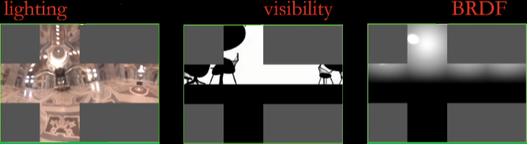

着色时，采样三张图并相乘就能得到最终的着色结果

但对于每一个着色点，都需要这样三张 cubemap 来存储预计算数据，存储很费

所以 Sloan 提出了 Precomputed Radiance Transfer ，结合 SH 对光照的处理来重新处理渲染方程（【Precomputed Radiance Transfer for Real-Time Rendering in Dynamic, Low-Frequency Lighting Environments】(Sloan SIGGRAPH 2002)）

PRT 的基本思路如下：
$$\displaystyle L(\mathbf{o}) = \int_{\Omega} L(\mathbf{i})V(\mathbf{i})\rho(\mathbf{i}, \mathbf{o})max(0, \mathbf{n} \cdot \mathbf{i})d\mathbf{i}$$
以是否和光照相关作为划分条件，渲染方程被分成 lighting - $L(\mathbf{i})$ 和 light transport - $V(\mathbf{i})\rho(\mathbf{i}, \mathbf{o})max(0, \mathbf{n} \cdot \mathbf{i})$ 两个部分

在场景中除了光照以外的其他所有条件都不会发生变化的情况下， light transport 可以被看做是一个球面函数，我们可以将 light transport 也写成基函数表示，大致分为三个步骤：
+ 球谐基对光照函数做近似
    + $L(\mathbf{i}) \approx \sum l_iB_i(\mathbf{i})$
+ 预计算 —— precomputed transport
    + 将 light transport 投影到光照函数所使用的球谐基上
+ 运行时直接相乘

#### Diffuse Case
Diffuse BRDF 项是一个常数，在渲染方程中可以直接将 BRDF 项提出来
$$\displaystyle L(\mathbf{o}) = \rho \int_{\Omega} L(\mathbf{i})V(\mathbf{i})max(0, \mathbf{n} \cdot \mathbf{i})d\mathbf{i}$$

对于光照，我们使用球谐进行表达 $L(\mathbf{i}) \approx \sum l_iB_i(\mathbf{i})$

将球谐表示的光照带入渲染方程得
$$\displaystyle L(\mathbf{o}) \approx \rho \int_{\Omega} \sum l_iB_i(\mathbf{i})V(\mathbf{i})max(0, \mathbf{n} \cdot \mathbf{i})d\mathbf{i}$$

交换积分和求和的顺序（积分和求和的顺序需要满足一定条件才可以交换，这里是直接交换算是假设交换前后结果相等或者近似）得
$$\displaystyle L(\mathbf{o}) \approx \rho \sum l_i \int_{\Omega} B_i(\mathbf{i})V(\mathbf{i})max(0, \mathbf{n} \cdot \mathbf{i})d\mathbf{i}$$

**$\displaystyle \int_{\Omega} B_i(\mathbf{i})V(\mathbf{i})max(0, \mathbf{n} \cdot \mathbf{i})d\mathbf{i}$ 这个过程就是 light transport 项投影到球谐基的过程（SH 小节中关于球谐系数的说明）**

显然，可以将球谐基和 light transport 项的投影过程放到离线预计算中去，将结果记作 $T_i$

对于实时渲染来说，计算着色就仅仅只做一次点乘 $L(\mathbf{o}) \approx \rho \sum l_iT_i$

#### PRT 的核心理解
渲染方程
$$\displaystyle L_{\mathbf{o}}(p, \mathbf{\omega_o}) = \int_{\Omega^+} L_i(p, \mathbf{\omega_i})f_r(p, \mathbf{\omega_i}, \mathbf{\omega_o}) \cos\theta_{\mathbf{\omega_i}} V(p, \mathbf{\omega_i})d\mathbf{\omega_i}$$
被分成 lighting 和 light transport 两个部分，分别记作
$$\begin{equation*} \begin{split}\displaystyle
&L_(\mathbf{\omega_i}) = L_i(p, \mathbf{\omega_i})
\\
&T_(\mathbf{\omega_i}) = f_r(p, \mathbf{\omega_i}, \mathbf{\omega_o}) \cos\theta_{\mathbf{\omega_i}} V(p, \mathbf{\omega_i})
\end{split} \end{equation*}$$
分别对 lighting 和 light transport 做球谐近似
$$\begin{equation*} \begin{split}\displaystyle
&L_(\mathbf{\omega_i}) = L_i(p, \mathbf{\omega_i}) \approx \sum_p c_p B_p(\mathbf{\omega_i})
\\
&T_(\mathbf{\omega_i}) = f_r(p, \mathbf{\omega_i}, \mathbf{\omega_o}) \cos\theta_{\mathbf{\omega_i}} V(p, \mathbf{\omega_i}) \approx \sum_q c_q B_q(\mathbf{\omega_i})
\end{split} \end{equation*}$$
然后带回渲染方程中，交换积分和求和的次序，可得
$$\begin{equation*} \begin{split}
\displaystyle L_{\mathbf{o}}(p, \mathbf{\omega_o})
&= \int_{\Omega^+} L_i(p, \mathbf{\omega_i})f_r(p, \mathbf{\omega_i}, \mathbf{\omega_o}) \cos\theta_{\mathbf{\omega_i}} V(p, \mathbf{\omega_i})d\mathbf{\omega_i}
\\
&= \sum_p \sum_q c_p c_q\int_{\Omega^+} B_p(\mathbf{\omega_i}) B_q(\mathbf{\omega_i})d\mathbf{\omega_i}
\end{split} \end{equation*}$$

在 Diffuse Case 里最终得到的结果仅仅是 $O(n)$ 复杂度的计算结果，为什么换了一个理解思路就变成 $O(N^2)$ ，这跟球谐函数的正交不变性有关

$\displaystyle \int_{\Omega^+} B_p(\mathbf{\omega_i}) B_q(\mathbf{\omega_i})$ 是将 $B_p(\mathbf{\omega_i})$ 投影到 $B_q(\mathbf{\omega_i})$ （或将 $B_q(\mathbf{\omega_i})$ 投影到 $B_p(\mathbf{\omega_i})$）上，两个正交基互相投影，只有当前仅当 $p = q$ 时才能得到投影系数 $1$ ，如果不等整个式子直接为 $0$

在 $p = q$ 的前提下，$\displaystyle \sum_p \sum_q c_p c_q\int_{\Omega^+} B_p(\mathbf{\omega_i}) B_q(\mathbf{\omega_i})d\mathbf{\omega_i}$ 的复杂度仅为 $O(n)$

#### Glossy Case
在渲染方程中
$$\displaystyle L(\mathbf{o}) = \int_{\Omega} L(\mathbf{i}) \rho(\mathbf{i}, \mathbf{o}) V(\mathbf{i})max(0, \mathbf{n} \cdot \mathbf{i})d\mathbf{i}$$
与 Diffuse 不同的是，Glossy BRDF 项不是常量，而是一个 4 维的函数 $\rho(\mathbf{i}, \mathbf{o})$ ，处理过程如下

还是将渲染方程的 lighting 投影到基函数上，得到

$$\displaystyle L(\mathbf{o}) \approx \sum l_i \int_{\Omega} B_i(\mathbf{i}) \rho(\mathbf{i}, \mathbf{o}) V(\mathbf{i})max(0, \mathbf{n} \cdot \mathbf{i})d\mathbf{i}$$

其中 $\displaystyle \int_{\Omega} B_i(\mathbf{i}) \rho(\mathbf{i}, \mathbf{o}) V(\mathbf{i})max(0, \mathbf{n} \cdot \mathbf{i})d\mathbf{i}$ 仍然可以理解为投影过程，即将 4 维的 light transport 投影到 $B_i(\mathbf{i})$ 上，得到一个只剩 2 维函数 $T_i(\mathbf{o})$

此时渲染方程转变成为

$$\displaystyle L(\mathbf{o}) \approx \sum l_i T_i(\mathbf{o})$$

对于 Glossy 材质来说，某个观察角度 $\mathbf{o}$ 对应着唯一一个 light transport 函数 $T_i(\mathbf{o})$

接下来，再将这个 2 维函数（在球面坐标下，方向 $\mathbf{o}$ 由 2 维 $\theta$ 和 $\varphi$ 确定）投影到另一个球谐基上 $\displaystyle T_i(\mathbf{o}) \approx \sum t_{ij}B_j(\mathbf{o})$ ，将渲染方程变成

$$\displaystyle L_{\mathbf{o}} = \sum(\sum l_it_{ij}) B_j(\mathbf{o})$$

对原函数做一次投影得到一组球谐系数，对得到的球谐函数再做一次投影，得到的是一个球谐系数的矩阵 $t_{ij}$

原渲染方程在进过对 light 做一次投影和对 light transport 做两次投影后，转换成立 light 球谐系数组和 light transport 球谐系数矩阵相乘

用图像理解上述整个过程

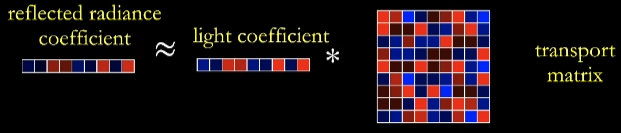

+ 渲染方程左边是不同方向上的 radiance $L(\mathbf{o})$ ，是一组向量 
+ light 经过球谐处理后得到另一组向量 $l_i$
+ light transport 经过两次不同维度的投影后得到复合球谐系数组，即为球谐系数矩阵 $t_{ij}$

#### PRT 的延申理解
**理解一：Transport Paths 对光路进行类**
+ $LE$ - 表示从光源出发，直接进入观察方向
+ $LGE$ - 表示从光源出发，经过 Glossy 材质物体弹射一次，进入观察方向
+ 用类似正则的表示
    + $L(D|G)^*E$ - 表示从光源出发，经过 Glossy 或 Diffuse 材质弹射 ($*$) 次，进入观察方向
        常见的例子如下，表示光线不同的弹射次数

        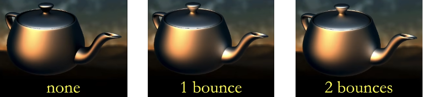

    + $LS^*(D|G)^*E$ - 表示从光源出发，先经过 specular 材质弹射 （$*$）次之后，再经过 Glossy 或 Diffuse 材质弹射 ($*$) 次，进入观察方向
        常见的例子是焦散，表示光线经过 Specular 后被聚焦到了 Diffuse 或 Glossy 的物质上

        

经过上述对各种光路的理解，我们不难发现所有光路都是由光线出发，经过一定路径后到达观察方向

结合 light transport 进行分析，所有的光路都可以拆分为 light 和 light transport

那么，不管光照环境多么复杂，都可以使用 PRT 的思想进行处理

对于实时的情况下，不管光路多么复杂，我们都可以将其看作一个已经预计算处理过的 light transport 

**理解二：Precomputation of light transport**
之前，我们已经得到了 light transport ，即 $\displaystyle T_i \approx \int_{\Omega} B_i(\mathbf{i}) V(\mathbf{i}) max(0, \mathbf{n \cdot i}) d\mathbf{i}$

这个式子将 light 球谐化后的球谐基给挪了进来，但这个式子本身就很像渲染方程，我们可以将 $B_i(\mathbf{i})$ 看作是 light

light transport 投影到 n 阶的球谐基的这个过程，可以看作是 n 个不同的光照，对场景进行着色得到不同的光照结果

这么理解下，我们可以认为，无论 light transport 多么复杂，都可以被各种光照着色的方式（Path Tracing、Photon Mappingg 等）给解出来

整个过程类似与下图：

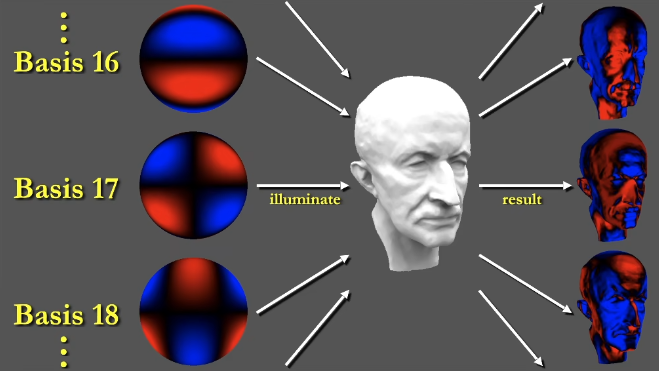

### PRT 的结果
但是，对于上述的过程，有几个问题：
+ 除光照以外的所有条件都是不变的，意味着场景需要是静态的
+ 切换光照就相当于切换不同的球谐系数，那么旋转光照就要稍微处理一下（球谐的旋转不变性）

直接给出 Sloan 的 PRT 演示结果

+ Diffuse Case

    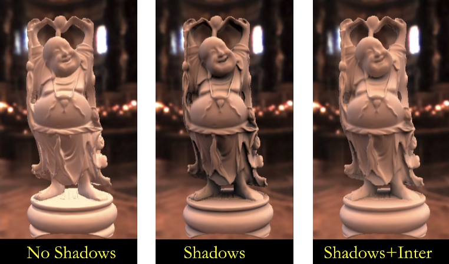

+ Glossy Case

    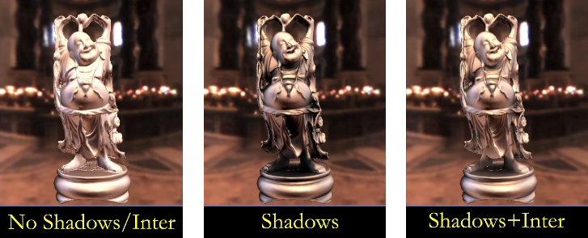

+ Arbitrary BRDF Results
    + Anisotropic BRDFs
    
        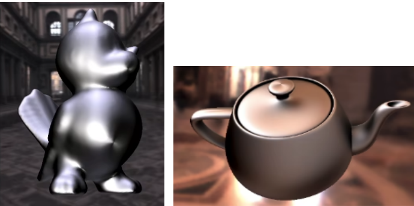

    + Other BRDFs

        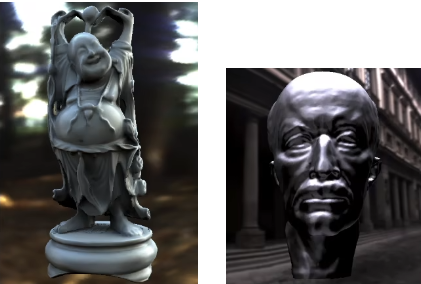

    + Spatially Varying 不同的位置有不同的 BRDF

        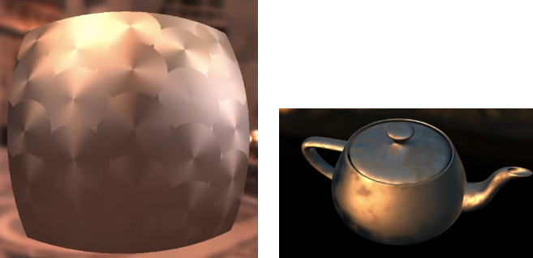

### Limitations
+ Low-frequency
    + SH 本身只适合描述低频信息（我们并不能无限提升阶数来表示高频信息），导致以 SH 为基函数处理的 PRT 只适合低频光照和 BRDF 变化不那么剧烈的材质
+ Dynamic lighting, but static scene/material
    + PRT 可以处理动态光照（SH 具有旋转不变性，可以计算系数变化来表示投影前的光线变化）
    + 但 PRT 只能预计算固定的场景和固定的材质，即 light transport 是固定的，如果改变场景就会需要重新预计算
+ Big precomputation data
    + PRT 需要我们为每个着色点预计算 light transport 并存储
    + Diffuse 只存储每个点的向量，但是 Glossy 还需要存储每个点的矩阵

### PRT Follow Up Works
+ More basis functions
+ dot product => triple products
+ static scene => dynamic scene
+ fix matrials => dynamic materials
+ other effects:translucent, hair, ...
+ Precomputation => analytic computation
+ ...

### More Basis Functions
除了球谐外，还有其他不同性质的基函数，例如：
+ Wavelet 小波
+ Zonal Harmonics
+ Spherical Gaussian
+ Piecewise Constant

简单介绍小波基函数中的一种 —— 2D Haar wavelet

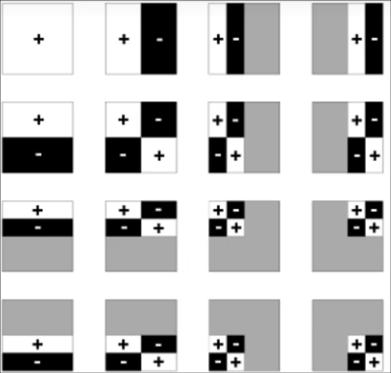

不同于定义在球面上的球谐基， Haar Wavelet 是定义在图像上类似于图像块的区域内，除了定义域外，其他地方都没有定义

目标函数到小波基函数的投影有两个比较显著的特点：
+ Wavelet Transformation
使用小波变化进行投影，将目标函数投影到任意小波基函数上
+ 投影的结果是，很多小波基函数的系数都为 0 或者接近 0
这意味着我们可以只保留很小一部分非 0 的系数，或者保留较大或者最大的几组系数

投影的优缺点如下：
+ A non-linear approximation
前面说到我们会保留部分非 0 系数，这将导致投影和恢复是对原函数的非线性近似
+ All-frequency representation
小波最大的优点，就是可以全频率的表示原函数

做小波变换进行投影，是在 2D 平面做的投影，如何表示球型的光照函数呢？
答：可以使用 Cubemap 记录光照信息，再将其 6 个面分别做小波变换

投影到小波基函数的过程如下：

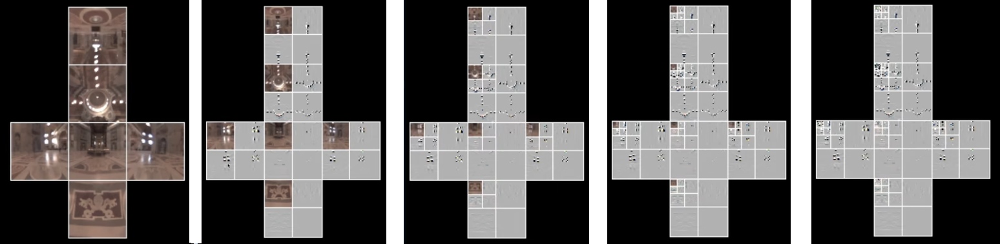
 
对每一张图来说，做一次小波变换，就将低频信息存储在了左上 $1/4$ 的位置里，将储高频信息存储再其他三个块里

观察高频区域，可以发现高频信息很少，绝大多数地方都是 0 ，非 0 值并不多

可以对左上的低频块再继续做小波变换，得到新的更低频的图块和次高频的块

根据需要做不同次数的小波变换可以得到不同的近似结果

用 SH 和 Wavelet 做基函数的渲染结果对比如下：
+ Low frequency vs. All frequency
+ SH vs. Wavelet

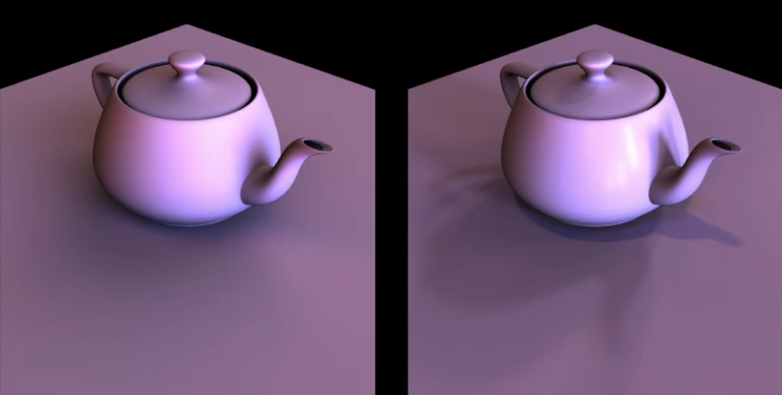

相同的存储量，小波可以渲染出更多高频的细节，高光阴影等在图像中对比还是非常强烈

Wavelet 的有严重的缺点，小波处理后的光照不可旋转（球谐具有旋转不变性，可以通过系数快速得到旋转后的系数）

小波处理后的光照要旋转，只能先还原光照，对光照做旋转，再将旋转后的光照重新投影到小波基函数上去

### Other
闫令琪在大学阶段写的第一篇论文就是 PRT 相关的
《Accurate Translucent Material Rendering under Spherical Gaussian Lights》 —— Pacific Graphics 2012

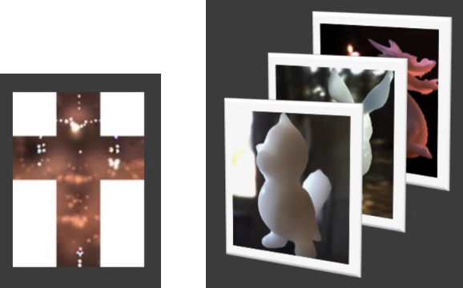