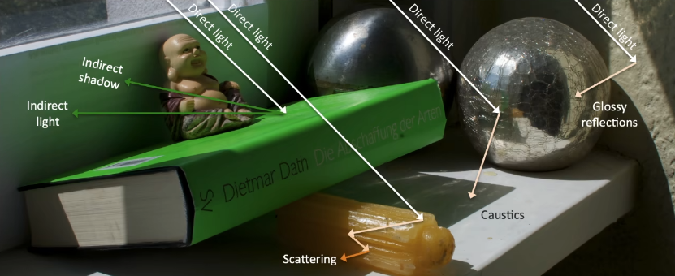
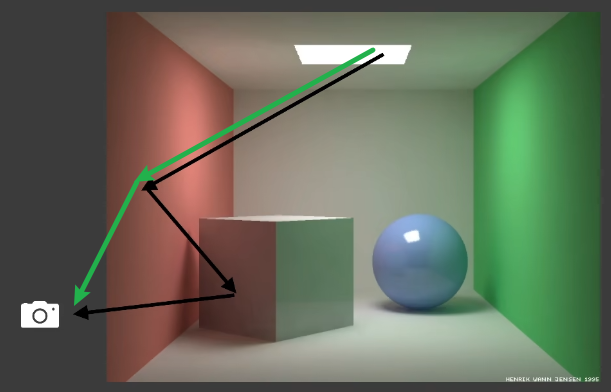
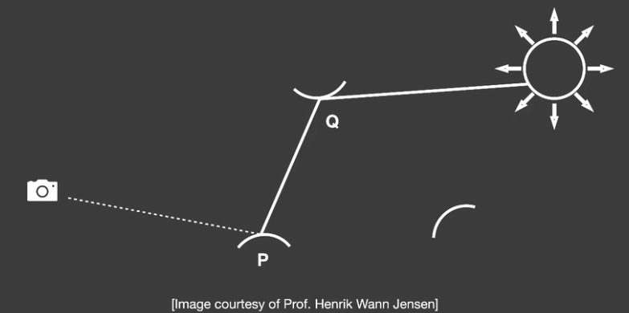
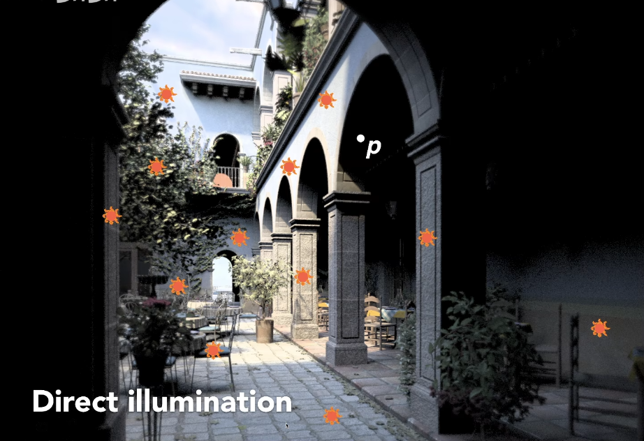
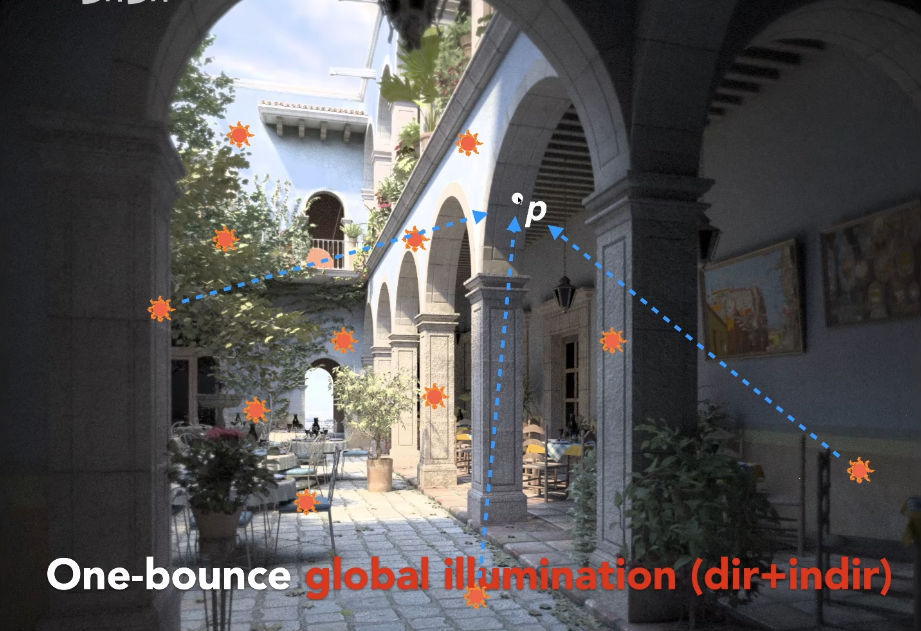
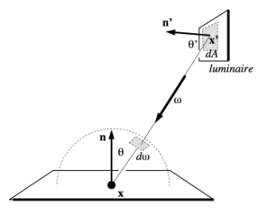
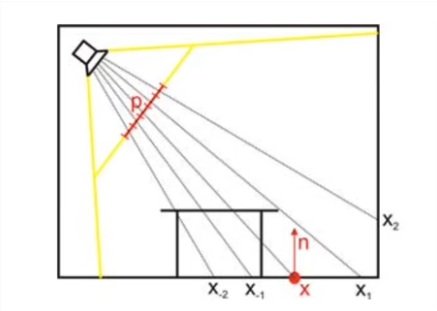
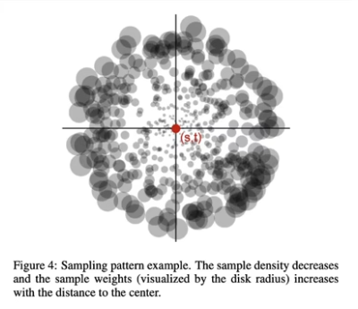
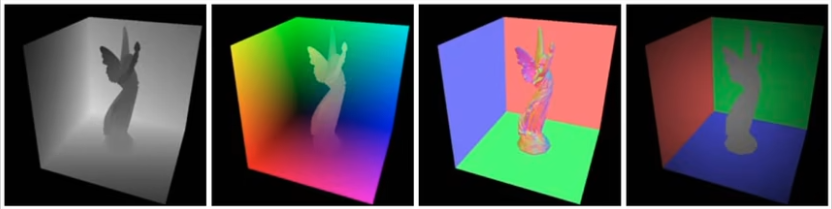
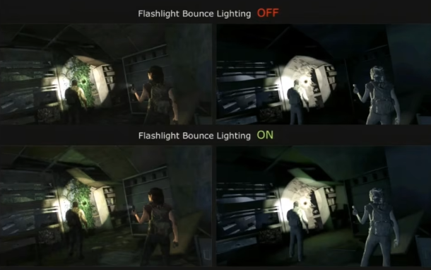

# Real-Time Global Illumination
Global Illumination (GI) 是对场景的渲染非常重要，但实现起来非常困难的光照类型

## Preknowledge
总所周知，光线追踪的光线弹射次数是无线的，不可能在实时渲染的时候使用无限次弹射的光线进行渲染

因此，在实时渲染领域，通常使用直接光照和弹射一次的间接光照来进行场景渲染，并将其称之为全局光照（GI）

即，GI = Direct illumination + one bounce indirect illumination

如下图所表示的两张光照
+ 直接光照（绿色）：由光源出发，打到物体后直接反弹到摄像机的光线
+ 一次弹射间接光照（黑色）：由光源出发，打到物体后经过一次弹射打到另一个物体，再反弹到摄像机的光线
    + 由光源发射照亮的第一个物体，这一段路径一般成为直接光照，不会计算弹射次数

实时光照有两个基本的，或者说需要接近的要求
+ 简单易实现
+ 快速

这两个要求也是后续讨论实时渲染的重要指标

## 目录
+ Reflective Shadow Maps
+ Light Propagation Volumes
+ Voxel Global Illumination

## Reflective Shadow Maps
### Recap
回顾 GAMES101 的第 16 节中，对整个光线弹射的理解，如下图：

Q 点是被直接光照亮的点， P 是被直接光（图中未画出）和一次弹射间接光照亮的点

这里做出进一步理解，对于 P 点的间接光而言，照亮 P 点的间接光，可以被当作是被一个面光源给直接照亮的

为什么是面光源，因为 P 点的间接光实际上是由 Q 附近以及其他反射向 P 点的区域所照亮了

因此，**我们可以将照亮 P 点的间接光，看着是一个面光源来进行计算**

举个例子解释：
+ 被直接光照照亮的场景

    被直接光照照射到的地方有颜色，没有被直接光照到的地方就是一片黑色
    显然，只有被直接照到的地方才能被当作一次弹射间接光照的面光源（如图中的小太阳区域）

    

+ 被一次弹射间接光照亮的场景
    场景中的 P 点，就是被一次间接光照所照亮的
    直接光照所照亮的区域，反射出来的光线照亮了 P 点，对于 P 点来说，这些直接光照亮区域，就是 P 点的面光源

    

### Key Observations
想要让间接光照亮点 P ，还需要解决一下几个问题：
+ 那些“面光源”是照亮点 P 的光源，我们需要筛选出来
+ 每个不同的“面光源”对点 P 的光照贡献如何计算，即如何解面光源着色的渲染方程
    + 在得到所有“面光源”的贡献后，还需要将它们放入渲染方程中得到光照结果，并进行结果累加

针对这两个问题，有人总结出了一套解决方案，被成为 Reflective Shadow Maps ，简称 RSM

### Reflective Shadow Map Core
现在来解决上述的几个问题

#### 如何筛选出照亮 P 点的面光源
显然，这个问题等价于场景中那些地方被直接光所照亮了，自然可以联想到 Shadow Maps
+ 可以使用 Shadow Maps 来判断哪些地方被直接光所照亮
+ 同时 Shadow Maps 的每个 texel 正好对应场景的的一小块区域，可以被完美的当作一个面光源
    + 这里是将 SM 的 texel 近似成整体面光源，做了一次近似
+ 得到每个“面光源”的 randiance
    + 对于 SM 中的每一个 texel 来说，都能知道光照的方向，如果在固定观察方向的前提下，我们就可以进行 shading

使用 SM 解决了筛选光源的问题，但产生了两个新的问题
+ 如果 SM 的分辨率是 512x512 的，那么就会有这么多个面光源进行渲染，计量非常大
+ 我们只能计算观察方向的 randiance ，无法计算从光源出发的其他各个方向的 randiance

现在我们来解决这些新问题
+ 第一个问题，是纯计算量的问题，但它本身并不阻碍我们的“面光源”着色
    + 因此，第一个问题可以留到优化的时候进行解决
+ 第二个问题，如何才能计算所有光照方向的 randiance 呢？

    + 我们可以假设，所有的反射物体（即直接光照亮的物体）是 diffuse 材质的物体，那么它向各个方向反射的光都是一样的
    + 这里只假设反射物体是反射出来的光照是按照 diffuse 计算的，反射物体本身的着色和被间接光照亮的物体的着色仍然是任意材质的

那么，现在已经到了所有方向的 Irrandiance ，也就是我们知道了点 P 所需要的所有“面光源的信息”

#### 如何计算每个“面光源”对点 P 的着色贡献
这里需要联动一下 [Games101-路径追踪优化](https://github.com/HL0817/Games101Notes/blob/main/Notes/13_14_15_16_Ray_Tracing/Ray_Tracing.md#%E8%B7%AF%E5%BE%84%E8%BF%BD%E8%B8%AA%E7%9A%84%E4%BC%98%E5%8C%96) 章节，将对物体着色点积分解渲染方程的方法运用到我们当前遇到的问题上

即，将对着色点所在积分域解渲染方程转换为对光源所在积分域解渲染方程

将解渲染方程转换到光源上，实际是将渲染方程的积分域替换到光源的表面上，也就是将 $d\omega$ 转换到 $dA$ ，即求 $d\omega$ 到 $dA$ 的转换关系

非常简单的方法，将光源上的单位面积 $dA$ 投影到着色点的单位球的表面（可以从单位立体角的定义得到），就得到了着色点的单位立体角
$$\Large d\omega = \frac {dA \ \ \cos \theta'}{||x' - x||^2}$$
其中，$\theta' \not = \theta$ ，用得到的式子替换渲染方程中的 $d\omega_i$ 得到
$$\begin{equation*} \begin{split} L_o(p, \omega_o)
&= \displaystyle \int_{\Omega_{patch}}L_i(p, \omega_i) V(p, \omega_i) f_r(p, \omega_i, \omega_o) \cos \theta d\omega_i \\
&= \displaystyle \int_{A_{patch}}L_i(p \to q) V(p, \omega_i) f_r(p, q \to q, \omega_o) \frac{\cos\theta \cos\theta'}{||x' - x||^2} dA \end{split} \end{equation*}$$

使用这种思路，我们可以为着色点计算每个“面光源”对 P 的着色贡献

（在实际处理渲染方程的，因为每个 RSM 的 texel 非常小，直接将 $A_{texel}$ 近似成 $dA$ 也是可以的）

回过头来看这个图

对于 Q 点而言，我们将其近似成 RSM 的一个 texel ，把它看作一个面光源；同时，我们又近似的将它的材质理解为了 diffuse 材质（这样处理不用管光线弹射方向，对半球做整体积分就 OK 了）

(强调一下，这里在计算，由 Q 点射向 P 点的 radiance ，即 $L_i(q \to p)$ )

对于每一个 diffuse RSM patch 而言：
+ $f_r = \rho / \pi$
    + 被假设为 diffuse 之后，Q点的 BRDF 值就固定了
+ $L_i = f_r \cdot \frac {\Phi}{dA}$ （ $\phi$ 是间接光强或光能）
    + 这里是由 BRDF 的定义变换而来
    + BRDF:描述单位面积内固定方向接收到的辐射通量发射到不同方向的数值变化的分布情况
    + $f_r = \frac {dL_i}{dE_r}$ 
    + $L_i$ 是 radiance
    + $E_r$ 是 irradiance ， $E_r = \frac {\Phi}{dA}$

将 $L_i = f_r \cdot \frac {\Phi}{dA}$ 带入，我们会发现 diffuse RSM patch 的 $dA$ 和渲染方程中的 $dA$ 约掉了

我们甚至不需要关心每个 texel 的大小，只存 reflective flux （ $f_r * \Phi$ 被称为 reflective flux ，是一种行业内不太正规的简称）一个数据就可以进行计算

最终得到点 Q （diffuse RSM patch）弹射到点 P 的 irrandiance
$$\Large \displaystyle E_p(x, n) = \Phi_p \frac{max\{0, \lang n_p | x - x_p \rang \} max\{0, \lang n_ | x_p - x \rang \}}{{|| x - x_p ||}^{4->2}}$$
上面的公式中，有一个地方需要注意，分母的次方由原论文的的 4 次方改为了 2 次方，闫玲琪说这里是原论文推到错误，从点 P 到点 Q 由一个 falloff 的衰减，应该是 2 次方（**没有验证过，我不确定**）

对于渲染方程中的其他项，我们都逐一进行了处理，只剩下可见性相关的内容

而对于 $V(p, \omega_i)$ ，RSM 是无法处理的，我们不能依靠 RSM 去获得每一个 patch 和 点 P 的可见性

如果要计算所有 patch 的可见性，又是一个 $O(n^2)$ 的问题，我们需要为每个着色点取遍历每一个 patch
这 visibility 不好算怎么办，那干脆就不算。理由嘛就是计算量大，而且对于 one bounce indirect light 而言，也不太有必要算（这里可能也有我们将 点 Q 看作 diffuse 材质的考虑，反正都 diffuse 了，可见性也干脆就不算了）

#### Patch 的选择
不是 RSM 内的所有 texel 都对每一个着色点由贡献，我们需要对齐进行筛选

+ Visibility
    + 我们之前已经讨论了，不对 Visibility 做处理，自然也不会用 Visibility 做剔除
+ Orientation
+ Distance
    + 只选择里着色点比较近的次级光源，大多数次级光照的贡献应该都来自于着色点附近的物体的反射

RSM 的论文里做了一个非常大胆的假设：

我们不是很好找到世界空间内，着色点周围的物体所对应的 RSM patch
于是，不妨假设在光照空间（RSM 对应的空间）内离着色点深度比较近的 RSM patch 就是我们需要的 patch ，认为这些 patch 在世界空间内离着色点也比较近

这个假设有点类似 PCSS ，我们要做 block search 确定一个采样范围

最终，将 512x512 分辨率的 RSM 的 patch 选取数降低到了 400 左右

#### RSM 存储数据
最终在 RSM 里，我们除了存储 SM 本身有的深度值外，还需要额外存储一些 one-bounce indirect light shading 的数据
+ Depth
+ world coordinate
+ normal
+ reflective flux
+ etc.

#### RSM Results
RSM 被应用到了一些游戏的手电筒模式下
+ Gears of War 4, Uncharted 4, The Last of US, etc.

    

#### Pros and Cons of RSM
+ Pros
    + 易于实现
+ Cons
    + 性能问题
    这个是 SM 自带的问题，性能跟直接光源的数量线性相关，有多少的直接光照，我们就需要做多少个 RSM
    + 不做可见性判断
    会给人一种不真实感，有些环境光照的结果因为遮挡原因是错误的
    + 有很多假设
        + diffuse reflectors
        + depth as distance
        + etc.
    + 采样率问题 - sampling rate / quality tradeoff
    patch 的数量仍然庞大，整体采样率非常高，我们需要做额外的很多工作