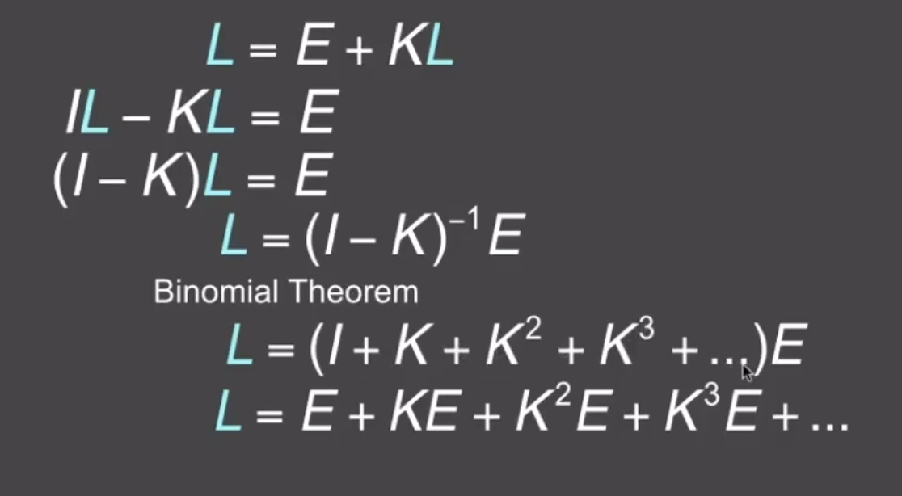

# bidirectional reflectance distribution function (BRDF) 双向反射分布函数

the bidirectional reflectance distribution function represents how much light is reflected into each outgoing direction $$\omega_r$$ from each incoming direction.

$$f_r(\omega_i \rightarrow \omega_r) = \frac{dL_r(\omega_r)}{dE_i(\omega_i)} = \frac{dL_r(\omega_r)}{L_i(\omega_i)cos\theta_i d\omega_i} [\frac{1}{sr}]$$ 概率

**$$L_r的微分来自于反射到该方向的光线不止来自于i方向$$**

## reflection equation

$$L_r(p, \omega_r) = \int_{H^2}f_r(p,\omega_i \rightarrow \omega_r)L_i(p, \omega_i)cos\theta_i d\omega_i$$ p是position, 点的坐标

## rendering equation

$$L_o(p, \omega_o) = L_e(p, \omega_o) +  \int_{H^2}f_r(p,\omega_i \rightarrow \omega_r)L_i(p, \omega_i)cos\theta_i d\omega_i$$

其中$$L_e$$是物体自己发的光, $$cos\theta_i = n \cdot \omega_i$$

Fredholm integral Equation of second kind

$$l(u) = e(u) + \int l(v)K(u,v)dv$$

其中$$K(u,v) = f_rcos\theta_i$$, $$K(u,v)dv$$ is kernel of equation 

该方程的linear operator Equation: 

$$L = E + KL$$

**线性算子?矩阵???**

