# LUT

1.LUT定义

显示[查找表](https://link.zhihu.com/?target=http%3A//baike.baidu.com/view/1627735.htm)（Look-Up-Table)简称为LUT

LUT实际上就是一张像素灰度值的映射表，它将实际采样到的像素灰度值经过一定的变换如阈值、反转、二值化、对比度调整、线性变换等，变成了另外一个与之对应的灰度值，这样可以起到突出图像的有用信息，增强图像的光对比度的作用。

3D-LUT：从本质上来说，LUT的作用就是将每一组RGB的输入值转化成输出值。

## 2.用途：

**校准LUT**

校准LUT是用来“修正”[显示器](https://link.zhihu.com/?target=http%3A//cpro.baidu.com/cpro/ui/uijs.php%3Fadclass%3D0%26app_id%3D0%26c%3Dnews%26cf%3D1001%26ch%3D0%26di%3D128%26fv%3D18%26is_app%3D0%26jk%3Ddb7dbd9216a89a3a%26k%3D%CF%D4%CA%BE%C6%F7%26k0%3D%CF%D4%CA%BE%C6%F7%26kdi0%3D0%26luki%3D10%26mcpm%3D0%26n%3D10%26p%3Dbaidu%26q%3D80058190_cpr%26rb%3D0%26rs%3D1%26seller_id%3D1%26sid%3D3a9aa81692bd7ddb%26ssp2%3D1%26stid%3D9%26t%3Dtpclicked3_hc%26td%3D1832207%26tu%3Du1832207%26u%3Dhttp%3A%2F%2Fwww.cgspread.com%2F3388.html%26urlid%3D0)不准确的地方，它能够确保经过校准的显示器可以显示尽可能准确的图像——在显示器的能力限制范围之内。

**技术LUT**

技术LUT用于转换不同的“标准”，比如说从一个颜色空间转换到另一个。

**创意LUT**

**用于风格化，滤镜等，此处运用的3DLUT就是实现unity滤镜效果。**

**滤镜示例：**

输入：

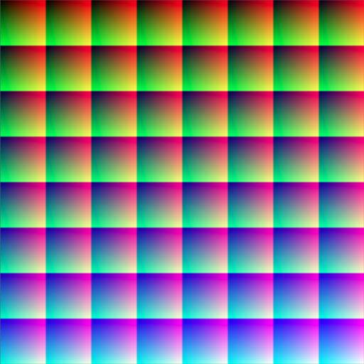

输出：

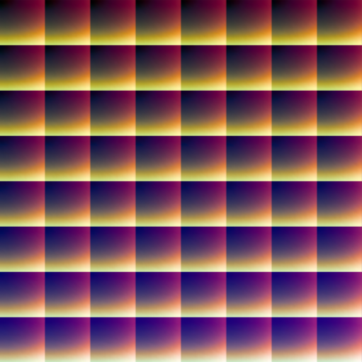

效果：

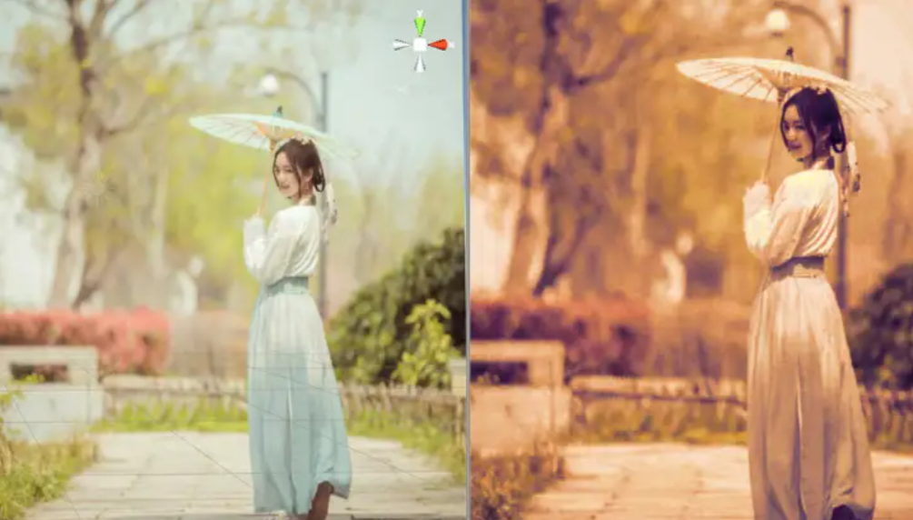

3.解读：

几何解读：3DLUT 可以看成是一个记录了色域范围内关键点颜色点坐标的立方体。


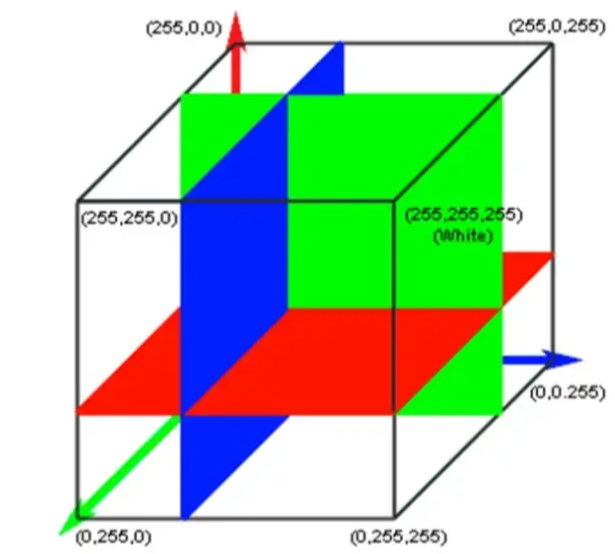


我更愿意把它看作是B分量不同灰度值上关于R，G分量分布的切片图组合，这样更容易理解。

下图是我根据制作的一张简易LUT 2*2的图，为了验证原理，RGB分量都是线性分布（实际上RGB分量在不同的显示系统里面会根据显示效果和色域做校正，因此一般不是线性分布）：

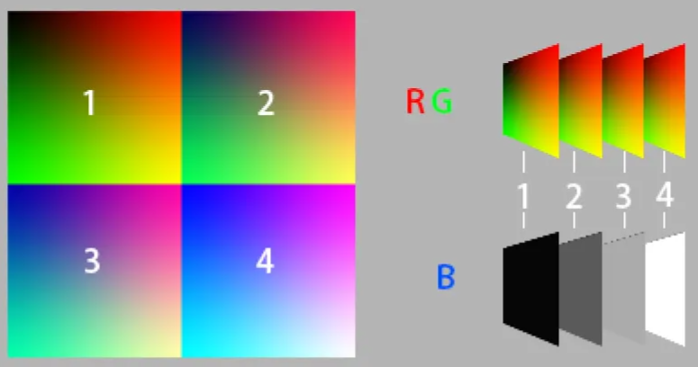

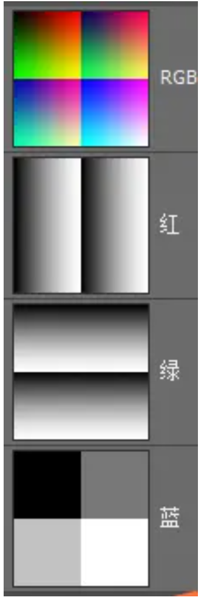

输入：将原始色彩空间映射到lut图。

先根据B值找到对应灰度的切片，然后根据R,G值找到在此切片上的坐标，得到颜色值在立方体的坐标。不在关键点的颜色坐标，通过插值得到。

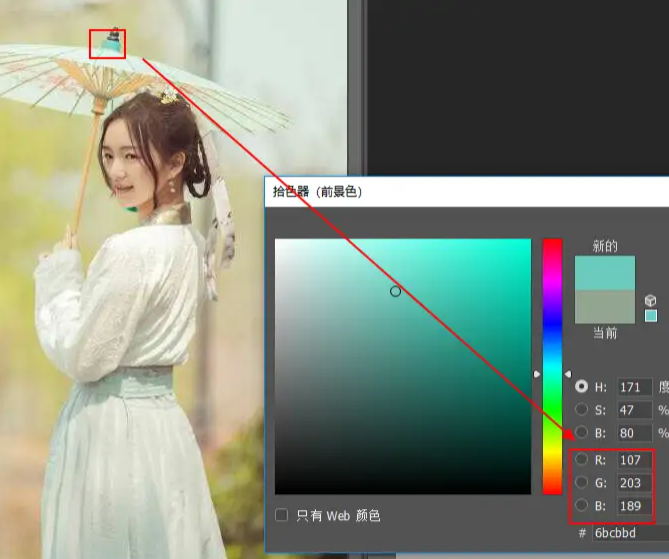

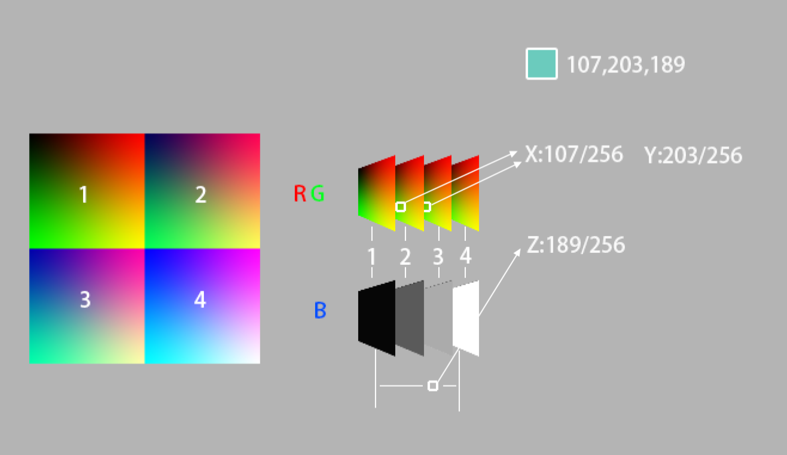

操作：将颜色变化应用到切片图。

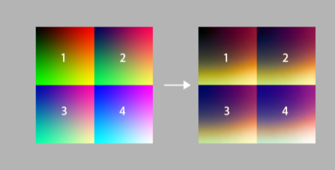

输出：按照原来颜色的坐标，找到坐标位置替换后的颜色，替换原有的颜色。RG分量上面根据UV坐标位置对颜色进行插值，B分量上面根据两个切片和所处两个切片中间的坐标位置进行插值

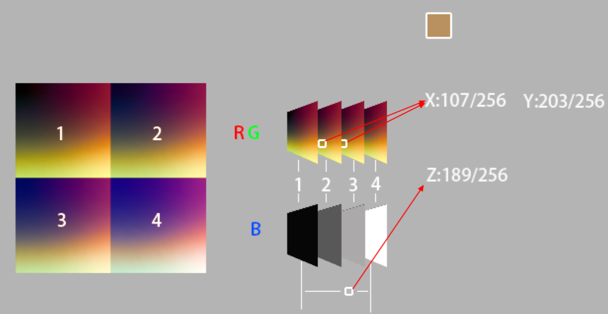

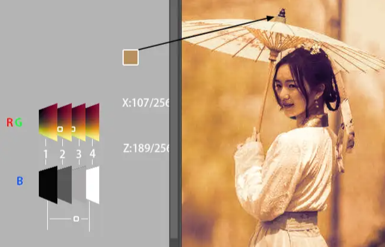

8*8的lut，采样分辨率为64。

参考链接：

[ColorLut](https://blog.csdn.net/danffer1985/article/details/78692992)

## 4.GLSL代码

8*8 LUT原图：


8*8 LUT代码：

```text
varying highp vec2 textureCoordinate;
uniform sampler2D inputImageTexture;
uniform sampler2D inputImageTexture2;

uniform lowp float intensity;

void main() {

    highp vec4 textureColor = texture2D(inputImageTexture, textureCoordinate);
    highp float blueColor = textureColor.b * 63.0;

    highp vec2 quad1;
    quad1.y = floor(floor(blueColor) / 8.0);
    quad1.x = floor(blueColor) - (quad1.y * 8.0);

    highp vec2 quad2;
    quad2.y = floor(ceil(blueColor) / 8.0);
    quad2.x = ceil(blueColor) - (quad2.y * 8.0);

    highp vec2 texPos1;
    texPos1.x = (quad1.x * 0.125) + 0.5/512.0 + ((0.125 - 1.0/512.0) * textureColor.r);
    texPos1.y = (quad1.y * 0.125) + 0.5/512.0 + ((0.125 - 1.0/512.0) * textureColor.g);

    highp vec2 texPos2;
    texPos2.x = (quad2.x * 0.125) + 0.5/512.0 + ((0.125 - 1.0/512.0) * textureColor.r);
    texPos2.y = (quad2.y * 0.125) + 0.5/512.0 + ((0.125 - 1.0/512.0) * textureColor.g);

    lowp vec4 newColor1 = texture2D(inputImageTexture2, texPos1);
    lowp vec4 newColor2 = texture2D(inputImageTexture2, texPos2);

    lowp vec4 newColor = mix(newColor1, newColor2, fract(blueColor));
    gl_FragColor = vec4(newColor.rgb, textureColor.w);

}
```

\--------------------------------------------------------

## 另外一种计算方式：

```text
#version 300 es
#ifdef GL_ES//for discriminate GLES & GL
#ifdef GL_FRAGMENT_PRECISION_HIGH
precision highp float;
#else
precision mediump float;
#endif
#else
#define highp
#define mediump
#define lowp
#endif
in vec2 texcoordOut;

uniform sampler2D colorMap;
uniform sampler2D mainTexture;

out vec4 color;

void main()
{
    const float EPS = 0.000001;
    const float pxSize = 512.0;
    vec3 orgColor = texture(mainTexture, texcoordOut).rgb;
 
    float bValue = (orgColor.b * 255.0) / 4.0;
 
    vec2 mulB = clamp(floor(bValue) + vec2(0.0, 1.0), 0.0, 63.0);
    vec2 row = floor(mulB / 8.0 + EPS);
    vec4 row_col = vec4(row, mulB - row * 8.0);
    vec4 lookup = orgColor.ggrr * (63.0/pxSize) + row_col * (64.0/pxSize) + (0.5/pxSize);
 
    float b1w = bValue - mulB.x;
 
    vec3 sampled1 = texture(colorMap, lookup.zx).rgb;
    vec3 sampled2 = texture(colorMap, lookup.wy).rgb;
 
    vec3 res = mix(sampled1, sampled2, b1w);
 
 color = vec4(res, 1.0);
}
```

## 5.unity实现

8*8lut代码：

```text
Shader "chain/LUT64"
{
	Properties
	{
		_MainTex ("Texture", 2D) = "white" {}
		_LutTex("FilterMap",2D)="white"{}
	}
	SubShader
	{
		// No culling or depth
		Cull Off ZWrite Off ZTest Always

		Pass
		{
			CGPROGRAM
			#pragma vertex vert
			#pragma fragment frag
 
			#include "UnityCG.cginc"


			struct v2f
			{
				float2 uv : TEXCOORD0;
				float4 pos : SV_POSITION;
			};

			v2f vert (appdata_img v)
			{
				v2f o;
				o.pos = UnityObjectToClipPos(v.vertex);
				o.uv = v.texcoord;
				return o;
			}
 
			sampler2D _MainTex;
			sampler2D _LutTex;

			fixed4 frag (v2f i) : SV_Target
			{
				fixed4 col = tex2D(_MainTex, i.uv);
//B分量分为64个片段
				float Bcolor = col.b * 63;
				float2 quad1;
//获取竖向和横向的片段位置（共获取2个B值片段位置，并在之后用余数插值）
				quad1.y = floor(floor(Bcolor)/8);
				quad1.x = floor(Bcolor)-(quad1.y*8);

				float2 quad2;
				quad2.y = ceil(floor(Bcolor)/8);
				quad2.x = ceil(Bcolor)-(quad2.y*8);

				float2 uv1;
				float2 uv2;
				//计算UV坐标，并对采样范围左右各缩小0.5
				uv1.x = ((quad1.x)*0.125)+ 0.5/512.0 +((0.125-0.5/512.0)* col.r);
				uv1.y =1-(((quad1.y)*0.125) + 0.5/512.0 +((0.125-0.5/512.0)* col.g));

				uv2.x = ((quad2.x)*0.125)+ 0.5/512.0 +((0.125-0.5/512.0)* col.r);
				uv2.y = 1-(((quad2.y)*0.125)+ 0.5/512.0 +((0.125-0.5/512.0)* col.g));
                              //采样
				fixed4 col1 = tex2D(_LutTex,uv1);
				fixed4 col2 = tex2D(_LutTex,uv2);
                              //根据B值的灰度插值
				col.rgb = lerp(col1.rgb,col2.rgb, frac(Bcolor));				
				col=fixed4(col.rgb,1.0);
				return col;
			}
			ENDCG
		}
	}
}
```


2*2 LUT片元代码，实际上只是把对应行列数修改了一下：

```text
			fixed4 frag (v2f i) : SV_Target
			{
				fixed4 col = tex2D(_MainTex, i.uv);
				float Bcolor = col.b * 3;
				float2 quad1;
				quad1.y = floor(floor(Bcolor)/2);
				quad1.x = floor(Bcolor)-(quad1.y*2);

				float2 quad2;
				quad2.y = ceil(floor(Bcolor)/2);
				quad2.x = ceil(Bcolor)-(quad2.y*2);

				float2 uv1;
				float2 uv2;
 
				uv1.x = ((quad1.x)*0.5)+1/512+ (0.5-0.5/512)* col.r;
				uv1.y =1-(((quad1.y)*0.5) + 1/512+ (0.5-0.5/512)* col.g);

				uv2.x = ((quad2.x)*0.5)+1/512+ (0.5-0.5/512)* col.r;
				uv2.y = 1-(((quad2.y)*0.5)+ 1/512+ (0.5-0.5/512)* col.g);			

				fixed4 col1 = tex2D(_LutTex,uv1);
				fixed4 col2 = tex2D(_LutTex,uv2);

				col.rgb = lerp(col1.rgb,col2.rgb, frac(Bcolor));				
				col=fixed4(col.rgb,1.0);
				return col;
			}
```

实际实现的时候发现在uv计算的时候不能单纯的除以行列数，如果这样做的话会发现画面在高亮的位置出现白点或者黑点的情况，这是因为图片采样的时候并不是100%的精确，浮点的计算总会造成误差，再加上图片质量的损失，在边缘的地方采样会造成UV溢出，所以需要进行一点点的修正，缩小采样的范围，关键代码就是这两句：

```
uv1.x = ((quad1.x)*0.5) + 1/512 + (0.5-0.5/512)*col.r;
uv1.y =1 - (((quad1.y)*0.5) + 1/512 + (0.5-0.5/512)*col.g);
```

注：图片质量设置中，将SRGB选项关闭，用以避免Unity的色彩空间转换。

必须将Generate Mip Map选项关闭，以避免图片质量损失，造成效果损失。


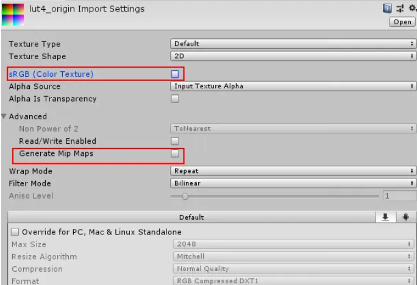

## 5.photoshop完成LUT滤镜图片的制作

1.直接对初始的颜色二维图使用LUT效果，存储完成图作为滤镜查找图

教程参考：

[Photoshop鲜为人知的一个调色功能LUT](https://link.zhihu.com/?target=http%3A//www.360doc.com/content/14/0828/17/21412_405399858.shtml)

2.使用动作记录对图片的调整，然后对初始颜色二维图播放动作，存储完成图作为滤镜查找图

## 未探索的点：

1. 色彩空间和LUT的映射关系
2. LUT原图生成方式
3. 用二进制文本格式存储的图片不会存在质量损失的问题，也不会存在采样过界的问题，未来可以考虑直接读取.cube等LUT格式的文件以替代LUT图片