# SDF面部阴影

### 概述

对于要生成这样一张阈值图：

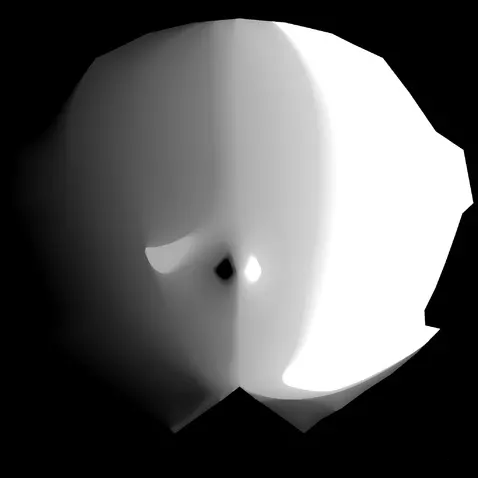

要算的当然就是每个像素位置的阈值

输入为几个特定角度的阴影图：

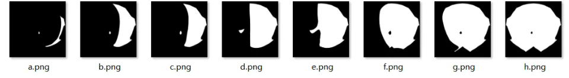

注意：

首先，可以观察到所有图的同一个像素位置中，只会有一次值的突变（这个其实很好理解，脸上的一个部分，当灯光旋转过来的时候，只会有一次从暗部变成亮部，不管跟其他部分比是提前还是延后）

这就可以得到输入图片的要求：**图片必须连续且后一张必须可以覆盖前一张（可以是暗部覆盖也可以是亮部覆盖，但只能是一种）**

然后就可以按顺序操作了，先生成对应的sdf图（这里有个坑，那个算法的源代码中最后对dist进行了缩放，需要注意，这里如果弄得太大，会导致后面计算阈值的时候缺少渐变的效果）

至于怎么具体计算阈值，其实理解起来很简单，**就是根据该像素点在前后两张图中采样的sdf值的差值去插值前后两张图的阈值**，我尽量把自己的想法讲明白

我们要生成一张0-255的阈值图，在ps中阈值为1或255的时候看到的图片一定是第一张或者最后一张，那么自然而然中间这几张的阈值就可以计算出来（因为图片是均匀变化的），先用平均算出一个间隔为多少，然后得到index就可以得到每一张原始图对应的阈值了。

对于该阈值图的某个像素点来说，例如该点值为128，当ps中阈值调到128，就会发现该点在边界上，对于这个像素点来说，只会有一次处于边界，或者永远不处于边界（一直被照亮或者一直处于黑暗），需要找到在哪两张图中间时该像素点会在某一个阈值条件下处于边界，然后对于已知前后AB两张图对应阈值的情况下，该点的阈值计算就很简单了：**前一张图的阈值+用该点离前一张图边界的距离/前后两张图的距离差**

距离的相关信息从对应的sdf图中就可以获得了，这里要提的就是因为会计算距离差，如果之前那个缩放做的太猛了，距离差可能会在一定区域内成为定值，那样渐变的效果就不够强烈了，所以可以自行调整得到符合要求的缩放效果。

虽然不知道自己讲清楚了没有，但是我自己是明白了这个图的生成过程，至于SDF图的算法，大概懂了，但我还是比较难讲明白，就不班门弄斧了，至于生成这种图的代码，我也就不放了，还是大佬的香。

当然了，图是一个准备工作，我们需要做的还是要把图用到shader里面

先看一下效果：

[效果](./imgs/SDF0.MP4)

shader代码：

[黑魔姬：神作面部阴影渲染还原274 赞同 · 30 评论文章](https://zhuanlan.zhihu.com/p/279334552)

```csharp
float isSahdow = 0;
//这张阈值图代表的是阴影在灯光从正前方移动到左后方的变化
half4 ilmTex = tex2D(_IlmTex, input.uv);
 //这张阈值图代表的是阴影在灯光从正前方移动到右后方的变化
half4 r_ilmTex = tex2D(_IlmTex, float2(1 - input.uv.x, input.uv.y));
float2 Left = normalize(TransformObjectToWorldDir(float3(1, 0, 0)).xz);	//世界空间角色正左侧方向向量
float2 Front = normalize(TransformObjectToWorldDir(float3(0, 0, 1)).xz);	//世界空间角色正前方向向量
float2 LightDir = normalize(light.direction.xz);
float ctrl = 1 - clamp(0, 1, dot(Front, LightDir) * 0.5 + 0.5);//计算前向与灯光的角度差（0-1），0代表重合
float ilm = dot(LightDir, Left) > 0 ? ilmTex.r : r_ilmTex.r;//确定采样的贴图
//ctrl值越大代表越远离灯光，所以阴影面积会更大，光亮的部分会减少-阈值要大一点，所以ctrl=阈值
//ctrl大于采样，说明是阴影点
isSahdow = step(ilm, ctrl);
bias = smoothstep(0, _LerpMax, abs(ctrl - ilm));//平滑边界，smoothstep的原理和用法可以参考我上一篇文章
if (ctrl > 0.99 || isSahdow == 1)
    diffuse = lerp(diffuse , diffuse * _ShadowColor.xyz ,bias);
```

### 具体实现

1. 输入：9 张 图片，光照角度分别是与脸前方呈 180°, 157.5°, 135°, 112.5°, 90°, 67.5°, 45°, 22.5°, 0°

注1：图1 中光照是贴图右方，左右方均不影响，最终shader兼容左右

注2: 0 可以是全脸白色，对应 图1 h.png

注3: 180.png 不能全黑，至少留一个白像素点，表示最开始哪里有光

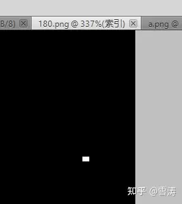

180.png 留一个白像素

2. 将9张图片全部转换成 SDF 贴图，

使用 [GitHub - mattdesl/image-sdf: generate a signed distance field from an image](https://link.zhihu.com/?target=https%3A//github.com/mattdesl/image-sdf)

这个生成 SDF 的

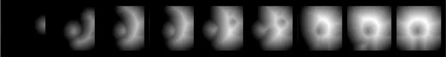

原始 2048*2048，spread 512，downscale 7

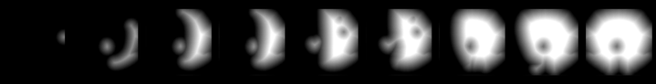

图2 原始 2048*2048，spread 256，downscale 4

3. 每两相邻 SDF 贴图生成平滑图像，共 8 张

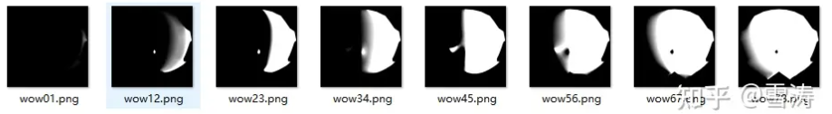

- 以 wow01.png 为例，在 ps 中通过修改阈值预览可以看到如下效果

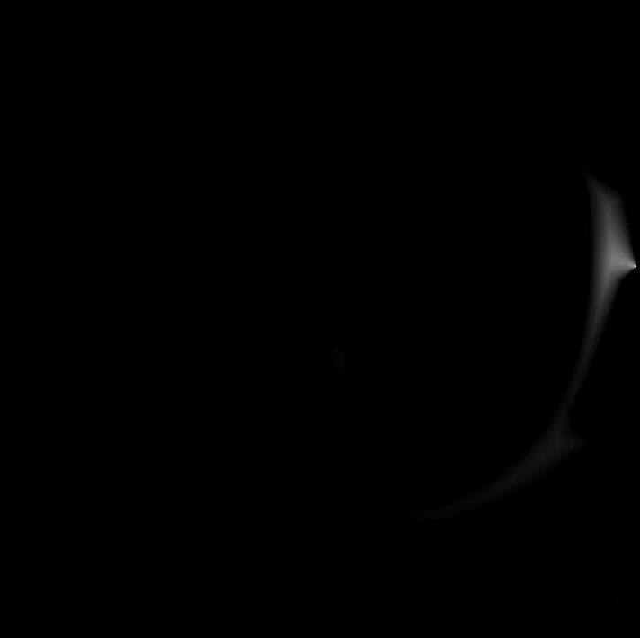

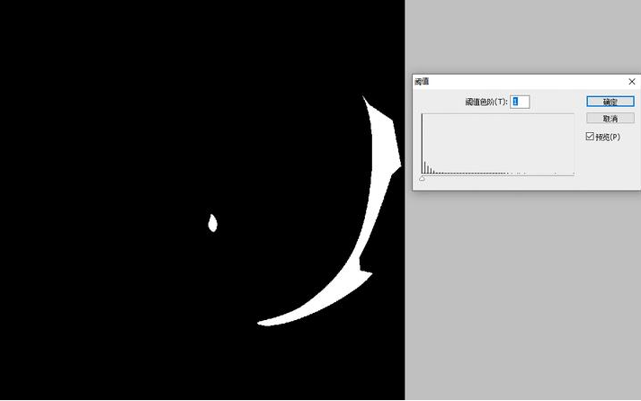

wow01.png 修改阈值

4. 8张 平滑图像逐像素求和除以 8，就是最终的脸部阴影贴图

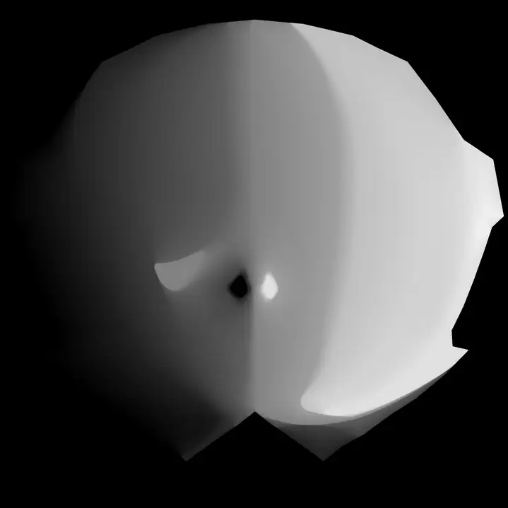

最终贴图 wow.png

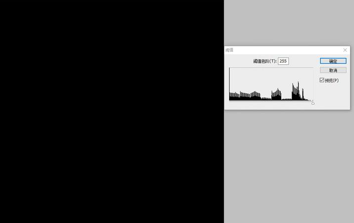

wow.png 修改阈值

5. 脸部阴影贴图渲染阴影代码：

引用：[光阳果：原神截帧分析(持续作案中...)](https://zhuanlan.zhihu.com/p/272495627)

```glsl
float3 _Up    = float3(0,1,0);                          //人物上方向 用代码传进来
float3 _Front = float3(0,0,-1);                         //人物前方向 用代码传进来
float3 Left = cross(_Up,_Front);
float3 Right = -Left;
//也可以直接从模型的世界矩阵中拿取出 各个方向
//这要求模型在制作的时候得使用正确的朝向: X Y Z 分别是模型的 右 上 前
//float4 Front = mul(unity_ObjectToWorld,float4(0,0,1,0));
//float4 Right = mul(unity_ObjectToWorld,float4(1,0,0,0));
//float4 Up = mul(unity_ObjectToWorld,float4(0,1,0,0));

float FL =  dot(normalize(_Front.xz), normalize(L.xz));
float LL = dot(normalize(Left.xz), normalize(L.xz));
float RL = dot(normalize(Right.xz), normalize(L.xz));
float faceLight = faceLightMap.r + _FaceLightmpOffset ; //用来和 头发 身体的明暗过渡对齐
float faceLightRamp = (FL > 0) * min((faceLight > LL),(1 > faceLight+RL ) ) ;
float3 Diffuse = lerp( _ShadowColor*BaseColor,BaseColor,faceLightRamp);
```

补充：

unity，使用 图2 生成的 SDF 贴图， 用 shader 模拟 4. 的平滑贴图过渡 与 混合

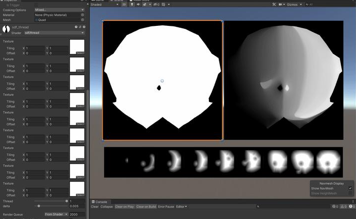

左：模拟阈值 右：模拟阴影贴图 下：9张SDF贴图

shader 代码：

左：sdf_thread.shader

```glsl
Shader "sdf/thread"
{
    Properties
    {
        _MainTex0 ("Texture", 2D) = "white" {}
        _MainTex1 ("Texture", 2D) = "white" {}
        _MainTex2 ("Texture", 2D) = "white" {}
        _MainTex3 ("Texture", 2D) = "white" {}
        _MainTex4 ("Texture", 2D) = "white" {}
        _MainTex5 ("Texture", 2D) = "white" {}
        _MainTex6 ("Texture", 2D) = "white" {}
        _MainTex7 ("Texture", 2D) = "white" {}
        _MainTex8 ("Texture", 2D) = "white" {}
        _thread ("Thread", Range(0,1)) = 0.5
	_delta("delta", Range(0,0.05)) = 0.01

    }
    SubShader
    {
        // No culling or depth
        Cull Off ZWrite Off ZTest Always

        Pass
        {
            CGPROGRAM

            #pragma vertex vert
            #pragma fragment frag

            #include "UnityCG.cginc"

            struct appdata
            {
                float4 vertex : POSITION;
                float2 uv : TEXCOORD0;
            };

            struct v2f
            {
                float2 uv : TEXCOORD0;
                float4 vertex : SV_POSITION;
            };

            v2f vert (appdata v)
            {
                v2f o;
                o.vertex = UnityObjectToClipPos(v.vertex);
                o.uv = v.uv;
                return o;
            }

            sampler2D _MainTex0;
            sampler2D _MainTex1;
            sampler2D _MainTex2;
            sampler2D _MainTex3;
            sampler2D _MainTex4;
            sampler2D _MainTex5;
            sampler2D _MainTex6;
            sampler2D _MainTex7;
            sampler2D _MainTex8;
			float _thread;
			float _delta;

            fixed4 frag (v2f i) : SV_Target
            {
				fixed4 col0 = tex2D(_MainTex0, i.uv);
				fixed4 col1 = tex2D(_MainTex1, i.uv);
                fixed4 col2 = tex2D(_MainTex2, i.uv); 
                fixed4 col3 = tex2D(_MainTex3, i.uv); 
                fixed4 col4 = tex2D(_MainTex4, i.uv); 
                fixed4 col5 = tex2D(_MainTex5, i.uv); 
                fixed4 col6 = tex2D(_MainTex6, i.uv); 
                fixed4 col7 = tex2D(_MainTex7, i.uv); 
                fixed4 col8 = tex2D(_MainTex8, i.uv);

                float4 color = float4(0, 0, 0, 1);

                float cols[9];

                cols[0] = col0.a;
                cols[1] = col1.a;
                cols[2] = col2.a;
                cols[3] = col3.a;
                cols[4] = col4.a;
                cols[5] = col5.a;
                cols[6] = col6.a;
                cols[7] = col7.a;
                cols[8] = col8.a;

                 for (int i = 0; i < 8; i++) {
                     if (i/8.0 < _thread && _thread <= (i+1)/8.0) {
                         fixed r = lerp(cols[i], cols[i+1], _thread*8 - i);
                         r = smoothstep(0.5- _delta, 0.5+ _delta, r);
                         color = fixed4(r, r, r, 1);
                         return color;
                     }
                 }
                
                return color;
            }
            ENDCG
        }
    }
}
```


右：sdf_blend.shader

```glsl
Shader "sdf/blend"
{
    Properties
    {
        _MainTex0 ("Texture", 2D) = "white" {}
        _MainTex1 ("Texture", 2D) = "white" {}
        _MainTex2 ("Texture", 2D) = "white" {}
        _MainTex3 ("Texture", 2D) = "white" {}
        _MainTex4 ("Texture", 2D) = "white" {}
        _MainTex5 ("Texture", 2D) = "white" {}
        _MainTex6 ("Texture", 2D) = "white" {}
        _MainTex7 ("Texture", 2D) = "white" {}
        _MainTex8 ("Texture", 2D) = "white" {}
	_delta ("delta", Range(0,0.05)) = 0.01

    }
    SubShader
    {
        // No culling or depth
        Cull Off ZWrite Off ZTest Always

        Pass
        {
            CGPROGRAM

            #pragma vertex vert
            #pragma fragment frag

            #include "UnityCG.cginc"

            struct appdata
            {
                float4 vertex : POSITION;
                float2 uv : TEXCOORD0;
            };

            struct v2f
            {
                float2 uv : TEXCOORD0;
                float4 vertex : SV_POSITION;
            };

            v2f vert (appdata v)
            {
                v2f o;
                o.vertex = UnityObjectToClipPos(v.vertex);
                o.uv = v.uv;
                return o;
            }

            sampler2D _MainTex0;
            sampler2D _MainTex1;
            sampler2D _MainTex2;
            sampler2D _MainTex3;
            sampler2D _MainTex4;
            sampler2D _MainTex5;
            sampler2D _MainTex6;
            sampler2D _MainTex7;
            sampler2D _MainTex8;
			float _delta;

            fixed4 frag (v2f i) : SV_Target
            {
				fixed4 col0 = tex2D(_MainTex0, i.uv);
				fixed4 col1 = tex2D(_MainTex1, i.uv);
                fixed4 col2 = tex2D(_MainTex2, i.uv); 
                fixed4 col3 = tex2D(_MainTex3, i.uv); 
                fixed4 col4 = tex2D(_MainTex4, i.uv); 
                fixed4 col5 = tex2D(_MainTex5, i.uv); 
                fixed4 col6 = tex2D(_MainTex6, i.uv); 
                fixed4 col7 = tex2D(_MainTex7, i.uv); 
                fixed4 col8 = tex2D(_MainTex8, i.uv);

                float4 color = float4(0, 0, 0, 1);

                float cols[9];

                cols[0] = col0.a;
                cols[1] = col1.a;
                cols[2] = col2.a;
                cols[3] = col3.a;
                cols[4] = col4.a;
                cols[5] = col5.a;
                cols[6] = col6.a;
                cols[7] = col7.a;
                cols[8] = col8.a;


                float4 color2 = float4(0, 0, 0, 1);
                for (float j=1; j <= 256.0; j++) {
                    float _thread2 = j / 256.0;

                    for (int i = 0; i < 8; i++) {
                        if (i/8.0 < _thread2 && _thread2 <= (i+1)/8.0) {
                            fixed r = lerp(cols[i], cols[i+1], _thread2*8 - i);
                            r = smoothstep(0.5- _delta, 0.5+ _delta, r);
                            fixed4 tmp_color = fixed4(r, r, r, 1);
                            color2 = ((j-1) * color2 + tmp_color) / j;
                            break;
                        }
                    }

                }

                color = color2;


                return color;
            }
            ENDCG
        }
    }
}
```


再补充 unity 中 GPU 渲染 SDF，很快 上述的sdf规格生成一张一秒都不用

注1：Texture 是输入的贴图，Rt不用填，sdfgenerate shader在文章后面

注2：up 电脑 unity 1024*1024 * 350*350 左右GPU就会崩溃，有大小限制

输出大小1024*1024

暴力逐像素遍历 350*350 会崩溃

当然下图 512*512 * 256 * 256 远小于这个崩溃值

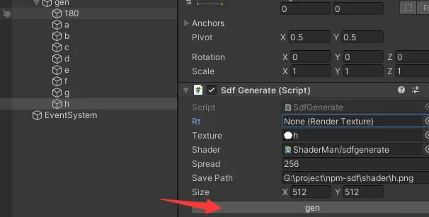

作为 MonoBehavior 组件用，Rt 不用填，点击 gen

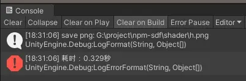

耗时没有1s, 很快啊

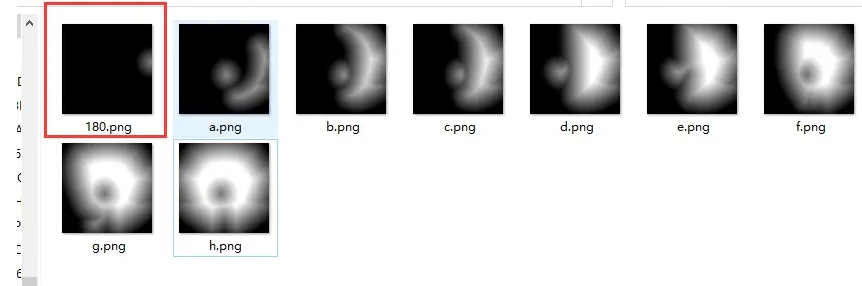


sdfgenerate.shader

```glsl
Shader "ShaderMan/sdfgenerate"
    {

    Properties{
        _MainTex ("MainTex", 2D) = "white" {}
        _range ("range", Range(16, 256)) = 16
    }

    SubShader
    {
        Tags { "RenderType" = "Transparent" "Queue" = "Transparent" }

        Pass
        {
        ZWrite Off
        Blend SrcAlpha OneMinusSrcAlpha

        CGPROGRAM
        #pragma vertex vert
        #pragma fragment frag
        #include "UnityCG.cginc"

        struct VertexInput {
            fixed4 vertex : POSITION;
            fixed2 uv:TEXCOORD0;
            fixed4 tangent : TANGENT;
            fixed3 normal : NORMAL;
           //VertexInput
        };


        struct VertexOutput {
            fixed4 pos : SV_POSITION;
            fixed2 uv:TEXCOORD0;
            //VertexOutput
        };

        //Variables
        sampler2D _MainTex;
        uniform float4 _MainTex_TexelSize;
        float _range;

    
        bool isIn(fixed2 uv) {
            fixed4 texColor = tex2D(_MainTex, uv);
            return texColor.r > 0.5;
        }
        

        float squaredDistanceBetween(fixed2 uv1, fixed2 uv2)
        {
            fixed2 delta = uv1 - uv2;
            float dist = (delta.x * delta.x) + (delta.y * delta.y);
            return dist;
        }


        VertexOutput vert (VertexInput v)
        {
           VertexOutput o;
           o.pos = UnityObjectToClipPos (v.vertex);
           o.uv = v.uv;
           //VertexFactory
           return o;
        }
        fixed4 frag(VertexOutput i) : SV_Target
        {

            fixed2 uv = i.uv;

            const float range = _range;
            const int iRange = int(range);
            float halfRange = range / 2.0;
            fixed2 startPosition = fixed2(i.uv.x - halfRange * _MainTex_TexelSize.x, i.uv.y - halfRange * _MainTex_TexelSize.y);

            bool fragIsIn = isIn(uv);
            float squaredDistanceToEdge = (halfRange* _MainTex_TexelSize.x*halfRange*_MainTex_TexelSize.y)*2.0;

            // [unroll(100)]
            for (int dx = 0; dx < iRange; dx++) {
                // [unroll(100)]  
                for (int dy = 0; dy < iRange; dy++) {
                    fixed2 scanPositionUV = startPosition + float2(dx * _MainTex_TexelSize.x, dy* _MainTex_TexelSize.y);

                    bool scanIsIn = isIn(scanPositionUV / 1);
                    if (scanIsIn != fragIsIn) {
                        float scanDistance = squaredDistanceBetween(i.uv, scanPositionUV);
                        if (scanDistance < squaredDistanceToEdge) {
                            squaredDistanceToEdge = scanDistance;
                        }
                    }
                }
            }

            float normalised = squaredDistanceToEdge / ((halfRange * _MainTex_TexelSize.x*halfRange * _MainTex_TexelSize.y)*2.0);
            float distanceToEdge = sqrt(normalised);
            if (fragIsIn)
                distanceToEdge = -distanceToEdge;
            normalised = 0.5 - distanceToEdge;


            return fixed4(normalised, normalised, normalised, 1.0);
        }
        ENDCG

        }
    }
}
```


SdfGenerate.cs

```csharp
using System.Collections;
using System.Collections.Generic;
using System.IO;
using UnityEditor;
using UnityEngine;

[CustomEditor(typeof(SdfGenerate))]
public class SdfGenerateInsp : Editor
{
    public override void OnInspectorGUI() {
        base.DrawDefaultInspector();

        var sdfGenerate = target as SdfGenerate;
        if (GUILayout.Button("gen")) {
            sdfGenerate.gen();

        }
    }
}
public class SdfGenerate : MonoBehaviour
{
    public RenderTexture rt;
    public Texture texture;
    public Shader shader;
    public int spread = 16;

    public string savePath;

    public Vector2 size = new Vector2(1024, 1024);

    public void gen() {
        var sdfGenerate = this;
        if (sdfGenerate.texture == null) {
            Debug.LogErrorFormat("texture is null ");
            return;
        }

        if (sdfGenerate.shader == null) {
            Debug.LogErrorFormat("shader is null ");
            return;
        }

        if (sdfGenerate.rt != null) {
            sdfGenerate.rt.Release();
            sdfGenerate.rt = null;
        }

        System.Diagnostics.Stopwatch watch = new System.Diagnostics.Stopwatch();
        watch.Start();
        //init();计算耗时的方法


        sdfGenerate.rt = new RenderTexture((int)sdfGenerate.size.x, (int)sdfGenerate.size.y, 32, RenderTextureFormat.ARGB32);

        Material mat = new Material(sdfGenerate.shader);
        mat.hideFlags = HideFlags.DontSave;
        mat.SetFloat("_range", sdfGenerate.spread);

        var input_rt = RenderTexture.GetTemporary(new RenderTextureDescriptor(sdfGenerate.rt.width, sdfGenerate.rt.height, sdfGenerate.rt.format));

        Graphics.Blit(texture, input_rt);

        Graphics.Blit(input_rt, sdfGenerate.rt, mat);


        RenderTexture.ReleaseTemporary(input_rt);

        var rt = sdfGenerate.rt;
        Texture2D tex = new Texture2D(rt.width, rt.height, TextureFormat.RGB24, false);
        tex.ReadPixels(new Rect(0, 0, rt.width, rt.height), 0, 0);
        tex.Apply();

        var directory = Path.GetDirectoryName(sdfGenerate.savePath);
        var fileName = Path.GetFileName(sdfGenerate.savePath);

        //Debug.LogErrorFormat("path: {0}", sdfGenerate.savePath);
        //Debug.LogErrorFormat("directory: {0}", directory);
        //Debug.LogErrorFormat("fileName: {0}", fileName);

        if (!string.IsNullOrEmpty(directory)) {
            if (!Directory.Exists(directory)) {
                Directory.CreateDirectory(directory);
            }
        }
        else {
            Debug.LogErrorFormat("savePath directory no exist {0}", sdfGenerate.savePath);
            return;
        }


        File.WriteAllBytes(sdfGenerate.savePath, tex.EncodeToPNG());

        Debug.LogFormat("save png: {0}", sdfGenerate.savePath);

        watch.Stop();
        var mSeconds = watch.ElapsedMilliseconds / 1000.0;
        Debug.LogErrorFormat("耗时：{0}秒", mSeconds.ToString());
    }
}
```