# Toon Shading Collection 

## CH03a - Direct Diffuse on Face 面部漫反射（主光）

二次元角色的面部是对真实人脸的高度抽象，其漫反射阴影的表达也是高度概括性的。明暗界线对于法线非常敏感，很容易产生不平整的界线，影响模型的美观，这对面部明暗处理带来了严峻的挑战。

常见二次元脸的光影，通常存在一些特殊区域，比如眼睛下面会形成一个三角区。要实现这些效果，而我们同时又希望尽量精简面数，那就需要做相应的专门调整。

一个坏消息是，可能目前为止还没有一种完美的解决方案。过场动画可以靠精确设置光源来回避问题，但实际游戏的高自由性总会暴露一些丑的角度。

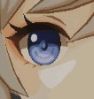

*↑眼下三角*

<br>

------

### 面部阴影风格归纳

做阴影修正之前，最好先确定什么样的光影符合卡通的表现特征。下面从动画和现实表现入手，盘点一下常规的面部阴影表现。

<br>

- #### 简化

在动画中可以选择直接干掉阴影（除了头发投影），这种方式在光比相对较弱的环境中被广泛应用，不过这样面部就太平，一般会添加鼻尖线条、红晕之类的细节，下图中第一行的图片具有这种特征。

而对于光比较大或者展示角色受光的情况下，会去画脸部边缘的阴影或高光，这种阴影的特征就是边缘平滑，贴合面部边缘形状。下图中第二行的图片体现了这种特征。


<br>

- #### 特征区域

特征区域的光影表达，面部主要集中在鼻尖，眼底，唇低，眉头，这些区域是面部高光与阴影的表现的密集区，常常会画上高光或阴影等细节，有时也用于情绪的表现。下图也列举了部分动画中的表现。


<br>

- #### 伦勃朗光

伦勃朗光是一种常见于肖像摄影的照明布局方式。最主要的特征是强调面部明暗对比，即高反差的光比。而卡通表现中经常使用到的是这种布光方式产生的阴影轮廓，这种轮廓最典型的特征就是一侧脸颊上产生的三角形的亮区。下图中即是这种布光的面部表现。

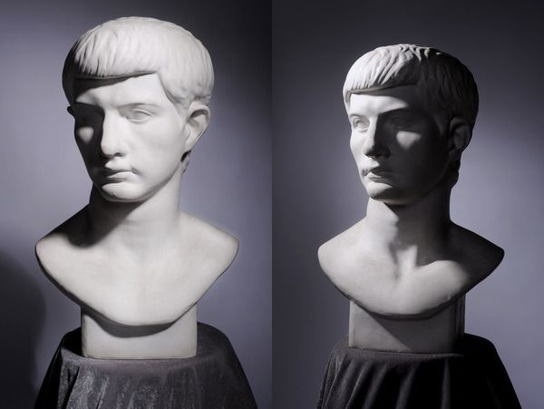

在渲染中，实际上这种三角光是由面部的自阴影与自投影组合形成的，引擎中不采用直接打光的方式形成这种阴影的原因，一是阴影精度的问题，二是阴影的动态变化依旧不可控，在其他光照角度下很难有理想的阴影形状。

面部的这种光影特征也是在动画中对三角区域做处理的依据，侧光下很多角色面部都会出现类似的特征。

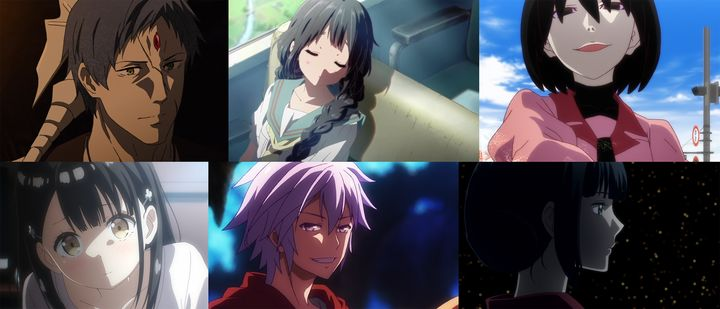

<br>

- #### 其他形状

当然面部光影的表现形式还有很多，类似下图。


<br>

- #### 动态变化

在3D中还原面部阴影最麻烦的地方在于光照的动态变化。动画中的阴影是逐帧调整的，可以为了画面不讲道理，而在模型上的计算是要遵循规则的，所以需要概括出通用的变化特征，再为了达成目的使用各种Trick。下面两张图展示出大多数动画中的动态变化。

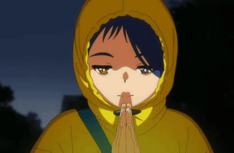

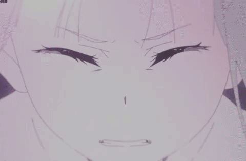

另外也有画师做了不同角度面部光照的研究，挺有参考价值的，在这里一并贴出。光学核心写的《动画阴影化简》中不仅概括了面部特征，同时也有动画角色的整体阴影特征，十分推荐读一下。

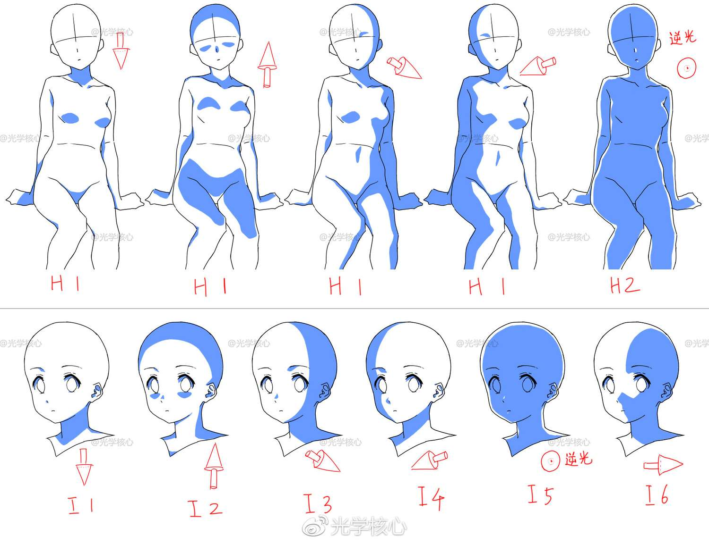

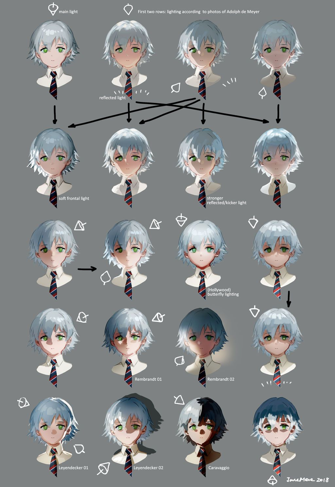

<br>

<br>

------

<br>

目前大致有两种思路来修正面部光影形态：法线和阈值。

<br>

------

### 修正面部法线

一是通过模型拓补适配阴影形状并使指定区域内法线对齐一致，来实现像lowpoly一样的粗略阴影；二是使用简化的代理模型（包括但不限于球体）做法线传递，可以得到平滑的明暗变化。

Unity有免费插件Normal Painter等工具做手动修正，Maya自带法线传递的功能，3ds Max可以通过插件Noors Normal Thief实现法线传递的功能。在SP里还有Normal Convert Shader可以绘制法线图。


*↑注意眼下的三角区等位置的布线*

<br>

脸颊的小的倒三角形，这个效果不是随便就能做出来的，稍微懂一点打光的朋友都能了解，这是一个比较经典的伦勃朗三点光源产生的一种明中有暗、暗中有明的效果。如果卡通渲染想要达到这个效果，就要谈到布线的问题。

这个小的三角形一定要切出来布线，去卡住这个光影的轮廓，你才能看到这个三角形。至于这个造型是什么样子，可能针对不同的角色有不同的情况，男性要硬朗一点、女性就要小一点。但是这个小的桃心形是一定要切出来的。

<br>

**优点：** 

- XYZ各个方向的光照角度都有考虑到。
- 模型确定的话处理较快，还算适合量产。
- 阴影精度和贴图无关。

**缺点：** 

- 某些角度还是会有瑕疵，要想发现并修正瑕疵、且不引入其它角度的新瑕疵，需要的工作量很大，而且可能找不到所有角度光照都不错的结果。
- 对前期模型布线要求很高。
- 环形布线必然产生三角结构，对表情适配可能有影响。
- 难以处理复杂体块。
- 会导致阴影产生跳变，即在两种阴影形态之间会快速切换。

 <br>

**注意：** 

- 经过修改后的模型不能直接使用法线贴图，所以如果必须使用法线贴图，建议把修改过的法线储存到顶点色或UV上，这样不会影响其他的效果。
- 模型布线要精细，区域布线需要有循环边保护、侧面分区等，本质是根据角色阴影走向来布线，这样也比较好控制阴影方向。

<br>

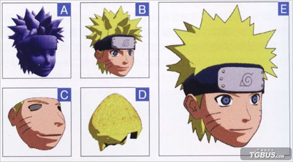

*↑火影忍者究极风暴，将人物的面部向外膨胀，再用膨胀后的面部法线传递回原模型*

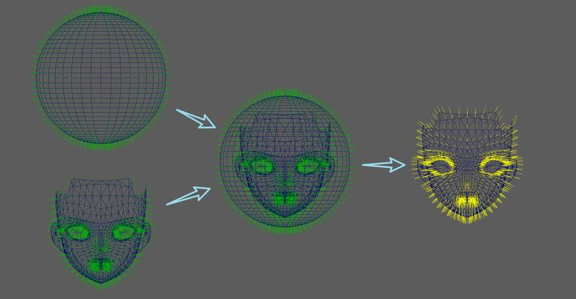

*↑常见的球体法线传递示例*

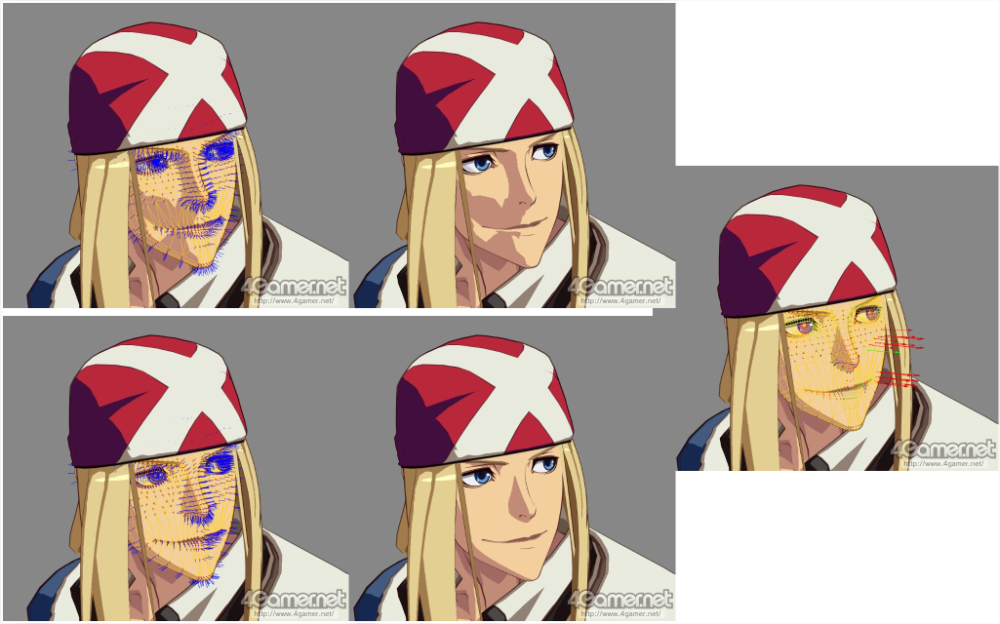

*↑罪恶装备，手动调整法线*


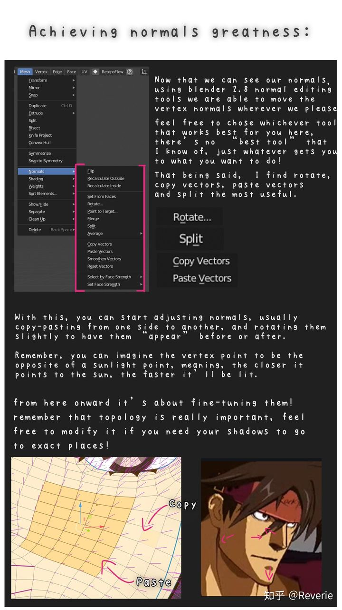

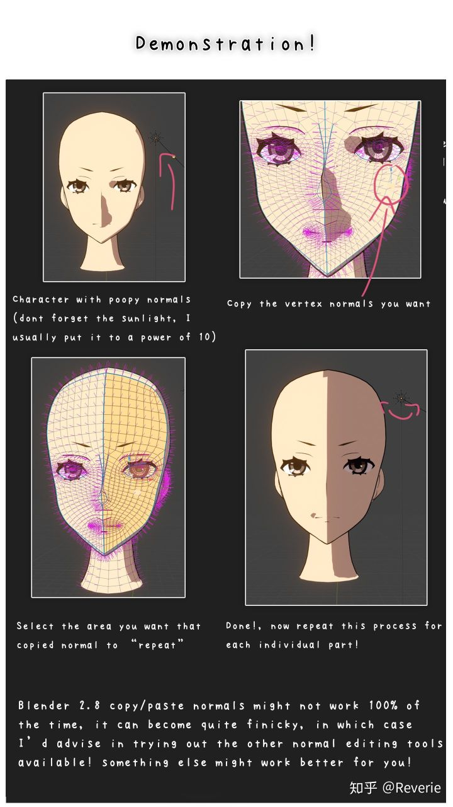

*↑推特作者Yoolies的脸部法线调整教程*

<br>

#### 面部布线注意点补充

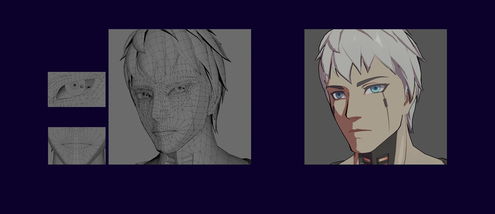

脸颊的小的倒三角形，这个效果不是随便就能做出来的，稍微懂一点打光的朋友都能了解，这是一个比较经典的伦勃朗三点光源产生的一种明中有暗、暗中有明的效果。如果卡通渲染想要达到这个效果，就要谈到布线的问题。

这个小的三角形一定要切出来布线，去卡住这个光影的轮廓，你才能看到这个三角形。至于这个造型是什么样子，可能针对不同的角色有不同的情况，男性要硬朗一点、女性就要小一点。但是这个小的桃心形是一定要切出来的。

再往下看嘴巴，这里的布线，如果稍微懂一点，大家也能知道嘴巴、眼球都是有一圈一圈的口轮匝肌、眼轮匝肌布线。这样它动起来时，光影会看着更自然。我们现在这个卡通渲染布线，其实从鼻底到嘴唇是没有圈线的。

为什么要这么做？第一，因为卡通角色在做表情、说话的时候，有时动作是非常夸张的；第二，这种渲染方式不像传统做法，它的光影非常明确，你可以看到右边就是亮部，左边是暗部，中间只有一条线过渡，而不是有一个明显的光滑过渡。当这个人在做表情的时候，如果loop圈线太多，它会产生很多不必要的瑕疵影响表现。所以这个嘴巴才需要这么做。

<br>

- #### 变体1——法线贴图

还可以直接在法线贴图上改出平整的法线。

**优点：** 不用再纠结模型点线排布。

**缺点：** 过于静态。

**注意：** 这张图并非常见的切线空间法线，而是物体空间法线图，这样才能有高通用性，表情口型的顶点变更都不会影响光照分布。当然也可以把它转回切线空间版本，但没必要。如果某些情况要求光照随表情改版，也可以增加另一张脸部法线图做插值。


*↑在SP中用Normal Convert Shader绘制法线图*

<br>

- #### 变体2——法线动态偏移

据说嗜血代码的面部法线方案是，模型原始法线不需要修改，另有一个通道控制面部法线动态偏移强度，偏移方向是视线负方向，于是从各个方向查看模型时，法线都能趋向于平面，比直接调整法线的侧面效果还要顺滑一些。

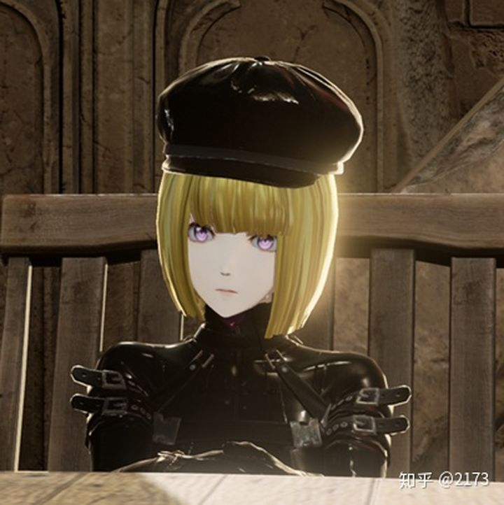

<br>

<br>

------

### mask控制暗部强度

通过一张面部的mask贴图来控制阴影的变化，使得阴影只在有限的区域（比如鼻子附近）中出现。当然，也可以使用顶点色来代替mask贴图的作用。

还有种简化版，是先在ramp条计算上就把整体明暗分界点后移，整张脸处于亮部的区间更大，再压暗鼻子和下巴等细节，甚至可能永久压暗。战双是这个做法，甚至连鼻子下的阴影也不留，只卡了一段勾线表现鼻子。

**优点：** 没法线修正麻烦。

**缺点：** 有些光照角度可能还要磨合。

**注意：** 基于HalfLambert值来进行的调整，而HalfLambert本身就是NdotL，法线如果本身就很平滑的话调整起来会方便很多。


*↑米哈游：直接利用一个顶点色通道，控制脸部的上色层的强弱，减弱面部明暗对比，通过压低漫反射表现来达到想要的卡通效果。*

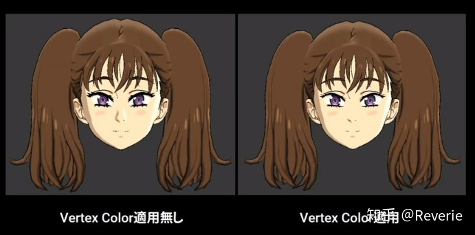

*↑七大罪也用了顶点色通道调整脸部阴影*


*↑崩坏3面部阴影判定贴图*

<br>

<br>

------

### 水平方向阈值mask

原神使用的角色面部处理方法。

美术先绘制出光线按纵轴旋转各角度的理想光影mask图，模型本身的 halfLambert 值不参与mask的制作流程。然后使用SDF有向距离场算法，融合各角度mask，最后生成一张过渡mask。通常只考虑水平方向的过渡，在计算 halfLambert 时 lightDir 和 normalDir 都只计算 xz 分量。

<br>

**优点：** 

- 比起法线调整要直观得多，制作简单高效，可以脚本生成。
- 通用性高，只要其他角色面部布线和UV位置保持一致，在不同脸上的效果基本不变。
- 不需要再费力对齐法线，模型法线只产生一半的影响或完全不影响（根据算法），即便模型法线发生调整也没什么问题。
- 可以把光照一直保持倾斜的角度的话，效果不错，也没有违和感。

**缺点：** 

- 并非所有细节可以完美手绘控制，只能照顾光照的左右旋转分量。（理论上可以魔改，但美术要绘制的原始光影形态角度增多。）
- 为了保证边缘信息准确，这张图不建议压缩。
- 在一些情况下对软阴影支持比较差（一是会有色阶感，二在曲率不同与UV拉伸的区域会存在软硬交接的边缘）。
- 面部形态差异较大的角色比较多时，UV拉伸导致一张mask很难通用，美术要单独订制的工作量增大，也限制了角色设计的自由发挥。

<br>

**大佬分享的工具：** [如何快速生成混合卡通光照图](https://zhuanlan.zhihu.com/p/356185096)


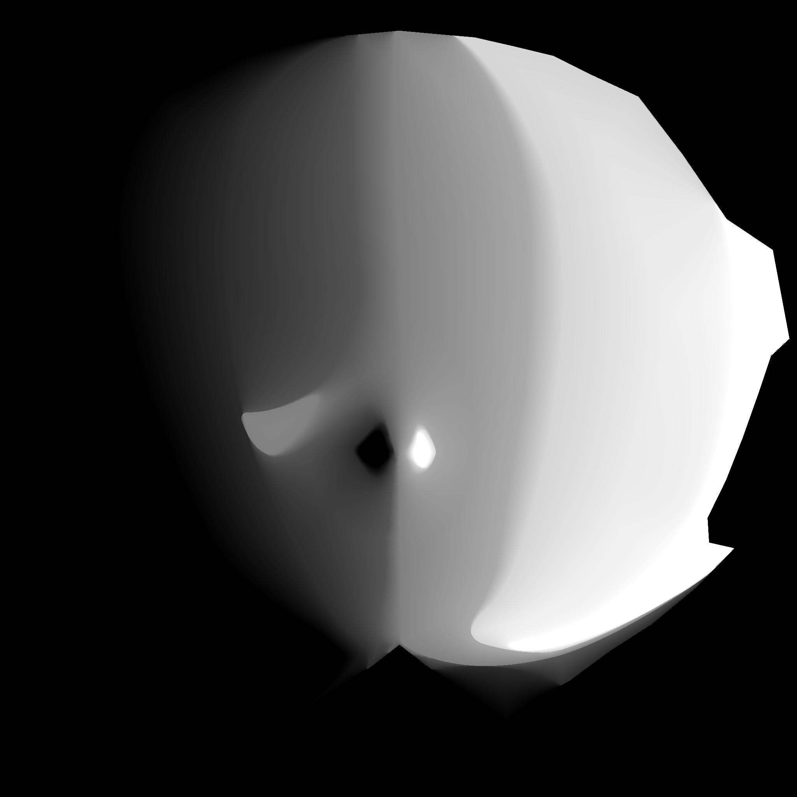

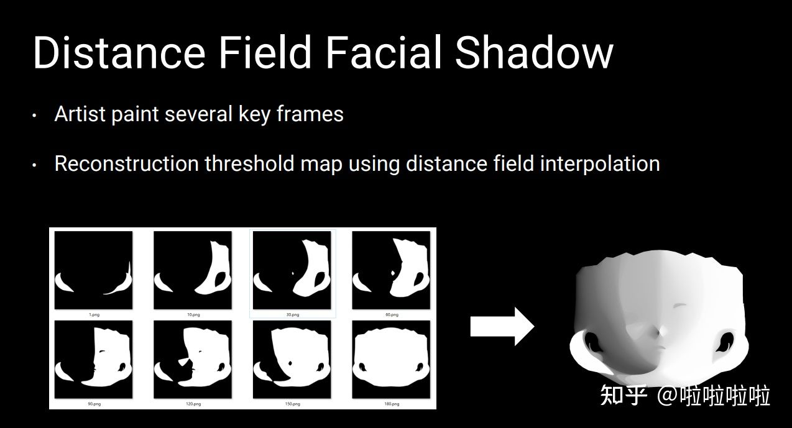

*↑米哈游：绘制了光照角度在1°、10°、30°、60°、90°、120°、150°、180° 的图像*

<br>

#### SDF贴图制作方式

整合一下目前已知的制作方式，会先放出相关链接，然后简要概述。

<br>

- ##### 帧间插值

[雪涛：卡通脸部阴影贴图生成 渲染原理](https://zhuanlan.zhihu.com/p/389668800)

大概过程是先绘制出不同光照角度的面部阴影形状，之后使用算法生成每张光照图的SDF，插值混合生成最终图像。


<br>

- ##### 等高线填充

[【教程】使用csp等高线填充工具制作三渲二面部阴影贴图_哔哩哔哩_bilibili](https://www.bilibili.com/video/BV16y4y1x7J1)

与上述方式本质上相似，不过是利用了已有软件的功能。过程是先绘制出不同光照角度下面部阴影的边界线条，之后利用CSP的等高线填充功能，生成SDF。

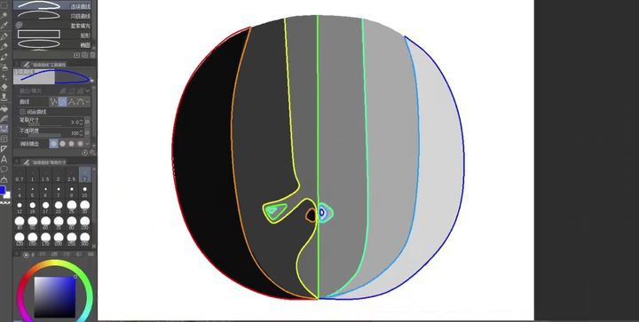

<br>

- ##### 曲线融合变形

[五行精灵：三渲二脸部阴影曲线，曲线融合变形算法 curve morph algorithm 开源](https://zhuanlan.zhihu.com/p/271220648)

自动化的胜利，在houdini中拟合等高线的变化过程，同时生成高度图，获得SDF。

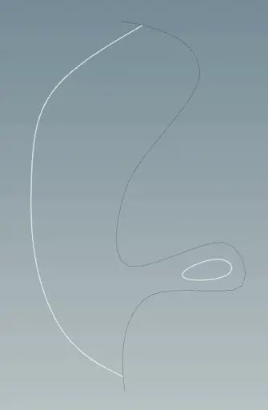

<br>

- ##### 程序化批量生成

[卡通渲染流程【番外-使用SD批量生成面部SDF贴图】](https://zhuanlan.zhihu.com/p/546880604)

[卡通渲染流程【番外-使用SD批量生成SDF贴图】-简介有教程和工程文件！](https://www.bilibili.com/video/BV1Md4y1D7sZ)

用Substance Designer程序化批量生成SDF贴图。

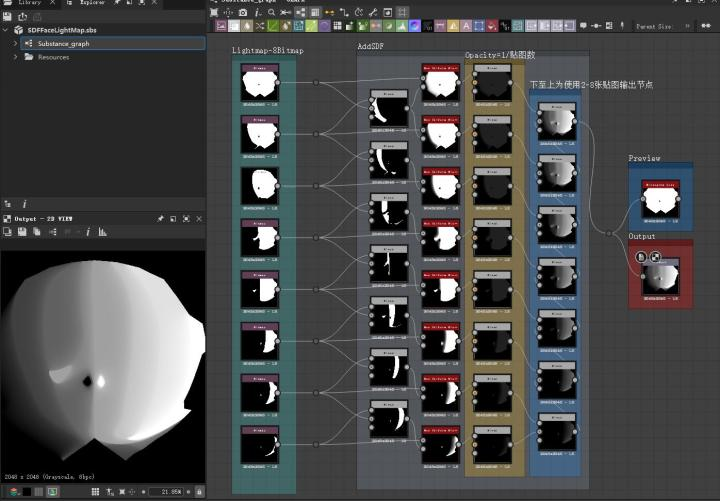

<br>

<br>

------

### 算法改良

#### ——SDF柔化边缘

其实这里的明暗交界线是可以改成软边效果的，边界的采样锯齿问题也可以缓解，但在某些光照角度和参数组合的条件下会有渐变过渡区域阶梯化的问题。

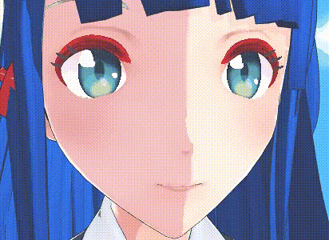

*↑实现效果*

示例代码如下，注意原作者写得比较粗糙，还有优化空间：

```glsl
float isSahdow = 0;
//这张阈值图代表的是阴影在灯光从正前方移动到左后方的变化
half4 ilmTex = tex2D(_IlmTex, input.uv);
 //这张阈值图代表的是阴影在灯光从正前方移动到右后方的变化
half4 r_ilmTex = tex2D(_IlmTex, float2(1 - input.uv.x, input.uv.y));
float2 Left = normalize(TransformObjectToWorldDir(float3(1, 0, 0)).xz);	//世界空间角色正左侧方向向量
float2 Front = normalize(TransformObjectToWorldDir(float3(0, 0, 1)).xz);	//世界空间角色正前方向向量
float2 LightDir = normalize(light.direction.xz);
float ctrl = 1 - clamp(0, 1, dot(Front, LightDir) * 0.5 + 0.5);//计算前向与灯光的角度差（0-1），0代表重合
float ilm = dot(LightDir, Left) > 0 ? ilmTex.r : r_ilmTex.r;//确定采样的贴图
//ctrl值越大代表越远离灯光，所以阴影面积会更大，光亮的部分会减少-阈值要大一点，所以ctrl=阈值
//ctrl大于采样，说明是阴影点
isSahdow = step(ilm, ctrl);
bias = smoothstep(0, _LerpMax, abs(ctrl - ilm));//平滑边界，smoothstep的原理和用法可以参考我上一篇文章
if (ctrl > 0.99 || isSahdow == 1)
    diffuse = lerp(diffuse , diffuse * _ShadowColor.xyz ,bias);
```

<br>

#### ——SDF+法线混合计算

Cygames Tech Conference中赛马娘分享的方式，使用类似SDF的方式绘制特征区域，并配合修正法线后的光照结果，混合获得面部阴影。

这种方式比单纯使用SDF的好处是：当阴影边界恰好在在面部可形变区域时（比如眼睛与嘴部），阴影边界不会因为面部变形而拉伸。另外还可以减少mask绘制工作量。因为考虑到了法线，有调整为照顾到光源任意旋转角度光影形态的可能性。

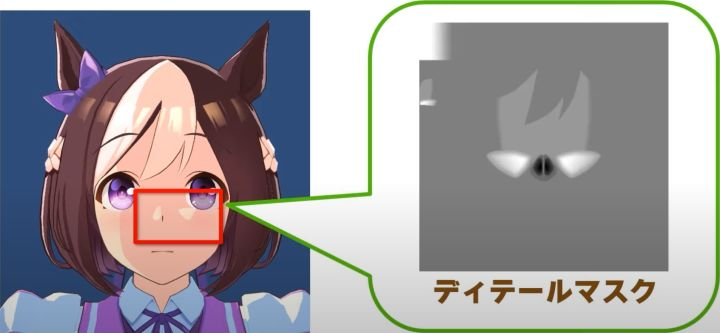

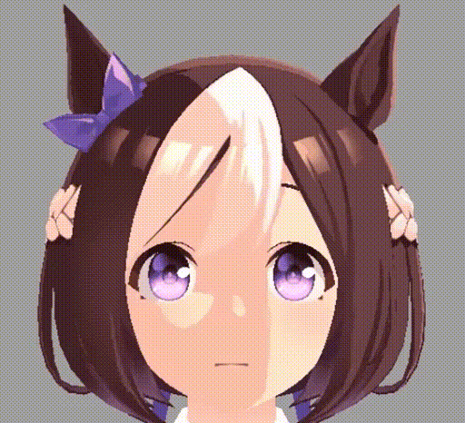

虽然分享中并没有说明具体怎么计算，不过有了这个思路，做出类似的效果并不是难事。

具体还原示范见：[二次元角色卡通渲染—面部篇](https://zhuanlan.zhihu.com/p/411188212)

<br>

<br>

------

### MatCap方案

面部光影也可以另辟蹊径使用Matcap思路。

七大罪的技术分享中讲述了这种方式，作者在分享中讲到使用这种方式的原因：根据（动画）演出中非现实的阴影设定，比起物理事实更重视感情的传达。

在大部分情况下卡通画面不需要保证光照的正确性，只要画面中的效果是感观舒适，就是可行的。所以在非动态光照下，使用Matcap表现角色的光影结构切分是非常简单并且效果还不错的方式——也就是说比较适于固定镜头过场动画中。

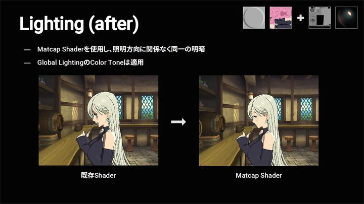

下图是PPT中贴出的最简版的MatCap相关代码，而且MatCap采样也可以使用顶点色调整，屏蔽不需要的效果。

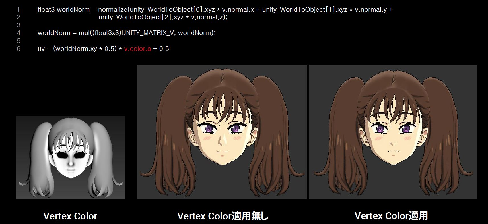

<br>

<br>

------

### 衔接问题

经过调整的面部区域，要怎样和周围皮肤上的漫反射明暗分界线自然地连接，也是一个要考虑的问题。取巧的方式就是大家头顶都有头发盖着，并且脖子下巴都压暗，那基本不用担心。但如果要出光头角色，就要慎重了……不过话说回来，古往今来卡渲游戏有出现过吴克角色吗？

<br>

<br>

------

### 弃疗方案：独立动态光照

将光照方向跟场景光照方向解绑，完全跟随角色朝向和视角。光照有限视角方向，随着角色朝向偏移，但不超过30°夹角，角色转向较大时，再将光照插值变化为更好的角度。

这个办法常用于选人界面。一般玩家不会发现或并不在意。

而在世界场景中，可能要考虑将场景光源也跟着角色光源方向变化，也有的做法是永远从相机视角方向给角色打光、场景保持自己的静态光照方向。

如果不是为了面部光影的处理，谁会这么自讨苦吃地复杂化光照方案呢……

<br>

#### 变体1——压低光源角度法


一般天光其实都是顶光（为了生成较少的建筑阴影），直接打人脸上都会完蛋。蓝色协议是直接在人物身上将天光方向拉平了50%，也就是仰角最多45度。

但这个方法只是解决了光照的高低角度问题，左右角度并不在它的考虑范畴。

<br>

#### 变体2——补光法

也有观点认为：光源的方向垂直于视线方向就会把明暗部之间的强烈对比呈现出来，因此为了削弱对比就专门为脸部补一个光，光源是从观察者这边射出去的，或者加点自发光也行。

不过这也只是稍微缓解了原生面部阴影形状给人带来的不适感，并没有从本质上解决问题。

<br>

<br>

------

### 强行建模法

介绍一种动画公司常用的技法。

有的日本CGI动画公司使用的是另外的方式来实现想要的体积感和光影表现，就是通过反直觉的建模强行把3D模型进行扭曲，或者阴影颜色直接通过覆盖模型的方式进行制作。

其实只要最终渲染的画面效果是对的那其实无论什么方法都可以。

当然，考虑到面数、相机和光源的多角度变化，游戏中一般不会这么做，而是用上文和上章提到的办法替代。

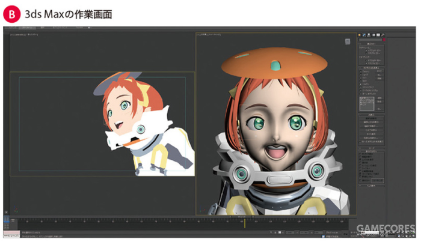


