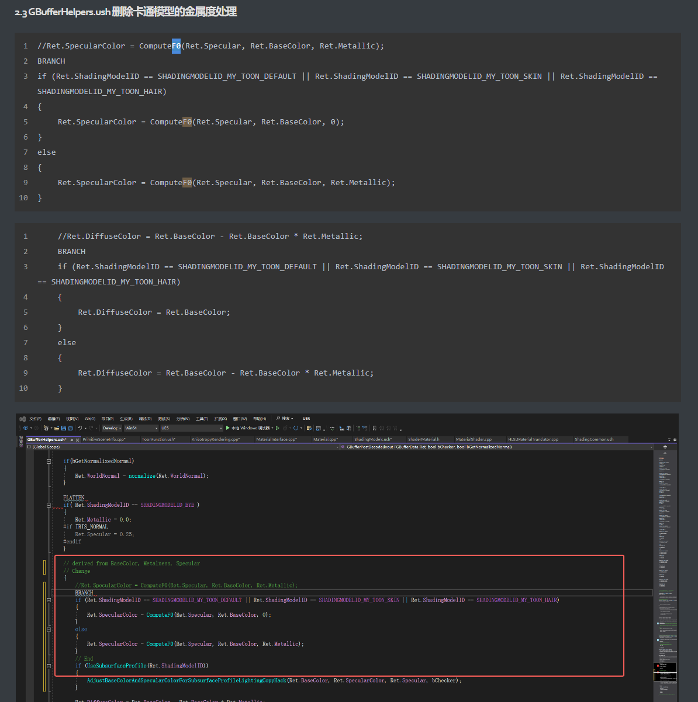

# 卡通渲染细节优化总结

## 刘海投影

方式：深度偏移

### 1.2 实现方式

流朔大佬很久之前就实现过一个不错的刘海投影效果，主要思想是给头发或脸部绘制模板，然后在屏幕空间下进行偏移，进行模板测试：

[流朔：【Unity URP】以Render Feature实现卡通渲染中的刘海投影1049 赞同 · 49 评论文章](https://zhuanlan.zhihu.com/p/232450616)

[流朔：【Unity URP】卡通渲染中的刘海投影·改169 赞同 · 10 评论文章](https://zhuanlan.zhihu.com/p/416577141)

由于我们UE做的是延迟渲染，做起来这个效果就更简单了，在做脸部shading时，偏移一下屏幕空间的深度信息和头发的深度进行对比，直接就能得到刘海投影。在加上上一篇文章写入了ToonModel，已经把头发和脸部区分好了，做起刘海投影更是如鱼得水。

### 二、实现

本文很大半篇幅在修改ToonBuffer，如果只想看头发投影的实现，建议直接跳到：**2.3 添加头发投影**。

### 2.1 Light Shader读取ToonBuffer

以我目前的修改，只有Raytracing Shadow的Shader可以读取到ToonBuffer，这次的刘海投影在Lighting Pass中计算，我们需要让Lighting的Shader也读取ToonBuffer里的信息。

UE计算Lighting使用的是DeferredLightPixelShaders.usf，我们可以发现它最终是使用GetGBufferData函数来获取GBuffer信息。


DeferredShadingCommon.ush

我们可以在这里加上对ToonBuffer的采样：


DeferredShadingCommon.ush

但是这么改完了之后，会发现一点效果都没有，这是因为默认情况下走的是这个分支


这个函数你[全局搜索](https://zhida.zhihu.com/search?q=全局搜索&zhida_source=entity&is_preview=1)是搜不出来的，因为它是在C++中生成的。具体是怎么生成的呢，可以看看ShaderGenerationUtil.cpp。

如果想看到它生成的代码，我们可以用[Visual Studio](https://zhida.zhihu.com/search?q=Visual+Studio&zhida_source=entity&is_preview=1)打开工程，在上面打个断点，debug一下看看这个OutputFileData。


ShaderGenerationUtil.cpp

DecodeGBufferData函数在这个函数里生成，会生成四种DecodeGBufferData函数：

- DecodeGBufferDataUV
- DecodeGBufferDataUint
- DecodeGBufferDataSceneTextures
- DecodeGBufferDataSceneTexturesLoad


ShaderGenerationUtil.cpp


把OutputFileData复制到VS Code查看

由于DeferredLightPixelShaders.usf里用的是DecodeGBufferDataUV，所以我也先只在DecodeType == CoordUV时加上TBuffer的采样，如果以后用到了其他的三个，到时候再加。


ShaderGenerationUtil.cpp


ShaderGenerationUtil.cpp

接下来我们还要修改一下这个DecodeGBufferDataDirect函数，它是由CreateGBufferDecodeFunctionDirect生成的


OutputFileData生成的代码


ShaderGenerationUtil.cpp

我没有直接修改CreateGBufferDecodeFunctionDirect函数，而是定义了个GBufferDecodeFunctionDirectOveride来生成DecodeGBufferDataDirect函数的重载：

```c
static FString GBufferDecodeFunctionDirectOveride(const FGBufferInfo& BufferInfo)
{
	FString FullStr;

	//------------------------------------------------函数头--------------------------------------------------
	FullStr += TEXT("FGBufferData  DecodeGBufferDataDirect(");
	bool bFirst = true;
	for (int32 Index = 0; Index < FGBufferInfo::MaxTargets; Index++)
	{
		const EGBufferType Target = BufferInfo.Targets[Index].TargetType;

		if (Target != GBT_Invalid && Index != 0)
		{
			if (bFirst)
			{
				bFirst = false;
			}
			else
			{
				FullStr += TEXT(",\n\t");
			}

			int32 NumChan = GetTargetNumChannels(Target);
			FString TypeName = GetFloatType(NumChan);
			FString CurrLine = FString::Printf(TEXT("%s InMRT%d"),
				TypeName.GetCharArray().GetData(),
				Index);

			FullStr += CurrLine;
		}
	}
	if (!bFirst)
	{
		FullStr += TEXT(",\n\t\t");
	}
	// 参数中加入TBuffer
	FullStr += TEXT(" \n\tuint4 InTBufferA,");
	FullStr += TEXT(" \n\tuint4 InTBufferB,");
	FullStr += TEXT(" \n\tuint4 InTBufferC,");
	FullStr += TEXT(" \n\tfloat CustomNativeDepth");
	FullStr += TEXT(",\n\tfloat4 AnisotropicData");
	FullStr += TEXT(",\n\tuint CustomStencil");
	FullStr += TEXT(",\n\tfloat SceneDepth");
	FullStr += TEXT(",\n\tbool bGetNormalizedNormal");
	FullStr += TEXT(",\n\tbool bChecker)\n");

	FullStr += TEXT("{\n");

	//------------------------------------------------函数Body--------------------------------------------------

	// 先使用默认的DecodeGBufferDataDirect函数
	FullStr += TEXT("\tFGBufferData Ret = DecodeGBufferDataDirect(");
	bFirst = true;
	for (int32 Index = 0; Index < FGBufferInfo::MaxTargets; Index++)
	{
		const EGBufferType Target = BufferInfo.Targets[Index].TargetType;

		if (Target != GBT_Invalid && Index != 0)
		{
			if (bFirst)
			{
				bFirst = false;
			}
			else
			{
				FullStr += TEXT(",\n\t\t");
			}

			int32 NumChan = GetTargetNumChannels(Target);
			FString CurrLine = FString::Printf(TEXT("InMRT%d"),
				Index);

			FullStr += CurrLine;
		}
	}

	if (!bFirst)
	{
		FullStr += TEXT(",\n\t\t");
	}
	
	FullStr += TEXT(" \n\t\tCustomNativeDepth");
	FullStr += TEXT(",\n\t\tAnisotropicData");
	FullStr += TEXT(",\n\t\tCustomStencil");
	FullStr += TEXT(",\n\t\tSceneDepth");
	FullStr += TEXT(",\n\t\tbGetNormalizedNormal");
	FullStr += TEXT(",\n\t\tbChecker);\n");

	//使用DecodeToonDataFromBuffer解码Toon部分
	FullStr += TEXT(" \n\tif (Ret.ShadingModelID == SHADINGMODELID_TOON)");
	FullStr += TEXT(" \n\t{");
	FullStr += TEXT(" \n\t\tRet.ToonBuffer = DecodeToonDataFromBuffer(InTBufferA, InTBufferB, InTBufferC, InMRT4);");
	FullStr += TEXT(" \n\t}");

	//------------------------------------------------Return-----------------------------------------------
	FullStr += TEXT("\n");
	FullStr += TEXT("\treturn Ret;\n");

	FullStr += TEXT("}\n");
	FullStr += TEXT("\n");
	
	return FullStr;
}
```

上面的函数生成的代码大概长这样：


GBufferDecodeFunctionDirectOveride生成的代码

这里真的很想吐槽UE要这么生成代码，可能是为了提高一些代码复用，但是这样修改起代码来真的很麻烦，很不直观，一个这么简单的函数，C++写了100多行，红豆泥逆天。

把它加到这里：


ShaderGenerationUtil.cpp

现在DeferredLightPixelShaders.usf应该就能读取到ToonBuffer了，这里我写了一点测试代码，让SelfID == 255的时候LightAttenuation等于0


然后给脸部的SelfID写入255，脸部的光照消失了，说明ToonBuffer成功读取到了。


### 2.2 修改ToonMaterial节点

之前材质编辑器为了写入ToonBuffer还要写Custom节点，有点麻烦


我打算把Toon Material节点改成下面这样：


修改针脚名称：


MaterialExpressionToonMaterialOutput.h

添加一个GetInputType函数，用来定义针脚接受什么类型的输入：


MaterialExpressionToonMaterialOutput.h

在MaterialExpressions.cpp中实现UMaterialExpressionToonMaterialOutput::GetInputType

```c
uint32 UMaterialExpressionToonMaterialOutput::GetInputType(int32 InputIndex)
{
	if (InputIndex == 0) { return MCT_Float1; }		// SelfID
	if (InputIndex == 1) { return MCT_Float1; }		// ObjectID
	if (InputIndex == 2) { return MCT_Float1; }		// ToonModel
	if (InputIndex == 3) { return MCT_Float1; }		// ShadowCastFlag
	if (InputIndex == 4) { return MCT_Float1; }		// HairShadowOffset
	if(InputIndex < 7)
	{
		return MCT_Float4;
	}
	check(false);
	return MCT_Float3;
}
```

然后修改一下UMaterialExpressionToonMaterialOutput::Compile


MaterialExpressions.cpp

修改输出节点数量：


MaterialExpressions.cpp

这样输出节点就修改好了。

接下来修改一下Engine/Shaders/Private/Toon/ToonPassShader.usf里的MainPS函数，把针脚信息正确写入ToonBuffer中。下面我把读取针脚和编码ToonBuffer的逻辑封装为两个函数：GetToonBuffer和EncodeToonBuffer


我把Engine/Shaders/Private/Toon/ToonShadingCommon.ush改名为ToonBufferCommon.ush，并且添加了两个文件：ToonShadingCommon.ush和ToonMaterialParameterCommon.ush


下面截出来的修改并不全，具体改了哪些东西大家去git看提交记录吧，全部截出来太长了。

像ToonStep这些和光照相关的放ToonShadingCommon.ush里，等一下计算头发投影也会放这里面：


ToonBufferCommon.ush里多了个EncodeToonBuffer和GetToonPayloadByToonBuffer函数


ToonBufferCommon.ush


ToonBufferCommon.ush

ToonMaterialParameterCommon.ush则是放了通过FMaterialPixelParameters来获取ToonBuffer和ToonPayloadData的函数。

```c
#pragma once

#include "../Common.ush"
#include "ToonBufferCommon.ush"

FToonBuffer GetToonBuffer(FMaterialPixelParameters MaterialParameters)
{
	FToonBuffer ToonBuffer;
	ToonBuffer.SelfID = 0;
	ToonBuffer.ObjectID = 0;
	ToonBuffer.ToonModel = 0;
	ToonBuffer.ShadowCastFlag = 0;
	ToonBuffer.HairShadowOffset = 0.0f;
	ToonBuffer.ToonBufferB = 0.0f;
	ToonBuffer.ToonBufferC = 0.0f;
#ifdef  HAVE_GetToonMaterialOutput0	
	ToonBuffer.SelfID = clamp(GetToonMaterialOutput0(MaterialParameters), 0.0f, 255.0f);
#endif
#ifdef  HAVE_GetToonMaterialOutput1	
	ToonBuffer.ObjectID = clamp(GetToonMaterialOutput1(MaterialParameters), 0.0f, 255.0f);
#endif
#ifdef  HAVE_GetToonMaterialOutput2	
	ToonBuffer.ToonModel = clamp(GetToonMaterialOutput2(MaterialParameters), 0.0f, 7.0f);
#endif
#ifdef  HAVE_GetToonMaterialOutput3	
	ToonBuffer.ShadowCastFlag = clamp(GetToonMaterialOutput3(MaterialParameters), 0.0f, 32.0f);
#endif
#ifdef  HAVE_GetToonMaterialOutput4	
	ToonBuffer.HairShadowOffset = GetToonMaterialOutput4(MaterialParameters);
#endif
#ifdef  HAVE_GetToonMaterialOutput5	
	ToonBuffer.HairShadowOffset = GetToonMaterialOutput4(MaterialParameters);
#endif
#ifdef  HAVE_GetToonMaterialOutput6	
	ToonBuffer.HairShadowOffset = GetToonMaterialOutput4(MaterialParameters);
#endif

	return ToonBuffer;
}

FToonPayloadData GetToonPayloadData(FMaterialPixelParameters MaterialParameters)
{
	FToonBuffer ToonBuffer = GetToonBuffer(MaterialParameters);
	
	return GetToonPayloadByToonBuffer(ToonBuffer);
}
```

后面还有include头文件，RayTracingOcclusionRGS.usf和RayTracingMaterialHitShaders.usf的修改


具体的修改都在这个提交记录里，还是看直接看git更清楚点：


### 2.3 添加头发投影

接下来终于可以正式添加头发的投影了。一共就改了两个文件，代码量很少，为了显得本文没那么水，下面分步骤进行修改。

在DeferredLightPixelShaders.usf里把ToonShadingCommon.ush包括进去


当ShadowModel是Toon并且是ToonFace或ToonEye的时候，使用GetHairShadow计算头发投影：


DeferredLightPixelShaders.usf

GetHairShadow函数放在ToonShadingCommon.ush中实现：

```c
float GetHairShadow(FGBufferData GBuffer, FDeferredLightData LightData, float2 ScreenUV)
{
	float Shadow = 1.0f;
	float k = 100.0f;
	// 屏幕空间LightDirection
	// View.TranslatedWorldToCameraView用于将世界空间变换到屏幕空间
	float3 LightDirVS = mul(LightData.Direction, (float3x3)(View.TranslatedWorldToCameraView));
	// 翻转LightDirVS的y方向，不然Offset上下会反，可能会出现OpenGL和DirectX不一致的情况，不过到时候遇到再改
	LightDirVS.y = -LightDirVS.y;
	// 修正摄像机距离对偏移距离的影响
	LightDirVS *= (100.0f / CalcSceneDepth(ScreenUV));

	// View.BufferSizeAndInvSize.xy是屏幕分辨率；View.BufferSizeAndInvSize.xy是屏幕分辨率的倒数
	float2 Offset = LightDirVS.xy * k * GBuffer.ToonBuffer.HairShadowOffset * View.BufferSizeAndInvSize.zw;
	float2 OffsetedUV = ScreenUV + Offset;
	
	FGBufferData OffsetedGBuffer = GetGBufferData(OffsetedUV);

	if (OffsetedGBuffer.ToonBuffer.ToonModel == TOONMODEL_HAIR
		&& OffsetedGBuffer.ToonBuffer.ObjectID == GBuffer.ToonBuffer.ObjectID)
	{
		Shadow = 0.0f;
	}
	
	return Shadow;
};
```

上面的代码中，我们使用View.TranslatedWorldToCameraView将光源方向变换到屏幕空间。

关于View这个Buffer，我们可以在FRenderLightParameters中找到，各种矩阵和视图相关的信息都是通过这个Buffer传递给shader的。


而View.BufferSizeAndInvSize则是屏幕分辨率信息，如果分辨率1920x1080，

则BufferSizeAndInvSize.xy等于1920和1080，BufferSizeAndInvSize.zw等于1/1920和1/1080。

计算Offset的时候乘上BufferSizeAndInvSize.zw是为了保证计算出来的offset不会受分辨率影响。


添加上对Depth的判断消除脸部后面头发的投影

目前的代码还有点问题，添加上对Depth的判断来避免脸部采样到后面的头发

```c
if (OffsetedGBuffer.ToonBuffer.ToonModel == TOONMODEL_HAIR && OffsetedGBuffer.Depth < ScreenSpaceData.GBuffer.Depth)
{  
    HairShadow = 0.0f;  
}
```

可以看到离相机距离不同，Offset距离不一样：


可以使用场景深度来修正Offset距离，使用CalcSceneDepth可以得到场景相对于相机的世界空间距离，也就是Clip Space Position的w分量（乘上100.0f是因为深度太大了，防止offset太小）。

```c
LightDirVS *= (100.0f / CalcSceneDepth(ScreenUV));
```


当离屏幕太近的时候，会采样到屏幕之外，加一个saturate可以一定程度减少问题，但无法完全解决，这是屏幕空间算法很难避免的问题。

```c
float2 OffsetedUV = saturate(InputParams.ScreenUV + Offset);
```


加一个saturate一定程度上减少采样到屏幕外的问题

如果想完全解决采样到屏幕外的问题，可以改成在MeshDraw Pass中绘制头发投影，但是我都写到这一步了，就懒得再动它了，以后有空再改，反正这么近的gachi恋距离也不常见。


当有多个光源的时候，也会出现头发的投影，这个我们并不希望出现，可以把主光源之外的头发投影都去除掉：

```c
bool IsMainLight = !LightData.bRadialLight && all(LightData.Direction == View.AtmosphereLightDirection[0].xyz);
```


完整的GetHairShadow函数：

```c
float3 GetMainLightDirection()
{
	return View.AtmosphereLightDirection[0].xyz;
}

bool IsMainLight(FDeferredLightData LightData)
{
	return !LightData.bRadialLight && all(LightData.Direction == GetMainLightDirection());
}

float GetHairShadow(FGBufferData GBuffer, FDeferredLightData LightData, float2 ScreenUV)
{
	float Shadow = 1.0f;
	
	if (!IsMainLight(LightData))
	{
		return Shadow;
	}
	
	float k = 100.0f;
	// 屏幕空间LightDirection
	// View.TranslatedWorldToCameraView用于将世界空间变换到屏幕空间
	float3 LightDirVS = mul(LightData.Direction, (float3x3)(View.TranslatedWorldToCameraView));
	// 翻转LightDirVS的y方向，不然Offset上下会反，可能会出现OpenGL和DirectX不一致的情况，不过到时候遇到再改
	LightDirVS.y = -LightDirVS.y;
	// 修正摄像机距离对偏移距离的影响
	LightDirVS *= (100.0f / CalcSceneDepth(ScreenUV));

	// View.BufferSizeAndInvSize.xy是屏幕分辨率；View.BufferSizeAndInvSize.xy是屏幕分辨率的倒数
	float2 Offset = LightDirVS.xy * k * GBuffer.ToonBuffer.HairShadowOffset * View.BufferSizeAndInvSize.zw;
	float2 OffsetedUV = saturate(ScreenUV + Offset);
	
	FGBufferData OffsetedGBuffer = GetGBufferData(OffsetedUV);

	if (OffsetedGBuffer.ToonBuffer.ToonModel == TOONMODEL_HAIR
		&& OffsetedGBuffer.Depth < GBuffer.Depth
		&& OffsetedGBuffer.ToonBuffer.ObjectID == GBuffer.ToonBuffer.ObjectID)
	{
		Shadow = 0.0f;
	}
	
	return Shadow;
};
```


## 面部sdf阴影优化


## 阴影控制-shadingRig


## Ramp Shadow（常用）


## 半透眉毛

方式一：使用模板测试写入遮罩，自定义眉毛stencil值为a，头发为b，叠加部分（叠加部分 = 自定义模板区域 - （场景深度 - 自定义的深度阈值））为a+b，对眉毛重合区域的头发部分使用半透明，其它部分用不透明，然后根据相机与角色Forward夹角，减少透明度。

本篇将大量使用此材质函数，建议提前创建好：

DeBugIf：


开始前我们先了解三个概念：CustomDepth、SceneDepth和CustomStencil

SceneDepth：场景深度，遮挡物场景深度，被遮挡部分不存在深度


CustomDepth：自定义深度，物体Detail中可设定，是相对于SceneDepth的一个远平面，开启后的深度值与SceneDepth相同


*开启自定义深度后比较值


CustomStencil：

在Buffer中单独存在的一层信息，仅有一层，两自定义深度物体重叠时，深度信息将使用靠前物体的模版值，**重叠信息可通过自定义深度模板写入遮罩生成**。


开始制作：（用到模板值的记得在项目设置渲染中启用模板）

一、遮挡显示的简单应用

*先通过一个小案例了解如何让被遮挡物体显示。

1、通过自定义模板得到物体完整深度值（限制为1）


2、通过自定义深度与场景深度做运算得到未被遮挡部分（限制为1）


*为什么不直接比较自定义深度与场景深度——会把背景也算进去，背景深度便是自定义深度的远平面深度


3、将步骤1与步骤2相减得到遮挡部分：


4、得到遮挡信息便可以随意操作了


5、但是，两自定义模板物体无法通过一张自定义模板buffer表示遮挡

*当开启遮挡物深度值，可以使遮挡物不显示被遮挡物体


*这点特性也比较实用，但是，做人物眉毛时，我们需要在有自定义模板值的头发前提下，制作眉毛透过效果，这时需要新的思路。

二、制作眉毛透过效果

1、思路讲解：

将自定义模具分块，同时存在时叠加模具值即可，官方也为这种方法提供了便利。

*自定义模板写入遮罩：


上图不难看出，未被遮罩的身体模具值为3，衣服开启写入遮罩并设定默认值为64，在被身体遮挡后，与前方物体相加，变成了67，通过这一点，我们可以获取两自定义模具的遮罩信息。

*使用规范建议：


自定义模板值在0-255之间，根据项目需求，可以选择上图值用作需要遮罩物体的起始值

例：我选择了第八位（128），则0-127用于存放无需遮罩物体，128用于存放需要遮罩物体，129-255用于获取遮罩值。

2、开始制作：

*获取遮罩部分并添加底色：


效果：


*将遮罩物、被遮罩物和遮罩遮挡部分叠加获取[后处理](https://zhida.zhihu.com/search?q=后处理&zhida_source=entity&is_preview=1)处理效果范围：


效果：


如果眉毛没有拆出来，则需要改源码使用逐材质自定义Stencil

在用UE的时候，或多或少都会对官方的Custom Stencil Value和Overlay Material有些不满：为什么这么好用的功能是逐Actor / Mesh的而不是逐材质的？

其实这玩意是能改到逐材质的，在Stencil的写入的部分本身就写入了材质信息：


可以看到在输入里是有读到Material这个参数的。

首先需要声明的是，本人就是个半吊子写代码水平，这是本人拍脑袋的纯绿皮改动，有不对的地方还请各位爷斧正。

------

因此我们可以像改逐材质Overlay Material一样对Stencil也进行一波修改：

首先需要类似的在Material中开槽

在MaterialInterface.h中声明UProperty：


之后声明对应的Get函数的[纯虚函数](https://zhida.zhihu.com/search?q=纯虚函数&zhida_source=entity&is_preview=1)用于之后的覆写


在Material.h中声明覆写Get函数


MaterialInstance中覆写Get函数


同时重新声明两个Instance变量槽，主要是懒得写覆写变量那一堆东西了。


并将Get函数实现，此处需要判断是否有母材质，并判断是否开启了材质实例的覆写开关，如果开了则直接用材质实例的输入，否则用母材质的。


MaterialShared中声明Get函数


MaterialEditorInstanceConstant中声明变量


MaterialInstanceEditor和PreviewMaterial中记录变量修改


至此材质的槽修改就玩成了，其实写入CustomStencil就一步，只是加槽比较麻烦。

在CustomDepthRendering中的TryAddMeshBatch函数中有这么一步


这个PrimitiveSceneProxy就是官方放CustomStencil槽的地方，而官方的CustomDepth开关在AddMeshBatch


因为不想改动太大，因此将功能设计为了需要开启整个模型的CustomDepth逐材质的custom stencil才生效。

在TryAddMeshBatch中做如下改动


如果开了材质的Custom Stencil开关则直接以材质的Stencil为准，而如果材质的Stencil为0则忽略这个材质的Stencil（不写入Stencil，相当于单材质关闭Stencil），如果没有开材质的Stencil则用Mesh的Stencil


最终效果，可以实现很多以前需要拆模型才能实现的事情了


方式二：卡渲中眉毛透过头发基本是常规操作了，大部分是通过模板测试做的。之前遇到过一个小众情况，眉毛mesh没有单独拆出来，导致无法使用模板测试，故尝试使用深度偏移做透明眉毛

原理和代码也很简单，一句话概括就是，在相机空间中，对深度做一点偏移

```text
Varyings vert(Attributes input)
{    
    Varyings output = (Varyings)0;
    VertexPositionInputs positionInputs = GetVertexPositionInputs(input.positionOS.xyz);
    output.positionCS = positionInputs.positionCS;
       
    float3 positionVS = positionInputs.positionVS;
    positionVS.z += _EyebrowOffsetZ; //眉毛偏移深度
    float4 positionCS = TransformWViewToHClip(positionVS);
    float depth = positionCS.z / positionCS.w;
    output.positionCS.z = depth * output.positionCS.w; //把偏移后的深度赋值到裁切空间

    return output;
}
```

这里用的是[布洛妮娅](https://zhida.zhihu.com/search?q=布洛妮娅&zhida_source=entity&is_preview=1)的模型，眉毛是拆出来的。没拆出来的话，可以用顶点色等区分一下，只画眉毛部分即可


正面效果

有个小问题，侧边看时，透明眉毛会很奇怪


侧面错误效果

解决办法时，在相机旋转值侧面时，减少透明度

```text
Varyings vert(Attributes input)
{    
    - - - -
    
    //根据相机与角色Forward夹角，减少透明度
    float cos = dot(_WorldSpaceCameraPos - positionInputs.positionWS, _CharacterForward);
    output.color.a = saturate(lerp(cos, 1, _EyebrowRotFadeout));

    return output;
}
```


同时可以作用于眼睛。

## ComputeShader存储逐物体信息


## 拓展Gbuffer

应用：

1.使用Custom Buffer当成开关，用来分离卡通Specular和写实Specular，区分F0的计算，卡通不需要金属度，可以在材质里切换。也可以用来分离各向异性，分离普通材质和头发材质，这样就不用为头发单独写一个ShadingModel，节省位宽。




2.写入ilm等需要的特殊RT数据

例如：

GBuffer1.rgb=常规前向渲染结果（角色屏幕空间边缘光除外，屏幕空间边缘光在DefferdLighting中做）;

GBuffer1.rgb=Nomral;

GBuffer1.a=SpecularAreaMask;

GBuffer2.a=ShadowAreaMask;


GBuffer2.r=RimAreaMask(区分强弱有无);

GBuffer2.g=区分身体不同部位(Mask)；

GBuffer2.b=待定。


GBuffer2.a=Pixel Local Storage(在DefferdLight中区分材质的IDmask)

GBuffer3=Depth/Stencil;

其中区分GBuffer2.a的通道信息较为重要，举个例子：脸、头发、身体、皮肤在处理光照的时候还是有较大不同，可以通过GBuffer2.g 和GBuffer2.a区分出脸和Body中皮肤的部分使用同一种光照方式保证脸和下巴的光照一致。


GBuffer2.a在DefferdLight解码

3.用来存储任何trick需要的数据

缺点：增加GBuffer在移动端无法使用，性能消耗大。


### UnityHdrp拓展GBuffer

## 一、简介

首先我们简单梳理一下hdrp 延时渲染大致思路，便于之后展开。


主要看这两个pass，Gbuffer将和光照无关的模型表面特性记录到屏幕空间的4张rt上，然后在deferred Lighting阶段统一计算着色。

假设场景中n个物体，m个光源

- Forward每个物体都要计算m次光源，总共计算 m x n， 多光源下性能堪忧。
- Gbuffer 绘制物体时不考虑光源计算m次，deferred Lighting绘制光照时拥有所有物体信息，只需要遍历一遍所有光源，总共m+n次，优化[就在这里](https://zhida.zhihu.com/search?content_id=230359650&content_type=Article&match_order=1&q=就在这里&zhida_source=entity)。同时因为将表面特性同时记录下来了，因此着色阶段可以访问相邻像素，做到forward做不到的事情，缺点就是带宽大。

## 二、起因


gbuffer 4张主要分别记录了主颜色、[法线](https://zhida.zhihu.com/search?content_id=230359650&content_type=Article&match_order=1&q=法线&zhida_source=entity)、表面特性、gi。针对不同shader，第三张存不同含义的参数，并储存一个标记featureID作区分。

通常npr风格可以把第三张rt改为ilm贴图，但由于我希望npr渲染同时带有pbr风格，特别是希望保留原先hdrp效果（sss、[各向异性](https://zhida.zhihu.com/search?content_id=230359650&content_type=Article&match_order=1&q=各向异性&zhida_source=entity)、色散彩色）的基础上叠加npr阴影，因此我决定加一张rt。（正式项目谨慎取舍，且后面的方案也可以解决这个问题）

但遇到sdf阴影的时候，5张还是存不下了。


这是一个sdf阴影的大致算法，可以看到，不仅仅要额外存脸正方向侧方向（6个float)，还要存两份ilm的b通道，一正一反，具体取那个依据光照，gbuffer时只能全部存进去。这样别说5张，6张都不够用。正在我考虑怎么压缩数据的时候，某个[截帧](https://zhida.zhihu.com/search?content_id=230359650&content_type=Article&match_order=1&q=截帧&zhida_source=entity)带给我了思路。

## 三、解决方案


从某游戏的截帧看到，他在gbuffer阶段算出算出阴影蒙版存入，这意味着npr阴影最少只占一个比特位，那可有大量可以扣的空间。

这个做法妙就妙在：

- 通常卡渲[二值化](https://zhida.zhihu.com/search?content_id=230359650&content_type=Article&match_order=1&q=二值化&zhida_source=entity)阴影只需要考虑一个光源，打光用的点光源可以接受拥有过渡。因此计算次数是变成了n*1+m，基本还是没变。
- 二值化阴影基本也只需要知道主光方向，计算一个ndl，并不涉及复杂的光照运算，增加的性能开销可以忽略。
- 脸部sdf和衣服手绘ao阴影可以融合为一套，不需要打额外的标记位区分。

## 四、实现

1、在gbuffer获取光照方向

在com.unity.render-pipelines.high-definition@14.0.7\Runtime\RenderPipeline\HDRenderPipeline.Prepass.cs的RenderGBuffer重通过m_GpuLightsBuilder.directionalLights[0]传入自定义参数


注意，由c#传入的变量不能申明在CBUFFER内部，我们申明在LitProperties CBuffer_END之后。


然后LitData中传入surfaceData，lit.hlsl中拿到surfaceData压入gbuffer。deferred Lighting过程从gbuffer取到存入bsdfData，就可以在lightLoop中用于着色。（需要扩展lit.cs，自动生成lit.cs.hlsl）

## 五、小节

效果完成了，匿了。工作以后精力有限，可能写的有点虎头蛇尾，实在不好意思。


另外，最近在抽空写hdrp mmd工程，目前已经开源。代码是自己写的都直接开源了，但模型资源由于有版权问题不收录到git工程，以下是git链接：[HDRP_MMD/HDRP_MMD at main · BlazeWYSB/HDRP_MMD (github.com)](https://link.zhihu.com/?target=https%3A//github.com/BlazeWYSB/HDRP_MMD/tree/main/HDRP_MMD)

## 自定义pass，描边

增加MeshDrawPipeline，能够让模块解耦，更灵活。前期这个管线就可以只负责FMeshDrawCommand的转换，而FMeshDrawCommand是完全无状态的，不需要像PrimitiveComponent那样维护各种变化更新，FMeshDrawCommand的职能就是记录渲染Mesh需要的shaders、资源绑定、Drawcall参数，在转换到RHI之前，可以对FMeshDrawCommand可控地排序、缓存、合并绘制。最后，SubmitMeshDrawCommands()将FMeshDrawCommand转换为RHICommandList指令。

添加一个Mesh Draw Pass主要需要实现三样东西

1. Mesh Draw Pass的Processor类
2. 定义VS和PS的类，以及Shader的实现（顶点渲染和像素渲染）
3. 调用RDG的Render函数

通过实现上述三种类或函数，再完成一些其他零散的修改和实现，即可完成自定义Pass的创建了。下面就来讲讲具体如何进行开发吧。

示例：

```
// ----------------------------------YK Engine Start-----------------------------------------
// Toon Base Pass Step 3

#pragma once

#include "DataDrivenShaderPlatformInfo.h"
#include "MeshPassProcessor.h"

#include "MeshMaterialShader.h"

//-------------------------------------YK Engine Start----------------------------------------
// Toon Buffer step 5-1
// // 用于获取ToonBufferTexture的FRDGTextureDesc，FRDGTextureDesc存储了texture的一些描述信息，如大小，格式，MipMap层数等
// FRDGTextureDesc GetToonBufferTextureDesc(FIntPoint Extent, ETextureCreateFlags CreateFlags);
// // 用于创建一张ToonBufferTexture
// FRDGTextureRef CreateToonBufferTexture(FRDGBuilder& GraphBuilder, FIntPoint Extent, ETextureCreateFlags CreateFlags, const TCHAR* Name);

struct FFastVramConfig;
void CreateToonBuffers(FRDGBuilder& GraphBuilder, FSceneTextures& SceneTexture, FIntPoint Extent, const FFastVramConfig& FastVRamConfig);

//-------------------------------------YK Engine End------------------------------------------

class FToonBasePassMeshProcessor : public FMeshPassProcessor
{
public:
    FToonBasePassMeshProcessor(
       const FScene* Scene,
       ERHIFeatureLevel::Type InFeatureLevel,
       const FSceneView* InViewIfDynamicMeshCommand,
       const FMeshPassProcessorRenderState& InPassDrawRenderState,
       FMeshPassDrawListContext* InDrawListContext
    );

    // 函数将会从引擎底层拿到MeshBatch，Material等资源
    // MeshBatch简单理解就是同一批次的网格
    // 我们通过这个函数筛选哪些Mesh需要绘制并调用Process()
    virtual void AddMeshBatch(
       const FMeshBatch& RESTRICT MeshBatch,
       uint64 BatchElementMask,
       const FPrimitiveSceneProxy* RESTRICT PrimitiveSceneProxy,
       int32 StaticMeshId = -1
    ) override final;

private:
    // 准备好数据(MeshBatch，要用什么shader绘制，shader参数，剔除方式，深度测试等)
    // 将数据传递给BuildMeshDrawCommands生成MeshDrawCommand
    // MeshDrawCommand是完整描述了一个Pass Draw Call的所有状态和数据，如shader绑定、顶点数据、索引数据、PSO缓存等
    // 之后引擎会把MeshDrawCommand转化为RHI命令进行渲染
    bool Process(
       const FMeshBatch& MeshBatch,
       uint64 BatchElementMask,
       int32 StaticMeshId,
       const FPrimitiveSceneProxy* RESTRICT PrimitiveSceneProxy,
       const FMaterialRenderProxy& RESTRICT MaterialRenderProxy,
       const FMaterial& RESTRICT MaterialResource,
       ERasterizerFillMode MeshFillMode,
       ERasterizerCullMode MeshCullMode
    );

    FMeshPassProcessorRenderState PassDrawRenderState;
};


//-----------------------------------------shader----------------------------------


class FToonBasePassVS : public FMeshMaterialShader
{
    DECLARE_SHADER_TYPE(FToonBasePassVS, MeshMaterial);

public:
    FToonBasePassVS() = default;
    FToonBasePassVS(const ShaderMetaType::CompiledShaderInitializerType& Initializer)
        : FMeshMaterialShader(Initializer)
    {

    }

    static void ModifyCompilationEnvironment(const FMaterialShaderPermutationParameters& Parameters, FShaderCompilerEnvironment& OutEnvironment)
    {}

    static bool ShouldCompilePermutation(const FMeshMaterialShaderPermutationParameters& Parameters)
    {
        return IsFeatureLevelSupported(Parameters.Platform, ERHIFeatureLevel::SM5) &&
            (Parameters.VertexFactoryType->GetFName() == FName(TEXT("FLocalVertexFactory")) || 
                Parameters.VertexFactoryType->GetFName() == FName(TEXT("TGPUSkinVertexFactoryDefault")));
    }

    void GetShaderBindings(
        const FScene* Scene,
        ERHIFeatureLevel::Type FeatureLevel,
        const FPrimitiveSceneProxy* PrimitiveSceneProxy,
        const FMaterialRenderProxy& MaterialRenderProxy,
        const FMaterial& Material,
        const FMeshPassProcessorRenderState& DrawRenderState,
        const FMeshMaterialShaderElementData& ShaderElementData,
        FMeshDrawSingleShaderBindings& ShaderBindings) const
    {
        FMeshMaterialShader::GetShaderBindings(Scene, FeatureLevel, PrimitiveSceneProxy, MaterialRenderProxy, Material, DrawRenderState, ShaderElementData, ShaderBindings);
    }

};


class FToonBasePassPS : public FMeshMaterialShader
{
    DECLARE_SHADER_TYPE(FToonBasePassPS, MeshMaterial);

public:

    FToonBasePassPS() = default;
    FToonBasePassPS(const ShaderMetaType::CompiledShaderInitializerType& Initializer)
        : FMeshMaterialShader(Initializer)
    {
        // 这个用于绑定shader的参数InputColor，虽然shader中没有使用
        InputColor.Bind(Initializer.ParameterMap, TEXT("InputColor"));
    }

    static void ModifyCompilationEnvironment(const FMaterialShaderPermutationParameters& Parameters, FShaderCompilerEnvironment& OutEnvironment)
    {}

    static bool ShouldCompilePermutation(const FMeshMaterialShaderPermutationParameters& Parameters)
    {
        return IsFeatureLevelSupported(Parameters.Platform, ERHIFeatureLevel::SM5) &&
            (Parameters.VertexFactoryType->GetFName() == FName(TEXT("FLocalVertexFactory")) || 
                Parameters.VertexFactoryType->GetFName() == FName(TEXT("TGPUSkinVertexFactoryDefault")));
    }

    void GetShaderBindings(
        const FScene* Scene,
        ERHIFeatureLevel::Type FeatureLevel,
        const FPrimitiveSceneProxy* PrimitiveSceneProxy,
        const FMaterialRenderProxy& MaterialRenderProxy,
        const FMaterial& Material,
        const FMeshPassProcessorRenderState& DrawRenderState,
        const FMeshMaterialShaderElementData& ShaderElementData,
        FMeshDrawSingleShaderBindings& ShaderBindings) const
    {
        FMeshMaterialShader::GetShaderBindings(Scene, FeatureLevel, PrimitiveSceneProxy, MaterialRenderProxy, Material, DrawRenderState, ShaderElementData, ShaderBindings);

        FVector3f Color(1.0, 0.0, 0.0);

        ShaderBindings.Add(InputColor, Color);
    }

    LAYOUT_FIELD(FShaderParameter, InputColor);
};


//-------------------------------------YK Engine End------------------------------------------
```
