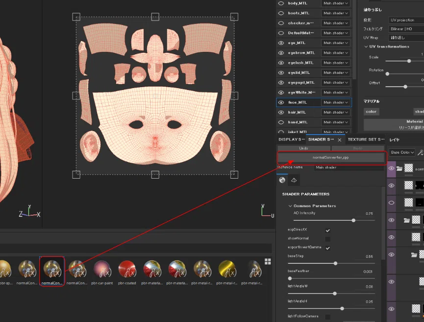
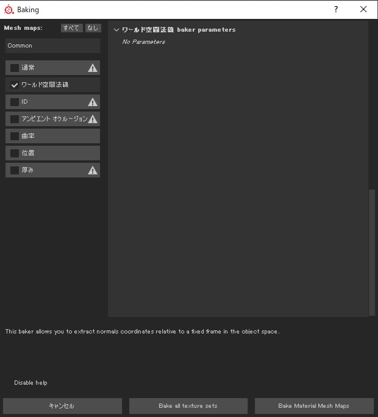

# 绘制法线方法

SubstancePainter向け、ワールド空間に対してペイントした法線情報をタンジェント空間に変換するシェーダーを作成しました。

セルルックモデルの法線編集に使用しています。テクスチャベースのため頂点解像度やトポロジに依存せず法線修正ができるのが良いところだと思います。

SubstanceやGLSLでシェーダーを書くこと自体初めてなので、正しくできているか怪しい部分もあります。間違い等ありましたら訂正いただけると助かります。

## 概要

SubstancePainterのnormalチャンネルにワールドスペースの法線を書き込むことでそれをタンジェントスペースに置き換えて表示します。

確認用にセルシェーディング機能も用意しています。

## Shader

```
import lib-sampler.glsl

const float PI  = 3.141592653589793;
//: param auto world_eye_position
uniform vec3 camera_pos;

//: param auto channel_basecolor
uniform SamplerSparse basecolor_tex;

//: param auto channel_normal
uniform SamplerSparse normal_texture;
//: param auto texture_normal
uniform SamplerSparse base_normal_texture;
//: param auto normal_y_coeff
uniform float base_normal_y_coeff;

//: param auto channel_user0
uniform SamplerSparse user0_tex;


//: param custom {
//:   "default": false,
//:   "label": "expDirectX"
//: }
uniform bool expDirectX;

//: param custom {
//:   "default": true,
//:   "label": "showNormal"
//: }
uniform bool showNormal;

//: param custom {
//:   "default": false,
//:   "label": "exportInvertGamma"
//: }
uniform bool exportInvertGamma;

//: param custom {
//:  "default": 0.5,
//:   "min": 0.0,
//:   "max": 1.0,
//:   "label": "shadepos"
//: }
uniform float shadepos;

//: param custom {
//:   "default": 0.001,
//:   "min": 0.001,
//:   "max": 1.0,
//:   "label": "softness"
//: }
uniform float softness;

//: param custom {
//:   "default": 0.0,
//:   "min": -1.0,
//:   "max": 1.0,
//:   "label": "lightAngleW"
//: }
uniform float lightAngleW;

//: param custom {
//:   "default": 0.0,
//:   "min": -1.0,
//:   "max": 1.0,
//:   "label": "lightAngleH"
//: }
uniform float lightAngleH;

//: param custom {
//:   "default": false,
//:   "label": "lightFollowCamera"
//: }
uniform bool lightFollowCamera;

vec3 normalFade(vec3 normal,float attenuation)
{
 if (attenuation<1.0 && normal.z<1.0)
 {
   float phi = attenuation * acos(normal.z);
   normal.xy *= 1.0/sqrt(1.0-normal.z*normal.z) * sin(phi);
   normal.z = cos(phi);
 }

 return normal;
}

vec3 normalUnpack(vec4 normal_alpha, float y_coeff)
{
 if (normal_alpha.a == 0.0 || normal_alpha.xyz == vec3(0.0)) {
   return vec3(0.0, 0.0, 1.0);
 }

 vec3 normal = normal_alpha.xyz * 2.0 - vec3(1.0);
 normal.y *= y_coeff;
 normal = normalize(normal);

 return normal;
}

vec3 getWorldNormal(V2F inputs)
{
   vec3 worldNormal = normalUnpack(textureSparse(normal_texture, inputs.sparse_coord), -1);
   return worldNormal;
}

dvec3 tangentTransform(V2F inputs,vec3 worldNormal)
{
   dmat3 WorldNormalToTangentNormal = dmat3( inputs.tangent.x , inputs.bitangent.x , inputs.normal.x,
                                          inputs.tangent.y , inputs.bitangent.y , inputs.normal.y,
                                          inputs.tangent.z , inputs.bitangent.z , inputs.normal.z);
   dvec3 tangentNormal = (WorldNormalToTangentNormal) * worldNormal;

   return tangentNormal;
}

dvec3 worldTransform(V2F inputs,dvec3 tangentNormal)
{

   dmat3 TangentNormalToWorldNormal = dmat3( inputs.tangent.x , inputs.tangent.y , inputs.tangent.z,
                                          inputs.bitangent.x , inputs.bitangent.y , inputs.bitangent.z,
                                          inputs.normal.x , inputs.normal.y , inputs.normal.z);
   dvec3 worldNormal = (TangentNormalToWorldNormal) * tangentNormal;

   return worldNormal;
}

dvec3 vectorToColor(dvec3 Vector)
{
   dvec3 outColor = Vector/vec3(2.0)+vec3(0.5);//convertColor

   outColor.y = mix(outColor.y,1.0-outColor.y,expDirectX);

   outColor = mix(outColor,pow(vec3(outColor),vec3(2.2)),exportInvertGamma);

   return outColor;
}

vec3 toon(V2F inputs,dvec3 tangentNormal)
{
   vec3 L = lightFollowCamera ? normalize(camera_pos - inputs.position): vec3(0,0,1);
   mat3 Ry = mat3( cos(lightAngleW * PI),  0,  sin(lightAngleW * PI),
                   0,      1,   0,    
                 -1*sin(lightAngleW * PI), 0,  cos(lightAngleW * PI));

   mat3 Rx = mat3( 1,    0,      0,
                   0, cos(lightAngleH * PI), -1*sin(lightAngleH * PI),    
                   0, sin(lightAngleH * PI),  cos(lightAngleH * PI));

   L = Ry * Rx * L;//transform light vector

   vec3 V = normalize(camera_pos - inputs.position);

   vec3 baseColor = getBaseColor(basecolor_tex, inputs.sparse_coord).rgb;
   //vec3 shadeColor = textureSparse(user0_tex,  inputs.sparse_coord).rgb;
   vec3 shadeColor = getBaseColor(user0_tex,  inputs.sparse_coord).rgb;
   shadeColor = pow(shadeColor,vec3(2.2));

   //transformTangentNormalToWorldNormal
   dvec3 worldNormal = worldTransform(inputs,tangentNormal);

   double halfLambert = dot(worldNormal,L)*0.5+0.5;//halfLambert
   float lightArea = float(1.0 -( (halfLambert - shadepos + softness) / softness));
   lightArea = clamp( lightArea, 0.0, 1.0 );//clamping 0 to 1
   vec3 finalColor = mix(baseColor ,shadeColor ,lightArea); // Final Color

   return finalColor;
}

void shade(V2F inputs)
{
   vec3 worldNorm = getWorldNormal(inputs);
   dvec3 tangentNorm = tangentTransform(inputs,worldNorm);
   dvec3 tangentNorm_color = vectorToColor(tangentNorm);
   
   vec3 toon = toon(inputs,tangentNorm);

   vec3 outputColor = mix( toon,vec3(tangentNorm_color) ,showNormal);

   emissiveColorOutput(vec3(outputColor));
   alphaOutput(1.0);
}
```

ところでuser0のテクスチャを読む際にガンマがかかった状態で読み込まれてしまうのはなぜなんだろう...。

## 使い方

**・導入方法**

上記Shaderコードを、.glslもしくは.fragという拡張子で保存し、substancePainterにドラッグアンドドロップしてください。

shaderとして読み込まれるのを確認し、シェルフかプロジェクトに読み込んでください。


読み込んだShaderをShaderSettingsウィンドウのシェーダーセット欄(下図)にドラッグしてください。



**・チャンネル設定**

使用するチャンネルは次になります。

 \- Base Color [sRGB8] : トゥーン表示時のライトが当たった部分の色味を定義します。

 \- user0 [sRGB8] : トゥーン表示時の影部分の色味を定義します。

 \- normal [RGB16F or RGB32F] : ワールドスペースで法線をペイントするチャンネルです。後述のノイズ問題の精度を上げるため32bitが推奨です。


## 手順

前述のシェーダーの割り当て、チャンネルの設定が済んでいるものとします。

1.Bake Mesh Mapsからワールド空間法線を書き出しておきます。



2.新規塗りつぶしレイヤーのNormalチャンネルに書き出したワールドノーマルを張り付け、マテリアルビューでよく見るノーマルマップ色(R:0.5,G:0.5,B:1.0)になっているかを確認してください。


3.あとはNormalチャンネルに思いっきりペイントをしていくだけです。

先ほど書き出したワールドノーマルテクスチャを参考に、ワールド空間に対してどちらに向いてほしいかをペイントしていきます。

後から微調整しやすいよう、塗りつぶしレイヤーを使うといいですよ。

＊一つだけ、Normalの合成方法は、デフォルトだとMMdt(Normal map detail)になっているかと思います。こちらを通常の合成にしないと正しく合成できません。


いっそ方向が分かりやすいように球などを一緒に読み込んでしまうのもありかもしれません。

**・書き出し方**

テクスチャの書き出しはFile > Export Textures のConfigを2D Viewにして行います。書き出し時にはノーマルが見えるよう、シェーダーのshowNormalにチェックを入れてください。

Ditheringは外しておくことをお勧めします。


## パラメーター解説


・expDirectX : DirectX向けのノーマルに変換します。

・showNormal : ノーマルを表示するモードです。ここがオフの場合にはトゥーンプレビューになります。

・exportinvertGamma : 2D Viewからの書き出し時に自動でガンマ補正がかかってしまうようでして、こちらを相殺するために逆ガンマをかけるオプションになります。

・lightAngleW : トゥーン表示時に横方向のライトの回転を行います。

・lightAngleH : トゥーン表示時に縦方向のライトの回転を行います。

・shadepos : トゥーン表示時の影の位置です。

・softness : トゥーン表示の陰影のグラデのかかり具合の制御用です。

## Tips

・読み込むモデルは、あらかじめDCCツール上で三角形化しておくと良いです。四角形をどの方向に切るかがDCCツールと異なる場合、書き出した法線マップを当ててもきれいに表示されません。

## 既知の問題点

法線計算の際の精度の問題か、少々ノイズが残ります。ライトの向きの変わり目にちらちらと一瞬ですがノイズが現れます。


Normalチャンネルを32Bitで計算することで多少軽減されます。

現状完全には消し切れておりません。


以上です。何か思いついたらまた投稿します。

