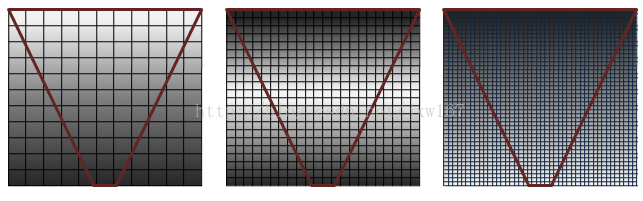
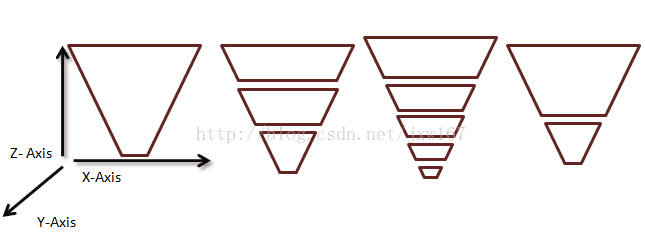
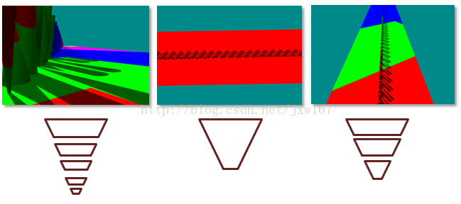
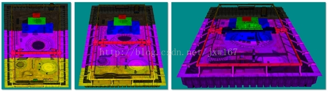
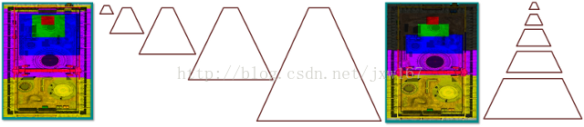
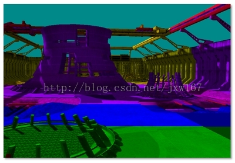
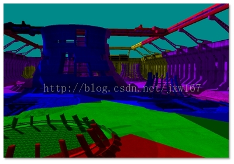
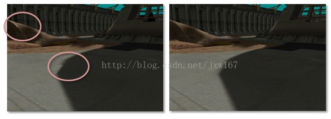

# CSM

文中涉及到的源代码可以在DirectX Software Development Kit (SDK) in the CascadedShadowMaps11 and VarianceShadows11 samples找到，感兴趣的同学可以自行下载。

CSM的基本概念很容易理解， 相机平截头体的不同区域需要具有不同分辨率的阴影贴图，距离眼睛最近的物体比较远的物体需要更高

的分辨率。 事实上，当眼睛移动非常接近几何时，最接近眼睛的像素可能需要如此大的分辨率，甚至4096×4096的阴影贴图也不够。

CSM的基本思想是将截头锥体分割成多个截头圆锥体。 为每个子树呈现阴影贴图; 像素着色器然后从最接近匹配所需分辨率的地图采样，

如下图所示：



 在图1中，品质显示（从左到右）从最高到最低， 表示阴影图的一系列网格，具有截头锥体（反向锥体为红色），显示了

像素覆盖率如何受到不同分辨率阴影贴图的影响。 阴影是质量最高的（白色像素），当比例为1：1的比例时，将光线中的像素映

射到阴影贴图中的纹素。 当多个像素映射到相同的阴影纹素时，透视混叠以大的、块状的纹理贴图（左图）的形式发生。 

阴影贴图太大时，将被采样。 如下图所示：


 图2显示了图1中每个阴影贴图中最高质量部分的切口。具有最紧密放置的像素（在顶点处）的阴影贴图最接近摄像机。 

在技术上，这些是相同大小的地图，白色和灰色用于举例说明级联阴影贴图的成功， 白色是理想的，因为它显示了良好的覆

盖率 - 视空间像素和阴影贴图纹素的1：1比例。

 CSM需要每帧执行以下步骤：

 1、将截锥体分成子块。
2、计算每个子视锥体的正投影。
3、为每个子视锥体渲染一个阴影贴图。
4、渲染场景
a. 绑定阴影贴图和渲染。
b. 顶点着色器执行以下操作： 计算每个灯光的纹理坐标（除非在像素着色器中计算所需的纹理坐标）  ->   转换灯光顶点，依此类推。
c. 像素着色器执行以下操作：确定正确的阴影贴图  ->  必要时转换纹理坐标  ->  处理灯光

下面介绍如何分割视锥体，分割截锥体是创建子视锥体的行为， 用于分割平截头体的一种技术是计算Z方向从零百分之一百的间隔。

 每个间隔然后表示作为Z轴的百分比的近平面和远平面。


在实际操作中，重新计算每帧的平截头体分裂会导致阴影边缘闪烁。 普遍接受的做法是使用每个场景的静态级联间隔集。 在这种情况下，沿Z轴的间隔用于描述在分割截头锥体时发生的子结点， 确定给定场景的正确大小间隔取决于几个因素。

相对于场景几何，相机方向影响级联间隔选择。 例如，非常靠近地面的相机，例如足球游戏中的地面摄像机，具有与天空中的照相机不同的静态级联间隔。

图4，显示一些不同的摄像机及其各自的分区。 当场景的Z范围非常大时，需要更多的分割平面。 例如，当眼睛非常靠近地平面，但是遥远的物体仍然可见时，可能需要多个级联。 分割平截头体，使得眼睛附近更多的分裂（透视混叠正在改变最快）也是有价值的。 当大多数几何结构被集成到视锥体的小部分（例如俯视图或飞行模拟器）中时，需要更少的级联。

效果如下所示：



 左边，当几何在Z中具有高动态范围时，需要大量的级联。 （中心）当几何在Z中具有低动态范围时，多个平截头体几乎没有任何好处。 

（右）当动态范围为中等时，只需要三个分区。

每个级联的投影矩阵紧密地配合在其相应的圆锥上， 在视场摄像机和光方向正交的配置中，级联可以紧密配合，几乎没有重叠。 光和

摄像机移动成平行对准时，重叠变大（图5）。 当光和摄像机几乎平行时，它被称为“断层”，对于大多数阴影算法来说，这是一个很难的

场景。 限制光和相机是不常见的，以便不会发生这种情况。 然而，CSM在这种情况下表现比许多其他算法好得多。



 许多CSM实现使用固定大小的截头圆锥体， 当平截头体以固定大小的间隔分割时，像素着色器可以使用Z深度索引到级联阵列。

 一旦选择了截头锥体间隔，就可以使用以下两种方法之一创建子视锥体：适合场景并适合级联。

 所有的截头圆锥体都可以用相同的近平面创建。 这迫使级联重叠。 CascadedShadowMaps11示例调用此技术适合场景。 

 或者，可以使用实际的分区间隔作为近平面和远平面来创建截头圆锥体， CascadedShadowMaps11示例调用此技术适合级联。

 这两种方法如图所示，适合级联浪费较少的分辨率。 适合级联的问题是正投影基于视锥体的方向而生长和收缩。 适合场景技术

通过视角平截头体的最大尺寸来消除正视投影，从而消除视角相机移动时出现的伪影。 改进阴影深度的常见技巧地图解决了在“以纹理

大小增量移动光”部分中的光线移动时出现的伪影。



 CascadedShadowMaps11示例将阴影贴图呈现为一个大的缓冲区。 这是因为PCF上的纹理数组是一个Direct3D 10.1功能。 对于

每个级联，创建一个视口，其涵盖对应于该级联的深度缓冲区的部分。 零像素着色器被绑定，因为只需要深度。 最后，为每个级联设置

正确的视口和阴影矩阵，因为深度图一次一个地渲染到主影子缓冲区中。

 包含阴影的缓冲区现在绑定到像素着色器。 有两种选择CascadedShadowMaps11示例中实现的级联的方法。 这两种方法用着色器代码解释。




 顶点着色器计算顶点的世界空间中的位置。

```
Output.vDepth = mul( Input.vPosition, m_mWorldView ).z; 
```

像素着色器接受的插值深度：

```
fCurrentPixelDepth = Input.vDepth; 
```

 CASCADE_COUNT_FLAG指定级联数。 m_fCascadeFrustumsEyeSpaceDepths_data约束视图截头锥分区。 比较后，

fComparison包含当前像素大于屏障的值1，当级联较小时为0。 点积将这些值合并到数组索引中。

```
float4 vCurrentPixelDepth = Input.vDepth; 
float4 fComparison = ( vCurrentPixelDepth > m_fCascadeFrustumsEyeSpaceDepths_data[0]); 
float fIndex = dot(float4(CASCADE_COUNT_FLAG > 0, CASCADE_COUNT_FLAG > 1, CASCADE_COUNT_FLAG > 2, CASCADE_COUNT_FLAG > 3) , fComparison ); 
fIndex = min( fIndex, CASCADE_COUNT_FLAG ); 
iCurrentCascadeIndex = (**int**)fIndex; 
```

 一旦级联被选中，纹理坐标必须被转换成正确的级联。

```
vShadowTexCoord = mul( InterpolatedPosition, m_mShadow[iCascadeIndex] ); 
```

然后使用该纹理坐标用X坐标和Y坐标对纹理进行采样。 Z坐标用于进行最终的深度比较。 

基于地图的选择针对级联进行测试，以找到涵盖特定像素的最紧密的地图。 顶点着色器不是计算世界空间中的位置，而是计算每个级联的视图空间位置。 像素着色器遍历级联，以便缩放和移动纹理坐标，以便它们对当前级联进行索引。 然后根据纹理边界测试纹理坐标。 当纹理坐标的X和Y值落在级联中时，它们用于对纹理进行采样。 Z坐标用于进行最终的深度比较。



 基于间隔的选择比基于地图的选择要快一些，因为级联选择可以直接完成。 基于地图的选择必须与纹理坐标与级联边界相交。
当阴影贴图完美对齐时，基于地图的选择会更有效地使用级联。

 VSM（后面文章讲解）和过滤技术（如PCF）可以与低分辨率CSM一起使用来产生柔和的阴影。 不幸的是，由于分辨率不匹

配，这会在层叠层之间产生可见的接缝。 解决方案是在阴影映射之间创建一个带，其中对两个级联执行阴影测试。 然后，

着色器基于混合频带中的像素位置在两个值之间线性内插。 样本CascadedShadowMaps11和VarianceShadows11提供了一个GUI滑块，

可用于增加和减少此模糊区域。 着色器执行动态分支，使得绝大多数像素仅从当前级联读取。

