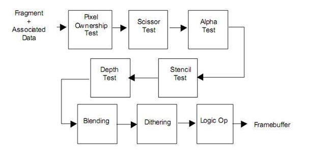
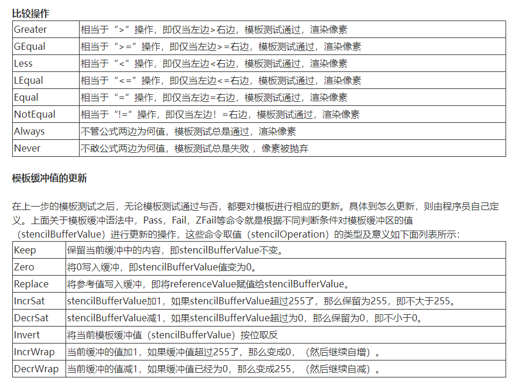

# 模板测试

## **模板测试概要**

stencil与颜色缓冲区和深度缓冲区类似，模板缓冲区可以为屏幕上的每个像素点保存一个无符号整数值(通常的话是个8位整数)。这个值的具体意义视程序的具体应用而定。在渲染的过程中，可以用这个值与一个预先设定的参考值相比较，根据比较的结果来决定是否更新相应的像素点的颜色值。这个比较的过程被称为模板测试。模板测试发生在透明度测试（alpha test）之后，深度测试（depth test）之前。如果模板测试通过，则相应的像素点更新，否则不更新。图形渲染管线中，基于单个像素的测试操作的顺序如下图



模板测试语法

一般来说，stencil完整语法格式如下：

```
stencil｛
	Ref referenceValue
	ReadMask  readMask
	WriteMask writeMask
	Comp comparisonFunction
	Pass stencilOperation
	Fail stencilOperation
	ZFail stencilOperation
｝
```

**Ref**

```
Ref referenceValue
```

Ref用来设定参考值referenceValue，这个值将用来与模板缓冲中的值进行比较。referenceValue是一个取值范围位0-255的整数。

**ReadMask**

```
ReadMask  readMask
```

ReadMask 从字面意思的理解就是读遮罩，readMask将和referenceValue以及stencilBufferValue进行按位与（&）操作，readMask取值范围也是0-255的整数，默认值为255，二进制位11111111，即读取的时候不对referenceValue和stencilBufferValue产生效果，读取的还是原始值。

**WriteMask**

```
WriteMask writeMask
```

WriteMask是当写入模板缓冲时进行掩码操作（按位与【&】），writeMask取值范围是0-255的整数，默认值也是255，即当修改stencilBufferValue值时，写入的仍然是原始值。

**Comp**

```
Comp comparisonFunction
```

Comp是定义参考值（referenceValue）与缓冲值（stencilBufferValue）比较的操作函数，默认值：always

**Pass**

```
Pass stencilOperation
```

Pass是定义当模板测试（和深度测试）通过时，则根据（stencilOperation值）对模板缓冲值（stencilBufferValue）进行处理，默认值：keep

**Fail**

```
Fail stencilOperation
```

Fail是定义当模板测试（和深度测试）失败时，则根据（stencilOperation值）对模板缓冲值（stencilBufferValue）进行处理，默认值：keep

**ZFail**

```
ZFail stencilOperation
```

ZFail是定义当模板测试通过而深度测试失败时，则根据（stencilOperation值）对模板缓冲值（stencilBufferValue）进行处理，默认值：keep

Comp，Pass,Fail 和ZFail将会应用给背面消隐的几何体（只渲染前面的几何体），除非Cull Front被指定，在这种情况下就是正面消隐的几何体（只渲染背面的几何体）。你也可以精确的指定双面的模板状态通过定义CompFront，PassFront，FailFront，ZFailFront（当模型为front-facing geometry使用）和ComBack，PassBack，FailBack，ZFailBack（当模型为back-facing geometry使用）

**模板测试判断依据**

和深度测试一样，在unity中，每个像素的模板测试也有它自己一套独立的依据，具体公式如下：

```
if（referenceValue&readMask comparisonFunction stencilBufferValue&readMask）
通过像素
else
抛弃像素
```

在这个公式中，主要分comparisonFunction的左边部分和右边部分

referenceValue是有Ref来定义的，这个是由程序员来定义的，readMask是模板值读取掩码，它和referenceValue进行按位与（&）操作作为公式左边的结果，默认值为255，即按位与（&）的结果就是referenceValue本身。

stencilBufferValue是对应位置当前模板缓冲区的值，同样与readMask做按位掩码与操作，结果做为右边的部分

comparisonFunction比较操作通过Comp命令定义，公式左右两边的结果将通过它进行判断，其取值及其意义如下面列表所示。



在更新模板缓冲值的时候，也有writeMask进行掩码操作，用来对特定的位进行写入和屏蔽，默认值为255（11111111），即所有位数全部写入，不进行屏蔽操作。

举个如下的例子：

```
stencil｛
	Ref 2
	Comp always
	Pass replace
｝
```

在上面的代码中，第一行Ref 2这行将referenceValue定义为2；

第二行中，Comp命令后的参数是always，此时我们不管stencilBufferValue为多少，模板测试都是成功通过的；

而第三行中，Pass replace的意思是，当模板测试通过则将referenceValue替换给stencilBufferValue，此时stencilBufferValue值为2，因此上面的例子功能相当于将stencilBufferValue刷新为2；

**小结**

上面说了这么多，主要的重点如下

- 使用模板缓冲区最重要的两个值：当前模板缓冲值（stencilBufferValue）和模板参考值（referenceValue）
- 模板测试主要就是对这个两个值使用特定的比较操作：Never，Always，Less ，LEqual，Greater，Equal等等。
- 模板测试之后要对模板缓冲区的值（stencilBufferValue）进行更新操作，更新操作包括：Keep，Zero，Replace，IncrSat，DecrSat，Invert等等。
- 模板测试之后可以根据结果对模板缓冲区做不同的更新操作，比如模板测试成功操作Pass，模板测试失败操作Fail，深度测试失败操作ZFail，还有正对正面和背面精确更新操作PassBack，PassFront，FailBack等等。

使用一个模板区域来控制另外物体的渲染例子

这个实例需要两个shader实现，如上面的那个用来限制区域的box所使用的shader中的关键代码：

```
ColorMask 0
ZWrite Off
Stencil｛
	Ref 1
	Comp Always
	Pass Replace
｝
```

上面这段代码中，ColorMask 0作用是屏蔽颜色的输出，即不输出颜色到屏幕。ZWrite Off用来关闭深度写入，防止深度测试中后面的角色的像素被剔除掉；在stencil中 Ref 1将referenceValue设置成1，Comp Always 保证模板测试始终通过，Pass Replace 操作则将stencilBufferValue刷新为1；即这段代码的功能是在屏幕上对应模型的位置不输入任何颜色，而将对应位置的模板缓冲值刷新为1；

接下来需要在角色使用的shader中添加如下关键代码：

```
Stencil ｛
      Ref 1
      Comp Equal
｝
```

上面这段代码中，Ref 1将referenceValue设置成1，在接下来的一行代码中，Comp Equal的意思是，如果referenceValue=stencilBufferValue，则模板测试通过，渲染像素，否则抛弃；在这个例子中，由于屏幕中的像素默认的模板值（stencilBufferValue）为0（我猜的，貌似是正确的哈）而参考值referenceValue为1，所以正常情况下使用这个shader的模型是不显示的，但是在使用了第一个shader的box区域，由于stencilBufferValue被刷新为1，所以在这个区域中，角色是能够显示的。

https://zhuanlan.zhihu.com/p/667451775

## 理解

什么是模板缓存？

在渲染平面上，每个像素都存有一个模板值（0-255，一个字节）。打个比方，屏幕好比一块活字印刷版，像素好比字，模板值好比是啥字。这样我们就可以通过改变模板的值，来渲染制定区域的像素。比如下图中，我们设定中间区域的模板值为1，然后只渲染模板为1的区域。


下图中，“模板测试”指模板缓存值（stencil buffer）与你自定义的参考值（Ref）的比较结果。在传统PC渲染流水线（手机平台可能略有不同）中，模板测试是在深度测试（ZTest）之前的，没有通过模板测试的像素就会被舍弃不渲染，甚至直接跳过ZTest。


**2. 语法：**

要加模板测试，就在Shader的Pass开头写Stencil{ }[结构体](https://zhida.zhihu.com/search?q=结构体&zhida_source=entity&is_preview=1)。如果每个Pass都用，则可以提到外面。

还是举个栗子吧：


*Ref 2*：设置参考值。除了2，还可以设置0-255的任意数。

*Comp equal*：表示通过模板测试的条件。这里只有等于2的像素才算通过测试。除了equal，还有Greater、Less、Always、Never等，类似ZTest。

*Pass keep*：表示通过模板测试和Z测试（注意是都通过）的像素，怎么处置它的模板值，这里我们保留它的模板值。除了keep，还有Replace，IncrWrap（循环自增1，超过255为0），IncrSat（自增1，超过255还是255），DecrWrap，DecrSat等。

*Fail decrWrap*：表示没通过模板测试的像素, 怎么处置它的模板值。这里为循环自减。

*ZFail keep*：表示通过了模板测试但没通过Z测试的像素，怎么处置它的模板值。这里为保持不变。

除此之外，还有ReadMask和WriteMask语法，用来提取Ref值或模板缓存的某几位，默认是255，全部提取。

好了，语法就这么多，是不是很精简！不信请查阅Unity官方文档，搜Stencil即可。


**3. 应用例子：**

画红绿蓝三个红球，目标是在红绿交界且被平面挡住的部分画出蓝球。官网效果如下：


蓝色部分貌似在平面下面，其实是在平面上面的，是不是很神奇！请看分解：


## *第一步画红球：*

```text
Shader "Red" {  
    SubShader {  
        Tags { "RenderType"="Opaque" "Queue"="Geometry"}
        Pass {  
            Stencil {  
                Ref 2                     //参考值为2，stencilBuffer值默认为0  
                Comp always               //stencil比较方式是永远通过  
                Pass replace              //pass的处理是替换，就是拿2替换buffer 的值  
                ZFail decrWrap            //ZFail的处理是溢出型减1  
            }  
        // stencil和Zbuffer都通过的话就执行。把点渲染成红色。  
            CGPROGRAM  
            #pragma vertex vert  
            #pragma fragment frag  
            struct appdata {  
                float4 vertex : POSITION;  
            };  
            struct v2f {  
                float4 pos : SV_POSITION;  
            };  
            v2f vert(appdata v) {  
                v2f o;  
                o.pos = mul(UNITY_MATRIX_MVP, v.vertex);  
                return o;  
            }  
            half4 frag(v2f i) : SV_Target {  
                return half4(1,0,0,1);  
            }  
            ENDCG  
        }  
    }
}  
```


平面以上的点，通过了模板测试和深度测试，则模板值。在平面下面的半球，通过stencil测试但没通过深度测试，stencil值减一为255。


## *第二步画绿球：*

```text
Shader "Green" {  
    SubShader {  
        Tags { "RenderType"="Opaque" "Queue"="Geometry+1"}  //渲染次序为Geometry+1，在红球之后  
        Pass {  
            Stencil {  
                Ref 2                 //参考值为2  
                Comp equal            //stencil比较方式是相同，只有等于2的才能通过  
                Pass keep           //stencil和Zbuffer都测试通过时，选择保持  
                Fail decrWrap        //stencil没通过，选择溢出型减1，所以被平面挡住的那层stencil值就变成254  
                ZFail keep           //stencil通过，深度测试没通过时，选择保持  
            }  

            CGPROGRAM  
            #pragma vertex vert  
            #pragma fragment frag  
            struct appdata {  
                float4 vertex : POSITION;  
            };  
            struct v2f {  
                float4 pos : SV_POSITION;  
            };  
            v2f vert(appdata v) {  
                v2f o;  
                o.pos = mul(UNITY_MATRIX_MVP, v.vertex);  
                return o;  
            }  
            half4 frag(v2f i) : SV_Target {  
                return half4(0,1,0,1);  
            }  
            ENDCG  
        }  
    }
}  
```


还记得红球的上半部是2吗？绿球与这部分相交的部分就通过了模板测试。不管怎么移动绿球，只渲染与红球上半部分相交的区域。

另外注意，红球下半区域与绿球的交界处的模板值已经变成了254，成为接下来蓝球的绘制区域。


## *第三步画蓝球：*

```text
Shader "Blue" {  
    SubShader {  
        Tags { "RenderType"="Opaque" "Queue"="Geometry+2"}  //渲染次序为Geometry+2,在前面两个shader之后  
        Pass {  
            Stencil {  
                Ref 254            //参考值为254  
                Comp equal         //比较方式是是否相等,即只会渲染
            }  

            CGPROGRAM  
            #pragma vertex vert  
            #pragma fragment frag  
            struct appdata {  
                float4 vertex : POSITION;  
            };  
            struct v2f {  
                float4 pos : SV_POSITION;  
            };  
            v2f vert(appdata v) {  
                v2f o;  
                o.pos = mul(UNITY_MATRIX_MVP, v.vertex);  
                return o;  
            }  
            half4 frag(v2f i) : SV_Target {  
                return half4(0,0,1,1);  
            }  
            ENDCG  
        }  
    }
}  
```

蓝球限定了只有模板值为254的区域能通过测试，因此蓝球只渲染254且也通过了ZTest的部分。也就说图中的蓝色区域是在白色平面上面的。下图为蓝球从上往下移的过程。

