本文的修改都上传github了，对应下图的提交记录：

##### 一、前言
###### 1.1 背景

这篇文章本来是打算写多光源的，但是我在计算多光源的时候，想在Light Pass里读取物体的轴心点来做一些效果（具体是什么效果我先卖个关子，还请等我多光源的文章）。

在Light Pass里我们是读不到物体的轴心点的，不过想解决也不难，之前我们创建了ToonBufferA、B、C，目前我就用了ToonBufferA，把物体的轴心点写进ToonBufferB或者C就行。但是，这样写的话非常浪费，一个物体只有一个轴心点，这么低频的信息往根本没必要逐像素地写入Buffer里。（而且物体轴心点数据是世界空间坐标，至少得用16位float3来写，非常浪费）
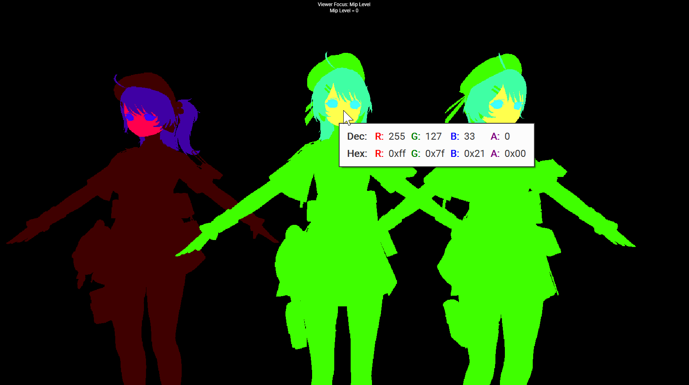
>这里我用之前写的ID图来做示例，大多数像素写的都是相同的值，造成大量浪费

那么怎么让我们减少写入轴心点这种PerObject数据的带宽了？我的想法是这样的，创建一张Texture，然后使用Computer Shader往Texture的每一个像素写入一个Toon物体的轴心点。

其实也可以不用写Texture，用类似PerInstance Custom Data的方法，把轴心点作为一个Buffer传递给Light Pass就行，但是由于惯性思维，我一开始想到的就是把一张屏幕分辨率的Texture优化为一张以Actor数量为分辨率的Texture，现在写Texture的方法我都实现完了，也就懒得再改为写Buffer的方法。
###### 1.2 大致实现思路

>大致架构

我创建了一个ToonActorComponent，里面保存着ID和Pivot属性，和ToonActorComponent相对应的，在渲染线程下创建一个ToonActorProxy，同样也保存着ID和Pivot属性。

在FScene下维护一个ToonActorProxy的列表，把ID和Pivot属性存为一个Structured Buffer里发送给ToonActorTextureCS。ToonActorTextureCS读取Buffer，把ID作为UV值把Pivot写入对应像素里。

我们还需要找个办法采样这张ToonActorTexture，之前我们在ToonBuffer里写入了一个叫objectID的东西，刚好可以用这个ID作为Texture的Index。因此，我们需要确保ToonActorProxy的ID和ObjectID一致。

创建一个ToonActorComponent挂载在ToonActorBase下，这是一个抽象类，真正可以实例化的ToonActor的实现我放在Plugin里，方便你们如果觉得我实现得不好的话可以去改。

然后就是ToonActorManager，它维护了场景中所有ToonActor的列表，将ToonActor在列表中的Index作为ToonActor的ID。

看起来实现得花里胡哨的，其实很多东西我都没做，比如ToonActorTexture的分辨率我固定为16x16，最多支持255个Actor...
###### 1.3 Computer Shader基础知识

关于Computer Shader的已经有很多人写过非常优秀的文章了，所以我就不在关公门前耍大刀了，这只里贴出几篇文章链接给大家作为参考。

如果你没写过Computer Shader，你需要搞清楚Computer Shader的线程组、各种ID的区别，非常推荐你看一下江荣大佬的这篇文章：
【Unity】Compute Shader的基础介绍与使用：https://zhuanlan.zhihu.com/p/368307575
这篇文章非常详细的介绍了核函数、线程组、各种ID、StructuredBuffer等基础概念。

如果你想看一些Computer Shader的使用案例，建议从remo大佬的Compute Shader学习笔记看起：
Compute Shader学习笔记（一）：https://zhuanlan.zhihu.com/p/699253914
他的这个系列由浅到深，从用computer shader画圆，给GPU传递数据，从GPU获取数据这些基础操作开始，后面又扩展到后处理、粒子、草地等，是非常不错的参考。

除此之外，这个仓库：https://github.com/cinight/MinimalCompute里也有很多computer shader的使用案例，看看一些有意思的使用案例，有利于各位激发脑洞，举一反三。

如果你想在UE上实现computer shader，可以看看下面这些文章：
https://dev.epicgames.com/community/learning/tutorials/WkwJ/unreal-engine-simple-compute-shader-with-cpu-readback
https://zhuanlan.zhihu.com/p/279556619
这些文章通过插件的形式实现了computer shader。

本文则是通过修改UE源码的形式来实现computer shader，希望也可以作为你的参考。

##### 二、实现

###### 2.1 简易Computer Shader模板


> CopyDepthTextureCS.usf

UE源码里面有一个Computer Shader：`FViewDepthCopyCS` ，就是上图贴出来的这个，是不是超级简单，正常适合我们抄一抄作为一个模板来用。

在Engine/Source/Runtime/Renderer/Private/Toon/下创建ToonActorTexture.h和ToonActorTexture.cpp。
ToonActorTexture.h非常简单：


接下来是ToonActorTexture.cpp：
``` c
// ----------------------------------YK Engine Start-----------------------------------------
#include "ToonActorTexture.h"
#include "ScenePrivate.h"
#include "DataDrivenShaderPlatformInfo.h"

class FToonActorTextureCS : public FGlobalShader
{
	DECLARE_GLOBAL_SHADER(FToonActorTextureCS)
		SHADER_USE_PARAMETER_STRUCT(FToonActorTextureCS, FGlobalShader)

		BEGIN_SHADER_PARAMETER_STRUCT(FParameters, )
		SHADER_PARAMETER_RDG_TEXTURE_UAV(RWTexture2D<float4>, RWTarget)
		SHADER_PARAMETER_STRUCT_REF(FViewUniformShaderParameters, View)
		END_SHADER_PARAMETER_STRUCT()

		using FPermutationDomain = TShaderPermutationDomain<>;

	static bool ShouldCompilePermutation(const FGlobalShaderPermutationParameters& Parameters)
	{
		return IsFeatureLevelSupported(Parameters.Platform, ERHIFeatureLevel::SM5);
	}

	static int32 GetGroupSize()
	{
		return 8;
	}

	static void ModifyCompilationEnvironment(const FGlobalShaderPermutationParameters& Parameters, FShaderCompilerEnvironment& OutEnvironment)
	{
		FGlobalShader::ModifyCompilationEnvironment(Parameters, OutEnvironment);
		OutEnvironment.SetDefine(TEXT("THREADGROUP_SIZE"), GetGroupSize());
	}
};

IMPLEMENT_GLOBAL_SHADER(FToonActorTextureCS, "/Engine/Private/Toon/ToonActorTextureCS.usf", "MainCS", SF_Compute);

FToonActorTextureCS::FParameters* GetToonActorTexturePassParameters(FRDGBuilder& GraphBuilder, FScene* Scene, FViewInfo& View, FSceneTextures& SceneTextures)
{
	
	FRDGTextureRef Target = SceneTextures.Color.Target;
	
	FToonActorTextureCS::FParameters* PassParameters = GraphBuilder.AllocParameters<FToonActorTextureCS::FParameters>();
	PassParameters->View = View.ViewUniformBuffer;
	PassParameters->RWTarget = GraphBuilder.CreateUAV(Target);

	return PassParameters;
}

void AddToonActorTextureCSPass(FRDGBuilder& GraphBuilder, FScene* Scene,FViewInfo& View, FSceneTextures& SceneTextures)
{
	FToonActorTextureCS::FPermutationDomain PermutationVector;
	TShaderRef<FToonActorTextureCS> ComputeShader = View.ShaderMap->GetShader<FToonActorTextureCS>(PermutationVector);
	
	FToonActorTextureCS::FParameters* PassParameters = GetToonActorTexturePassParameters(GraphBuilder, Scene, View, SceneTextures);
	
	FComputeShaderUtils::AddPass(
		GraphBuilder,
		RDG_EVENT_NAME("CreateToonActorTexture"),
		ComputeShader,
		PassParameters,
		FComputeShaderUtils::GetGroupCount(FIntVector(256, 256, 1), FToonActorTextureCS::GetGroupSize()));
}

// ----------------------------------YK Engine End-------------------------------------------
```

然后在Engine/Shaders/Private/Toon创建ToonActorTextureCS.usf：
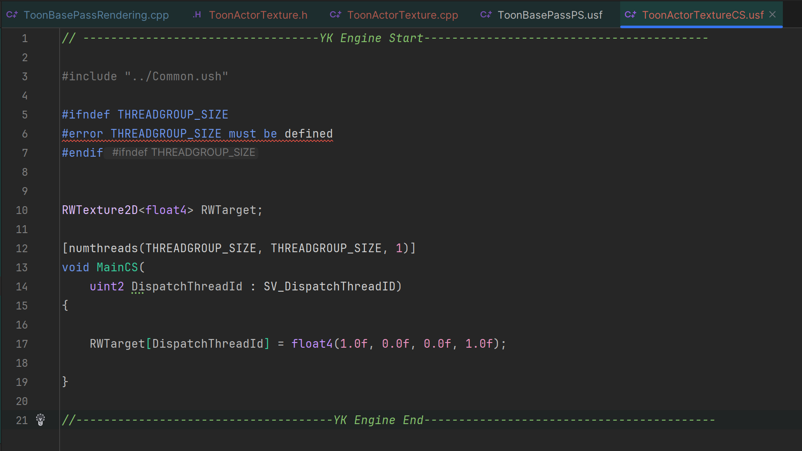

最后，在ToonBasePass后面绘制我们的ToonActorTexturePass：

> ToonBasePassRendering.cpp

上面代码的结果是在屏幕左上角绘制一个红色的方块，如果看到这个结果，说明我们的computer shader已经正确绘制了。
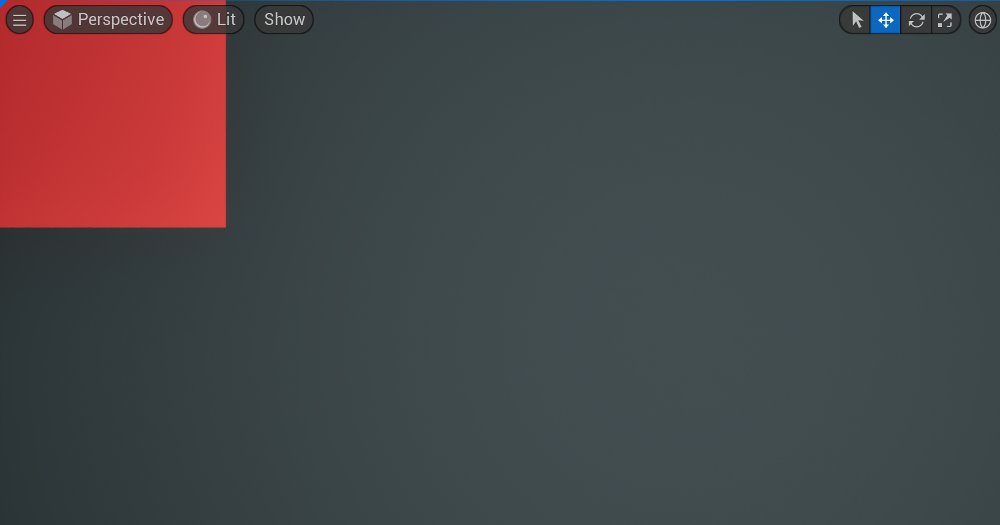

###### 2.2 添加ToonActorComponent

虽然在前言里我说的是把Actor的轴心点传给Light Pass，但我实际上想传给Light Pass的是角色的中心点。一般模型制作的时候会把轴心点用到角色的脚下，并不会放在身体中间，所以我们需要找个地方把Actor的中心点给存储起来。
所以我打算创建一个ToonActorComponent的东西，用于存放Actor的中心点和ID，以后如果有其他想保存在Toon Actor上的信息，都可以塞到这里。

在Engine/Source/Runtime/Engine/Classes/Components下创建ToonActorComponent.h：
它的成员变量主要是就两个东西：ToonActorID、PivotOffset
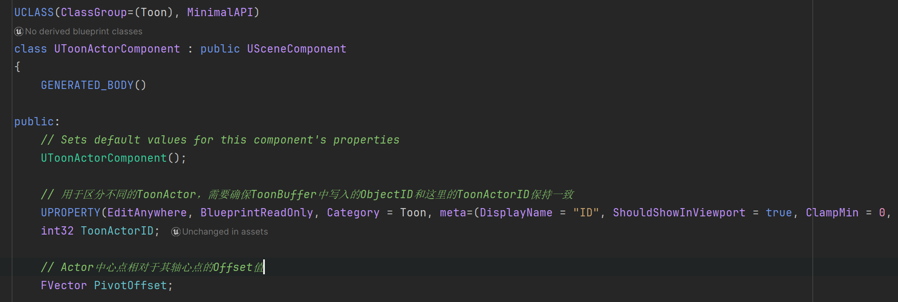

正如`ULightComponent`在渲染线程中有一份对应：`FLightSceneProxy`，我也给`ToonActorComponent`创建一份渲染线程的对应：`ToonActorProxy`。
在Engine/Source/Runtime/Engine/Public下创建ToonActorProxy.h：
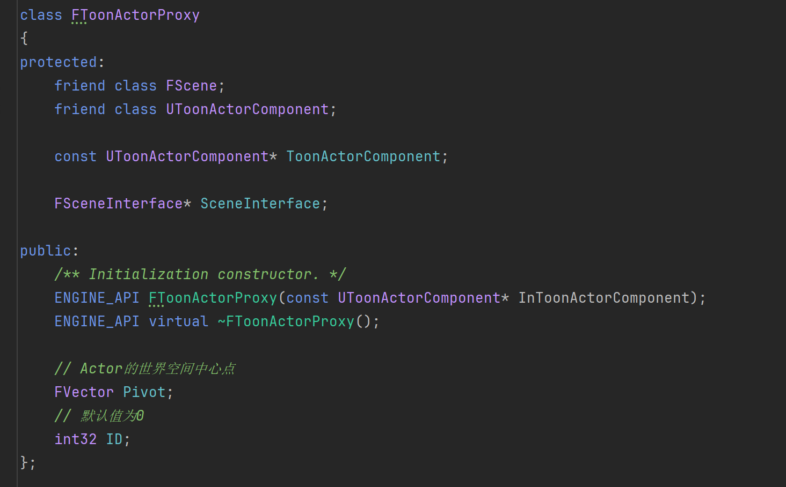

在ToonActorComponent里存一份Proxy的指针，同时也加上一些成员变量Get和Set的方法。

> ToonActorComponent.h

```c++
void UToonActorComponent::SetID(int32 NewValue)
{
	if (AreDynamicDataChangesAllowed()
		&& ToonActorID != NewValue)
	{
		ToonActorID = NewValue;
		MarkRenderStateDirty();
	}
}

int32 UToonActorComponent::GetID() const
{
	return ToonActorID;
}

bool UToonActorComponent::SetPivot(const FVector& NewValue, bool bWorldSpace)
{
	const FVector NewPivotOffset = bWorldSpace ? NewValue - GetComponentLocation() : NewValue;
	if (AreDynamicDataChangesAllowed()
		&& NewPivotOffset != PivotOffset)
	{
		PivotOffset = NewPivotOffset;
		MarkRenderStateDirty();
		return true;
	}

	// ActorCenter没有发生改变
	return false;
}

FVector UToonActorComponent::GetPivot(bool bWorldSpace) const
{
	return bWorldSpace ? GetComponentLocation() + PivotOffset : PivotOffset;
}

```

FScene里维护一个ToonActorProxy的列表：
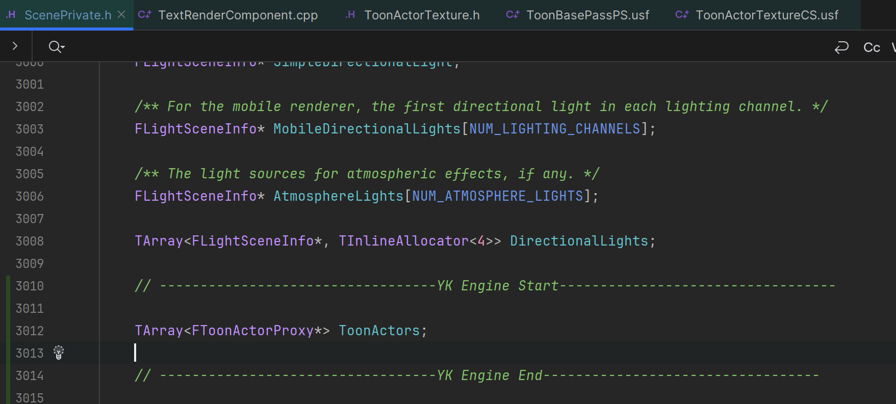

在FSceneInterface里加上ToonActor的Add和Remove等的方法，当我们往场景中添加或者移除ToonActorComponent的时候，就会调用这些函数：

> SceneInterface.h

在FScene中重载上面的函数：
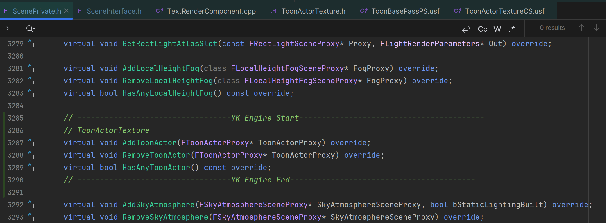
> ScenePrivate.h

在ToonActorTexture.cpp实现上面的函数：
```c++
void FScene::AddToonActor(FToonActorProxy* ToonActorProxy)
{
	check(ToonActorProxy)
	FScene* Scene = this;

	ENQUEUE_RENDER_COMMAND(FAddToonCharacterCommand)(
		[Scene, ToonActorProxy](FRHICommandListImmediate& RHICmdList)
		{
			check(!Scene->ToonActors.Contains(ToonActorProxy));
			Scene->ToonActors.Push(ToonActorProxy);
		}
	);
}

void FScene::RemoveToonActor(FToonActorProxy* ToonActorProxy)
{
	check(ToonActorProxy)
	FScene* Scene = this;
	
	ENQUEUE_RENDER_COMMAND(FRemoveToonCharacterCommand)(
		[Scene, ToonActorProxy](FRHICommandListImmediate& RHICmdList)
		{
			Scene->ToonActors.RemoveSingle(ToonActorProxy);
		} );
}

bool FScene::HasAnyToonActor() const
{
	return ToonActors.Num() > 0;
}
```

在FNULLSceneInterface里也重载一下：

> RendererScene.cpp

我们重载这下这几个函数来调用AddToonActor等方法把我们的Component加入FScene中：
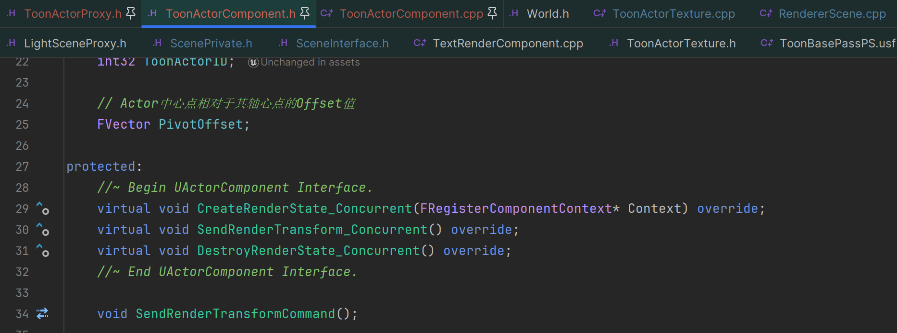
> ToonActorComponent.h

```c++
void UToonActorComponent::CreateRenderState_Concurrent(FRegisterComponentContext* Context)
{
	Super::CreateRenderState_Concurrent(Context);

	bool bHidden = false;
#if WITH_EDITORONLY_DATA
	bHidden = GetOwner() ? GetOwner()->bHiddenEdLevel : false;
#endif // WITH_EDITORONLY_DATA
	if (!ShouldComponentAddToScene())
	{
		bHidden = true;
	}

	if (GetVisibleFlag() && !bHidden && ShouldComponentAddToScene() && ShouldRender() && IsRegistered() && (GetOuter() == NULL || !GetOuter()->HasAnyFlags(RF_ClassDefaultObject)))
	{
		ToonActorProxy = CreateSceneProxy();
		GetWorld()->Scene->AddToonActor(ToonActorProxy);
	}
}

void UToonActorComponent::SendRenderTransformCommand()
{
	if (ToonActorProxy)
	{
		FVector NewActorPivot = GetPivot(true);
		FToonActorProxy* SceneProxy = ToonActorProxy;
		ENQUEUE_RENDER_COMMAND(FUpdateToonActorProxyTransformCommand)(
			[SceneProxy, NewActorPivot](FRHICommandList& RHICmdList)
			{
				// Nothing else is needed so that command could actually go.
				SceneProxy->Pivot = NewActorPivot;
			});
	}
}

void UToonActorComponent::SendRenderTransform_Concurrent()
{
	Super::SendRenderTransform_Concurrent();
	SendRenderTransformCommand();
}

void UToonActorComponent::DestroyRenderState_Concurrent()
{
	Super::DestroyRenderState_Concurrent();
	
	if (ToonActorProxy)
	{
		GetWorld()->Scene->RemoveToonActor(ToonActorProxy);

		FToonActorProxy* SceneProxy = ToonActorProxy;
		ENQUEUE_RENDER_COMMAND(FDestroyToonCharacterProxyCommand)(
			[SceneProxy](FRHICommandList& RHICmdList)
			{
				delete SceneProxy;
			});

		ToonActorProxy = nullptr;
	}
}
```

###### 2.3 添加ToonActorBase

既然有ToonActorComponent，当然我们还需要一个ToonActor来挂载我们的Compnent，那么为什么要叫做ToonActorBase呢，因为它只是作为一个基类，ToonActor我们放到后面实现。

在Engine/Source/Runtime/Engine/Classes/Toon下创建：ToonActorBase.h
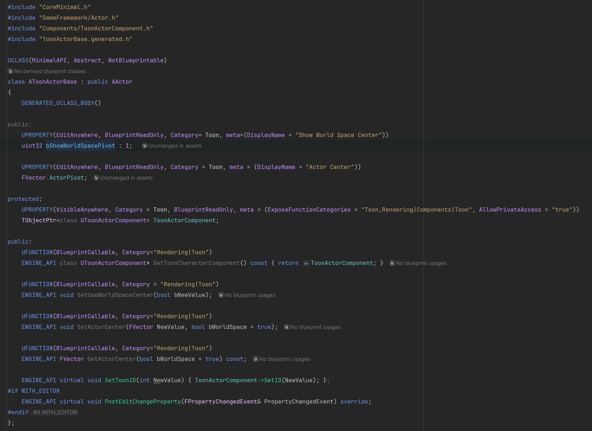

我不希望AToonActorBase被被实例化或者直接被蓝图继承，所以加上`Abstract`和`NotBlueprintable`的标志。
AToonActorBase的ActorPivot是真正要显示在Details面板上，给用户调整的中心点
ToonActorComponent里存储的PivotOffset是中心点相对于Component轴心点的Offset
而ActorPivot则可以通过开关bShowWorldSpacePivot，来显示为绝对世界空间的中心点坐标或相对于轴心点的Offset值。

ToonActorBase的构造函数，将默认的组件设置为ToonActorComponent：

> ToonActorBase.cpp

Get和Set函数：
``` c
void AToonActorBase::SetUseWorldSpaceCenter(bool bNewValue)
{
	if (bShowWorldSpacePivot == bNewValue)
	{
		return;
	}

	bShowWorldSpacePivot = bNewValue;
	// 当bUseWorldSpaceCenter发生了修改，更新ActorPivot
	if (bShowWorldSpacePivot)
	{
		ActorPivot = ToonActorComponent->PivotOffset + ToonActorComponent->GetComponentLocation();
	}
	else
	{
		ActorPivot = ToonActorComponent->PivotOffset;
	}
	
}

void AToonActorBase::SetActorCenter(FVector NewValue, bool bWorldSpace)
{
	if (ToonActorComponent)
	{
		ToonActorComponent->SetPivot(NewValue, bWorldSpace);
		ActorPivot = ToonActorComponent->GetPivot(bShowWorldSpacePivot);
	}
}

FVector AToonActorBase::GetActorCenter(bool bWorldSpace) const
{
	return ToonActorComponent->GetPivot(bWorldSpace);
}
```

在编辑器修改bShowWorldSpaceCenter时，更新ActorPivot的显示：

> ToonActorBase.cpp

###### 2.4 在插件中实现ToonActor、ToonActorManager

以空白插件模板创建一个叫YKEngineEx的插件，
在Engine/Plugins/YKEngineEx/Source/YKEngineEx/Public下创建ToonActor.h：
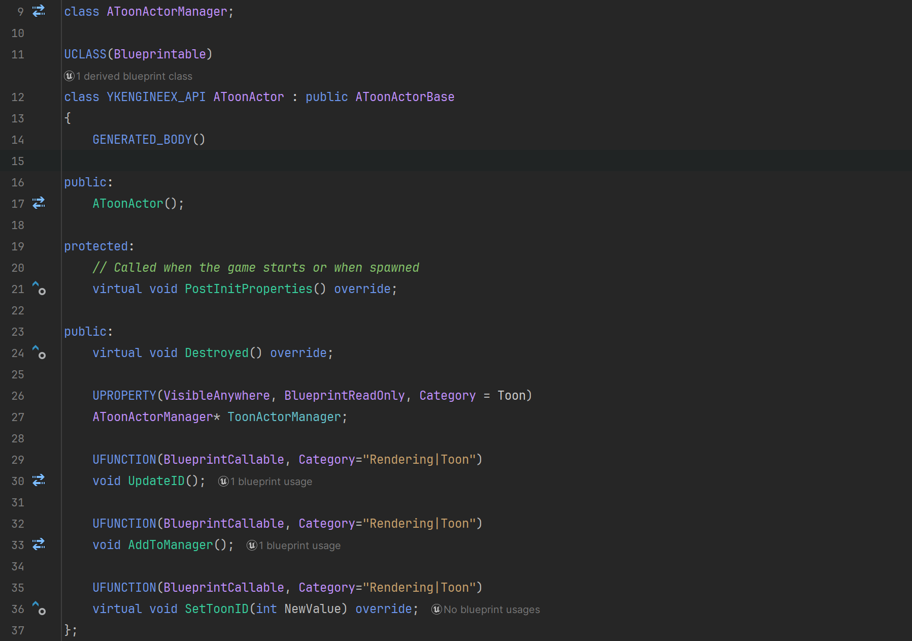

再创建一个ToonActorManager.h，ToonActorManager用来管理ToonActor的ID：
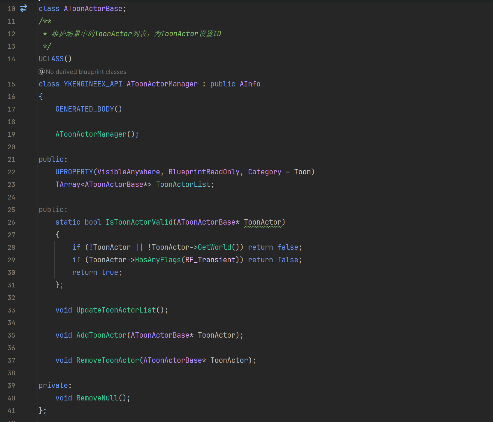

当创建ToonActor，如果场景中没有ToonActorManager，自动创建一个：

> ToonActor.cpp

当ToonActorManager被创建的时候，调用AddToonActor函数，把场景里所有ToonActor都加入到ToonActorList里：

> ToonActorManager.cpp

AddToonActor的实现：

> ToonActorManager.cpp

还有RemoveToonActor的实现：
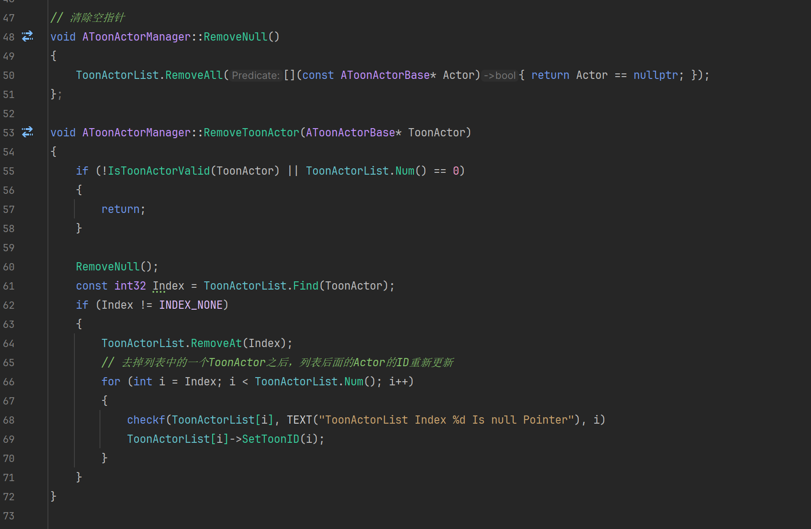
> ToonActorManager.cpp

当ToonActor完成初始化，把它加入到ToonActorManager里，当ToonActor要被销毁时，将它从ToonActorManager里移除：

> ToonActor.cpp

完成了之后，场景里的所有ToonActor应该都会自动被ToonActorManager管理，被自动设置ID属性。
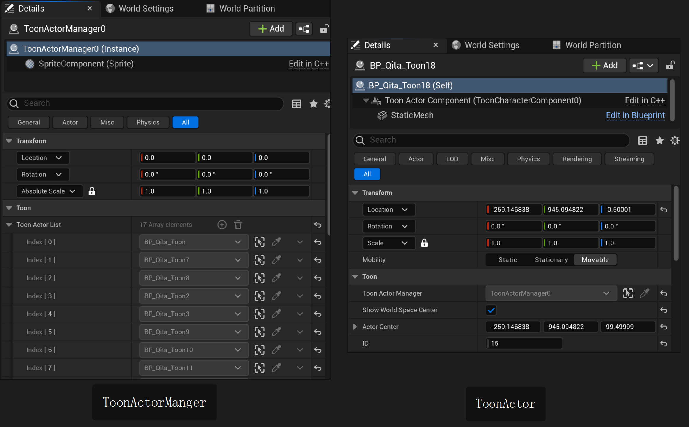

把ToonActor的ID传入材质里作为ObjectID，这样就能保证ToonActor ID和ObjectID保持一致：


###### 2.5 将轴心点保存到ToonActorTexture

经过上面一番操作，FScene里的ToonActorProxy里面应该已经保存了正确的ID和中心点，接下来我们要在ToonActorTexture.cpp中读取它们，并它们构造为一个Structed Buffer发送给ComputerShader。

不过在读取ToonActorProxy之前，我们需要在SceneTexture里加上一张ToonActorTexture，这个过程跟之前添加ToonBuffer和ToonShadowTexture类似，所以过程我就直接跳过了，这张ToonActorTexture的分辨率我设置为16x16，格式为4通道的32位浮点数。

> ToonActorTexture.cpp

先定义一个结构体FToonActorData：

> ToonActorProxy.h

在Shader参数里添加两个参数：
- NumToonActor，记录ToonActor的数量
- ToonActorDatas，一个自定义结构体，保存所有ToonActor的ID和中心点

> ToonActorTexture.cpp

在ToonActorProxy里添加一个函数GetToonActorData，将Pivot从世界空间坐标变换到相对相机的坐标：

> ToonActorProxy.cpp

创建StructuredBuffer并将它传到shader参数里：
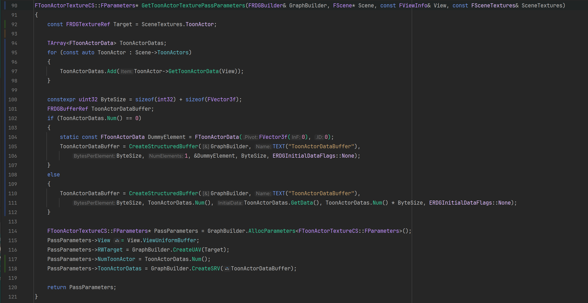
> ToonActorTexture.cpp

把ThreadCount改回16x16，并且在绘制之前先添加一个Pass清空ToonActorTexture：
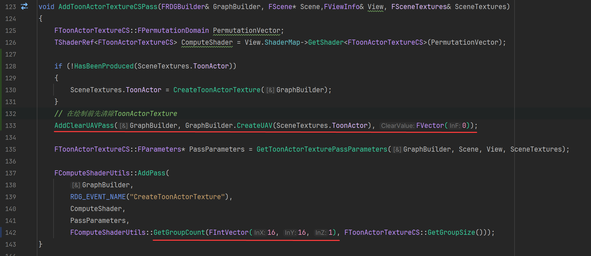
> ToonActorTexture.cpp

在Shader里也添加上FToonActorData和几个参数的声明，然后读取ToonActorDatas的ID，把ID作为坐标，把Pivot写入ToonActorTexture：
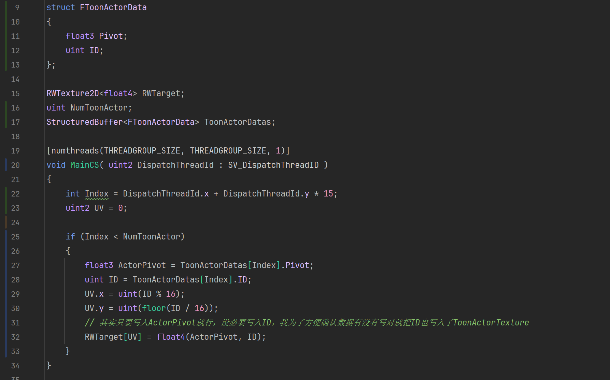
> ToonActorTextureCS.usf

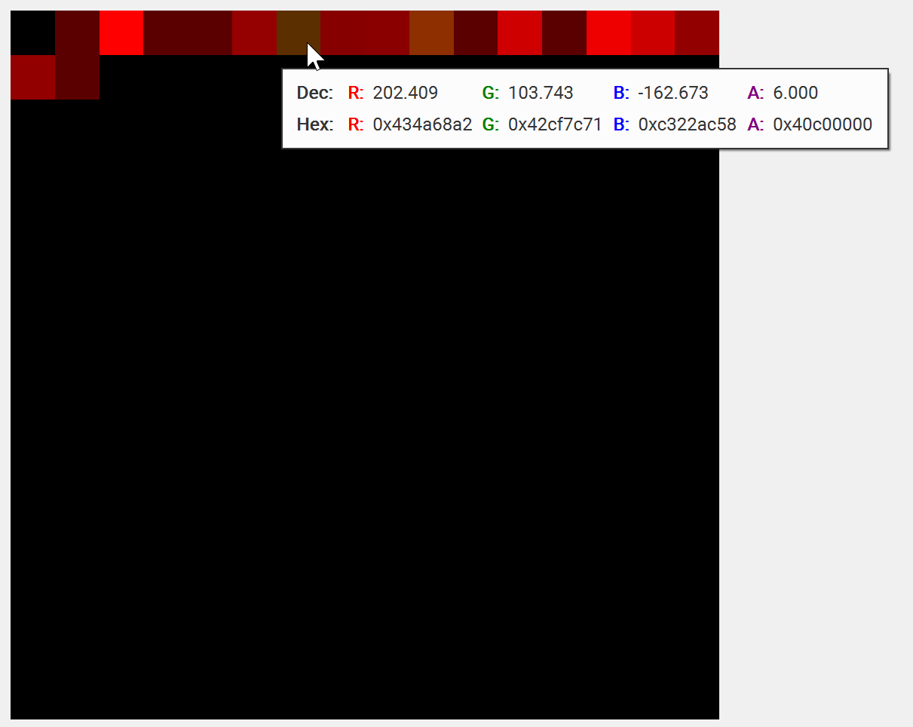

###### 2.6 LightPass读取ToonActorTexture

在FDeferredLightPS的Parameters里加上ToonActorTexture：

> LightRendering.cpp

> LightRendering.cpp

最后在Shader里写点测试代码，可以发现在LightPass里已经成功读取到了我们传入的中心点：

> DeferredLightPixelShaders.usf


##### 三、参考

【Unity】Compute Shader的基础介绍与使用：
https://zhuanlan.zhihu.com/p/368307575

Compute Shader学习笔记（一）：
https://zhuanlan.zhihu.com/p/699253914

Simple compute shader with CPU readback：
https://dev.epicgames.com/community/learning/tutorials/WkwJ/unreal-engine-simple-compute-shader-with-cpu-readback

RenderDependencyGraph学习笔记（二）——在插件中使用ComputeShader：
https://zhuanlan.zhihu.com/p/279556619


