# GBuffer小知识及拓展GBuffer应用

新增一个GBuffer在UE来说较为复杂，主要需要修改以下文件，这里我先列举方便后期校对

1. SceneTextures.h/.cpp ：负责声明创建SceneTexture及GBuffer相关Texture
2. GBufferInfo.h / .cpp ：负责声明GBuffer相关属性
3. DeferredShadingCommon.ush : 负责DecodeShaderingCommon
4. SceneTextureParameters.h/.cpp ：负责SceneTexture Parameter 绑定等
5. ShaderGenerationUtil.cpp ： 负责生成Shader
6. SceneTexturesCommon.ush ： SceneTextures 相关Common 函数
7. MaterialTemplate.ush ： hlsl函数模板
8. ShaderCompiler.h ： 负责Shader编译
9. PixelShaderOutputCommon ： PixelShaderOutput相关定义

# 1. 什么是GBuffer？

延迟[渲染管线](https://zhida.zhihu.com/search?q=渲染管线&zhida_source=entity&is_preview=1)不了解的话可以直接参考 0向往0 dalao的文章了解

The G-buffer is the collective term of all textures used to store lighting-relevant data for the final lighting pass. (定义来自[here](https://link.zhihu.com/?target=https%3A//learnopengl.com/Advanced-Lighting/Deferred-Shading))

了解了GBuffer的定义后我们来了解下UE对GBuffer的相关定义和处理：

# 2.UE中的GBuffer解析

## 2.1 初步了解GBuffer

首先我们在延迟渲染中可以通过Renderdoc 截取看到 在渲染流程中会在不同时期对 GBuffer 进行读取/写入。

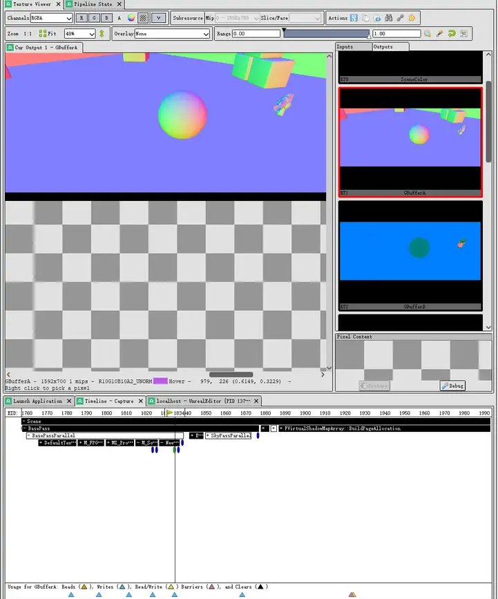

UE会在渲染的BasePass阶段将场景相关信息写入存储到GBuffer中。并在后续Lighting阶段将GBuffer中的相关信息进行读取后参与计算光照结果。

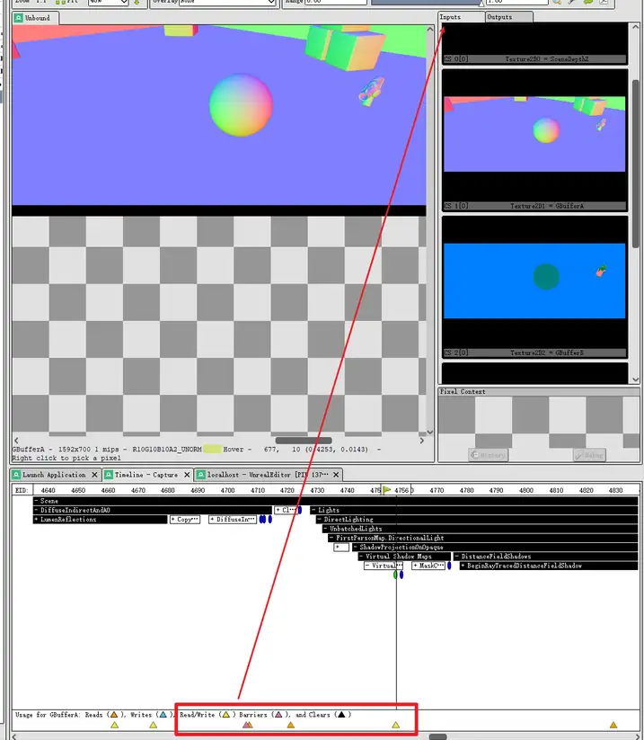

*这里可以看到在直接光的计算中使用的相关Gbuffer的读取。*

既然UE在基础的Deferred Rendering中使用到GBuffer，那我们先直接定位到 DeferredShadingRenderer.cpp 查看 Render 函数，这里由于本文篇幅原因不做详细解析，后续有时间笔者再补充下FDeferredShadingSceneRenderer::Render的相关细节流程，这里我直接使用总结的流程图：

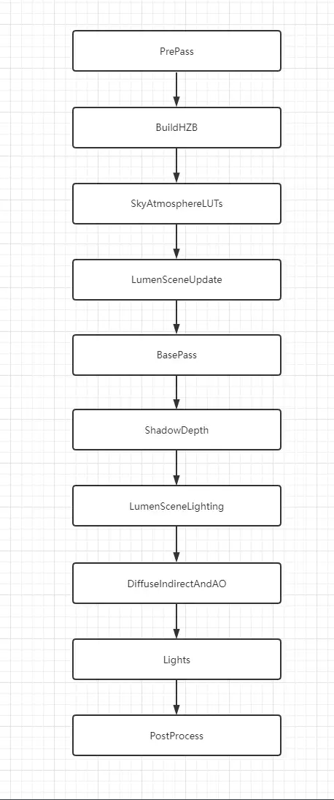

在渲染流程中，与GBuffer相关的处理主要是由FSceneTextures及其相关类进行处理。

主要是通过最开始根据 View 相关设置获得 SceneTexture 相关设置

```cpp
const FSceneTexturesConfig SceneTexturesConfig = FSceneTexturesConfig::Create(ViewFamily);
	FSceneTexturesConfig::Set(SceneTexturesConfig);
```

之后通过FSceneTextures::Create 方法进行创建相关的 SceneTexture。

```cpp
FSceneTextures& SceneTextures = FSceneTextures::Create(GraphBuilder, SceneTexturesConfig);
```

并在相关BasePass Lighting 计算前后进行调用来将结果输出到GBuffer中。

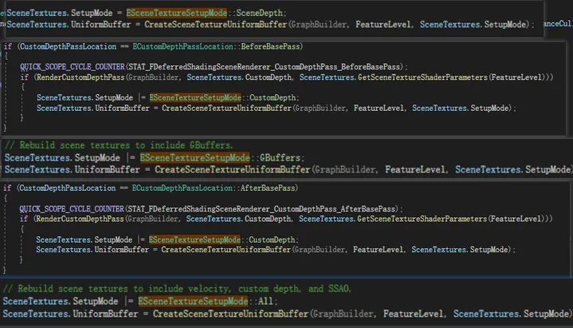

找到Render中对Gbuffer写入、读写位置后，继续深入FSceneTextures中进行研究。首先从Create函数开始，该函数主要是用于创建GBuffer对应的RT，在创建时会使用RDG的形式创建相应的2D Render Target

```cpp
// SceneTextures.cpp

if (Config.GBufferA.Index >= 0)
		{
			const FRDGTextureDesc Desc(FRDGTextureDesc::Create2D(Config.Extent, Config.GBufferA.Format, FClearValueBinding::Transparent, Config.GBufferA.Flags | FlagsToAdd | GFastVRamConfig.GBufferA));
			SceneTextures.GBufferA = GraphBuilder.CreateTexture(Desc, TEXT("GBufferA"));
		}

		if (Config.GBufferB.Index >= 0)
		{
			const FRDGTextureDesc Desc(FRDGTextureDesc::Create2D(Config.Extent, Config.GBufferB.Format, FClearValueBinding::Transparent, Config.GBufferB.Flags | FlagsToAdd | GFastVRamConfig.GBufferB));
			SceneTextures.GBufferB = GraphBuilder.CreateTexture(Desc, TEXT("GBufferB"));
		}

		if (Config.GBufferC.Index >= 0)
		{
			const FRDGTextureDesc Desc(FRDGTextureDesc::Create2D(Config.Extent, Config.GBufferC.Format, FClearValueBinding::Transparent, Config.GBufferC.Flags | FlagsToAdd | GFastVRamConfig.GBufferC));
			SceneTextures.GBufferC = GraphBuilder.CreateTexture(Desc, TEXT("GBufferC"));
		}

		if (Config.GBufferD.Index >= 0)
		{
			const FRDGTextureDesc Desc(FRDGTextureDesc::Create2D(Config.Extent, Config.GBufferD.Format, FClearValueBinding::Transparent, Config.GBufferD.Flags | FlagsToAdd | GFastVRamConfig.GBufferD));
			SceneTextures.GBufferD = GraphBuilder.CreateTexture(Desc, TEXT("GBufferD"));
		}

		if (Config.GBufferE.Index >= 0)
		{
			const FRDGTextureDesc Desc(FRDGTextureDesc::Create2D(Config.Extent, Config.GBufferE.Format, FClearValueBinding::Transparent, Config.GBufferE.Flags | FlagsToAdd | GFastVRamConfig.GBufferE));
			SceneTextures.GBufferE = GraphBuilder.CreateTexture(Desc, TEXT("GBufferE"));
		}
```

CreateSceneTextureUniformBuffer 函数会根据SetupMode进行初始化相应RT，其中最关键的就是通过EnumHasAnyFlags判断传入的SetupMode来进行RT的复制和修改

```cpp
if (EnumHasAnyFlags(SetupMode, ESceneTextureSetupMode::GBufferA) && HasBeenProduced(SceneTextures->GBufferA))
{
		SceneTextureParameters.GBufferATexture = SceneTextures->GBufferA;
				
}
```

同时在 SceneTextureParameters.h 中 定义了SceneTexture中相关RDG Texture的文件及相关方法，以辅助将GBuffer中的数据传递到相应的RT上进行绘制。

在 SceneTexturesCommon.ush 中定义了 RT 的[采样器](https://zhida.zhihu.com/search?q=采样器&zhida_source=entity&is_preview=1)等来实现在GPU中进行读取。

至此我们基本了解UE在延迟渲染管线中对GBuffer对应RT的操作流程。

## 2.2 UE如何定义GBuffer

UE中使用Encode和Decode机制来实现对GBuffer的写/读。并通过GBUFFER_REFACTOR宏来区别

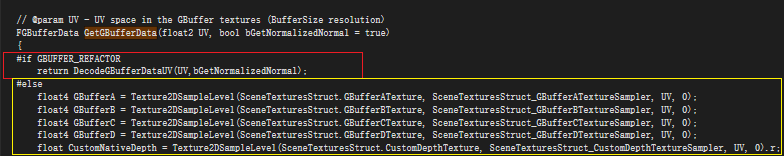

*此处参考YivanLee大佬的文章*

使用GBUFFER_REFACTOR宏来生成的是由C++部分生成 Encode 和 Decode 代码，负责生成代码的文件为 ShaderGenerationUtil.cpp ，可以在文件中查看

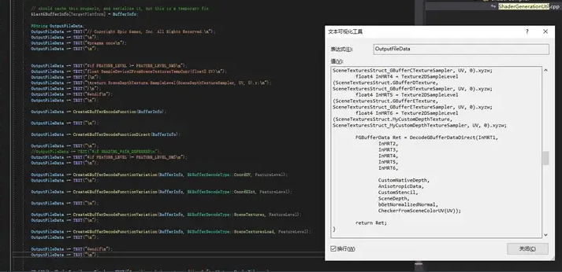

*（无力吐槽UE5使用FString拼接的方式实现C++控制HLSL的方法…debug起来十分不友好）*

ShaderGenerationUtil 文件主要负责在C++层面写入HLSL的相关逻辑。这里会实现GBuffer 的 Decode（写入） 和 Encode（读取）方法。这些后续在添加自己的GBuffer的时候都是需要进行修改的。

另一种就是在ush中直接写好的。具体可查看 DeferredShadingCommon.ush ~

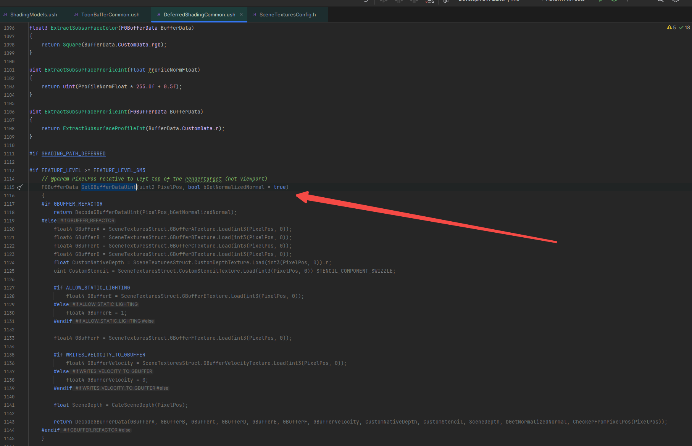

在FShaderCompileUtilities::ApplyDerivedDefines函数中把GBUFFER_REFACTOR宏加入实现区分。

在Decode Encode过程中，有一个结构特别关键：FGBufferData。

FGbufferData主要负责存储写入读出GBuffer的相关数据，在UE的PS阶段渲染函数BasePassPixelShader.usf 中看到调用 SetGBufferForShadingModel 来将相关 Material Input的数据传递给GBuffer。FGbufferData定义可以在DeferredShadingCommon.ush中查看。

```cpp
// all values that are output by the forward rendering pass
struct FGBufferData
{
	// normalized
	float3 WorldNormal;
	// normalized, only valid if HAS_ANISOTROPY_MASK in SelectiveOutputMask
	float3 WorldTangent;
	// 0..1 (derived from BaseColor, Metalness, Specular)
	float3 DiffuseColor;
	// 0..1 (derived from BaseColor, Metalness, Specular)
	float3 SpecularColor;
	// 0..1, white for SHADINGMODELID_SUBSURFACE_PROFILE and SHADINGMODELID_EYE (apply BaseColor after scattering is more correct and less blurry)
	float3 BaseColor;
	// 0..1
	float Metallic;
	// 0..1
	float Specular;
	// 0..1
	float4 CustomData;
	// AO utility value
	float GenericAO;
	// Indirect irradiance luma
	float IndirectIrradiance;
	// Static shadow factors for channels assigned by Lightmass
	// Lights using static shadowing will pick up the appropriate channel in their deferred pass
	float4 PrecomputedShadowFactors;
	// 0..1
	float Roughness;
	// -1..1, only valid if only valid if HAS_ANISOTROPY_MASK in SelectiveOutputMask
	float Anisotropy;
	// 0..1 ambient occlusion  e.g.SSAO, wet surface mask, skylight mask, ...
	float GBufferAO;
	// Bit mask for occlusion of the diffuse indirect samples
	uint DiffuseIndirectSampleOcclusion;
	// 0..255 
	uint ShadingModelID;
	// 0..255 
	uint SelectiveOutputMask;
	// 0..1, 2 bits, use CastContactShadow(GBuffer) or HasDynamicIndirectShadowCasterRepresentation(GBuffer) to extract
	float PerObjectGBufferData;
	// in world units
	float CustomDepth;
	// Custom depth stencil value
	uint CustomStencil;
	// in unreal units (linear), can be used to reconstruct world position,
	// only valid when decoding the GBuffer as the value gets reconstructed from the Z buffer
	float Depth;
	// Velocity for motion blur (only used when WRITES_VELOCITY_TO_GBUFFER is enabled)
	float4 Velocity;

	// My Custom Depth 
	float4 MyCustomDepth;

	// 0..1, only needed by SHADINGMODELID_SUBSURFACE_PROFILE and SHADINGMODELID_EYE which apply BaseColor later
	float3 StoredBaseColor;
	// 0..1, only needed by SHADINGMODELID_SUBSURFACE_PROFILE and SHADINGMODELID_EYE which apply Specular later
	float StoredSpecular;
	// 0..1, only needed by SHADINGMODELID_EYE which encodes Iris Distance inside Metallic
	float StoredMetallic;
};
```

此处只是定义好Gbuffer的Encode及Decode的方式，于是笔者继续深入，找到UE对GBuffer在C++侧定义的位置（GBufferInfo.h/.cpp），该文件定义了Gbuffer相关属性：

- EGBufferSlot：GBuffer相关内容接口
- EGBufferCompression：GBuffer相关压缩格式
- EGBufferType：GBuffer输出到Texture时Texture的格式
- FGBufferItem：在GBuffer中Texture的位置
- FGBufferBinding：GBuffer相关绑定信息，负责绑定GBuffer相关Format及CreateFlags

同时也定义了Gbuffer相关函数：

- FindGBufferTargetByName：通过name来查询对应的Gbuffer的RenderTarget
- FindGBufferBindingByName：通过name来找到GBuffer绑定的信息，内部会调用FindGBufferTargetByName
- FetchFullGBufferInfo/FetchLegacyGBufferInfo：负责绑定GBuffer的相关信息，这个函数会设置FGBufferInfo所有信息，包括初始化GBuffer的格式及各个通道的数据类型绑定情况
- FetchGBufferSlots：负责设置GBufferSlots，该步骤会在将需要写入GBuffer的EGBufferSlot存放成一个TArray，方便后续绑定使用。

至此GBuffer的相关定义也已完成，接下来笔者继续研究了UE中GBuffer中的组成部分。

## 2.3 UE 中 GBuffer 的组成

从前面的解析，可以了解到GBuffer的读取主要是通过Decode来进行，所以我们直接定位到延迟渲染中的EncodeGBuffer函数。该函数主要用于将 FGBufferData 中的相关数据解析后输出给 各个buffer。

```cpp
// DeferredShadingCommon.ush

/** Populates OutGBufferA, B and C */
void EncodeGBuffer(
	FGBufferData GBuffer,
	out float4 OutGBufferA,
	out float4 OutGBufferB,
	out float4 OutGBufferC,
	out float4 OutGBufferD,
	out float4 OutGBufferE,
	out float4 OutGBufferVelocity,
	/*out float4 OutMyCustomDepth,*/ //注释的是我自己加入的GBuffer
	float QuantizationBias = 0		// -0.5 to 0.5 random float. Used to bias quantization.
	)
{
	if (GBuffer.ShadingModelID == SHADINGMODELID_UNLIT)
	{
		OutGBufferA = 0;
		SetGBufferForUnlit(OutGBufferB);
		OutGBufferC = 0;
		OutGBufferD = 0;
		OutGBufferE = 0;
	}
	else
	{
#if MOBILE_DEFERRED_SHADING
		OutGBufferA.rg = UnitVectorToOctahedron( normalize(GBuffer.WorldNormal) ) * 0.5f + 0.5f;
		OutGBufferA.b = GBuffer.PrecomputedShadowFactors.x;
		OutGBufferA.a = GBuffer.PerObjectGBufferData;		
#elif 1
		OutGBufferA.rgb = EncodeNormal( GBuffer.WorldNormal );
		OutGBufferA.a = GBuffer.PerObjectGBufferData;
#else
		float3 Normal = GBuffer.WorldNormal;
		uint   NormalFace = 0;
		EncodeNormal( Normal, NormalFace );

		OutGBufferA.rg = Normal.xy;
		OutGBufferA.b = 0;
		OutGBufferA.a = GBuffer.PerObjectGBufferData;
#endif

		OutGBufferB.r = GBuffer.Metallic;
		OutGBufferB.g = GBuffer.Specular;
		OutGBufferB.b = GBuffer.Roughness;
		OutGBufferB.a = EncodeShadingModelIdAndSelectiveOutputMask(GBuffer.ShadingModelID, GBuffer.SelectiveOutputMask);

		OutGBufferC.rgb = EncodeBaseColor( GBuffer.BaseColor );

#if GBUFFER_HAS_DIFFUSE_SAMPLE_OCCLUSION
		OutGBufferC.a = float(GBuffer.DiffuseIndirectSampleOcclusion) * rcp(255) + (0.5 / 255.0);
#elif ALLOW_STATIC_LIGHTING
		// No space for AO. Multiply IndirectIrradiance by AO instead of storing.
		OutGBufferC.a = EncodeIndirectIrradiance(GBuffer.IndirectIrradiance * GBuffer.GBufferAO) + QuantizationBias * (1.0 / 255.0);
#else
		OutGBufferC.a = GBuffer.GBufferAO;
#endif

		OutGBufferD = GBuffer.CustomData;
		OutGBufferE = GBuffer.PrecomputedShadowFactors;
	}

#if WRITES_VELOCITY_TO_GBUFFER
	GBufferF= GBuffer.Velocity;
#else
	OutGBufferVelocity = 0;
#endif
	/*OutMyCustomDepth = GBuffer.MyCustomDepth;*/
}
```

该函数会在FPixelShaderInOut_MainPS中进行最后调用，将FGbufferData中的数据输出到GBuffer中。

通过分析可以看到UE5中对GBuffer做了一下分配：

- 手机端延迟渲染管线

|             | R                        | G                        | B                          | A                                                            |
| ----------- | ------------------------ | ------------------------ | -------------------------- | ------------------------------------------------------------ |
| GBufferA    | Normal                   | Normal                   | PrecomputedShadowFactors.x | PerObjectGBufferData                                         |
| GBufferB    | Metallic                 | Specular                 | Roughness                  | ShadingModelID+SelectiveOutputMask(各占4bit，Shading Mode最大值16） |
| GBufferC    | BaseColor                | BaseColor                | BaseColor                  | 见注释                                                       |
| GBufferD    | CustomData               | CustomData               | CustomData                 | CustomData                                                   |
| OutGBufferE | PrecomputedShadowFactors | PrecomputedShadowFactors | PrecomputedShadowFactors   | PrecomputedShadowFactors                                     |
| GBufferF    | Velocity                 | Velocity                 | Velocity                   | [各向异性](https://zhida.zhihu.com/search?q=各向异性&zhida_source=entity&is_preview=1)强度 |

- 延迟渲染管线

|             | R                        | G                        | B                        | A                                                            |
| ----------- | ------------------------ | ------------------------ | ------------------------ | ------------------------------------------------------------ |
| GBufferA    | Normal                   | Normal                   | Normal                   | PerObjectGBufferData                                         |
| GBufferB    | Metallic                 | Specular                 | Roughness                | ShadingModelID+SelectiveOutputMask(各占4bit，Shading Mode最大值16） |
| GBufferC    | BaseColor                | BaseColor                | BaseColor                | 见注释                                                       |
| GBufferD    | CustomData               | CustomData               | CustomData               | CustomData                                                   |
| OutGBufferE | PrecomputedShadowFactors | PrecomputedShadowFactors | PrecomputedShadowFactors | PrecomputedShadowFactors                                     |
| GBufferF    | Velocity                 | Velocity                 | Velocity                 | 各向异性强度                                                 |

- 在GBufferA禁用的分支里可以Encode法线到RG，如果这样做了B可以空出一个10bit，但移动没法使用。
- GBufferC的Alpha通道在有静态光照时候储存随机抖动过的IndirectIrradiance*Material AO，否则直接储存Material AO。

## 2.4 UE中GBuffer光照相关计算

### 2.4.1 延迟渲染管线

在延迟管线BasePass 的 GBuffer 数据填充后，会在 DiffuseIndirectAndAO 阶段中将间接光计算的[漫反射](https://zhida.zhihu.com/search?q=漫反射&zhida_source=entity&is_preview=1) 和 镜面反射 叠加到 GBuffer 中的BaseColor部分。（Note：不同方案会进行不同处理）

DiffuseIndirectAndAO 中包含了Lumen 相关 Radiosity 计算（感兴趣的朋友可以阅读 丛越dalao 文章），在完成间接光照计算后，GBuffer中的 BaseColor 将GI 计算结果 和 AO 叠加到 GBuffer 的 BaseColor 的过程叫 DiffuseIndirectComposite 。

DiffuseIndirectComposite 会将前面生成的DiffuseIndirect、RoughSpecularIndirect、SpecularIndirect 等与场景GBuffer 组合生成最终场景颜色 （同时包括bentNormal）。具体实现代码可以在IndirectLightRendering.cpp 中查看。组合过程可以在DiffuseIndirectComposite.usf中查看。

首先我们可以看下IndirectLightRendering.cpp 中，在该文件中会通过DIM_APPLY_DIFFUSE_INDIRECT宏来区分不同间接光方案。不同间接光方案在后续计算间接光对BaseColor的方式会有所不同。

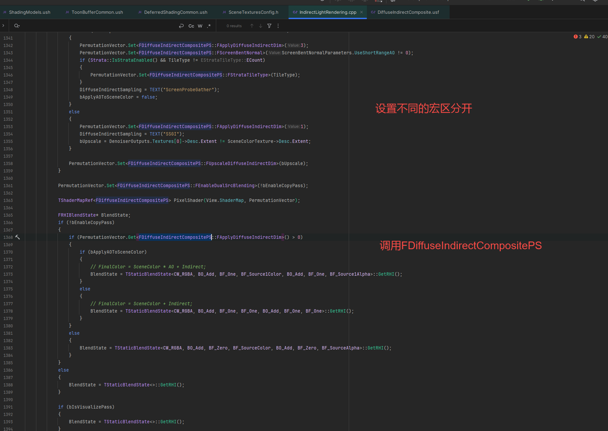

后续在DiffuseIndirectComposite.usf 中

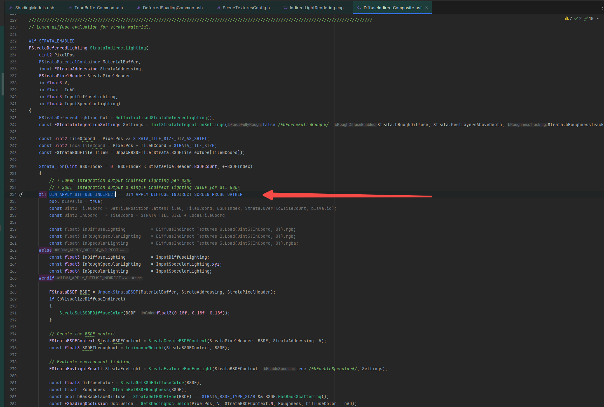

**在Lumen的间接光环境下，UE默认材质不会计算间接光的高光遮蔽计算（BentNormal除外） ，只会将漫反射间接光的遮蔽信息相乘到BaseColor上。**

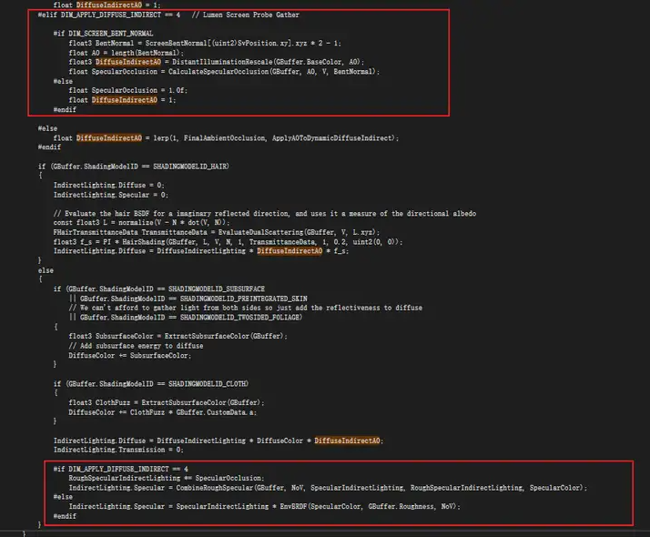

其他间接光模式后续再做进一步补充。

在后处理中 SSGI 也会调用到 GBuffer 进行渲染。主要是对AO进行相关处理

```cpp
// DiffuseIndirectComposite.usf

#if DIM_APPLY_DIFFUSE_INDIRECT
    {
        float3 DiffuseColor = GBuffer.DiffuseColor;
        if (UseSubsurfaceProfile(GBuffer.ShadingModelID))
        {
            DiffuseColor = GBuffer.StoredBaseColor;
        }

        OutColor.rgb += DiffuseColor * DiffuseIndirectTexture.SampleLevel(DiffuseIndirectSampler, BufferUV, 0).rgb;
    }
#endif

    // 应用AO到场景颜色. 因为在延迟直接照明之前，假设SceneColor中的所有照明都是间接照明.
    {
        float AOMask = (GBuffer.ShadingModelID != SHADINGMODELID_UNLIT);
        OutColor.a = lerp(1.0f, FinalAmbientOcclusion, AOMask * AmbientOcclusionStaticFraction);
    }
```

### 2.4.2 移动延迟渲染管线

开启方法 ： Mobile默认还是会使用forward shading。也可以手动设置，使得mobile使用pc renderer（“平台”->"项目设置"。默认为deferred，也可以使用forward）。但总的来说在mobile使用pc renderer不合适。

所以，引入了新的针对mobile GPU优化过的deferred shading。启用它的方法是在DefaultEngine.ini中添加r.Mobile.ShadingPath=1。

Mobile Deferred Shading 通过断点可一查看到在 MobileShadingRenderer.cpp 中 调用。

**在移动延迟渲染管线MobileBasePass的GBuffer数据填充后，不存在DiffuseIndirectAndAO的叠加过程，而是通过与间接光编码存在GBufferC.a 中 ，后续用于Diffuse IBL 的遮蔽计算，Specular没有进行遮蔽计算。**

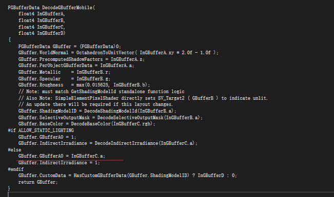

在MobileDeferredShading.usf 中设置读取GBufferAO进行叠加


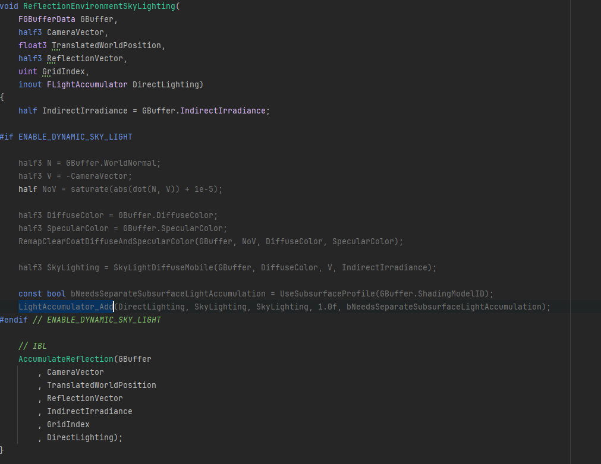

# 3. 实践（一）：如何在UE5中添加自己的GBuffer

介绍完GBuffer相关细节后，笔者开始尝试添加自己的GBuffer，这里感谢下 yivanlee dalao文章做的指导orz~

本人将基于上一篇文章的思路进行修改~

## 3.1 声明GBuffer Slot

GBufferInfo 用于声明设置 GBuffer 相关信息，包括GBuffer的名字、格式、相关可读性

首先我们需要在GBufferInfo文件中声明相关GBuffer声明。

在EGBufferSlot中添加写入GBuffer的类型，在FetchGBufferSlots函数中的EGBufferSlot数组中添加对应类型


并在 FetchLegacyGBufferInfo 函数中新增新GBuffer的Target及在Slot的绑定信息


Note需要在NumTargets中新增1（因为增加了自己的Buffer）


进入到 GBufferInfo.h 的[头文件](https://zhida.zhihu.com/search?q=头文件&zhida_source=entity&is_preview=1)中，修改FGBufferInfo的MaxTargets


## 3.2 添加FGBufferData

找到 DeferredShadingCommon.ush ，并在 struct FGBufferData 中添加新的数据格式


## 3.3 创建对应RT并绑定

首先定位到SceneTextures.h文件，并在FSceneTexturesConfig结构定义FGBufferBinding 的地方添加自己的 GBuffer Binding


同时在FSceneTextures结构中添加相应RT的RDGTextureRef


接下来来到 SceneTextures.cpp 中，在FSceneTexturesConfig::Create函数中将Config中的Buffer与名字进行绑定：


然后在FSceneTextures::Create函数中添加逻辑判断Config是否使用到相应GBuffer，并创建相应的RT，Note：这里可以设置RT的相关格式~

```cpp
if (Config.MyCustomDepth.Index >= 0)
		{
			const FRDGTextureDesc Desc(FRDGTextureDesc::Create2D(Config.Extent, Config.MyCustomDepth.Format, FClearValueBinding({ 0.0f, 0.0f, 0.0f, 0.0f }), Config.MyCustomDepth.Flags | FlagsToAdd | GFastVRamConfig.MyCustomDepth));
			SceneTextures.MyCustomDepthTexture = GraphBuilder.CreateTexture(Desc, TEXT("MyCustomDepth"));
		}
```

同时在FSceneTextures::GetGBufferRenderTargets函数中添加相关GBuffer


同时在同文件中的SetupSceneTextureUniformParameters函数中修改将RT与GBuffer进行绑定。这里需要调用EnumHasAnyFlags函数进行判断是否需要进行复制。


（同理移动端在下方的SetupMobileSceneTextureUniformParameters函数也可进行设置，由于笔者实现的PC的逻辑，移动端可自行拓展）

## 3.4 Encode And Decode

接下来修改GBuffer的Encode和Decode机制，打开ShaderGenerationUtil.cpp，首页需要在GetSlotTextName函数中创建对应的接口名称：


然后在 SetSharedGBufferSlots 函数中将对应的Slots解析接口打开（这里打开的话是默认全部打开，也可以在SetSlotsForShadingModelType 中对单独材质类型进行打开）


然后在 SettandardGBufferSlots 中 将对应接口在不同条件下判断是否开启进行添加。


该函数主要会用在DetermineUsedMaterialSlots函数，DetermineUsedMaterialSlots会设置不同shadingmodel所需要的GBuffer情况及是否使用相关CustomData。不了解ShadingModel的朋友可以查看我上一篇文章。这里我们需要为我们上一篇自定义的Shadingmodel添加相关GBuffer设置


## 3.5 写入GBuffer

写入GBuffer部分需要到Shader中进行设置。首先我们打开 DeferredShadingCommon.ush ，并在相应的encode区域添加 新增 GBuffer的绑定。

Note：需要通过#ifndef MOBILE_DEFERRED_SHADING 的方式来绕开 MOBILE_DEFERRED_SHADING


然后在默认的Decode函数中添加相关Decode


GetGBufferDataUint 函数中添加采样


GetGBufferDataFromSceneTextures 函数中添加采样


GetGBufferData 函数中添加采样


接下来打开 BasePassPixelShader.usf ，在FPixelShaderInOut_MainPS中添加HLSL中默认的绑定。


最后在ShaderGenerationUtil.cpp 文件的 SetSlotsForShadingModelType中添加默认GBufferSlots（Note：可见3.4节笔者的注释）


## 3.3调试GBuffer

编译后进行调试，通过打断点检查OutputData的方式查看相关Encode及Decode函数的正确性

最后结果


# 4.实践（二）.卡通渲染中GBuffer应用

## 4.1  SceneTexturesConfig添加GBuffer绑定

```
// Toon Buffer step 1
// 定义ToonBufferTexture
SHADER_PARAMETER_RDG_TEXTURE(Texture2D<uint4>, TBufferATexture)
SHADER_PARAMETER_RDG_TEXTURE(Texture2D, TBufferBTexture)
SHADER_PARAMETER_RDG_TEXTURE(Texture2D, TBufferCTexture)
// Toon Shadow
SHADER_PARAMETER_RDG_TEXTURE(Texture2D, ToonShadowTexture)
// ToonActorTexture
SHADER_PARAMETER_RDG_TEXTURE(Texture2D, ToonActorTexture)
```

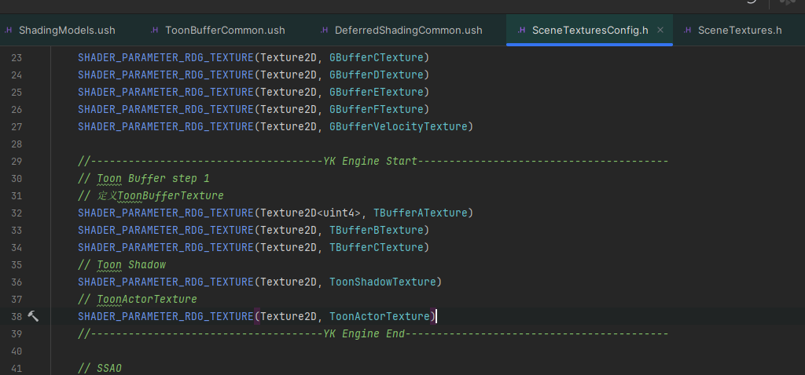

## 4.2  SceneTextures.h添加绑定

```
// Toon Buffer step 2
// 在ScreenTexture中定义Toon Buffer
FRDGTextureRef TBufferA{};
FRDGTextureRef TBufferB{};
FRDGTextureRef TBufferC{};
// Toon Shadow
FRDGTextureRef ToonShadow{};
// ToonActorTexture
FRDGTextureRef ToonActor{};
```

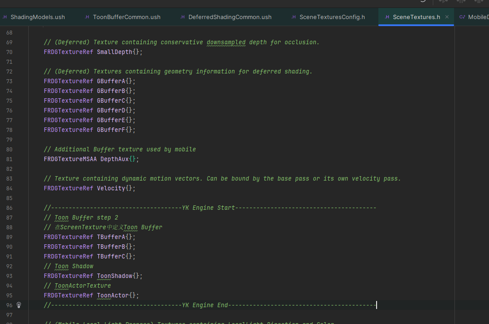

## 4.3   FastVRamConfig中定义Toon Buffer,用于创建控制台变量(Console Variable)

```
// Toon Buffer step 3-1
// FastVRamConfig中定义Toon Buffer,用于创建控制台变量(Console Variable)
FASTVRAM_CVAR(TBufferA, 0);
FASTVRAM_CVAR(TBufferB, 0);
FASTVRAM_CVAR(TBufferC, 0);
```

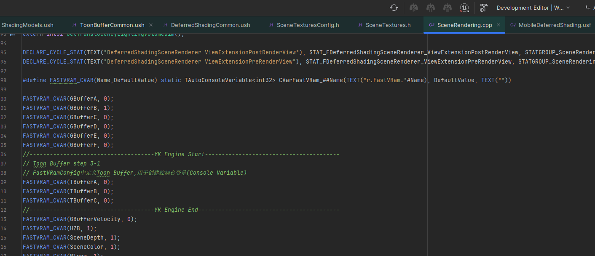

## 4.4  通过CVarFastVRam来更新TextureCreateFlags

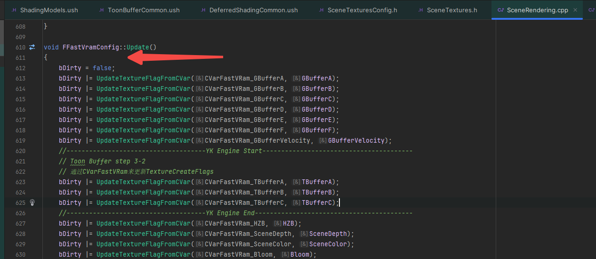

## 4.5  定义TextureCreateFlags

```
// Toon Buffer step 4
// 定义TextureCreateFlags
ETextureCreateFlags TBufferA;
ETextureCreateFlags TBufferB;
ETextureCreateFlags TBufferC;
// Toon Shadow
ETextureCreateFlags ToonShadow;
```

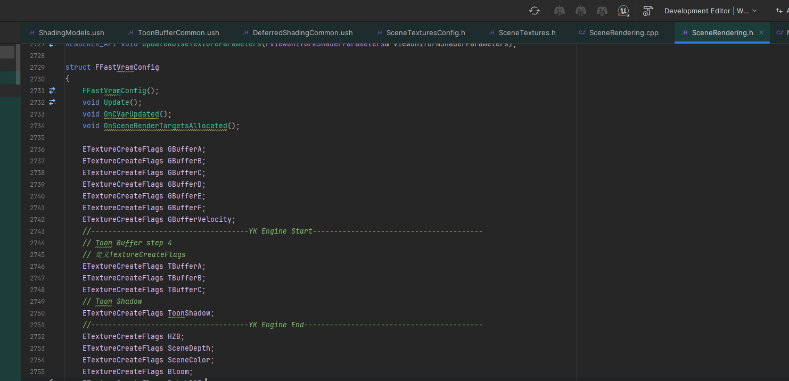

## 4.6  在自定义的PassRendering中创建BufferTexture

```
// Toon Buffer step 5-1
// // 用于获取ToonBufferTexture的FRDGTextureDesc，FRDGTextureDesc存储了texture的一些描述信息，如大小，格式，MipMap层数等
// FRDGTextureDesc GetToonBufferTextureDesc(FIntPoint Extent, ETextureCreateFlags CreateFlags);
// // 用于创建一张ToonBufferTexture
// FRDGTextureRef CreateToonBufferTexture(FRDGBuilder& GraphBuilder, FIntPoint Extent, ETextureCreateFlags CreateFlags, const TCHAR* Name);

struct FFastVramConfig;
void CreateToonBuffers(FRDGBuilder& GraphBuilder, FSceneTextures& SceneTexture, FIntPoint Extent, const FFastVramConfig& FastVRamConfig);
```

```
// Toon Buffer step 5-2
// FRDGTextureDesc GetToonBufferTextureDesc(FIntPoint Extent, ETextureCreateFlags CreateFlags)
// {
//  //输入的参数：
//  //Extent：贴图尺寸；PF_R8G8B8A8_UINT：贴图格式，表示RGBA各个通道均为8bit uint
//  //FClearValueBinding::Black:清除值，表示清除贴图时将其清除为黑色
//  //TexCreate_UAV：Unordered Access View，允许在着色器中进行随机读写操作
//  //TexCreate_RenderTargetable：表示纹理可作为渲染目标使用
//  //TexCreate_ShaderResource：表示纹理可作为着色器资源，可以在着色器中进行采样等操作
//  return FRDGTextureDesc(FRDGTextureDesc::Create2D(Extent, PF_R8G8B8A8_UINT, FClearValueBinding::Black, TexCreate_UAV | TexCreate_RenderTargetable | TexCreate_ShaderResource | CreateFlags));
// }
// // Toon Buffer step 5-3
// FRDGTextureRef CreateToonBufferTexture(FRDGBuilder& GraphBuilder, FIntPoint Extent, ETextureCreateFlags CreateFlags, const TCHAR* Name)
// {    
//  return GraphBuilder.CreateTexture(GetToonBufferTextureDesc(Extent, CreateFlags), Name);
// }

void CreateToonBuffers(FRDGBuilder& GraphBuilder, FSceneTextures& SceneTexture, FIntPoint Extent, const FFastVramConfig& FastVRamConfig)
{
    const FRDGTextureDesc TBufferADesc = FRDGTextureDesc(FRDGTextureDesc::Create2D(Extent, PF_R8G8B8A8_UINT,
       FClearValueBinding::Black, TexCreate_UAV | TexCreate_RenderTargetable | TexCreate_ShaderResource | FastVRamConfig.TBufferA));
    SceneTexture.TBufferA = GraphBuilder.CreateTexture(TBufferADesc, TEXT("TBufferA"));

    const FRDGTextureDesc TBufferBDesc = FRDGTextureDesc(FRDGTextureDesc::Create2D(Extent, PF_R8G8B8A8,
       FClearValueBinding::Black, TexCreate_UAV | TexCreate_RenderTargetable | TexCreate_ShaderResource | FastVRamConfig.TBufferB));
    SceneTexture.TBufferB = GraphBuilder.CreateTexture(TBufferBDesc, TEXT("TBufferB"));

    const FRDGTextureDesc TBufferCDesc = FRDGTextureDesc(FRDGTextureDesc::Create2D(Extent, PF_R8G8B8A8,
       FClearValueBinding::Black, TexCreate_UAV | TexCreate_RenderTargetable | TexCreate_ShaderResource | FastVRamConfig.TBufferC));
    SceneTexture.TBufferC = GraphBuilder.CreateTexture(TBufferCDesc, TEXT("TBufferC"));
}
```

## 4.7  定义ToonBuffer的SetupMode

```
enum class ESceneTextureSetupMode : uint32
{
    None         = 0,
    SceneColor    = 1 << 0,
    SceneDepth    = 1 << 1,
    SceneVelocity  = 1 << 2,
    GBufferA      = 1 << 3,
    GBufferB      = 1 << 4,
    GBufferC      = 1 << 5,
    GBufferD      = 1 << 6,
    GBufferE      = 1 << 7,
    GBufferF      = 1 << 8,
    SSAO         = 1 << 9,
    CustomDepth       = 1 << 10,
    //-------------------------------------YK Engine Start----------------------------------------
    // Toon Buffer step 6
    // 定义ToonBuffer的SetupMode
    TBufferA      = 1 << 11,
    TBufferB      = 1 << 12,
    TBufferC      = 1 << 13,
    ToonShadow    = 1 << 14, // Toon Shadow
    ToonActor     = 1 << 15, // ToonActorTexture
    GBuffers      = GBufferA | GBufferB | GBufferC | GBufferD | GBufferE | GBufferF,
    TBuffers      = TBufferA | TBufferB | TBufferC,
    All             = SceneColor | SceneDepth | SceneVelocity | GBuffers | SSAO | CustomDepth | TBuffers | ToonShadow | ToonActor
    //-------------------------------------YK Engine End------------------------------------------
};
```

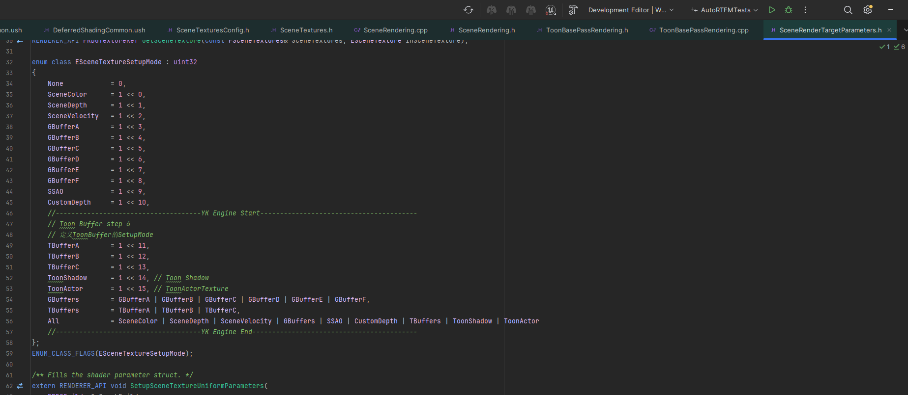

## 4.8  SceneTextures中引用自定义的PassRendering

```
CreateToonBuffers(GraphBuilder, SceneTextures, Config.Extent, GFastVRamConfig);
```

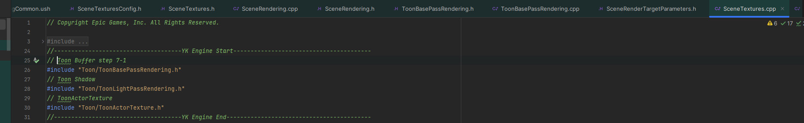

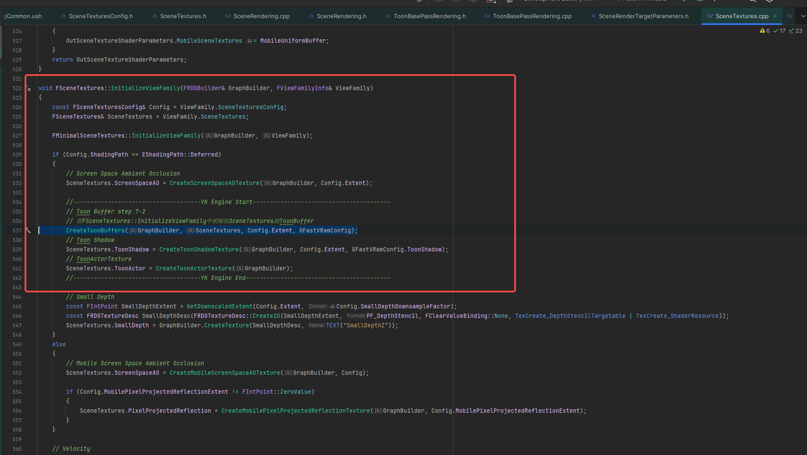


初始化ToonBufferTexture

```
SceneTextureParameters.TBufferATexture = SystemTextures.Black;
SceneTextureParameters.TBufferBTexture = SystemTextures.Black;
SceneTextureParameters.TBufferCTexture = SystemTextures.Black;
```

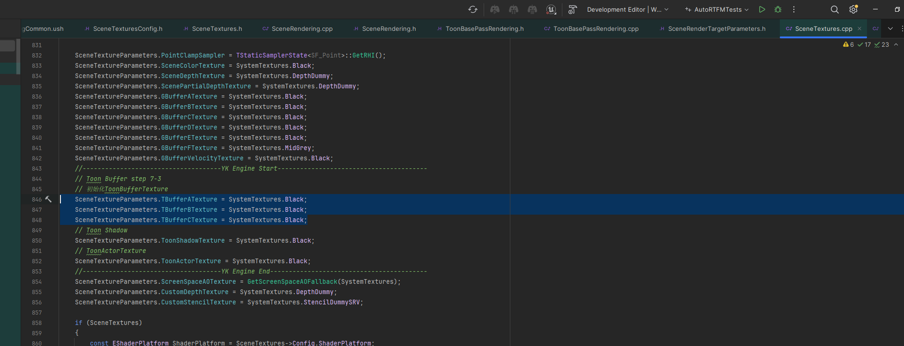


当有对应的SetupMode时，将SceneTextures的ToonBuffer与ToonBufferTexture绑定

```
if (EnumHasAnyFlags(SetupMode, ESceneTextureSetupMode::TBufferA) && HasBeenProduced(SceneTextures->TBufferA))
{
    SceneTextureParameters.TBufferATexture = SceneTextures->TBufferA;
}
if (EnumHasAnyFlags(SetupMode, ESceneTextureSetupMode::TBufferB) && HasBeenProduced(SceneTextures->TBufferB))
{
    SceneTextureParameters.TBufferBTexture = SceneTextures->TBufferB;
}
if (EnumHasAnyFlags(SetupMode, ESceneTextureSetupMode::TBufferC) && HasBeenProduced(SceneTextures->TBufferC))
{
    SceneTextureParameters.TBufferCTexture = SceneTextures->TBufferC;
}
// Toon Shadow
if (EnumHasAnyFlags(SetupMode, ESceneTextureSetupMode::ToonShadow) && HasBeenProduced(SceneTextures->ToonShadow))
{
    SceneTextureParameters.ToonShadowTexture = SceneTextures->ToonShadow;
}
// ToonActorTexture
if (EnumHasAnyFlags(SetupMode, ESceneTextureSetupMode::ToonActor) && HasBeenProduced(SceneTextures->ToonActor))
{
    SceneTextureParameters.ToonActorTexture = SceneTextures->ToonActor;
}
```

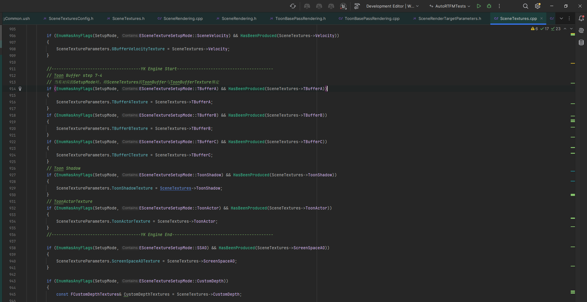

## 4.9  将RenderTaarget设置为ToonBuffer

```
FToonBasePassParameters* GetToonPassParameters(FRDGBuilder& GraphBuilder, const FViewInfo& View, FSceneTextures& SceneTextures)
{
    FToonBasePassParameters* PassParameters = GraphBuilder.AllocParameters<FToonBasePassParameters>();
    PassParameters->View = View.ViewUniformBuffer;
    // Toon Buffer step 8
    // 将RenderTaarget设置为ToonBuffer
    PassParameters->RenderTargets[0] = FRenderTargetBinding(SceneTextures.TBufferA, ERenderTargetLoadAction::ELoad);
    PassParameters->RenderTargets[1] = FRenderTargetBinding(SceneTextures.TBufferB, ERenderTargetLoadAction::ELoad);
    PassParameters->RenderTargets[2] = FRenderTargetBinding(SceneTextures.TBufferC, ERenderTargetLoadAction::ELoad);
    PassParameters->RenderTargets.DepthStencil = FDepthStencilBinding(SceneTextures.Depth.Target, ERenderTargetLoadAction::ELoad, ERenderTargetLoadAction::ELoad, FExclusiveDepthStencil::DepthWrite_StencilWrite);

    return PassParameters;
}
```

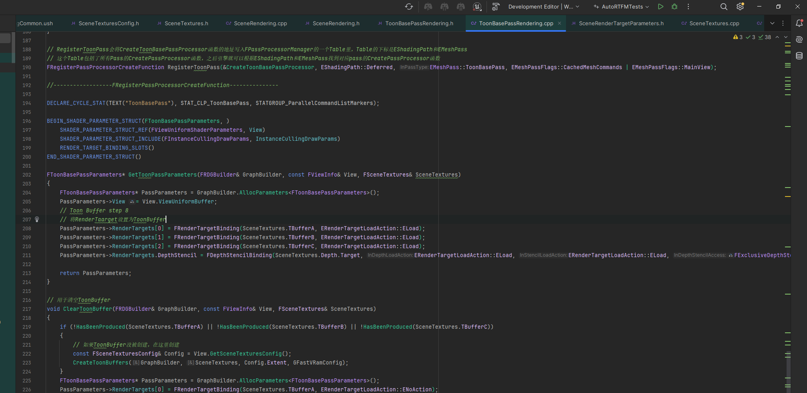

清空操作

```
void ClearToonBuffer(FRDGBuilder& GraphBuilder, const FViewInfo& View, FSceneTextures& SceneTextures)
{
    if (!HasBeenProduced(SceneTextures.TBufferA) || !HasBeenProduced(SceneTextures.TBufferB) || !HasBeenProduced(SceneTextures.TBufferC))
    {
       // 如果ToonBuffer没被创建，在这里创建
       const FSceneTexturesConfig& Config = View.GetSceneTexturesConfig();
       CreateToonBuffers(GraphBuilder, SceneTextures, Config.Extent, GFastVRamConfig);
    }
    FToonBasePassParameters* PassParameters = GraphBuilder.AllocParameters<FToonBasePassParameters>();
    PassParameters->RenderTargets[0] = FRenderTargetBinding(SceneTextures.TBufferA, ERenderTargetLoadAction::ENoAction);
    PassParameters->RenderTargets[1] = FRenderTargetBinding(SceneTextures.TBufferB, ERenderTargetLoadAction::ENoAction);
    PassParameters->RenderTargets[2] = FRenderTargetBinding(SceneTextures.TBufferC, ERenderTargetLoadAction::ENoAction);
    
    GraphBuilder.AddPass(RDG_EVENT_NAME("TBufferClear"), PassParameters, ERDGPassFlags::Raster,
          [PassParameters](FRHICommandList& RHICmdList)
       {
          // If no fast-clear action was used, we need to do an MRT shader clear.
          const FRenderTargetBindingSlots& RenderTargets = PassParameters->RenderTargets;
          FLinearColor ClearColors[MaxSimultaneousRenderTargets];
          FRHITexture* Textures[MaxSimultaneousRenderTargets];
          int32 TextureIndex = 0;

          RenderTargets.Enumerate([&](const FRenderTargetBinding& RenderTarget)
          {
             FRHITexture* TextureRHI = RenderTarget.GetTexture()->GetRHI();
             ClearColors[TextureIndex] = TextureRHI->GetClearColor();
             Textures[TextureIndex] = TextureRHI;
             ++TextureIndex;
          });

          DrawClearQuadMRT(RHICmdList, true, TextureIndex, ClearColors, false, 0, false, 0);
          
       });
}
```

## 4.10  设置RenderTarget

```
void MainPS(
    FSimpleMeshPassVSToPS In,
    out uint4 OutColor1 : SV_Target0,
    out float4 OutColor2 : SV_Target1,
    out float4 OutColor3 : SV_Target2
    )
{
    // 获取像素的材质参数(此处的材质就是材质辑器编辑出来的材质).
    FMaterialPixelParameters MaterialParameters = GetMaterialPixelParameters(In.FactoryInterpolants, In.SvPosition);
    
    FToonBuffer ToonBuffer = GetToonBuffer(MaterialParameters);

    EncodeToonBuffer(ToonBuffer, OutColor1, OutColor2, OutColor3);
}
```

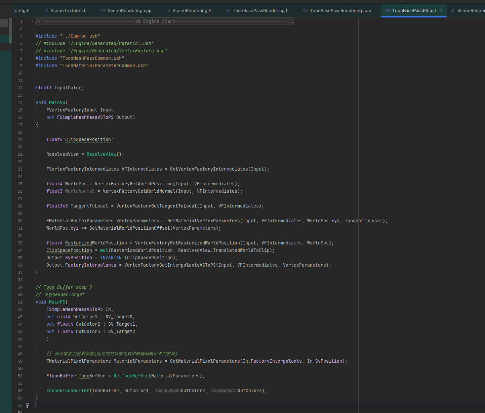

## 4.11  输出ToonBuffer

```
FToonBuffer GetToonBuffer(FMaterialPixelParameters MaterialParameters)
{
    FToonBuffer ToonBuffer;
    ToonBuffer.SelfID = 0;
    ToonBuffer.ObjectID = 0;
    ToonBuffer.ToonModel = 0;
    ToonBuffer.ShadowCastFlag = 0;
    ToonBuffer.HairShadowOffset = 0.0f;
    ToonBuffer.SpecularSmoothness = 0.5f;
    ToonBuffer.SpecularOffset = 0.0f;
    ToonBuffer.ToonBufferC = 0.0f;
#if NUM_MATERIAL_OUTPUTS_GETTOONBUFFEROUTPUT
    ToonBuffer.SelfID = clamp(GetToonBufferOutput0(MaterialParameters), 0.0f, 255.0f);
    ToonBuffer.ObjectID = clamp(GetToonBufferOutput1(MaterialParameters), 0.0f, 255.0f);
    ToonBuffer.ToonModel = clamp(GetToonBufferOutput2(MaterialParameters), 0.0f, 7.0f);
    ToonBuffer.ShadowCastFlag = clamp(GetToonBufferOutput3(MaterialParameters), 0.0f, 32.0f);
    ToonBuffer.HairShadowOffset = GetToonBufferOutput4(MaterialParameters);
    ToonBuffer.SpecularSmoothness = GetToonBufferOutput5(MaterialParameters);
    ToonBuffer.SpecularOffset = GetToonBufferOutput6(MaterialParameters);
    ToonBuffer.ToonBufferC = GetToonBufferOutput7(MaterialParameters);
#endif

    return ToonBuffer;
}
```

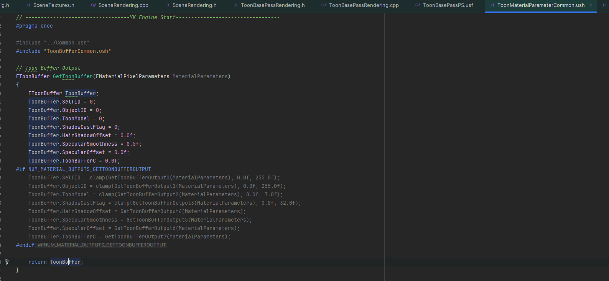


Toon材质的自定义属性输出

```
#pragma once

#include "CoreMinimal.h"
#include "Materials/MaterialExpressionCustomOutput.h"
#include "UObject/ObjectMacros.h"
#include "MaterialExpressionToonBufferOutput.generated.h"

/** Toon材质的自定义属性输出. */
UCLASS(MinimalAPI, collapsecategories, hidecategories = Object)
class UMaterialExpressionToonBufferOutput : public UMaterialExpressionCustomOutput
{
    GENERATED_UCLASS_BODY()

    // uint 8bit [0 - 255]
    UPROPERTY()
    FExpressionInput SelfID;
    // uint 8bit [0 - 255]
    UPROPERTY()
    FExpressionInput ObjectID;
    // uint 3bit [0 - 7]
    UPROPERTY()
    FExpressionInput ToonModel;
    // uint 5bit Mask
    UPROPERTY()
    FExpressionInput ShadowCastFlag;
    UPROPERTY()
    // float 8bit [0 - 1]
    FExpressionInput HairShadowOffset;
    // float 8bit [0 - 1]
    UPROPERTY()
    FExpressionInput SpecularSmoothness;
    // float 8bit [-1 - 1]
    UPROPERTY()
    FExpressionInput SpecularOffset;
    UPROPERTY()
    FExpressionInput ToonDataC;

public:
#if WITH_EDITOR
    //~ Begin UMaterialExpression Interface
    // 主要的功能实现在Compile()函数种
    virtual int32 Compile(class FMaterialCompiler* Compiler, int32 OutputIndex) override;
    virtual void GetCaption(TArray<FString>& OutCaptions) const override;
    virtual uint32 GetInputType(int32 InputIndex) override;
    //~ End UMaterialExpression Interface
#endif

    //~ Begin UMaterialExpressionCustomOutput Interface
    // 针脚的数量
    virtual int32 GetNumOutputs() const override;
    // 获取针脚属性的函数名
    virtual FString GetFunctionName() const override;
    // 节点的名称
    virtual FString GetDisplayName() const override;
    //~ End UMaterialExpressionCustomOutput Interface
};
```

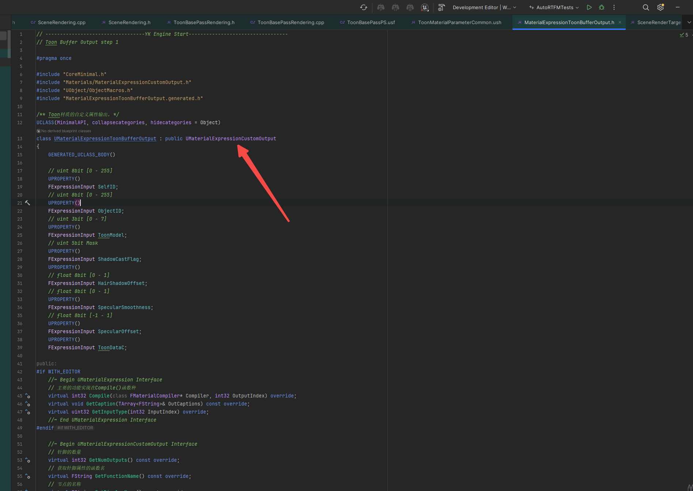

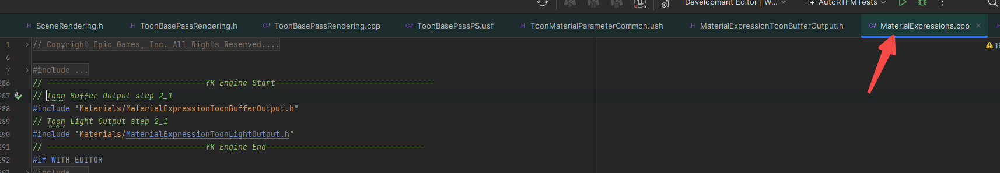

```
// ----------------------------------YK Engine Start----------------------------------
// Toon Buffer Output step 2_2
/** Toon材质的自定义属性输出. */

UMaterialExpressionToonBufferOutput::UMaterialExpressionToonBufferOutput(const FObjectInitializer& ObjectInitializer)
    : Super(ObjectInitializer)
{
    // Structure to hold one-time initialization
    // 节点的分类
    struct FConstructorStatics
    {
       FText NAME_Toon;
       FConstructorStatics()
          : NAME_Toon(LOCTEXT("Toon", "Toon"))
       {
       }
    };
    static FConstructorStatics ConstructorStatics;

#if WITH_EDITORONLY_DATA
    MenuCategories.Add(ConstructorStatics.NAME_Toon);
#endif

#if WITH_EDITOR
    Outputs.Reset();
#endif
}

#if WITH_EDITOR

uint32 UMaterialExpressionToonBufferOutput::GetInputType(int32 InputIndex)
{
    if(InputIndex < 7)
    {
       return MCT_Float1;
    }
    if (InputIndex == 7)
    {
       return MCT_Float4;
    }
    check(false);
    return MCT_Float3;
}


int32 UMaterialExpressionToonBufferOutput::Compile(class FMaterialCompiler* Compiler, int32 OutputIndex)
{
    int32 CodeInput = INDEX_NONE;

    const bool bStrata = Strata::IsStrataEnabled();

    // 这里会在BasePixelShader.usf.里生成一个获取针脚属性的函数
    // 如获取第一个针脚的数据使用函数GetToonBufferOutput0(MaterialParameters)
    // Generates function names GetToonBufferOutput{index} used in BasePixelShader.usf.
    if (OutputIndex == 0)
    {
       CodeInput = SelfID.IsConnected() ? SelfID.Compile(Compiler) : Compiler->Constant(0);
    }
    if (OutputIndex == 1)
    {
       CodeInput = ObjectID.IsConnected() ? ObjectID.Compile(Compiler) : Compiler->Constant(0);
    }
    if (OutputIndex == 2)
    {
       CodeInput = ToonModel.IsConnected() ? ToonModel.Compile(Compiler) : Compiler->Constant(0);
    }
    if (OutputIndex == 3)
    {
       CodeInput = ShadowCastFlag.IsConnected() ? ShadowCastFlag.Compile(Compiler) : Compiler->Constant(0);
    }
    if (OutputIndex == 4)
    {
       CodeInput = HairShadowOffset.IsConnected() ? HairShadowOffset.Compile(Compiler) : Compiler->Constant(0);
    }
    if (OutputIndex == 5)
    {
       CodeInput = SpecularSmoothness.IsConnected() ? SpecularSmoothness.Compile(Compiler) : Compiler->Constant(0.5f);
    }
    if (OutputIndex == 6)
    {
       CodeInput = SpecularOffset.IsConnected() ? SpecularOffset.Compile(Compiler) : Compiler->Constant(0.5f);
    }
    if (OutputIndex == 7)
    {
       CodeInput = ToonDataC.IsConnected() ? ToonDataC.Compile(Compiler) : Compiler->Constant4(0.f, 0.f, 0.f, 0.f);
    }

    return Compiler->CustomOutput(this, OutputIndex, CodeInput);
}

void UMaterialExpressionToonBufferOutput::GetCaption(TArray<FString>& OutCaptions) const
{
    OutCaptions.Add(FString(TEXT("Toon Buffer")));
}

#endif // WITH_EDITOR

int32 UMaterialExpressionToonBufferOutput::GetNumOutputs() const
{
    return 8;
}

FString UMaterialExpressionToonBufferOutput::GetFunctionName() const
{
    return TEXT("GetToonBufferOutput");
}

FString UMaterialExpressionToonBufferOutput::GetDisplayName() const
{
    return TEXT("Toon Buffer");
}

// Toon Light Output step 2_2

UMaterialExpressionToonLightOutput::UMaterialExpressionToonLightOutput(const FObjectInitializer& ObjectInitializer)
    : Super(ObjectInitializer)
{
    // Structure to hold one-time initialization
    // 节点的分类
    struct FConstructorStatics
    {
       FText NAME_Toon;
       FConstructorStatics()
          : NAME_Toon(LOCTEXT("Toon", "Toon"))
       {
       }
    };
    static FConstructorStatics ConstructorStatics;

#if WITH_EDITORONLY_DATA
    MenuCategories.Add(ConstructorStatics.NAME_Toon);
#endif

#if WITH_EDITOR
    Outputs.Reset();
#endif
}

#if WITH_EDITOR

uint32 UMaterialExpressionToonLightOutput::GetInputType(int32 InputIndex)
{
    if (InputIndex == 0) { return MCT_Float3; }       // ToonLighting
    check(false);
    return MCT_Float3;
}


int32 UMaterialExpressionToonLightOutput::Compile(class FMaterialCompiler* Compiler, int32 OutputIndex)
{
    int32 CodeInput = INDEX_NONE;

    const bool bStrata = Strata::IsStrataEnabled();

    // 这里会在BasePixelShader.usf.里生成一个获取针脚属性的函数
    // 如获取第一个针脚的数据使用函数GetToonLightOutput0(MaterialParameters)
    // Generates function names GetToonLightOutput{index} used in BasePixelShader.usf.
    if (OutputIndex == 0)
    {
       CodeInput = ToonLighting.IsConnected() ? ToonLighting.Compile(Compiler) : Compiler->Constant(0);
    }

    return Compiler->CustomOutput(this, OutputIndex, CodeInput);
}

void UMaterialExpressionToonLightOutput::GetCaption(TArray<FString>& OutCaptions) const
{
    OutCaptions.Add(FString(TEXT("Toon Light")));
}

#endif // WITH_EDITOR

int32 UMaterialExpressionToonLightOutput::GetNumOutputs() const
{
    return 1;
}

FString UMaterialExpressionToonLightOutput::GetFunctionName() const
{
    return TEXT("GetToonLightOutput");
}

FString UMaterialExpressionToonLightOutput::GetDisplayName() const
{
    return TEXT("Toon Light");
}
```

# 5. 总结

在UE中新增GBuffer的步骤有些过于复杂，同时UE使用C++控制HLSL的过程在Debug过程中比较有难度。同时新增的GBuffer也会增加相关带宽消耗（移动端几乎可以放弃）。

不过新增GBuffer可以将BasePass阶段相关数据存储为RT后传递给后续流程进行计算。