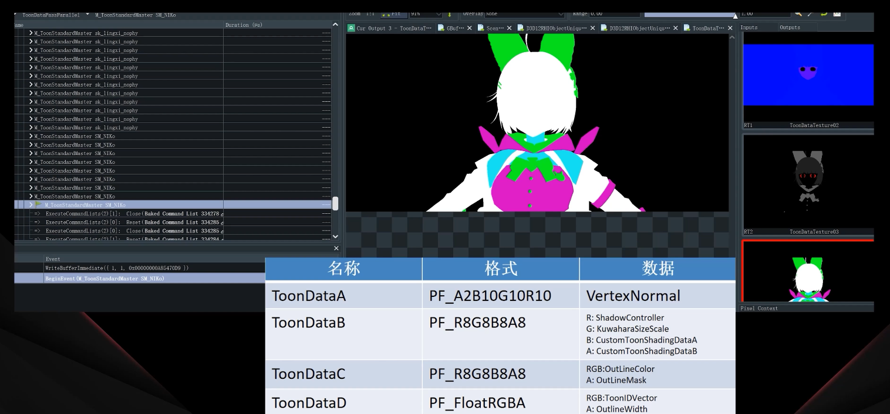
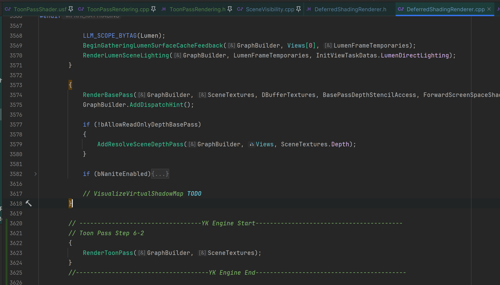
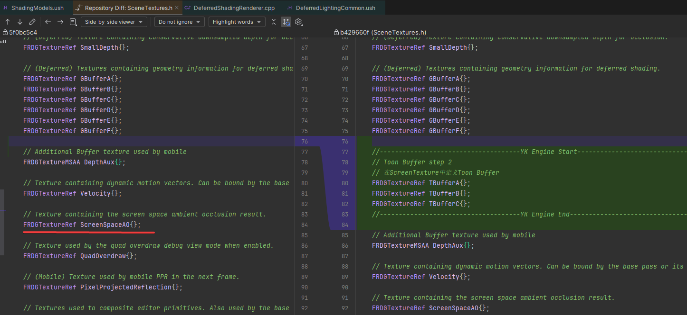
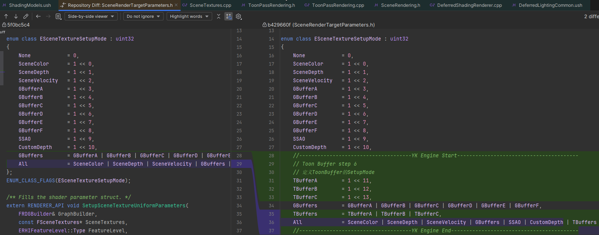
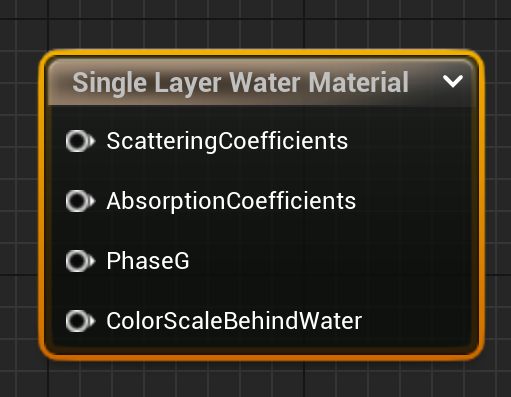
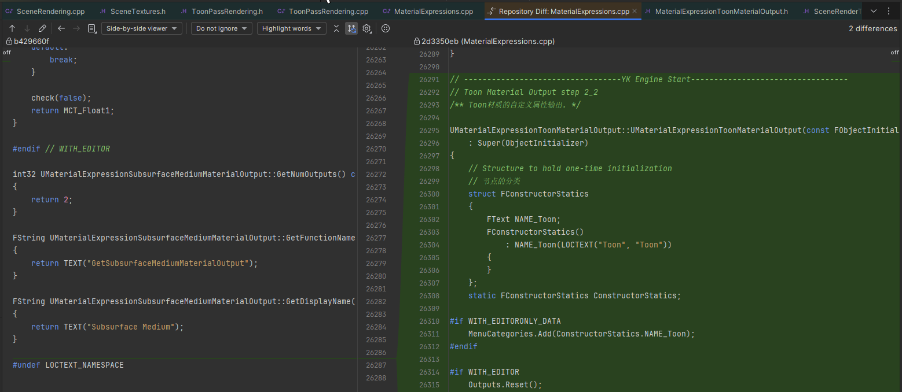
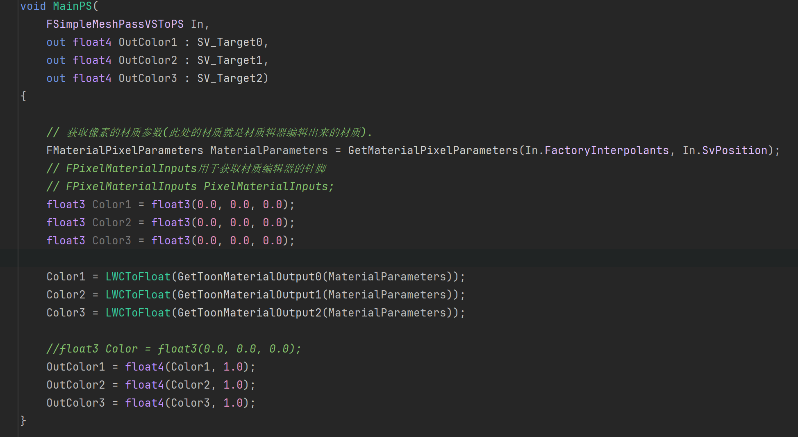
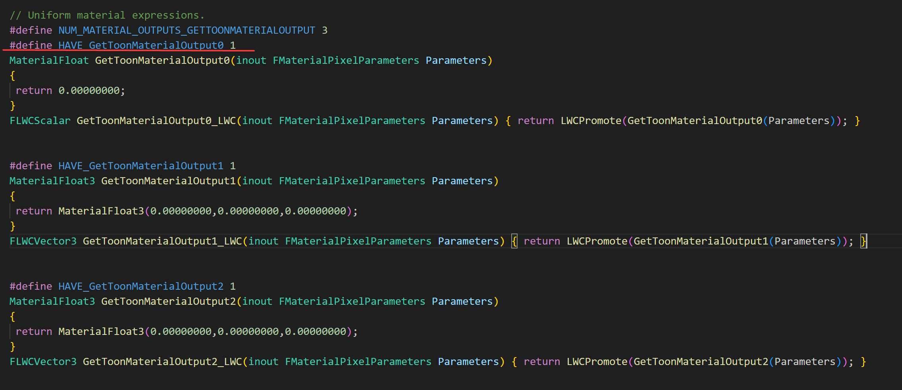
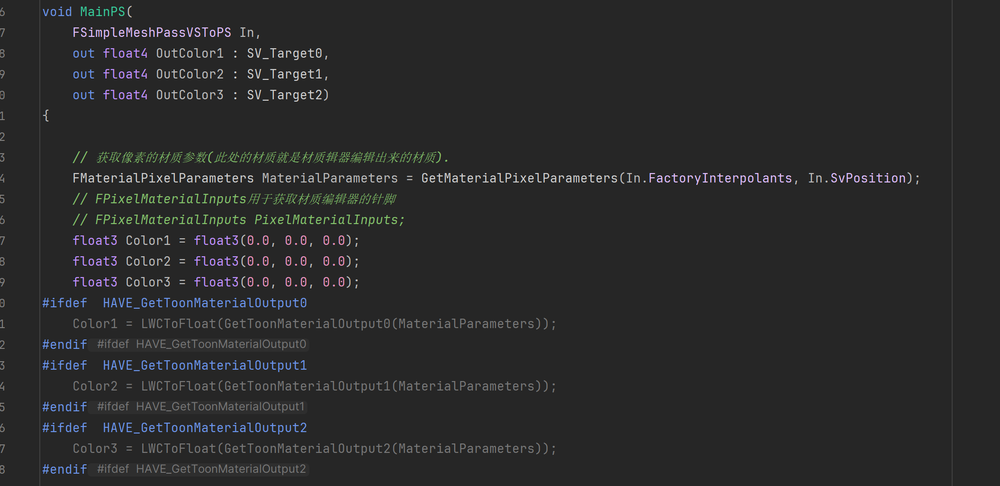
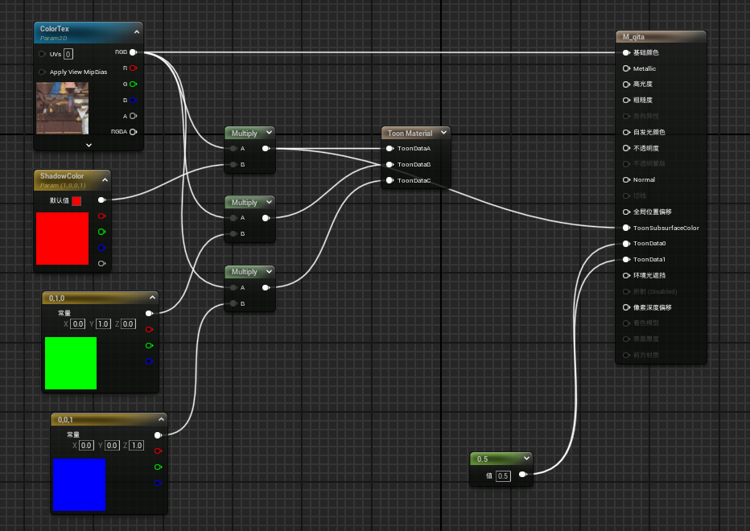

##### 一、前言

###### 1.1 背景

之前扩展GBuffer往里面添加一张新的Buffer，用来写入一些卡通渲染需要的额外数据。正常使用都没什么问题，但是当我把某个材质的shading model切换成Single Layer Water时，引擎crash掉了。

看了一下crash的堆栈信息，发现当使用Single Layer Water时，会增加一张叫“SLW.SeparatedMainDirLight”的RenderTarget，导致RenderTarget的数量超过了8张。


既然如此，我也不想继续扩展GBuffer了，我打算参考YivanLee大佬的做法，如下图，他在一个自定义的Pass里，把卡通渲染需要的数据写入了自定义的ToonDataTexture里。


> [https://www.bilibili.com/video/BV18Y411R7xZ](attachments/https://www.bilibili.com/video/BV18Y411R7xZ)

###### 1.2 总览

文章太长不看，所以这里先简单介绍一下本文的工作：
1. 首先添加了一个叫ToonPass的MeshDrawPass，该pass会在BasePass之后执行，只绘制使用Toon相关ShadingModel的网格
2. 接下来创建了三张FRDGTexture，命名为"TBufferTexture"，设置ToonPass的RenderTarget为TBuffer
3. 添加一个叫“ToonMaterialOutput”的材质节点，让ToonPasss的shader读取节点针脚上写入的数据，把它们写到TBuffer上

效果如下，TBuffer里写入的数据是我随便给的。


代码已经公开了，请访问我的Github仓库自取。
[https://github.com/Yu-ki016/UnrealEngine/tree/YK_Engine](attachments/https://github.com/Yu-ki016/UnrealEngine/tree/YK_Engine)
关于我的Github仓库文末有一些简单的介绍，可以导航到“三、Github仓库”部分查看。

#####   二、实现

###### 2.1添加ToonPass

关于如何添加一个自定义的MeshDrawPass，已经有很多大佬写了许多优秀的文章，我们可以直接参考他们的文章来修改。
[https://zhuanlan.zhihu.com/p/552283835](https://zhuanlan.zhihu.com/p/552283835)
[https://zhuanlan.zhihu.com/p/66545369[https://zhuanlan.zhihu.com/p/66545369)

首先我添加了一个简单的shader，用来测试效果，文件路径为：Engine/Shaders/Private/Toon/ToonPassShader.usf
```c++
// ----------------------------------YK Engine Start-----------------------------------------
// Toon Pass Step 1
// Toon Pass使用的shader

#include "../Common.ush"
#include "/Engine/Generated/Material.ush"
#include "/Engine/Generated/VertexFactory.ush"


struct FSimpleMeshPassVSToPS
{
	FVertexFactoryInterpolantsVSToPS FactoryInterpolants;
	float4 SvPosition : SV_POSITION;
};


float3 InputColor;

void MainVS(
	FVertexFactoryInput Input,
	out FSimpleMeshPassVSToPS Output)
{

	float4 ClipSpacePosition;
	
	ResolvedView = ResolveView();

	FVertexFactoryIntermediates VFIntermediates = GetVertexFactoryIntermediates(Input);

	float4 WorldPos = VertexFactoryGetWorldPosition(Input, VFIntermediates);
	float3 WorldNormal = VertexFactoryGetWorldNormal(Input, VFIntermediates);

	float3x3 TangentToLocal = VertexFactoryGetTangentToLocal(Input, VFIntermediates);

	FMaterialVertexParameters VertexParameters = GetMaterialVertexParameters(Input, VFIntermediates, WorldPos.xyz, TangentToLocal);
	WorldPos.xyz += GetMaterialWorldPositionOffset(VertexParameters);

	float4 RasterizedWorldPosition = VertexFactoryGetRasterizedWorldPosition(Input, VFIntermediates, WorldPos);
	ClipSpacePosition = mul(RasterizedWorldPosition, ResolvedView.TranslatedWorldToClip);
	Output.SvPosition = INVARIANT(ClipSpacePosition);
	Output.FactoryInterpolants = VertexFactoryGetInterpolantsVSToPS(Input, VFIntermediates, VertexParameters);
}

void MainPS(
	FSimpleMeshPassVSToPS In,
	out float4 OutColor : SV_Target0)
{
	float3 Color = float3(1.0, 0.0, 0.0);
	OutColor = float4(Color, 1.0);
}


//-------------------------------------YK Engine End------------------------------------------
```

接下来，打开Engine/Source/Runtime/Renderer/Public/MeshPassProcessor.h，在EMeshPass中添加MeshDrawPass枚举：


在MeshPassProcessor.h下方的GetMeshPassName()函数中添加ToonPass的字符串命名:


GetMeshPassName()函数下面MeshPass最大数量+1:


打开Engine/Source/Runtime/Engine/Public/PSOPrecache.h，把MaxPSOCollectorCount也+1


接下来创建Engine/Source/Runtime/Renderer/Private/ToonPassRendering.h和/ToonPassRendering.cpp这两个文件，关于ToonPass的具体实现大多都放在这里面。

在ToonPassRendering.h中定义类FToonPassMeshProcessor
```C++
#pragma once

#include "DataDrivenShaderPlatformInfo.h"
#include "MeshPassProcessor.h"

#include "MeshMaterialShader.h"

class FToonPassMeshProcessor : public FMeshPassProcessor
{
public:
	FToonPassMeshProcessor(
		const FScene* Scene,
		ERHIFeatureLevel::Type InFeatureLevel,
		const FSceneView* InViewIfDynamicMeshCommand,
		const FMeshPassProcessorRenderState& InPassDrawRenderState,
		FMeshPassDrawListContext* InDrawListContext
	);

	// 函数将会从引擎底层拿到MeshBatch，Material等资源
	// MeshBatch简单理解就是同一批次的网格
	// 我们通过这个函数筛选哪些Mesh需要绘制并调用Process()
	virtual void AddMeshBatch(
		const FMeshBatch& RESTRICT MeshBatch,
		uint64 BatchElementMask,
		const FPrimitiveSceneProxy* RESTRICT PrimitiveSceneProxy,
		int32 StaticMeshId = -1
	) override final;

private:
	// 准备好数据(MeshBatch，要用什么shader绘制，shader参数，剔除方式，深度测试等)
	// 将数据传递给BuildMeshDrawCommands生成MeshDrawCommand
	// MeshDrawCommand是完整描述了一个Pass Draw Call的所有状态和数据，如shader绑定、顶点数据、索引数据、PSO缓存等
	// 之后引擎会把MeshDrawCommand转化为RHI命令进行渲染
	bool Process(
		const FMeshBatch& MeshBatch,
		uint64 BatchElementMask,
		int32 StaticMeshId,
		const FPrimitiveSceneProxy* RESTRICT PrimitiveSceneProxy,
		const FMaterialRenderProxy& RESTRICT MaterialRenderProxy,
		const FMaterial& RESTRICT MaterialResource,
		ERasterizerFillMode MeshFillMode,
		ERasterizerCullMode MeshCullMode
	);

	FMeshPassProcessorRenderState PassDrawRenderState;
};
```

在ToonPassRendering.h下方在加上shader类（FToonPassVS和FToonPassPS）的声明。

这里声明的shader相当于hlsl端shader（ToonPassShader.usf）与c++端之间的桥梁，它存储着Shader关联的绑定参数、顶点工厂、编译后的各类资源等数据，并提供了编译器修改和检测接口，还有各类数据获取接口
```c++
class FToonPassVS : public FMeshMaterialShader
{
    DECLARE_SHADER_TYPE(FToonPassVS, MeshMaterial);

public:
    FToonPassVS() = default;
    FToonPassVS(const ShaderMetaType::CompiledShaderInitializerType& Initializer)
        : FMeshMaterialShader(Initializer)
    {

    }

    static void ModifyCompilationEnvironment(const FMaterialShaderPermutationParameters& Parameters, FShaderCompilerEnvironment& OutEnvironment)
    {}

    static bool ShouldCompilePermutation(const FMeshMaterialShaderPermutationParameters& Parameters)
    {
        return IsFeatureLevelSupported(Parameters.Platform, ERHIFeatureLevel::SM5) &&
            (Parameters.VertexFactoryType->GetFName() == FName(TEXT("FLocalVertexFactory")) || 
                Parameters.VertexFactoryType->GetFName() == FName(TEXT("TGPUSkinVertexFactoryDefault")));
    }

    void GetShaderBindings(
        const FScene* Scene,
        ERHIFeatureLevel::Type FeatureLevel,
        const FPrimitiveSceneProxy* PrimitiveSceneProxy,
        const FMaterialRenderProxy& MaterialRenderProxy,
        const FMaterial& Material,
        const FMeshPassProcessorRenderState& DrawRenderState,
        const FMeshMaterialShaderElementData& ShaderElementData,
        FMeshDrawSingleShaderBindings& ShaderBindings) const
    {
        FMeshMaterialShader::GetShaderBindings(Scene, FeatureLevel, PrimitiveSceneProxy, MaterialRenderProxy, Material, DrawRenderState, ShaderElementData, ShaderBindings);
    }

};


class FToonPassPS : public FMeshMaterialShader
{
    DECLARE_SHADER_TYPE(FToonPassPS, MeshMaterial);

public:

    FToonPassPS() = default;
    FToonPassPS(const ShaderMetaType::CompiledShaderInitializerType& Initializer)
        : FMeshMaterialShader(Initializer)
    {
        // 这个用于绑定shader的参数InputColor，虽然shader中没有使用
        InputColor.Bind(Initializer.ParameterMap, TEXT("InputColor"));
    }

    static void ModifyCompilationEnvironment(const FMaterialShaderPermutationParameters& Parameters, FShaderCompilerEnvironment& OutEnvironment)
    {}

    static bool ShouldCompilePermutation(const FMeshMaterialShaderPermutationParameters& Parameters)
    {
        return IsFeatureLevelSupported(Parameters.Platform, ERHIFeatureLevel::SM5) &&
            (Parameters.VertexFactoryType->GetFName() == FName(TEXT("FLocalVertexFactory")) || 
                Parameters.VertexFactoryType->GetFName() == FName(TEXT("TGPUSkinVertexFactoryDefault")));
    }

    void GetShaderBindings(
        const FScene* Scene,
        ERHIFeatureLevel::Type FeatureLevel,
        const FPrimitiveSceneProxy* PrimitiveSceneProxy,
        const FMaterialRenderProxy& MaterialRenderProxy,
        const FMaterial& Material,
        const FMeshPassProcessorRenderState& DrawRenderState,
        const FMeshMaterialShaderElementData& ShaderElementData,
        FMeshDrawSingleShaderBindings& ShaderBindings) const
    {
        FMeshMaterialShader::GetShaderBindings(Scene, FeatureLevel, PrimitiveSceneProxy, MaterialRenderProxy, Material, DrawRenderState, ShaderElementData, ShaderBindings);

        FVector3f Color(1.0, 0.0, 0.0);

        ShaderBindings.Add(InputColor, Color);
    }

    LAYOUT_FIELD(FShaderParameter, InputColor);
};
```

在ToonPassRendering.cpp的开头把FToonPassVS、FToonPassPS与hlsl端的shader绑定起来
```c++
#include "ToonPassRendering.h"

#include "ScenePrivate.h"
#include "MeshPassProcessor.inl"
#include "SimpleMeshDrawCommandPass.h"
#include "StaticMeshBatch.h"
#include "DeferredShadingRenderer.h"

// IMPLEMENT_MATERIAL_SHADER_TYPE接受的参数：
// FToonPassPS:我们在ToonPassRendering.h中定义的shader类
// TEXT("/Engine/Private/Toon/ToonPassShader.usf"):我们使用的shader路径
// TEXT("MainPS"):shader的入口函数名
// SF_Pixel:shader的类型，Vertex shader、Pixel shader或者compute shader
IMPLEMENT_MATERIAL_SHADER_TYPE(, FToonPassVS, TEXT("/Engine/Private/Toon/ToonPassShader.usf"), TEXT("MainVS"), SF_Vertex);
IMPLEMENT_MATERIAL_SHADER_TYPE(, FToonPassPS, TEXT("/Engine/Private/Toon/ToonPassShader.usf"), TEXT("MainPS"), SF_Pixel);
```

在ToonPassRendering.cpp中实现FToonPassMeshProcessor的构造函数：
```c++
FToonPassMeshProcessor::FToonPassMeshProcessor(
    const FScene* Scene,
    ERHIFeatureLevel::Type InFeatureLevel,
    const FSceneView* InViewIfDynamicMeshCommand,
    const FMeshPassProcessorRenderState& InPassDrawRenderState,
    FMeshPassDrawListContext* InDrawListContext)
:FMeshPassProcessor(Scene, Scene->GetFeatureLevel(), InViewIfDynamicMeshCommand, InDrawListContext),
PassDrawRenderState(InPassDrawRenderState)
{
	// 设置默认的BlendState和DepthStencilState
	// BlendState控制颜色混合方式
	// DepthStencilState控制深度写入，深度测试等行为
    if (PassDrawRenderState.GetDepthStencilState() == nullptr)
    {
    	PassDrawRenderState.SetDepthStencilState(TStaticDepthStencilState<false, CF_DepthNearOrEqual>().GetRHI());
    }
    if (PassDrawRenderState.GetBlendState() == nullptr)
    {
        PassDrawRenderState.SetBlendState(TStaticBlendState<>().GetRHI());
    }
}
```

在ToonPassRendering.cpp中实现AddMeshBatch函数：
```c++
void FToonPassMeshProcessor::AddMeshBatch(
    const FMeshBatch& MeshBatch,
    uint64 BatchElementMask,
    const FPrimitiveSceneProxy* PrimitiveSceneProxy,
    int32 StaticMeshId)
{
    const FMaterialRenderProxy* MaterialRenderProxy = MeshBatch.MaterialRenderProxy;

    const FMaterial* Material = MaterialRenderProxy->GetMaterialNoFallback(FeatureLevel);

    if (Material != nullptr && Material->GetRenderingThreadShaderMap())
    {
		const FMaterialShadingModelField ShadingModels = Material->GetShadingModels();
    	// 只有材质使用了Toon相关的shading model才会被绘制
	    if (ShadingModels.HasShadingModel(MSM_Toon) || ShadingModels.HasShadingModel(MSM_ToonFace))
	    {
	    	const EBlendMode BlendMode = Material->GetBlendMode();

	    	bool bResult = true;
	    	if (BlendMode == BLEND_Opaque)
	    	{
	    		Process(
					MeshBatch,
					BatchElementMask,
					StaticMeshId,
					PrimitiveSceneProxy,
					*MaterialRenderProxy,
					*Material,
					FM_Solid,
					CM_CW); //背面剔除
	    	}
	    }
    }
}
```

在ToonPassRendering.cpp中实现Process函数：
```c
bool FToonPassMeshProcessor::Process(
    const FMeshBatch& MeshBatch,
    uint64 BatchElementMask,
    int32 StaticMeshId,
    const FPrimitiveSceneProxy* PrimitiveSceneProxy,
    const FMaterialRenderProxy& MaterialRenderProxy,
    const FMaterial& RESTRICT MaterialResource,
    ERasterizerFillMode MeshFillMode,
    ERasterizerCullMode MeshCullMode)
{
    const FVertexFactory* VertexFactory = MeshBatch.VertexFactory;

    TMeshProcessorShaders<FToonPassVS, FToonPassVS> ToonPassShader;
    {
        FMaterialShaderTypes ShaderTypes;
    	// 指定使用的shader
        ShaderTypes.AddShaderType<FToonPassVS>();
        ShaderTypes.AddShaderType<FToonPassPS>();

        const FVertexFactoryType* VertexFactoryType = VertexFactory->GetType();

        FMaterialShaders Shaders;
        if (!MaterialResource.TryGetShaders(ShaderTypes, VertexFactoryType, Shaders))
        {
            //UE_LOG(LogShaders, Warning, TEXT("Shader Not Found!"));
            return false;
        }

        Shaders.TryGetVertexShader(ToonPassShader.VertexShader);
        Shaders.TryGetPixelShader(ToonPassShader.PixelShader);
    }


    FMeshMaterialShaderElementData ShaderElementData;
    ShaderElementData.InitializeMeshMaterialData(ViewIfDynamicMeshCommand, PrimitiveSceneProxy, MeshBatch, StaticMeshId, false);

    const FMeshDrawCommandSortKey SortKey = CalculateMeshStaticSortKey(ToonPassShader.VertexShader, ToonPassShader.PixelShader);
	PassDrawRenderState.SetDepthStencilState(TStaticDepthStencilState<false, CF_DepthNearOrEqual>().GetRHI());

	FMeshPassProcessorRenderState DrawRenderState(PassDrawRenderState);
	
    BuildMeshDrawCommands(
        MeshBatch,
        BatchElementMask,
        PrimitiveSceneProxy,
        MaterialRenderProxy,
        MaterialResource,
        DrawRenderState,
        ToonPassShader,
        MeshFillMode,
        MeshCullMode,
        SortKey,
        EMeshPassFeatures::Default,
        ShaderElementData
    );

    return true;
}
```

接下来还要在ToonPassRendering.cpp中实现FRegisterPassProcessorCreateFunction，这样就把FToonPassMeshProcessor注册进FPassProcessorManager里了
```c
void SetupToonPassState(FMeshPassProcessorRenderState& DrawRenderState)
{
	DrawRenderState.SetDepthStencilState(TStaticDepthStencilState<false, CF_DepthNearOrEqual>::GetRHI());
}

FMeshPassProcessor* CreateToonPassProcessor(ERHIFeatureLevel::Type FeatureLevel, const FScene* Scene, const FSceneView* InViewIfDynamicMeshCommand, FMeshPassDrawListContext* InDrawListContext)
{
	FMeshPassProcessorRenderState ToonPassState;
	SetupToonPassState(ToonPassState);
	return new FToonPassMeshProcessor(Scene, FeatureLevel, InViewIfDynamicMeshCommand, ToonPassState, InDrawListContext);
}

// RegisterToonPass会将CreateToonPassProcessor函数的地址写入FPassProcessorManager的一个Table里，Table的下标是EShadingPath和EMeshPass
// 这个Table包括了所以Pass的CreatePassProcessor函数，之后引擎就可以根据EShadingPath和EMeshPass找到对应pass的CreatePassProcessor函数
FRegisterPassProcessorCreateFunction RegisterToonPass(&CreateToonPassProcessor, EShadingPath::Deferred, EMeshPass::ToonPass, EMeshPassFlags::CachedMeshCommands | EMeshPassFlags::MainView);
```

接下来找到Engine/Source/Runtime/Renderer/Private/SceneVisibility.cpp，添加StaticCache和DynamicCache
在FRelevancePacket::ComputeRelevance()函数的basepass静态cache下面加上toonpass

```c
DrawCommandPacket.AddCommandsForMesh(PrimitiveIndex, PrimitiveSceneInfo, StaticMeshRelevance, StaticMesh, Scene, bCanCache, EMeshPass::ToonPass);
```

在ComputeDynamicMeshRelevance()函数的basepass动态cache下面加上toonpass


然后找到Engine/Source/Runtime/Renderer/Private/DeferredShadingRenderer.h，在FDeferredShadingSceneRenderer中添加一个新的函数RenderToonPass()

FDeferredShadingSceneRenderer::Render()是unreal延迟渲染的入口函数，我们会在FDeferredShadingSceneRenderer::Render里调用RenderToonPass()来渲染我们自己的pass


打开Engine/Source/Runtime/Renderer/Private/DeferredShadingRenderer.h把RenderToonPass放在BasePass下面：


RenderToonPass()的实现我们放到ToonPassRendering.cpp中：
```c
DECLARE_CYCLE_STAT(TEXT("ToonPass"), STAT_CLP_ToonPass, STATGROUP_ParallelCommandListMarkers);

BEGIN_SHADER_PARAMETER_STRUCT(FToonMeshPassParameters, )
    SHADER_PARAMETER_STRUCT_REF(FViewUniformShaderParameters, View)
    SHADER_PARAMETER_STRUCT_INCLUDE(FInstanceCullingDrawParams, InstanceCullingDrawParams)
    RENDER_TARGET_BINDING_SLOTS()
END_SHADER_PARAMETER_STRUCT()

FToonMeshPassParameters* GetToonPassParameters(FRDGBuilder& GraphBuilder, const FViewInfo& View, FSceneTextures& SceneTextures)
{
    FToonMeshPassParameters* PassParameters = GraphBuilder.AllocParameters<FToonMeshPassParameters>();
    PassParameters->View = View.ViewUniformBuffer;

	// 设置RenderTarget
    PassParameters->RenderTargets[0] = FRenderTargetBinding(SceneTextures.Color.Target, ERenderTargetLoadAction::ELoad);

    return PassParameters;
}

// 在DeferredShadingSceneRenderer调用这个函数来渲染ToonPass
void FDeferredShadingSceneRenderer::RenderToonPass(FRDGBuilder& GraphBuilder, FSceneTextures& SceneTextures)
{
    RDG_EVENT_SCOPE(GraphBuilder, "ToonPass");
    RDG_CSV_STAT_EXCLUSIVE_SCOPE(GraphBuilder, RenderToonPass);

    SCOPED_NAMED_EVENT(FDeferredShadingSceneRenderer_RenderToonPass, FColor::Emerald);

    for(int32 ViewIndex = 0; ViewIndex < Views.Num(); ++ViewIndex)
    {
        FViewInfo& View = Views[ViewIndex];
        RDG_GPU_MASK_SCOPE(GraphBuilder, View.GPUMask);
        RDG_EVENT_SCOPE_CONDITIONAL(GraphBuilder, Views.Num() > 1, "View%d", ViewIndex);

        const bool bShouldRenderView = View.ShouldRenderView();
        if(bShouldRenderView)
        {
            FToonMeshPassParameters* PassParameters = GetToonPassParameters(GraphBuilder, View, SceneTextures);

            View.ParallelMeshDrawCommandPasses[EMeshPass::ToonPass].BuildRenderingCommands(GraphBuilder, Scene->GPUScene, PassParameters->InstanceCullingDrawParams);

            GraphBuilder.AddPass(
                RDG_EVENT_NAME("ToonPass"),
                PassParameters,
                ERDGPassFlags::Raster | ERDGPassFlags::SkipRenderPass,
                [this, &View, PassParameters](const FRDGPass* InPass, FRHICommandListImmediate& RHICmdList)
            {
                FRDGParallelCommandListSet ParallelCommandListSet(InPass, RHICmdList, GET_STATID(STAT_CLP_ToonPass), View, FParallelCommandListBindings(PassParameters));
                ParallelCommandListSet.SetHighPriority();
                View.ParallelMeshDrawCommandPasses[EMeshPass::ToonPass].DispatchDraw(&ParallelCommandListSet, RHICmdList, &PassParameters->InstanceCullingDrawParams);
            });
        }
    }
}
```

完成了上面的内容之后，使用renderdoc截帧可以发现，我们已经成功地在BasePass下面添加了一个ToonPass。


###### 2.2 添加ToonBuffer

关于如何添加SceneTexture的文章我没找到，所以我顺便分享一下我添加ToonBuffer的心路历程，希望对大家自己修改自己的引擎有所参考。

一般我修改引擎会先在引擎里找一些相似的功能是怎么实现的，然后照着引擎源码改，改完build一下，能跑就成功，不能跑就再找找哪里改漏了，简单来说就是Ctrl C、Ctrl V大法。

首先我不想添加进GBuffer，所以SceneTexture的创建主要不是参考Basepass，在各个pass上溜了一遍，感觉ScreenSpaceAO挺符合我们想实现的功能的（在某个pass写入，还能在其他pass中读取）。

在全局搜索ScreenSpaceAO发现有一个叫ScreenSpaceAOTexture的东西，感觉可以以这个作为切入点：


接下来全局搜索ScreenSpaceAOTexture，大概有这些结果，上面shader部分的结果我们不需要去看，目前只需要关注c++部分，然后带mobile字眼的显然就是跟手机相关的，这部分我也不关注，所以也就只剩下11个结果，咱们挨个看一看：


首先第一个文件Engine/Source/Runtime/Engine/Public/SceneTexturesConfig.h，显然这里定义了ScreenSpaceAOTexture，我们在上面按照相同的格式，添加我们TBufferTexture的定义：


然后我们可以看到SceneTextures.cpp中使用了一个叫CreateScreenSpaceAOTexture的函数，这个函数是在PostProcessAmbientOcclusion中定义的，我们也定义一个类似的函数，放在ToonPassRendering.h中


我写文章的时候为了可以表现出我是怎么一步步改的，所以顺序跟我注释里的顺序有些区别，这里大家稍微注意一下：


在ToonPassRendering.cpp中加上这两个函数的实现：
```c
//--------------------------------ToonBufferTexture------------------------
// Toon Buffer step 5-2
FRDGTextureDesc GetToonBufferTextureDesc(FIntPoint Extent, ETextureCreateFlags CreateFlags)
{
	//输入的参数：
	//Extent：贴图尺寸；PF_B8G8R8A8：贴图格式，表示RGBA各个通道均为8bit
	//FClearValueBinding::Black:清除值，表示清除贴图时将其清除为黑色
	//TexCreate_UAV：Unordered Access View，允许在着色器中进行随机读写操作
	//TexCreate_RenderTargetable：表示纹理可作为渲染目标使用
	//TexCreate_ShaderResource：表示纹理可作为着色器资源，可以在着色器中进行采样等操作
	return FRDGTextureDesc(FRDGTextureDesc::Create2D(Extent, PF_B8G8R8A8, FClearValueBinding::Black, TexCreate_UAV | TexCreate_RenderTargetable | TexCreate_ShaderResource | CreateFlags));
}
// Toon Buffer step 5-3
FRDGTextureRef CreateToonBufferTexture(FRDGBuilder& GraphBuilder, FIntPoint Extent, ETextureCreateFlags CreateFlags)
{	
	return GraphBuilder.CreateTexture(GetToonBufferTextureDesc(Extent, CreateFlags), TEXT("TBufferA"));
}
//--------------------------------ToonBufferTexture------------------------
```

然后我们还可以看到SceneTexture.cpp中有这么一行代码，把SceneTexture的ScreenSpaceAO赋给了ScreenSpaceAOTexture，我们对着ScreenSpaceAO按一下F12，转跳到它定义的地方去看一看：


IDE帮我们转跳到Engine/Source/Runtime/Renderer/Private/SceneTextures.h里，我们也按照同样的格式，添加TBuffer。


我们回到SceneTexture.cpp，把之前搜索结果里需要改的地方补上，下面的修改也都是参考了ScreenSpaceAO。
现在开头把ToonPassRendering.h包括进去


初始化一下ToonBufferTexture：


把ToonBuffer和ToonBufferTexture绑定：


上面的截图少了TBufferB和TBufferC，代码块里的更全一点：
```c
//-------------------------------------YK Engine Start----------------------------------------
		// Toon Buffer step 7-4
		// 当有对应的SetupMode时，将SceneTextures的ToonBuffer与ToonBufferTexture绑定
		if (EnumHasAnyFlags(SetupMode, ESceneTextureSetupMode::TBufferA) && HasBeenProduced(SceneTextures->TBufferA))
		{
			
			SceneTextureParameters.TBufferATexture = SceneTextures->TBufferA;
		}
		if (EnumHasAnyFlags(SetupMode, ESceneTextureSetupMode::TBufferB) && HasBeenProduced(SceneTextures->TBufferB))
		{
			SceneTextureParameters.TBufferBTexture = SceneTextures->TBufferB;
		}
		if (EnumHasAnyFlags(SetupMode, ESceneTextureSetupMode::TBufferC) && HasBeenProduced(SceneTextures->TBufferC))
		{
			SceneTextureParameters.TBufferCTexture = SceneTextures->TBufferC;
		}
//-------------------------------------YK Engine End------------------------------------------
```

这样改完是有几处报错的，我们少定义了一些东西，我们转跳到对应的地方，添加一下。
先添加TextureCreateFlags


再添加ESceneTextureSetupMode



其他还有我全局搜索ScreenSpaceAO找到的Engine/Source/Runtime/Renderer/Private/SceneRendering.cpp中的这两处地方，它们是让我们可以通过控制台来开关ETextureCreateFlags（其实这个不加感觉也没啥问题）


到此为止，与ScreenSpaceAOTexture相关的部分我们都给ToonBufferTexture添加了差不多的内容，但还么结束，上面我们在SceneTextures.h中定义的TBuffer我们还没往里面写过数据。
我们回到ToonPassRendering.cpp中找到GetToonPassParameters()函数，我们在这里设置rendertarget为ToonBuffer，新的GetToonPassParameters()函数如下：
```c
FToonMeshPassParameters* GetToonPassParameters(FRDGBuilder& GraphBuilder, const FViewInfo& View, FSceneTextures& SceneTextures)
{
    FToonMeshPassParameters* PassParameters = GraphBuilder.AllocParameters<FToonMeshPassParameters>();
    PassParameters->View = View.ViewUniformBuffer;
	// Toon Buffer step 8
	// 将RenderTaarget设置为ToonBuffer
    if (!HasBeenProduced(SceneTextures.TBufferA))
    {
    	// 如果ToonBuffer没被创建，在这里创建
    	const FSceneTexturesConfig& Config = View.GetSceneTexturesConfig();
    	SceneTextures.TBufferA = CreateToonBufferTexture(GraphBuilder, Config.Extent, GFastVRamConfig.TBufferA);
    	SceneTextures.TBufferB = CreateToonBufferTexture(GraphBuilder, Config.Extent, GFastVRamConfig.TBufferB);
    	SceneTextures.TBufferC = CreateToonBufferTexture(GraphBuilder, Config.Extent, GFastVRamConfig.TBufferC);
    }
    //PassParameters->RenderTargets[0] = FRenderTargetBinding(SceneTextures.Color.Target, ERenderTargetLoadAction::ELoad);
    PassParameters->RenderTargets[0] = FRenderTargetBinding(SceneTextures.TBufferA, ERenderTargetLoadAction::EClear);
    PassParameters->RenderTargets[1] = FRenderTargetBinding(SceneTextures.TBufferB, ERenderTargetLoadAction::EClear);
    PassParameters->RenderTargets[2] = FRenderTargetBinding(SceneTextures.TBufferC, ERenderTargetLoadAction::EClear);
    PassParameters->RenderTargets.DepthStencil = FDepthStencilBinding(SceneTextures.Depth.Target, ERenderTargetLoadAction::ELoad, ERenderTargetLoadAction::ELoad, FExclusiveDepthStencil::DepthWrite_StencilWrite);

    return PassParameters;
}
```

最后打开shader文件，在ToonPassShader.usf中把我们的Pixel shader修改为如下形式：
```c
// Toon Buffer step 9
// 设置RenderTarget
void MainPS(
	FSimpleMeshPassVSToPS In,
	out float4 OutColor1 : SV_Target0,
	out float4 OutColor2 : SV_Target1,
	out float4 OutColor3 : SV_Target2)
{

	float3 Color1 = float3(1.0, 0.0, 0.0);
	float3 Color2 = float3(0.0, 1.0, 0.0);
	float3 Color3 = float3(0.0, 0.0, 1.0);
	
	//float3 Color = float3(0.0, 0.0, 0.0);
	OutColor1 = float4(Color1, 1.0);
	OutColor2 = float4(Color2, 1.0);
	OutColor3 = float4(Color3, 1.0);
}
```

完成了上面的修改之后，可以用RenderDoc截一帧看看，可以发现我们成功地把结果我们的ToonBuffer里


###### 2.3 添加ToonOutput节点

接下来，我希望能够在材质里添加一个类似于Single Layer Water Material的节点，在材质里把我们想要输出的数据写到ToonBuffer上。


我们全局搜索`Single Layer Water Material`，不难发现这个输出节点是类UMaterialExpressionSingleLayerWaterMaterialOutput定义


对UMaterialExpressionSingleLayerWaterMaterialOutput按F12导航到Engine/Source/Runtime/Engine/Classes/Materials/MaterialExpressionSingleLayerWaterMaterialOutput.h

我们在同个文件夹下创建文件MaterialExpressionToonMaterialOutput.h，MaterialExpressionSingleLayerWaterMaterialOutput.h的代码复制过来，稍作修改：
```c
// ----------------------------------YK Engine Start----------------------------------
// Toon Material Output step 1

#pragma once

#include "CoreMinimal.h"
#include "Materials/MaterialExpressionCustomOutput.h"
#include "UObject/ObjectMacros.h"
#include "MaterialExpressionToonMaterialOutput.generated.h"

/** Toon材质的自定义属性输出. */
UCLASS(MinimalAPI, collapsecategories, hidecategories = Object)
class UMaterialExpressionToonMaterialOutput : public UMaterialExpressionCustomOutput
{
	GENERATED_UCLASS_BODY()

	/** 一个Float3类型的输入，可以用来写入ToonBufferA. */
	UPROPERTY()
	FExpressionInput ToonDataA;
	UPROPERTY()
	FExpressionInput ToonDataB;
	UPROPERTY()
	FExpressionInput ToonDataC;

public:
#if WITH_EDITOR
	//~ Begin UMaterialExpression Interface
	// 主要的功能实现在Compile()函数种
	virtual int32 Compile(class FMaterialCompiler* Compiler, int32 OutputIndex) override;
	virtual void GetCaption(TArray<FString>& OutCaptions) const override;
	//~ End UMaterialExpression Interface
#endif

	//~ Begin UMaterialExpressionCustomOutput Interface
	// 针脚的数量
	virtual int32 GetNumOutputs() const override;
	// 获取针脚属性的函数名
	virtual FString GetFunctionName() const override;
	// 节点的名称
	virtual FString GetDisplayName() const override;
	//~ End UMaterialExpressionCustomOutput Interface
};

// ----------------------------------YK Engine End----------------------------------
```

接下来打开Engine/Source/Runtime/Engine/Private/Materials/MaterialExpressions.cpp，把我们的头文件包括进去：


然后跑到MaterialExpressions.cpp的末尾，把函数实现加进去，也是参考了SingleLayerWaterMaterialOutput的实现，稍微做了点修改：

代码如下：
```c
// ----------------------------------YK Engine Start----------------------------------
// Toon Material Output step 2_2
/** Toon材质的自定义属性输出. */

UMaterialExpressionToonMaterialOutput::UMaterialExpressionToonMaterialOutput(const FObjectInitializer& ObjectInitializer)
	: Super(ObjectInitializer)
{
	// Structure to hold one-time initialization
	// 节点的分类
	struct FConstructorStatics
	{
		FText NAME_Toon;
		FConstructorStatics()
			: NAME_Toon(LOCTEXT("Toon", "Toon"))
		{
		}
	};
	static FConstructorStatics ConstructorStatics;

#if WITH_EDITORONLY_DATA
	MenuCategories.Add(ConstructorStatics.NAME_Toon);
#endif

#if WITH_EDITOR
	Outputs.Reset();
#endif
}

#if WITH_EDITOR


int32 UMaterialExpressionToonMaterialOutput::Compile(class FMaterialCompiler* Compiler, int32 OutputIndex)
{
	int32 CodeInput = INDEX_NONE;

	const bool bStrata = Strata::IsStrataEnabled();

	// 这里会在BasePixelShader.usf.里生成一个获取针脚属性的函数
	// 如获取第一个针脚的数据使用函数GetToonMaterialOutput0(MaterialParameters)
	// Generates function names GetToonMaterialOutput{index} used in BasePixelShader.usf.
	if (OutputIndex == 0)
	{
		CodeInput = ToonDataA.IsConnected() ? ToonDataA.Compile(Compiler) : Compiler->Constant3(0.f, 0.f, 0.f);
	}
	if (OutputIndex == 1)
	{
		CodeInput = ToonDataB.IsConnected() ? ToonDataB.Compile(Compiler) : Compiler->Constant3(0.f, 0.f, 0.f);
	}
	if (OutputIndex == 2)
	{
		CodeInput = ToonDataC.IsConnected() ? ToonDataC.Compile(Compiler) : Compiler->Constant3(0.f, 0.f, 0.f);
	}
	

	return Compiler->CustomOutput(this, OutputIndex, CodeInput);
}

void UMaterialExpressionToonMaterialOutput::GetCaption(TArray<FString>& OutCaptions) const
{
	OutCaptions.Add(FString(TEXT("Toon Material")));
}

#endif // WITH_EDITOR

int32 UMaterialExpressionToonMaterialOutput::GetNumOutputs() const
{
	return 3;
}

FString UMaterialExpressionToonMaterialOutput::GetFunctionName() const
{
	return TEXT("GetToonMaterialOutput");
}

FString UMaterialExpressionToonMaterialOutput::GetDisplayName() const
{
	return TEXT("Toon Material");
}

// ----------------------------------YK Engine End----------------------------------
```

现在，我们就已经可以编译一下引擎，在材质蓝图界面找到我们新定义的节点。


接下来我们要在shader里获取Toon Material节点上各个针脚的信息，首先看看Single Layer Water针脚上的数据是怎么获取的：

在引擎里搜索，可以发现Engine/Shaders/Private/SingleLayerWaterShading.ush中使用GetSingleLayerWaterMaterialOutput0()这个函数来获取针脚信息的。


但是如果你在引擎全局搜索这个函数，就会发现压根找不到这个函数的定义，只能找到三处使用：


这里我们要注意一下MaterialExpressions.cpp里的这行注释，C++端会自己在BasePixelShader.usf生成这个函数。


所以我们也照猫画虎，修改MainPS:


然后就会发现报错找不到GetToonMaterialOutput0()这些函数，这是因为引擎只会在BasePassPixelShader.usf里生成这些函数，我们自己的shader就无法享受这种待遇。


一开始我尝试了把"ShadingCommon.ush"等文件包括进ToonPassShader.usf里，但是都没有用，依然是找不到函数。
然后我急中生智，在材质里创建了Toon Material节点，然后复制它生成的HLSL代码看看


把HLSL代码粘贴到VScode搜索一下，发现引擎在生成GetToonMaterialOutput0()函数时还会贴心地加上个HAVE_GetToonMaterialOutput0的宏


所以我们在shader里也用HAVE_GetToonMaterialOutput0宏把函数给包围起来，这样shader就可以成功编译了。


接下来在材质蓝图里稍微连点节点测试一下效果


使用RenderDoc截帧可以发现材质里的数据被成功地写进了ToonBuffer里。


##### 三、Github仓库

欢迎直接访问我的Github仓库查看代码：[https://github.com/Yu-ki016/UnrealEngine](https://github.com/Yu-ki016/UnrealEngine)

你可以在YK_Engine分支中找到本文的代码，刚好对应下图的这三个提交记录


##### 参考

剖析虚幻渲染体系（03）- 渲染机制：
[https://www.cnblogs.com/timlly/p/14588598.html](https://www.cnblogs.com/timlly/p/14588598.html)

剖析虚幻渲染体系（08）- Shader体系：
[https://www.cnblogs.com/timlly/p/15092257.html#821-fshader](https://www.cnblogs.com/timlly/p/15092257.html#821-fshader)

UE5 Add Custom MeshDrawPass：
[https://zhuanlan.zhihu.com/p/552283835](https://zhuanlan.zhihu.com/p/552283835)

虚幻4渲染编程(Shader篇)【第十三卷：定制自己的MeshDrawPass】：
[https://zhuanlan.zhihu.com/p/66545369](https://zhuanlan.zhihu.com/p/66545369)


