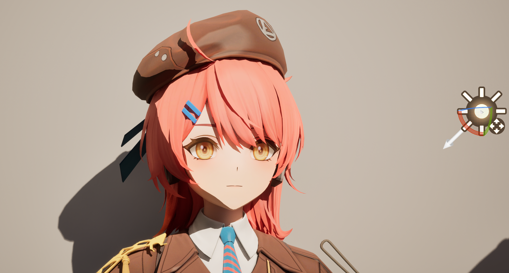

本文的修改也都上传github了，对应下图的提交记录：

>https://github.com/Yu-ki016/UnrealEngine/tree/YK_Engine
##### 一、前言

###### 1.1 背景

在动画中，常常会在角色脸部绘制和头发形态相似的阴影。
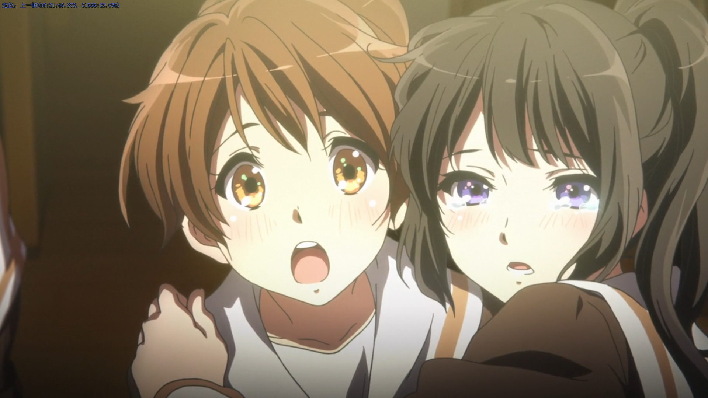

然而在很多角度下，头发的投影非常难看，和动画里的表现大相径庭。因此上一篇文章中去除了头发对脸部的投影，但是脸部没有了刘海的投影之后还是少了些体积感，总感觉少了些灵魂。


所以我打算用一些trick来把刘海的投影添加上去。

###### 1.2 实现方式

流朔大佬很久之前就实现过一个不错的刘海投影效果，主要思想是给头发或脸部绘制模板，然后在屏幕空间下进行偏移，进行模板测试：
https://zhuanlan.zhihu.com/p/232450616
https://zhuanlan.zhihu.com/p/416577141

由于我们UE做的是延迟渲染，做起来这个效果就更简单了，在做脸部shading时，偏移一下屏幕空间的深度信息和头发的深度进行对比，直接就能得到刘海投影。在加上上一篇文章写入了ToonModel，已经把头发和脸部区分好了，做起刘海投影更是如鱼得水。

##### 二、实现

本文很大半篇幅在修改ToonBuffer，如果只想看头发投影的实现，建议直接跳到：**2.3 添加头发投影**。
###### 2.1 Light Shader读取ToonBuffer

以我目前的修改，只有Raytracing Shadow的Shader可以读取到ToonBuffer，这次的刘海投影在Lighting Pass中计算，我们需要让Lighting的Shader也读取ToonBuffer里的信息。

UE计算Lighting使用的是DeferredLightPixelShaders.usf，我们可以发现它最终是使用GetGBufferData函数来获取GBuffer信息。
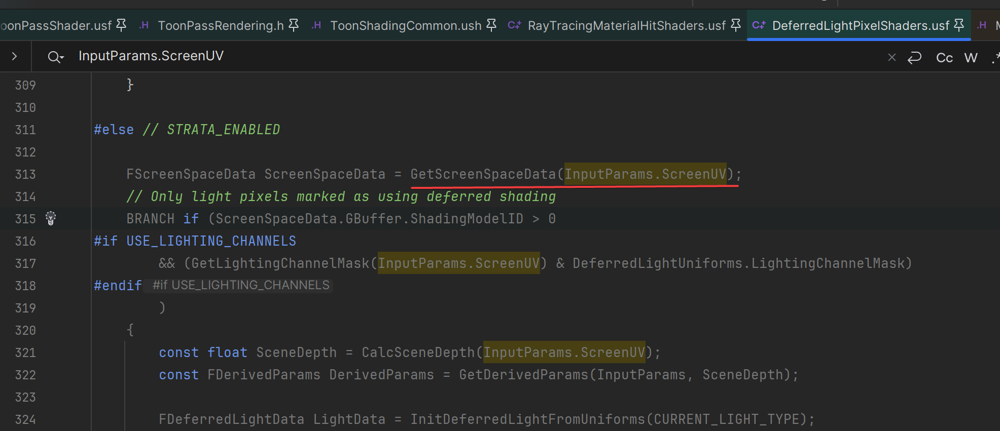


>DeferredShadingCommon.ush

我们可以在这里加上对ToonBuffer的采样：
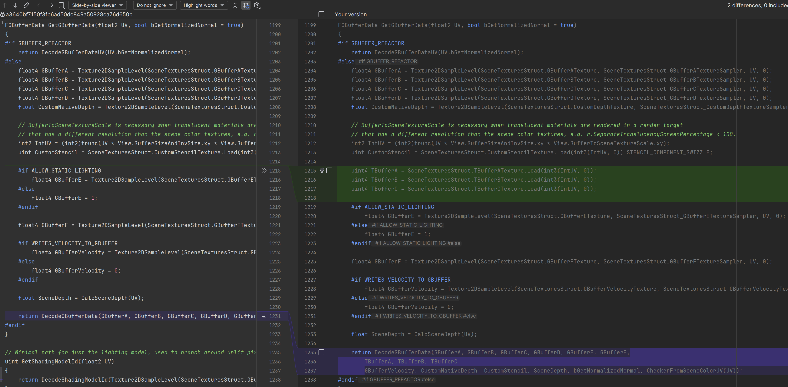
>DeferredShadingCommon.ush

但是这么改完了之后，会发现一点效果都没有，这是因为默认情况下走的是这个分支

>DeferredShadingCommon.ush

这个函数你全局搜索是搜不出来的，因为它是在C++中生成的。具体是怎么生成的呢，可以看看ShaderGenerationUtil.cpp。
如果想看到它生成的代码，我们可以用Visual Studio打开工程，在上面打个断点，debug一下看看这个OutputFileData。
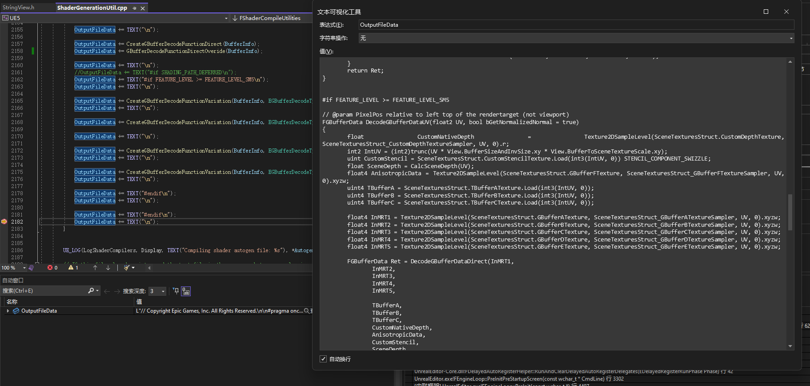
>ShaderGenerationUtil.cpp

DecodeGBufferData函数在这个函数里生成，会生成四种DecodeGBufferData函数：
- DecodeGBufferDataUV
- DecodeGBufferDataUint
- DecodeGBufferDataSceneTextures
- DecodeGBufferDataSceneTexturesLoad

>ShaderGenerationUtil.cpp

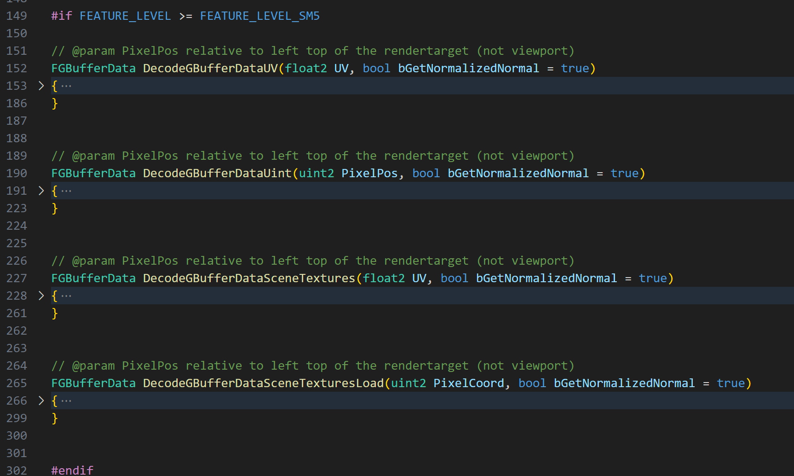
>把OutputFileData复制到VS Code查看

由于DeferredLightPixelShaders.usf里用的是DecodeGBufferDataUV，所以我也先只在DecodeType == CoordUV时加上TBuffer的采样，如果以后用到了其他的三个，到时候再加。

>ShaderGenerationUtil.cpp
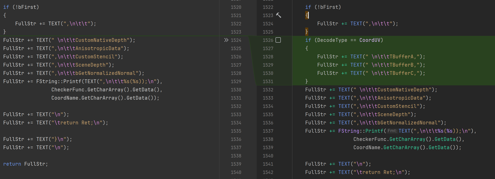
>ShaderGenerationUtil.cpp

接下来我们还要修改一下这个DecodeGBufferDataDirect函数，它是由CreateGBufferDecodeFunctionDirect生成的
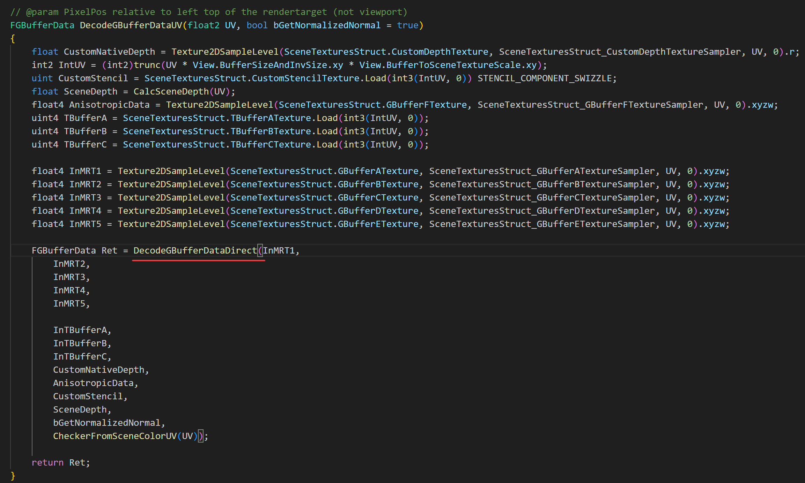
>OutputFileData生成的代码

>ShaderGenerationUtil.cpp

我没有直接修改CreateGBufferDecodeFunctionDirect函数，而是定义了个GBufferDecodeFunctionDirectOveride来生成DecodeGBufferDataDirect函数的重载：
```c
static FString GBufferDecodeFunctionDirectOveride(const FGBufferInfo& BufferInfo)  
{  
    FString FullStr;  
  
    //------------------------------------------------函数头--------------------------------------------------  
    FullStr += TEXT("FGBufferData  DecodeGBufferDataDirect(");  
    bool bFirst = true;  
    for (int32 Index = 0; Index < FGBufferInfo::MaxTargets; Index++)  
    {       const EGBufferType Target = BufferInfo.Targets[Index].TargetType;  
  
       if (Target != GBT_Invalid && Index != 0)  
       {          if (bFirst)  
          {             bFirst = false;  
          }          else  
          {  
             FullStr += TEXT(",\n\t");  
          }  
          int32 NumChan = GetTargetNumChannels(Target);  
          FString TypeName = GetFloatType(NumChan);  
          FString CurrLine = FString::Printf(TEXT("%s InMRT%d"),  
             TypeName.GetCharArray().GetData(),  
             Index);  
          FullStr += CurrLine;  
       }    }    if (!bFirst)  
    {       FullStr += TEXT(",\n\t\t");  
    }    // 参数中加入TBuffer  
    FullStr += TEXT(" \n\tuint4 InTBufferA,");  
    FullStr += TEXT(" \n\tuint4 InTBufferB,");  
    FullStr += TEXT(" \n\tuint4 InTBufferC,");  
    FullStr += TEXT(" \n\tfloat CustomNativeDepth");  
    FullStr += TEXT(",\n\tfloat4 AnisotropicData");  
    FullStr += TEXT(",\n\tuint CustomStencil");  
    FullStr += TEXT(",\n\tfloat SceneDepth");  
    FullStr += TEXT(",\n\tbool bGetNormalizedNormal");  
    FullStr += TEXT(",\n\tbool bChecker)\n");  
  
    FullStr += TEXT("{\n");  
  
    //------------------------------------------------函数Body--------------------------------------------------  
  
    // 先使用默认的DecodeGBufferDataDirect函数  
    FullStr += TEXT("\tFGBufferData Ret = DecodeGBufferDataDirect(");  
    bFirst = true;  
    for (int32 Index = 0; Index < FGBufferInfo::MaxTargets; Index++)  
    {       const EGBufferType Target = BufferInfo.Targets[Index].TargetType;  
  
       if (Target != GBT_Invalid && Index != 0)  
       {          if (bFirst)  
          {             bFirst = false;  
          }          else  
          {  
             FullStr += TEXT(",\n\t\t");  
          }  
          int32 NumChan = GetTargetNumChannels(Target);  
          FString CurrLine = FString::Printf(TEXT("InMRT%d"),  
             Index);  
          FullStr += CurrLine;  
       }    }  
    if (!bFirst)  
    {       FullStr += TEXT(",\n\t\t");  
    }    FullStr += TEXT(" \n\t\tCustomNativeDepth");  
    FullStr += TEXT(",\n\t\tAnisotropicData");  
    FullStr += TEXT(",\n\t\tCustomStencil");  
    FullStr += TEXT(",\n\t\tSceneDepth");  
    FullStr += TEXT(",\n\t\tbGetNormalizedNormal");  
    FullStr += TEXT(",\n\t\tbChecker);\n");  
  
    //使用DecodeToonDataFromBuffer解码Toon部分  
    FullStr += TEXT(" \n\tif (Ret.ShadingModelID == SHADINGMODELID_TOON)");  
    FullStr += TEXT(" \n\t{");  
    FullStr += TEXT(" \n\t\tRet.ToonBuffer = DecodeToonDataFromBuffer(InTBufferA, InTBufferB, InTBufferC, InMRT4);");  
    FullStr += TEXT(" \n\t}");  
  
    //------------------------------------------------Return-----------------------------------------------  
    FullStr += TEXT("\n");  
    FullStr += TEXT("\treturn Ret;\n");  
  
    FullStr += TEXT("}\n");  
    FullStr += TEXT("\n");  
    return FullStr;  
}
```
上面的函数生成的代码大概长这样：
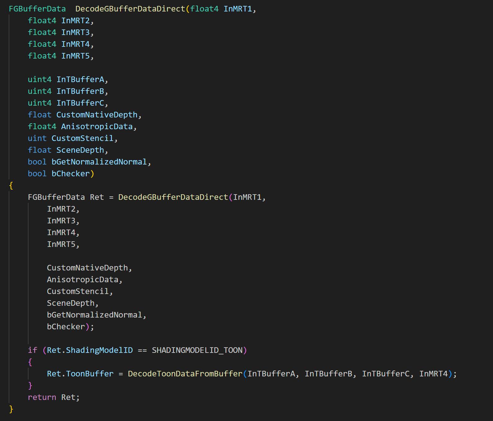
>GBufferDecodeFunctionDirectOveride生成的代码

这里真的很想吐槽UE要这么生成代码，可能是为了提高一些代码复用，但是这样修改起代码来真的很麻烦，很不直观，一个这么简单的函数，C++写了100多行，红豆泥逆天。

把它加到这里：

> ShaderGenerationUtil.cpp

现在DeferredLightPixelShaders.usf应该就能读取到ToonBuffer了，这里我写了一点测试代码，让SelfID == 255的时候LightAttenuation等于0


然后给脸部的SelfID写入255，脸部的光照消失了，说明ToonBuffer成功读取到了。


###### 2.2 修改ToonMaterial节点

之前材质编辑器为了写入ToonBuffer还要写Custom节点，有点麻烦
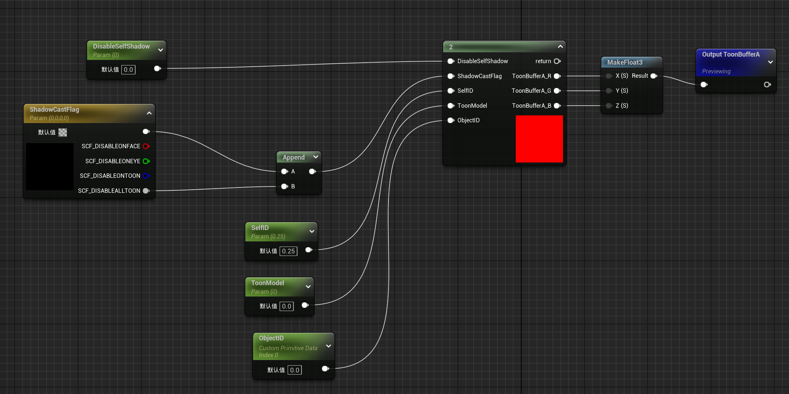

我打算把Toon Material节点改成下面这样：
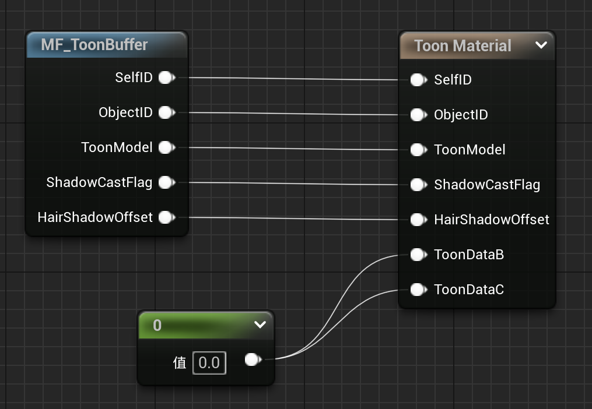
修改针脚名称：
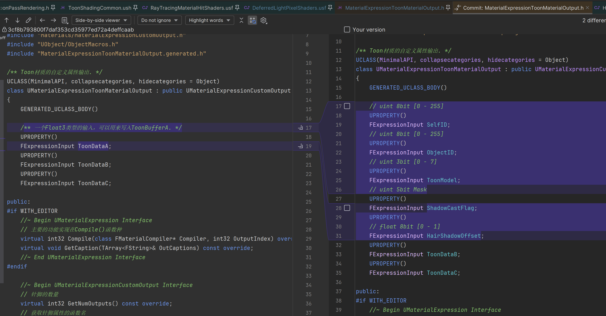
>MaterialExpressionToonMaterialOutput.h

添加一个GetInputType函数，用来定义针脚接受什么类型的输入：

>MaterialExpressionToonMaterialOutput.h

在MaterialExpressions.cpp中实现UMaterialExpressionToonMaterialOutput::GetInputType
```c
uint32 UMaterialExpressionToonMaterialOutput::GetInputType(int32 InputIndex)
{
	if (InputIndex == 0) { return MCT_Float1; }		// SelfID
	if (InputIndex == 1) { return MCT_Float1; }		// ObjectID
	if (InputIndex == 2) { return MCT_Float1; }		// ToonModel
	if (InputIndex == 3) { return MCT_Float1; }		// ShadowCastFlag
	if (InputIndex == 4) { return MCT_Float1; }		// HairShadowOffset
	if(InputIndex < 7)
	{
		return MCT_Float4;
	}
	check(false);
	return MCT_Float3;
}
```

然后修改一下UMaterialExpressionToonMaterialOutput::Compile
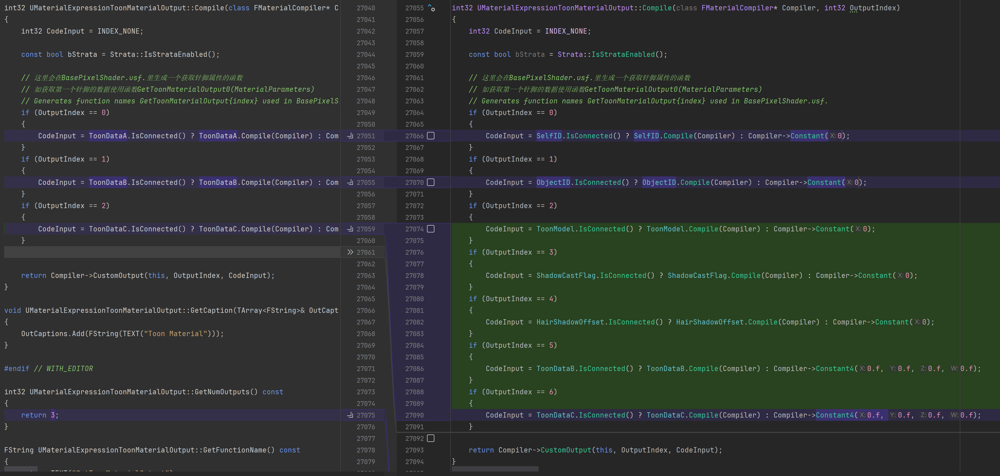

修改输出节点数量：


这样输出节点就修改好了

接下来修改一下Engine/Shaders/Private/Toon/ToonPassShader.usf里的MainPS函数，把针脚信息正确写入ToonBuffer中。下面我把读取针脚和编码ToonBuffer的逻辑封装为两个函数：GetToonBuffer和EncodeToonBuffer
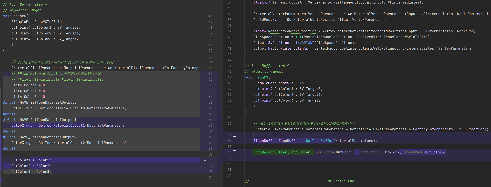

我把Engine/Shaders/Private/Toon/ToonShadingCommon.ush改名为ToonBufferCommon.ush，并且添加了两个文件：ToonShadingCommon.ush和ToonMaterialParameterCommon.ush

下面截出来的修改并不全，具体改了哪些东西大家去git看提交记录吧，全部截出来太长了。

像ToonStep这些和光照相关的放ToonShadingCommon.ush里，等一下计算头发投影也会放这里面：
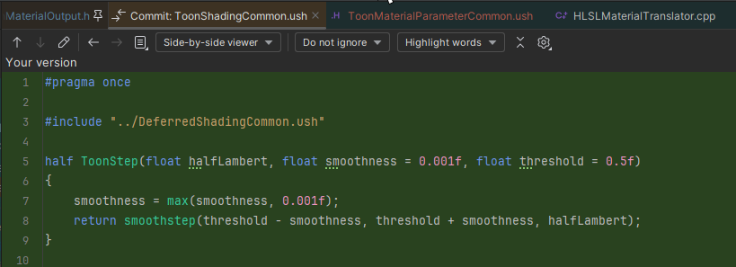

ToonBufferCommon.ush里多了个EncodeToonBuffer和GetToonPayloadByToonBuffer函数
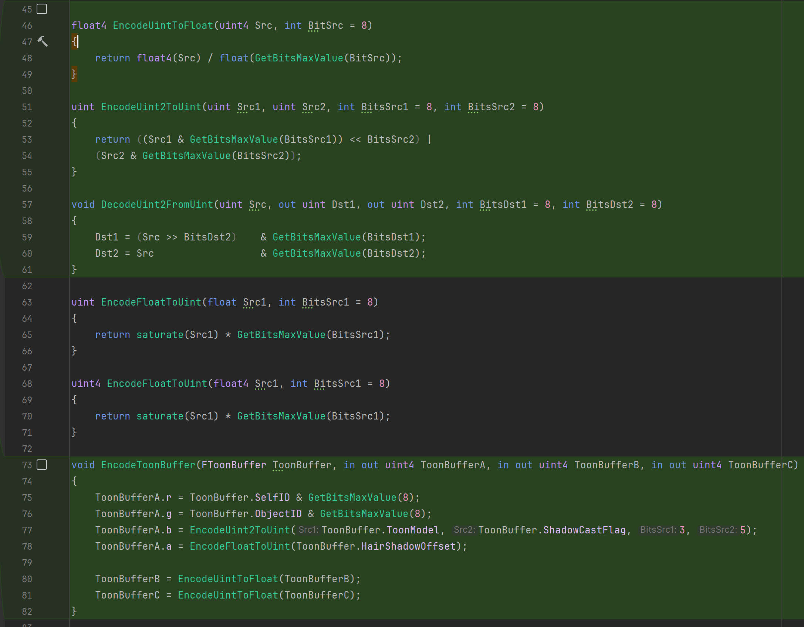


ToonMaterialParameterCommon.ush则是放了通过FMaterialPixelParameters来获取ToonBuffer和ToonPayloadData的函数。
```c
#pragma once

#include "../Common.ush"
#include "ToonBufferCommon.ush"

FToonBuffer GetToonBuffer(FMaterialPixelParameters MaterialParameters)
{
	FToonBuffer ToonBuffer;
	ToonBuffer.SelfID = 0;
	ToonBuffer.ObjectID = 0;
	ToonBuffer.ToonModel = 0;
	ToonBuffer.ShadowCastFlag = 0;
	ToonBuffer.HairShadowOffset = 0.0f;
	ToonBuffer.ToonBufferB = 0.0f;
	ToonBuffer.ToonBufferC = 0.0f;
#ifdef  HAVE_GetToonMaterialOutput0	
	ToonBuffer.SelfID = clamp(GetToonMaterialOutput0(MaterialParameters), 0.0f, 255.0f);
#endif
#ifdef  HAVE_GetToonMaterialOutput1	
	ToonBuffer.ObjectID = clamp(GetToonMaterialOutput1(MaterialParameters), 0.0f, 255.0f);
#endif
#ifdef  HAVE_GetToonMaterialOutput2	
	ToonBuffer.ToonModel = clamp(GetToonMaterialOutput2(MaterialParameters), 0.0f, 7.0f);
#endif
#ifdef  HAVE_GetToonMaterialOutput3	
	ToonBuffer.ShadowCastFlag = clamp(GetToonMaterialOutput3(MaterialParameters), 0.0f, 32.0f);
#endif
#ifdef  HAVE_GetToonMaterialOutput4	
	ToonBuffer.HairShadowOffset = GetToonMaterialOutput4(MaterialParameters);
#endif
#ifdef  HAVE_GetToonMaterialOutput5	
	ToonBuffer.HairShadowOffset = GetToonMaterialOutput4(MaterialParameters);
#endif
#ifdef  HAVE_GetToonMaterialOutput6	
	ToonBuffer.HairShadowOffset = GetToonMaterialOutput4(MaterialParameters);
#endif

	return ToonBuffer;
}

FToonPayloadData GetToonPayloadData(FMaterialPixelParameters MaterialParameters)
{
	FToonBuffer ToonBuffer = GetToonBuffer(MaterialParameters);
	
	return GetToonPayloadByToonBuffer(ToonBuffer);
}
```

后面还有include头文件，RayTracingOcclusionRGS.usf和RayTracingMaterialHitShaders.usf的修改


具体的修改都在这个提交记录里，还是看直接看git更清楚点：


###### 2.3 添加头发投影

接下来终于可以正式添加头发的投影了。一共就改了两个文件，代码量很少，为了显得本文没那么水，下面分步骤进行修改。

在DeferredLightPixelShaders.usf里把ToonShadingCommon.ush包括进去


当ShadowModel是Toon并且是ToonFace或ToonEye的时候，使用GetHairShadow计算头发投影：

>DeferredLightPixelShaders.usf

GetHairShadow函数放在ToonShadingCommon.ush中实现：
```

```c
float GetHairShadow(FGBufferData GBuffer, FDeferredLightData LightData, float2 ScreenUV)
{
	float Shadow = 1.0f;
	float k = 100.0f;
	// 屏幕空间LightDirection
	// View.TranslatedWorldToCameraView用于将世界空间变换到屏幕空间
	float3 LightDirVS = mul(LightData.Direction, (float3x3)(View.TranslatedWorldToCameraView));
	// 翻转LightDirVS的y方向，不然Offset上下会反，可能会出现OpenGL和DirectX不一致的情况，不过到时候遇到再改
	LightDirVS.y = -LightDirVS.y;
	// 修正摄像机距离对偏移距离的影响
	LightDirVS *= (100.0f / CalcSceneDepth(ScreenUV));

	// View.BufferSizeAndInvSize.xy是屏幕分辨率；View.BufferSizeAndInvSize.xy是屏幕分辨率的倒数
	float2 Offset = LightDirVS.xy * k * GBuffer.ToonBuffer.HairShadowOffset * View.BufferSizeAndInvSize.zw;
	float2 OffsetedUV = ScreenUV + Offset;
	
	FGBufferData OffsetedGBuffer = GetGBufferData(OffsetedUV);

	if (OffsetedGBuffer.ToonBuffer.ToonModel == TOONMODEL_HAIR
		&& OffsetedGBuffer.ToonBuffer.ObjectID == GBuffer.ToonBuffer.ObjectID)
	{
		Shadow = 0.0f;
	}
	
	return Shadow;
};
```

上面的代码中，我们使用View.TranslatedWorldToCameraView将光源方向变换到屏幕空间。
关于View这个Buffer，我们可以在FRenderLightParameters中找到，各种矩阵和视图相关的信息都是通过这个Buffer传递给shader的。


而View.BufferSizeAndInvSize则是屏幕分辨率信息，如果分辨率1920x1080，
则BufferSizeAndInvSize.xy等于1920和1080，BufferSizeAndInvSize.zw等于1/1920和1/1080。
计算Offset的时候乘上BufferSizeAndInvSize.zw是为了保证计算出来的offset不会受分辨率影响。

目前的代码还有点问题，添加上对Depth的判断来避免脸部采样到后面的头发
```
if (OffsetedGBuffer.ToonBuffer.ToonModel == TOONMODEL_HAIR && OffsetedGBuffer.Depth < ScreenSpaceData.GBuffer.Depth)
{  
    HairShadow = 0.0f;  
}
```


可以看到离相机距离不同，Offset距离不一样：


我们使用场景深度来修正Offset距离，使用CalcSceneDepth可以得到场景相对于相机的世界空间距离，也就是Clip Space Position的w分量。
```
LightDirVS *= (100.0f / CalcSceneDepth(ScreenUV));
```


当离屏幕太近的时候，会采样到屏幕之外，加一个saturate可以一定程度减少问题，但无法完全解决，这是屏幕空间算法很难避免的问题。
```
float2 OffsetedUV = saturate(InputParams.ScreenUV + Offset);
```


如果想完全解决采样到屏幕外的问题，可以改成在MeshDraw Pass中绘制头发投影，但是我都写到这一步了，就懒得再动它了，以后有空再改，反正这么近的gachi恋距离也不常见。

当有多个光源的时候，也会出现头发的投影，这个我们并不希望出现，可以把主光源之外的头发投影都去除掉：
```
bool IsMainLight = !LightData.bRadialLight && all(LightData.Direction == View.AtmosphereLightDirection[0].xyz);
```


完整的GetHairShadow函数：
```c
float3 GetMainLightDirection()
{
	return View.AtmosphereLightDirection[0].xyz;
}

bool IsMainLight(FDeferredLightData LightData)
{
	return !LightData.bRadialLight && all(LightData.Direction == GetMainLightDirection());
}

float GetHairShadow(FGBufferData GBuffer, FDeferredLightData LightData, float2 ScreenUV)
{
	float Shadow = 1.0f;
	
	if (!IsMainLight(LightData))
	{
		return Shadow;
	}
	
	float k = 100.0f;
	// 屏幕空间LightDirection
	// View.TranslatedWorldToCameraView用于将世界空间变换到屏幕空间
	float3 LightDirVS = mul(LightData.Direction, (float3x3)(View.TranslatedWorldToCameraView));
	// 翻转LightDirVS的y方向，不然Offset上下会反，可能会出现OpenGL和DirectX不一致的情况，不过到时候遇到再改
	LightDirVS.y = -LightDirVS.y;
	// 修正摄像机距离对偏移距离的影响
	LightDirVS *= (100.0f / CalcSceneDepth(ScreenUV));

	// View.BufferSizeAndInvSize.xy是屏幕分辨率；View.BufferSizeAndInvSize.xy是屏幕分辨率的倒数
	float2 Offset = LightDirVS.xy * k * GBuffer.ToonBuffer.HairShadowOffset * View.BufferSizeAndInvSize.zw;
	float2 OffsetedUV = saturate(ScreenUV + Offset);
	
	FGBufferData OffsetedGBuffer = GetGBufferData(OffsetedUV);

	if (OffsetedGBuffer.ToonBuffer.ToonModel == TOONMODEL_HAIR
		&& OffsetedGBuffer.Depth < GBuffer.Depth
		&& OffsetedGBuffer.ToonBuffer.ObjectID == GBuffer.ToonBuffer.ObjectID)
	{
		Shadow = 0.0f;
	}
	
	return Shadow;
};
```


##### 三、参考

【Unity URP】以Render Feature实现卡通渲染中的刘海投影
https://zhuanlan.zhihu.com/p/232450616

虚幻五渲染编程（Graphic篇）【第六卷： Customize GBuffer of UnrealEngine5】
https://zhuanlan.zhihu.com/p/521681785


