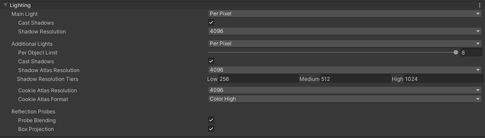

# URP学习

## **管线**

### **对管线的理解**

首先这里的管线，指的是图形学上的管线，渲染一帧需要的所有逻辑，要和后边说的前向渲染管线做个区分。

简单来说，分成几个部分，首先是管线的配置，也就是之前内置管线Quality Setting里的各种数值。然后是底层管线的逻辑，也就是RenderPipeline这个基类，这个类比较简单，具体逻辑都是子类实现，这里只定义了几个事件，和声明周期控制函数。核心部分就是UniversalRenderPipeline这个类了，下面会细分析这个类。

------

### **先简单看看配置**

在Quality Setting里，默认分了4个，default，低中高，和内置管线位置一样的，只是细节不同。

面板上的显示，基本上和UniversalRenderPipelineAsset类是一一对应的，主要分几个部分，比较重要的是光照和阴影，细节先不说了，用到了看看就行。

需要注意的是，这里的设置是对整个管线生效的，有些设置camera可以覆盖，比如depth和opaque贴图的选项。

------

### **管线的核心，UniversalRenderPipeline**

**先看数据**

PerFrameBuffer

- 每一帧数据都是一样的
- _GlossyEnvironmentColor和_SubtractiveShadowColor这两个运行时可能是不会改变的，但是为了shader正确使用，还是要每帧设置一次。
- 时间相关的几个值，内置管线中是可以直接取的，URP中要自己设置了。

PerCameraBuffer：每个相机需要的数据，包括矩阵，屏幕参数，相机世界坐标。

接着有一些写死的数值，不一一列举了。需要注意的是最大可见附加光数量，在这个版本StructedBuffer没开启，以后是会开的，看源码的注释是说在移动平台有性能问题，有些GPU在顶点shader不支持SSBO。

**核心逻辑，Render函数**

首先会发一个渲染开始的事件，然后设置线性或gamma空间，是否使用SRPBatcher，设置shader变量值，然后按深度排序相机，正式开始渲染。

对每个相机，判断是game还是scene，渲染大体相似，主要看下game的渲染。

入口，RenderCameraStack。首先读取UniversalAdditionalCameraData数据，URP中有对VR的支持，手游用不上，先忽略不看。

单个game相机渲染的完整流程，由以下5个函数组成。

- BeginCameraRendering：只是发个事件

- UpdateVolumeFramework：对volume系统的支持，核心是调用VolumeManager的Update方法，暂时不细看。

- InitializeCameraData：初始化数据，填充CameraData结构体，就是设置一系列的数值。

- RenderSingleCamera：渲染的核心逻辑，源码的注释是，执行culling，调用renderer的setup和execution方法。

- - 几个主要的功能，SetupPerCameraShaderConstants，设置PerCameraBuffer类中的数值，屏幕缩放比例，相机坐标，屏幕参数，invCameraViewProj。
  - 渲染逻辑分两部分，先执行一次clear指令，然后设置裁剪参数ScriptableCullingParameters结构体，再调用InitializeRenderingData函数，填充RenderingData结构体，这个结构体包含渲染相关的所有参数，裁剪信息，相机数据，光照阴影数据，后处理等很多。
  - RenderingData设置好之后，传给renderer，依次调用Setup和Execute，完成渲染，具体逻辑在Renderer部分细说。

- EndCameraRendering：结束事件。

渲染相机的大体流程就是这样，URP有个cameraStack的概念，大概理解就是一个相机带有一个stack，可包含多个相机，渲染的时候将stack里最后一个激活的相机渲染到屏幕上，渲染流程和上边差不多。

还有一个类是UniversalRenderPipelineCore，这是UniversalRenderPipeline的分部类，定义数据、选项、shader关键字以及一些功能性的函数。

## UniversalRenderer渲染管线

[URP管线源码学习](URP管线源码（基于Unity 2021.3.8、URP 12.1.7）.md)

[URP延迟管线](URP中的延迟渲染初探.md)

### **整体理解**

这部分算是URP的核心了，可编程管线，说的就是这个，有能力的项目，可以根据需要，做出更适合项目的管线。

unity提供了两个默认实现，一个是Universal（内部封装了forward和deferred），一个2D，2D有时间再细看（原谅我的懒），Universal这部分还是有些东西可看的，因为默认管线，这部分是完全看不到的，只能通过framedebugger看个流程，现在有机会看看内部实现，对理解管线也是很有好处的。

12版用UniversalRenderer代替了forward，用一个管线逻辑处理了forward和deferred，因为forward和deferred实际并没有那么大的区别，很多部分是通用的，所以unity就只提供一个选项，内部实现一个分支。在实现上，真正的区别，就是调用了不同的pass，以及对光源数据的处理。

------

### **渲染的最底层：pass**

UniversalRenderer可以简单理解成驱动各个pass执行的一个管理者，pass则实现了具体的渲染逻辑。

pass的功能，分为两部分，配置rt和执行最终渲染。

**pass-事件**

基类文件中定义了一系列的渲染事件，RenderPassEvent。每个pass，在初始化的时候，都定义了一个event，这个event用于pass的排序。id之间间隔50，可加offset以添加额外的event。

**pass-rt管理**

每个pass，在渲染前需要先声明自己用到的color和depth，再由管线决定是否需要切换，以及实际分配rt，renderer基类调用pass的Configure抽象函数。

```csharp
renderPass.Configure(cmd, cameraData.cameraTargetDescriptor); 
```

每个pass实现具体逻辑，pass子类调用基类的ConfigureTarget方法，配置渲染目标和clear方法，子类没实现则渲染到相机的目标。12增加了一个OnCameraSetup的方法，也是用于配置rt，看注释只有触发时间不一样，作用是一样的，也许以后会改成只有一个。

渲染目标分两个，color和depth，depth只有一个，color是个数组，默认第一个是相机目标，最大值在SystemInfo.supportedRenderTargetCount定义。

注意这个步骤只是设置了pass内部的数据，并没有真的通知到管线。

```text
RenderTargetIdentifier[] m_ColorAttachments = new RenderTargetIdentifier[]{BuiltinRenderTextureType.CameraTarget}; 
RenderTargetIdentifier m_DepthAttachment = BuiltinRenderTextureType.CameraTarget; 
```

真正设置渲染目标，是通过CommandBuffer的SetRenderTarget方法，URP在CoreUtils类封装了一个静态函数SetRenderTarget。ScriptableRenderer类在ExecuteRenderPass方法中，先调用pass的Config函数，然后取pass的color和depth数据，设置为真正的渲染目标。

梳理一下这个流程


------

### **forward逻辑**

**forward-初始化**

做了以下几件事

- 创建几个特殊材质，用的是配置里的shader，这几个材质会传给对应的pass。

```csharp
Material blitMaterial = CoreUtils.CreateEngineMaterial(data.shaders.blitPS); 
Material copyDepthMaterial = CoreUtils.CreateEngineMaterial(data.shaders.copyDepthPS); 
Material samplingMaterial = CoreUtils.CreateEngineMaterial(data.shaders.samplingPS);
Material screenspaceShadowsMaterial = CoreUtils.CreateEngineMaterial(data.shaders.screenSpaceShadowPS); 
```

- 设置模板测试StencilState结构体。
- 创建用到的每个pass，指定渲染RenderPassEvent。
- 设置各个rt
- 创建ForwardLights实例，用于光源的相关计算。
- 创建RenderingFeatures，这个类里只有cameraStacking一个bool值，像是个没开发完的功能。

**forward-Setup**

简单说这个函数的作用就是把一个个pass加到个list里，供后边执行每个pass。

对于只渲染深度的相机，只需要添加3个pass，opaque、skybox、transparent。

一些重要的判断

- 后处理是否开启，URP把后处理分成了两步，一个是实现常规特效的后处理，一个是抗锯齿这种，具体逻辑在PostProcessPass内部区分。
- 是否需要深度图。首先判断相机配置，然后区分scene和game相机，scene相机之外，检测一下是否可以从opaque pass拷贝过来，以提升性能。具体判断在CanCopyDepth函数。

对一些特殊pass的说明，按代码顺序，没有特殊操作的略过

- DepthOnlyPass

- - 开启条件：scene相机一定开启。game相机首先读取管线配置，同时CanCopyDepth为false，也就是说要注意本来不想开depth，但是开了抗锯齿等后处理效果，depth也会开启。
  - 用法：shader要有DepthOnly pass，渲染所有的DepthOnly Pass到指定texture，shader中通过_CameraDepthTexture获取。

- CopyColorPass

- - 复制指定颜色buffer到目标颜色buffer，可以复制不透明物的渲染结果，用于扭曲特效。
  - 降采样可作为优化。
  - shader中通过_CameraOpaqueTexture获取。

- CopyDepth和DepthOnly是互斥的，只需要用到一个，shader都是从_CameraDepthTexture获取。

其他pass还有很多 ，以后看shader的时候再一起细看。

**ScriptableRenderer-Execute**

unity把这部分放到了渲染管线的基类实现，也就是这部分被定义为通用的框架层，不建议项目扩展。

执行流程

- 获取相机数据，关闭shader关键字，执行一次clear操作

```csharp
SetCameraRenderState(cmd, ref cameraData); context.ExecuteCommandBuffer(cmd); cmd.Clear(); 
```

- 对pass排序，按之前定义的RenderPassEvent。

- 设置shader定义的时间变量，SetShaderTimeValues函数实现。

- 将pass按event顺序，分成四块

- - BeforeRendering：用于处理阴影等，不是实际的渲染，只作为功能使用
  - MainRenderingOpaque：渲染不透明物体
  - MainRenderingTransparent：透明物体
  - AfterRendering：在后处理之后，在unity的demo中没看到具体渲染了啥，可能是扩展用的吧。

- 执行SetupLights，设置光照需要的一系列参数，细节在光照部分细说。

- 然后先执行BeforeRendering

- 接着是一个循环，用于处理VR，由于手游中只需要渲染一次，VR部分先不管，只按一个去看。

- - 首先设置好相机属性，执行一次commandbuffer的clear指令。
  - 然后是不透明物体渲染，depth也在这执行。
  - 渲染透明物体，要注意的是透明和不透明物体的渲染，都是DrawObjectsPass实现的，参数不同，设置了RenderQueueRange和layer。
  - 渲染AfterRendering

forward大致流程大概就这些，感觉上没有太多特殊东西，只是细节很多，流程复杂些，用到了查查就好。

------

### 延迟渲染相关内容

#### **URP延迟渲染的简单介绍**

- 首先延迟渲染的核心思想，是利用gbuffer，保存一部分数据，最后做一次对应屏幕分辨率的计算。URP自然也要基于gbuffer去实现。
- URP对于传统的延迟渲染，又做了一些扩展。gbuffer保存了比法线更多的数据，以及可以支持多种光照模型，代价是drawcall增加。
- 目前的版本不支持OpenGL，但是支持Vulkan，手机上可以看情况开启，动态切换也比较容易。

#### **多种光照模型的支持方式**

基于模板值实现，目前GBufferPass配置了Lit、SimpleLit、Unlit这3个shader对应的模板值，通过DrawRenderers方法直接传给GPU。但是光照计算的时候，只对Lit和SimpleLit做了处理，Unlit实际会在forward的时候渲染。

GBufferPass渲染的结果，是每个像素的各种信息。模板缓冲值，真正意义是记录每个像素对应的光照算法。

GBufferPass做了两件事，一是使用指定的shader pass，渲染相机可见的所有物体。渲染的结果，不包含实时光，只有烘焙光，和各种物体本身数据（法线等）。可以隐藏光源验证，FrameDebug里没用到光源数据。二是对支持的材质，分别写入不同的模板值。

gbuffer数据计算完成后，对每个光源做两次计算，分别用Lit和SimpleLit算法。这样就实现了延迟渲染的多种光照模型。

#### **光源的处理**

看着代码，支持stencil和tiled两种方式，但是在延迟渲染下，tiled是固定关闭的，所以先不看tiled的方式，可能没完全实现。

对于stencil光源，会对每个光源类型渲染，最终都是用的DrawMesh方法，用指定的shader pass渲染。对于平行光，mesh是个全屏的三角形。点光源mesh是球体，聚光灯是个半球。

mesh的作用，是通过变换矩阵，将mesh放到光源位置，然后用指定pass渲染一遍，渲染目标是相机颜色buffer。加上深度和模板测试，结果就是对光源范围内的像素做了一次光照计算。

平行光，深度测试设置为NotEqual，效果是对全屏像素生效。

点光源和聚光灯，shader设置Cull Front，只渲染背面，同时ztest为GEqual。效果就是当前像素深度大于等于光源对应模型的深度，就计算光照颜色。

为什么要剔除正面

- 首先当光源超过屏幕范围，正面会不可见，只有渲染背面，才有光照效果。
- 如果是渲染正面，那么会把光源前面的物体照亮，而这一面是看不到的，就浪费了计算。
- 渲染背面的时候，如果mesh的位置，深度大于光源，表示在光源对应mesh背面的前面有像素，就计算像素的颜色。如果没有，表示超出了光源的显示范围。可以理解为从光源位置，向屏幕里面发一定长度的射线，如果打到了像素，表示被光源照到，计算颜色。
- 这地方有点不好理解，也只是自己的一些猜测。

#### **性能上的消耗**

因为对每个光源的每个光照模型都用渲染一次，增加了drawcall。最终drawcall数量=渲染所有物体的drawcall+光源数量*光照算法数量（也就是用到的shader数量）+（光源数量-1（Stencil Volume pass，用于设置模板值））。

尽管增加了drawcall，但overdraw并没有增加，依然是对屏幕像素，做主光源和附加光的光照。因为每个像素，用到的光照算法是固定的，所以每个drawcall，只计算自己对应的那些像素。

最大的消耗在于内存，可以根据配置设置gbuffer数据。

## **光照**

光照可以分两部分来看，一个是对光源的处理，主要逻辑在C#代码ForwardLights类，一个是shader的计算，核心是Lighting.hlsl文件。

### **光源的一些设置**

在管线设置



主光

- 2个选项，关闭，逐像素。
- 只支持平行光，选择亮度最大的一个，在GetMainLightIndex函数获取，没有返回-1。
- 可选是否产生阴影以及阴影贴图分辨率。

附加光

- 3个选项，关闭，逐顶点，逐像素。
- 逐顶点不能产生阴影。
- 每个物体受附加光影响有数量限制，PC上最大8个。
- 选逐像素可以产生阴影并设置阴影贴图分辨率。
- 点光源和平行光没有实时阴影，聚光灯选逐像素有。

UniversalAdditionalLightData，看名字是设置光源的属性，实际影响的参数只有shadowBias和shadowNormalBias，感觉这名字起的有点误导，不需要手动添加，如果在light里对Bias选择Custom，则会自动添加。

------

**ForwardLights源码理解**

这个类的主要作用就是处理光源，提交光照数据给GPU使用

首先定义了一个类LightConstantBuffer，将shader变量的id封装了一下，基本上就是坐标，颜色，强度。

```csharp
public static int _MainLightPosition; 
public static int _MainLightColor;  
public static int _AdditionalLightsCount; 
public static int _AdditionalLightsPosition; 
public static int _AdditionalLightsColor; 
public static int _AdditionalLightsAttenuation; 
public static int _AdditionalLightsSpotDir;  
public static int _AdditionalLightOcclusionProbeChannel; 
```

这里有一个StructuredBuffer的概念，在7.2版本的URP没有开启，官方的注释原因是有性能问题，vulkan有绑定的问题。以后可以开启了再细看。

核心函数Setup，作用是设置相关shader变量值，这部分看着代码不少，实际就是根据光源类型，设置不同数值。要注意的是现在不支持shadowmask，后续版本应该会有支持。

------

### **shader部分**

可以说C#只是设置了一些参数，真正的计算都是在shader完成的，URP实现了一个简化版的PBR，基于Minimalist CookTorrance BRDF，算法详细信息在[http://www.thetenthplanet.de/archives/255](http://www.thetenthplanet.de/archives/255)。下面分成几个部分，看看shader代码是怎么实现的。

shader可以分两部分来看，一个是底层运算库（hlsl文件），一个组合这些底层运算，实现不同效果需求。

**先看看输入**

输入分成几个文件，依次看一下

SurfaceInput.hlsl

- 看名字就是保存表面颜色的数据，首先定义了base、bump、emission贴图和采样器，URP定义材质的方法有点改变，要分别定义TEXTURE2D和SAMPLER，具体里边咋实现的也没查着，反正按格式写就行了。
- SurfaceData结构体，只定义了数值没有贴图。
- Alpha函数，封装了alpha的计算，如果开启ALPHATEST_ON，执行clip，然后返回alpha值。
- 接着是封装base、bump、emission3个采样函数。

UnityInput.hlsl

- 上边一些宏定义都是VR相关的，做手游的就不看了。
- 时间相关的一些参数，在通过管线设置。
- 相机世界坐标，_ProjectionParams，_ScreenParams，_ZBufferParams，unity_OrthoParams，有些在不同宏定义下，数据不同。
- camera相关的矩阵，各种坐标变换矩阵。这部分会在Input.hlsl封装成宏定义。
- 一些全局值

```csharp
real4 glstate_lightmodel_ambient; 
real4 unity_AmbientSky; 
real4 unity_AmbientEquator; 
real4 unity_AmbientGround; 
real4 unity_IndirectSpecColor; 
float4 unity_FogParams; 
real4  unity_FogColor; 
real4 unity_ShadowColor; 
```

- 运行时用到的贴图声明

```csharp
// Unity specific
TEXTURECUBE(unity_SpecCube0);
SAMPLER(samplerunity_SpecCube0);

// Main lightmap
TEXTURE2D(unity_Lightmap);
SAMPLER(samplerunity_Lightmap);
// Dual or directional lightmap (always used with unity_Lightmap, so can share sampler)
TEXTURE2D(unity_LightmapInd);

// We can have shadowMask only if we have lightmap, so no sampler
TEXTURE2D(unity_ShadowMask);
```

- 其他代码就不贴了，具体用到再回来查。

Input.hlsl

- 上边是一堆宏定义，作用就是定义最大可见光数量，分为SSBO和UBO，由于硬件限制，SSBO短期应该不能应用在是手机上，所以现在可以简单理解为可见光就是32个，反正就是个数量，以后是会越来越多的 。
- InputData结构体，这是像素shader用到的数据，要注意的是这并不是顶点shader返回的那个数据，URP用到的几个地方，都是先进行了一下数据的处理，比如LitForwardPass里的InitializeInputData函数。

```csharp
全局的颜色
half4 _GlossyEnvironmentColor;
half4 _SubtractiveShadowColor;

float4x4 _InvCameraViewProj;
float4 _ScaledScreenParams;
```

- 之后定义了主光和附加光源的各种属性，通过ForwardLights设置。

**Lighting.hlsl，实现光照计算**

如果没定义LIGHTMAP_ON，GI通过球谐函数计算，在顶点处理以减轻shader ALU压力。

PBR的核心函数是UniversalFragmentPBR，下面详细看一下这个函数的流程。

```csharp
BRDFData brdfData;
InitializeBRDFData(albedo, metallic, specular, smoothness, alpha, brdfData);
```

- 首先填充BRDFData结构体，包含brdf需要的参数，漫反射、高光、光滑度等值。

- - InitializeBRDFData这个函数根据工作流，设置高光和漫反射值。

```csharp
Light mainLight = GetMainLight(inputData.shadowCoord); 
```

- 然后通过GetMainLight获取主光的数据

- - 主要是方向和颜色。
  - distanceAttenuation默认是unity_LightData.z，unity_LightData.z值如果被裁剪是1，否则是0，如果开启lightmap或在subtractive模式下需要乘上unity_ProbesOcclusion.x。
  - shadowAttenuation用于计算阴影，默认是1，MainLightRealtimeShadow函数用来计算实时阴影的，具体逻辑在阴影部分细看。

```csharp
MixRealtimeAndBakedGI(mainLight, inputData.normalWS, inputData.bakedGI, half4(0, 0, 0, 0));
void MixRealtimeAndBakedGI(inout Light light, half3 normalWS, inout half3 bakedGI, half4 shadowMask)
#if defined(_MIXED_LIGHTING_SUBTRACTIVE) && defined(LIGHTMAP_ON)
    bakedGI = SubtractDirectMainLightFromLightmap(light, normalWS, bakedGI);
#endif
```

- 这个函数的作用是计算bakedGI的值，在定义了Subtractive同时开启lightmap时生效，原因是这一个点的颜色在烘焙时已经计算了主光源的光照和阴影值，避免和实时光再叠加一次，选择bake和实时光更暗的那个值作为最终值。

```csharp
half3 color = GlobalIllumination(brdfData, inputData.bakedGI, occlusion, inputData.normalWS, inputData.viewDirectionWS); 
```

- 根据brdfData、烘焙GI值、遮蔽值、法线、观察方向，计算GI，也就是所有的间接光颜色。计算分为以下几个部分：

- - 先计算菲涅尔值。间接反射= bakedGI * occlusion
  - GlossyEnvironmentReflection函数计算间接高光，如果开启了环境反射，就采样unity_SpecCube0，然后处理HDR，返回最终值。unity_SpecCube0保存了环境的立体贴图（天空盒和后面的反射探针形成的立体贴图，都算在这里），这个贴图有mipmap。
  - ps：unity_SpecCube1，存储的离物体最近的反射探针的数据，这里没用到。
  - EnvironmentBRDF：看名字是计算环境的BRDF，具体算法也没看懂，不知道啥原理，可能是个经验算法吧，反正能算出个颜色值就对了。

```csharp
color += LightingPhysicallyBased(brdfData, mainLight, inputData.normalWS, inputData.viewDirectionWS); 
```

- 这个函数是计算主光的brdf值，调用DirectBDRF函数，算法基于Minimalist CookTorrance BRDF。反正BRDF也就是DNF那3个函数，具体细节吧，相信unity就对了，反正我是看不懂~。

```csharp
for (uint lightIndex = 0u; lightIndex < pixelLightCount; ++lightIndex)
{
    Light light = GetAdditionalLight(lightIndex, inputData.positionWS);
    color += LightingPhysicallyBased(brdfData, light, inputData.normalWS, inputData.viewDirectionWS);
}
```

- 接着是计算附加光的颜色值，在一个for循环处理，也就是之前说的单pass渲染，不像内置管线那样有forward add pass了。
- 计算和主光差不多，但是没有间接光的计算，

```csharp
#ifdef _ADDITIONAL_LIGHTS_VERTEX
    color += inputData.vertexLighting * brdfData.diffuse;
#endif
color += emission;
```

- 最后一步是加上顶点光照，和自发光颜色。

到这PBR的光照计算就结束了，有很多细节略过了，以后有更深的理解再补上。

**最后一步，LitForwardPass.hlsl**

[URP LitShader解析](URP LitShader解析（一）.md)

这个文件实现了顶点和像素shader，定义了输入输出结构体，PBR的输入参数大致都差不多，就不贴代码了。

LitPassFragment也比较简单，首先定义一些数据，并初始化，调用UniversalFragmentPBR做光照计算，然后加上雾的颜色，就是最终颜色。

## 阴影

[关于MainLightShadowCasterPass](关于MainLightShadowCasterPass.md)

### 对阴影的理解

**unity的阴影，实际做了两件事**

- 一是计算出实时光的阴影，基于shadowmap。
- 二是将实时阴影和bake数据，根据不同策略做混合

**URP12对阴影的支持情况**

- 一个主光源（必须是平行光）的实时阴影。
- 移动平台最多32个附加光源（不支持平行光）。
- 附加光源都会写入一张rt，按图集的方式写入不同块。
- 点光源会写入图集的最多6个分区中（根据照到的区域计算），相比用cube会有性能提升，因为点光源不一定会照到6个面。
- 点光源和聚光灯的实时阴影。
- 屏幕空间阴影。
- 半透表面接收阴影，但不能投射阴影。

------

### **主光源shadowmap**

通过MainLightShadowCasterPass驱动

**先看构造函数和主要的属性**

RenderPassEvent是BeforeRenderingShadows，也就是clear之后就渲染shadowmap。

```csharp
m_MainLightShadowMatrices = new Matrix4x4[k_MaxCascades + 1]; 
m_CascadeSlices = new ShadowSliceData[k_MaxCascades]; 
m_CascadeSplitDistances = new Vector4[k_MaxCascades]; 
```

- 级联贴图相关的属性，用法在后面的代码细看，简单来说，级联阴影的作用类似mipmap，在不同距离采样不同精度的贴图，以提升性能。

```csharp
private static class MainLightShadowConstantBuffer 
```

- 这个类，声明了shader用到的各个变量，记录id。

**Setup函数**

有两个作用，一个是判断是否开启了阴影，一个是设置阴影的一些参数，分辨率，级联层级数量等。函数的结果是将设定好的阴影图按级联数量，分成几个小块，每个小块渲染一个精度的阴影。

```csharp
renderingData.cullResults.GetShadowCasterBounds(shadowLightIndex, out bounds) 
```

- 调用了一个底层接口，获取光源的包围盒，在光源范围内有shadowcast的物体时返回true。

```csharp
int shadowResolution = ShadowUtils.GetMaxTileResolutionInAtlas(renderingData.shadowData.mainLightShadowmapWidth,     renderingData.shadowData.mainLightShadowmapHeight, m_ShadowCasterCascadesCount); 
```

- 这个函数的作用，是根据级联数量，获取每块贴图的分辨率。

```csharp
ShadowUtils.ExtractDirectionalLightMatrix 
```

- 这个函数用来设置级联贴图相关的属性，矩阵、距离、分辨率等。
- 调用底层ComputeDirectionalShadowMatricesAndCullingPrimitives

**Configure函数**

主要作用是获取shadowmap的rt，配置到pass的color缓冲区，标记为只渲染深度值。

```csharp
m_MainLightShadowmapTexture = ShadowUtils.GetTemporaryShadowTexture(m_ShadowmapWidth,m_ShadowmapHeight, k_ShadowmapBufferBits); 
ConfigureTarget(new RenderTargetIdentifier(m_MainLightShadowmapTexture), m_MainLightShadowmapTexture.depthStencilFormat, renderTargetWidth, renderTargetHeight, 1, true);
重点是最后一个参数，标记depthOnly为true。
```

**Execute函数，实际执行的是RenderMainLightCascadeShadowmap**

- 首先渲染shader需要一个ShadowDrawingSettings，设置好setting的cullingSphere。

```csharp
Vector4 shadowBias = ShadowUtils.GetShadowBias(ref shadowLight, shadowLightIndex, ref shadowData, m_CascadeSlices[cascadeIndex].projectionMatrix, m_CascadeSlices[cascadeIndex].resolution); 
```

- 计算shadow的偏移值，不是直接用配置的值，这样可以根据分辨率做更细致的调整。具体计算在GetShadowBias函数，对点光源软阴影还要乘上2.5，这大概是个经验值。

```csharp
ShadowUtils.SetupShadowCasterConstantBuffer(cmd, ref shadowLight, shadowBias); 
```

- 设置shader的_ShadowBias和_LightDirection变量。

```csharp
ShadowUtils.RenderShadowSlice(cmd, ref context, ref m_CascadeSlices[cascadeIndex],     ref settings, m_CascadeSlices[cascadeIndex].projectionMatrix, m_CascadeSlices[cascadeIndex].viewMatrix); 
```

- 这个函数是渲染shadowmap的核心，每次调用，都将一个分辨率下的shadow渲染到shadowmap对应的一部分。

- - 一个重要的函数是SetViewProjectionMatrices，不过这个函数没查到太详细的资料，我的理解是相当于在光源创建一个相机的作用，因为shadowmap需要在光源位置渲染，而在URP中并没有实际创建相机，当初看这的时候还迷惑了好久。
  - 还有一个函数是EnableScissorRect，实际把shadowmap渲染的小了一点，避免边缘像素冲突。

```csharp
SetupMainLightShadowReceiverConstants(cmd, shadowLight, softShadows); 
```

- 最后一步，就是设置各个shader变量了。

------

### **附加光shadowmap**

大体流程和主光源差不多，下面就对一些有区别的地方做下说明。

- 附加光没有级联阴影，因为不支持平行光，而点光源和聚光灯都是有范围的，不需要支持级联，也可以节省内存。
- 附加光会以图集的方式渲染到一个rt上，并且不管有多少光源，都只有一个rt。所以实际上为了效果，对同时可见的点光源数量还是要限制的，因为点光源最多会占6块，聚光灯固定一块，光源越多，每个光源的分辨率也会越低，毕竟rt大小也是有限制的。
- unity有个优化，为了避免图集空间不足时显示错误，会删除分辨率过小的shadow slices。

------

### ShadowCaster pass写入shadowmap

- 通过ScriptableRenderContext的DrawShadows方法渲染ShadowCaster这个pass，写入shadowmap。
- [https://docs.unity3d.com/ScriptReference/Rendering.ScriptableRenderContext.DrawShadows.html](https://link.zhihu.com/?target=https%3A//docs.unity3d.com/ScriptReference/Rendering.ScriptableRenderContext.DrawShadows.html)接口说明在这。
- 实现在ShadowCasterPass.hlsl
- 顶点shader，主要是做坐标变换，和一般坐标变换不同点，一个是要加上偏移值，偏移值通过_ShadowBias获取，在c#设置。另一个问题是要考虑UNITY_REVERSED_Z。
- 像素shader也比较简单，固定返回0。调用Alpha函数，只是为了做裁剪，配合物体的挖洞效果，如果没定义_ALPHATEST_ON，这个函数调用是没用的，返回的alpha并不会用到。

### **实时阴影和bake数据混合**

计算上是分主光和附加光分别处理的，但算法相同。

bake有3种策略，在计算bakedShadow值和混合时处理。

**核心代码是下面的两个分支。**

- LIGHTMAP_SHADOW_MIXING在烘焙模式为Subtractive或Shadowmask时为true，表示对直接光和间接光都烘焙了阴影，取实时和烘焙的最小值。通过CalculateShadowMask函数处理，在Subtractive模式下，bakedShadow也是没有值的，如果不开启lightmap，则使用探针数据，unity提供*unity_ProbesOcclusion*获取*。*
- 否则只烘焙了间接光，bakedShadow是没有值的，阴影已经加在lightmap的颜色值上了。表现效果为根据fade距离，调整实时阴影强度。

```text
#if defined(LIGHTMAP_SHADOW_MIXING)
    return min(lerp(realtimeShadow, 1, shadowFade), bakedShadow);
#else
    return lerp(realtimeShadow, bakedShadow, shadowFade);
#endif
```

**还有一点是软阴影的计算，区分平台。**

在移动平台，采样4次，通过C#获取4个偏移值，返回平均值。

其他平台，通过SampleShadow_ComputeSamples_Tent_5x5获取偏移和权重，然后采样原点和周围8个像素，加权取平均值。

可以发现采样次数很多，由于overdraw的影响，也会造成比较大的性能浪费。unity增加了一个屏幕空间阴影的feature，可以提升一些性能。

------

### 屏幕空间阴影

只对主光源生效，分两个pass。第二个pass只是将一些shader关键字还原。重点是第一个。

核心算法是取到深度图上的每一点，转换为对应的世界坐标，然后正常计算shadow（包括软阴影），也就是对屏幕上的每一点做了一次阴影计算，所以最后的阴影效果，和不开启时是一样的。区别在于这样每个像素点只会计算一次阴影，避免了overdraw带来的多次采样shadowmap的消耗。可以理解为是一种预计算，之后计算颜色时采样这张全屏texture就可以了。

但是对半透表面，是不能采样这个贴图的，因为SS用的是当前深度图的深度对应的世界坐标，而半透表面不在这个点，所以遮挡当前深度的物体不一定会遮挡半透表面，对于半透表面，还是要正常采样shadowmap，因为shadowmap是对光源可见，能用来判断半透的遮挡情况。

总的来说，屏幕空间阴影是为了优化overdraw带来的多次采样shadowmap的问题，和其他屏幕空间的技术有点差别，但是核心思路还是一样的，都是为了减少计算量。作为一个feature是因为有些情况不透明没有overdraw，比如URP开启depth priming，以及支持TBDR的显卡。未来可能有更多的硬件可以处理overdraw。

### 半透表面处理

半透的表面，不会写入shadowmap，所以不能产生阴影。

半透接收的阴影，只能通过光源的shadowmap计算。

接收阴影会产生阴影比较重的问题，因为半透后面的物体也接收了阴影，然后半透本身变暗，叠加后边的颜色，变更暗。模型越复杂，颜色越暗。

## 后处理

URP把后处理分成了两个pass，finalPass只在相机抗锯齿模式为FastApproximateAntialiasing时调用。

### **开启条件，在ForwardRenderer判断**

- lastCameraInTheSatck。

- - 这名字有误导性，取的值是RenderingData的resolveFinalTarget，而resolveFinalTarget是在InitializeRenderingData函数设置的，取的值是requiresBlitToBackbuffer，InitializeRenderingData被RenderSingleCamera调用。requiresBlitToBackbuffer会在scene相机渲染，以及stack的最后一个相机设为true。
  - 这个参数的真正意义，我的理解是表示这个相机是否要渲染到屏幕上，如果要渲染到屏幕，再去判断相机是否开启后处理。
  - 后处理已经把画面渲染到屏幕上了，所以finalBlitPass不需要执行。

```csharp
bool applyFinalPostProcessing = anyPostProcessing && lastCameraInTheStack &&renderingData.cameraData.antialiasing == AntialiasingMode.FastApproximateAntialiasing; 
```

- applyFinalPostProcessing：

- - 为true的条件，相机开启后处理，并且lastCameraInTheStack为true、抗锯齿模式为FastApproximateAntialiasing。

- applyPostProcessing：

- - 只要相机开启后处理就为true。
  - 如果lastCameraInTheStack为true，会设置渲染目标rt，并设置是否需要对sRGB做转换。

------

### **PostProcessPass，驱动各个后处理shader**

**数据**

- MaterialLibrary：定义实现各个效果的material。
- PostProcessData：ScriptableObject，配置shader和贴图。在editor可以创建ScriptableObject的实例，但是并不能编辑shader，可能是个未开发完的功能。
- ShaderConstants：缓存shader名字对应的id。

**RenderFinalPass，渲染final pass**

```csharp
var material = m_Materials.finalPass; 
```

获取material，用于后续渲染。

```csharp
if (cameraData.antialiasing == AntialiasingMode.FastApproximateAntialiasing)     
    material.EnableKeyword(ShaderKeywordStrings.Fxaa); 
```

逻辑上来说判断抗锯齿模式是多余的，只有fxaa才会用这个分支渲染。

```csharp
SetupGrain(cameraData, material); 
SetupDithering(cameraData, material); 
```

如果对应效果开启，设置shader关键字或贴图，shader用的是finalPass。这俩并不对应具体的shader。

**Render函数**

Render函数里有个有趣的写法，int GetSource() => source;类似这种，在函数内定义函数。

这个函数按顺序渲染各个后处理效果，简单看下流程。

```csharp
cmd.Blit(GetSource(), BlitDstDiscardContent(cmd, GetDestination()), m_Materials.stopNaN); 
```

- 最先渲染的是一个特殊的NaNshader，可选的，作用是将不合法的颜色值用自定义的颜色输出，应该是调试用的，判断颜色是否合法的代码在CoreRP的Common.hlsl文件。

```csharp
DoSubpixelMorphologicalAntialiasing(ref cameraData, cmd, GetSource(), GetDestination()); 
```

- 处理SubpixelMorphological模式的抗锯齿，消耗较大，移动平台使用要看情况。

```csharp
DoDepthOfField(cameraData.camera, cmd, GetSource(), GetDestination(), cameraData.pixelRect); 
```

- 对scene camera不开启。Gaussian和Bokeh两种模式

```csharp
DoMotionBlur(cameraData.camera, cmd, GetSource(), GetDestination()); 
```

- 对scene camera不开启。是相机的运动模糊，物体运动是没有效果的。

```csharp
DoPaniniProjection(cameraData.camera, cmd, GetSource(), GetDestination()); 
```

- 对scene camera不开启。帕尼尼投影，一种圆柱形投影，效果是扭曲两侧，突出中间，在渲染大视角的时候提供更好的效果。

后面的都和UberPost shader相关

```csharp
void SetupBloom(CommandBuffer cmd, int source, Material uberMaterial) 
```

- 先按分辨率大小计算模糊次数，每次水平竖直分别模糊，没吃降低一倍分辨率，然后在执行Upsample，完成bloom。
- 设置bloom相关参数和贴图到UberPost shader。设置lens dirtiness相关参数到uber。

```csharp
SetupLensDistortion(m_Materials.uber, cameraData.isSceneViewCamera); 
```

- 镜头扭曲效果，设置uber shader的参数。

```csharp
SetupChromaticAberration(m_Materials.uber); 
```

- 比较高性能的色差效果。

```csharp
SetupVignette(m_Materials.uber); 
```

- 图像边缘的色调变暗，突出中间部分。

```csharp
SetupColorGrading(cmd, ref renderingData, m_Materials.uber); 
```

- 改变或矫正最终图像的颜色和亮度，处理lut、hdr、tonemapping

```csharp
SetupGrain(cameraData, m_Materials.uber); 
SetupDithering(cameraData, m_Materials.uber); 
```

- 在不是final pass的情况下执行。

```csharp
cmd.SetGlobalTexture("_BlitTex", GetSource()); 
```

- rt设置给_BlitTex。

```csharp
cmd.SetRenderTarget(cameraTarget, colorLoadAction, RenderBufferStoreAction.Store, RenderBufferLoadAction.DontCare, RenderBufferStoreAction.DontCare); 
```

- 设置rt为相机，完成渲染。

这些常见的后处理效果，都有比较成熟的算法，具体逻辑就不细看了。

## **RT理解**

**RT是什么，用在哪**

- 首先rt是一张特殊贴图，这张贴图对应的是GPU上的FrameBuffer，一般用到的是颜色和深度，从这张图取数据用于计算，或是直接对这张图进行修改，以得到想要的效果。

- - FrameBuffer就是gpu里渲染结果的目的地，我们绘制的所有结果（包括color depth stencil等）都最终存在这个这里。现代GPU通常都有几个FBO，实现双缓冲，以及将渲染结果保存在GPU的一块存储区域，之后使用。

- RT的应用主要是几个方式，一是从rt取数据，比如取深度用于各种计算。二是取这张图，比如在UI上显示模型，或是截图保存等。再一个就是是对图进行处理，实现扭曲或是其他全屏效果。

- 一般来说，不使用rt也是可以渲染出想要的图的，但是drawcall就会很多，unity内置管线，获取深度就是渲染一遍物体，这必然比直接取buffer消耗要大很多。但是从GPU拷贝数据回CPU，需要硬件支持，unity提供了CopyTextureSupport接口判断支持的拷贝方法，按硬件的发展速度应该不支持的会越来越少的。

**unity接口**

- unity对rt的抽象是RenderTexture这个类，定义了一些属性，包括大小，精度等各种。

- RenderTargetIdentifier

- - unity CoreModule实现，定义CommandBuffer用到的RenderTexture
  - 封装了texture的创建，因为texture创建方式有几种，rt，texture，BuiltinRenderTextureType，GetTemporaryRT
  - 这个类只是定义了rt的各种属性，真正创建应该是在CommandBuffer内部
  - BuiltinRenderTextureType类型：cameratarget、depth、gbuffer等多种
  - CommandBuffer.SetRenderTarget，可分别设置color和depth，以及贴图处理方式
  - CommandBuffer.SetGlobalTexture，效果是把texture赋值给shader变量，shader采样这个texture

- RenderTextureDescriptor

- - 封装创建rt需要的所有信息，可复用，修改部分值，减少创建消耗

- RenderTargetHandle

- - URP对RenderTargetIdentifier的一个封装
  - 保存shader变量的id，提升性能，避免多次hash计算
  - 真正用rt的时候，才会创建RenderTargetIdentifier
  - 定义了一个静态CameraTarget

**URP用法**

- URP不会直接用到rt，而是通过CommandBuffer的接口设置，参数是RenderTargetIdentifier。
- CoreUtils封装了SetRenderTarget方法，ScriptableRenderer调用
- ScriptableRenderPass，封装ConfigureTarget方法，可以设置color和depth
- pass设置好color和depth的rt后，renderer执行ExecuteRenderPass函数时读取，并设置给cb
- pass内部会根据需要设置color和depth的渲染内容，比如从buffer拷贝深度时，是渲染深度值到color缓冲区。
- 总结下来是由pass决定要渲染到哪个rt，以及用什么方式。然后renderer调用CoreUtils设置，设置好后调用pass的Execute方法渲染。

------

## **RT应用**

**深度纹理获取**

URP提供了两种获取深度图的方法，一种是像内置管线那样，直接渲染指定pass，另一种是取深度buffer，渲染到一张rt上，优先用取深度buffer的方法，效率更高，但是需要系统和硬件支持。

**先看下什么情况会生成深度图**

1. 主动开启，在PipelineAsset选择DepthTexture。
2. 渲染scene相机，固定开启，并用DepthOnly的方式获得。
3. 对于game相机，后处理，SMAA抗锯齿，DOF，运动模糊，用到了一个就会自动开启。判断在UniversalRenderPipeline的CheckPostProcessForDepth方法。

**取深度buffer，CopyDepthPass**

- CanCopyDepth函数判断当前环境是否可开启。现在看起来需要系统支持拷贝深度贴图并且不能开启MSAA，看注释之后的版本会支持MSAA。

- 这个pass一般在不透明渲染之后执行。看代码对scene相机执行时间不同，可是现在scene不会用这个渲染，可能是给以后留的吧。

- 实现方法

- - SetUp：设置源rt关联到shader的_CameraDepthAttachment。目标rt关联到_CameraDepthTexture。

  - Configure：设置目标rt格式，colorFormat为Depth，32位，msaa为1不开启，filterMode为Point

  - Execute，这地方理解的不知道对不对

  - - 先将源rt的内容赋值到shader定义的_CameraDepthAttachment贴图中
    - 然后调用基类的Blit方法，先设置管线的color为depth，也就是将depth渲染到color buffer中，然后执行Blit指令，用CopyDepth shader将buffer渲染到指定贴图上，后续shader直接采样这张贴图。
    - vert函数，坐标转换，object-clip，实际是没用的，有用的操作是设置uv，用于采样buffer，实际uv应该就是对应分辨率的。
    - frag：定义了msaa的处理，现在不会用到。直接采样_CameraDepthAttachment输出颜色，按现在的写法，应该直接用_CameraDepthAttachment就行了。额外渲染一次，应该是为了msaa准备的。
    - 流程总结：先设置管线的color buffer为depth，将相机得到的深度渲染到_CameraDepthAttachment，再调用CopyDepth shader渲染到_CameraDepthTexture

**DepthOnlyPass**

- 渲染所有shader中有DepthOnly pass的物体到指定深度buffer。
- 相机的rt，设置为哪个texture，渲染的物体就都渲染到这个rt上。

**RT应用-opaque纹理获取**

这个在内置的管线，是通过shader的grab指令获取的，移动设备支持的不好，URP加了一个拷贝buffer的方式，性能会好一些。

通过CopyColor pass实现。相比深度纹理简单很多，不需要判断硬件是否支持。

**ForwardRenderer对depth和opaque贴图处理流程**

- renderer类相当于pass和unity底层交互的一个接口，定义了各个opaque和depth的rt

- 各个rt默认是相机目标，可用于获取color和depth的buffer

- 如果需要渲染color或depth到贴图中，在添加pass之前要做一些操作，只有base相机才能渲染到color和depth

- - 判断createColorTexture和createDepthTexture，设置m_CameraColorAttachment和m_CameraDepthAttachment
  - 如果需要创建texture，执行CreateCameraRenderTarget函数，这个函数会调用GetTemporaryRT生成rt，函数执行后，color的depthBufferBits可能会设置为32位。
  - 设置好后，会传给基类的m_CameraColorTarget。每个pass执行Execute方法前，会先设置camera的rt。