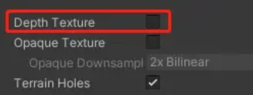
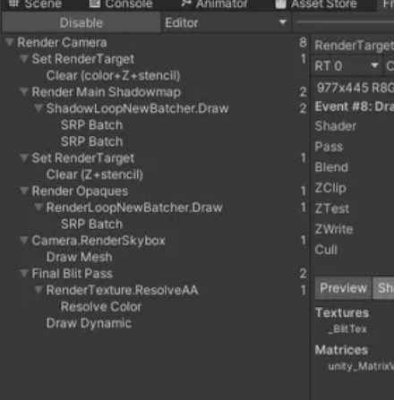
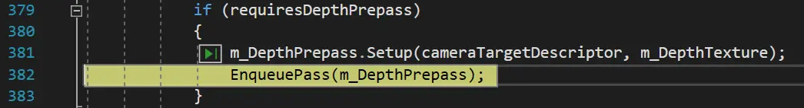
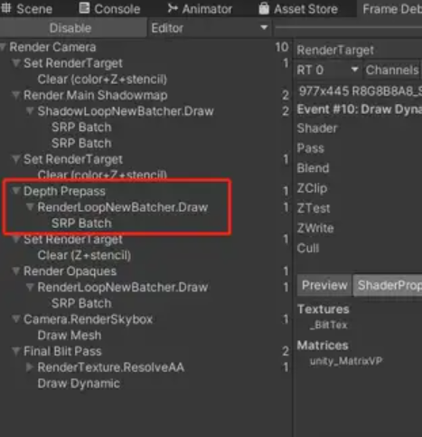
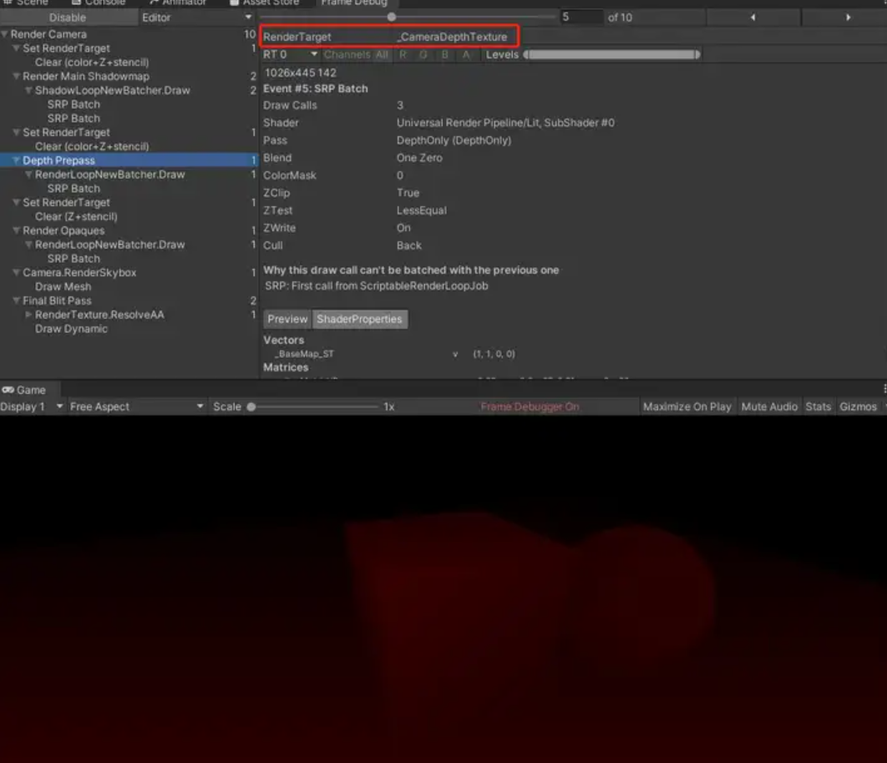
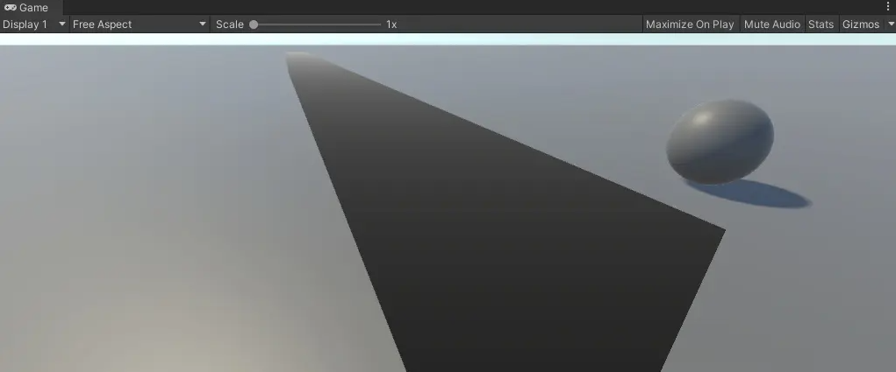
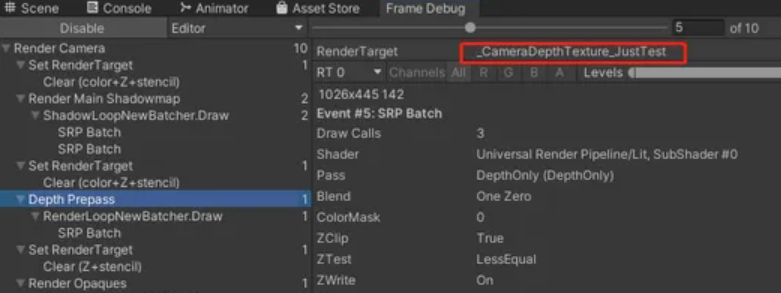
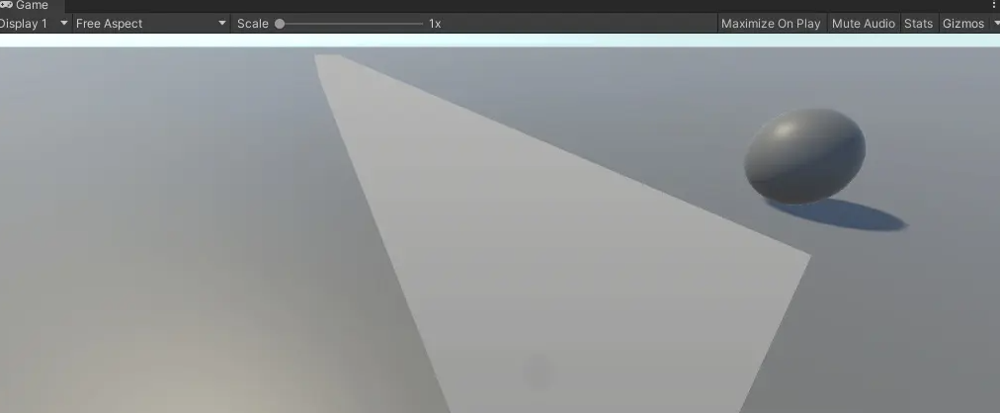

# 关于DepthOnlyPass

## 一、开启DepthOnlyPass

ForwardRenderer.Setup方法中，当requiresDepthPrepass变量为true的时候，才会将m_DepthPrepass填入m_ActivePassQueue中。

```c#
if (requiresDepthPrepass)
{
	m_DepthPrepass.Setup(cameraTargetDescriptor, m_DepthTexture);
	EnqueuePass(m_DepthPrepass);
}
```

如果是Scene相机或Preview相机，requiresDepthPrepass为true。如果是Game相机，只有当requiresDepthTexture为true且CanCopyDepth返回false的时候才为true:

```c#
requiresDepthPrepass = requiresDepthTexture && !CanCopyDepth(ref renderingData.cameraData)
requiresDepthPrepass |= isSceneViewCamera;
requiresDepthPrepass |= isPreviewCamera;
```

requiresDepthTexture由相机数据中的requiresDepthTexture变量赋值：

```c#
bool requiresDepthTexture = cameraData.requiresDepthTexture;
```

而跟踪一下代码可以发现，相机中的这个数据是从URP配置文件数据中读取的：



```c#
bool CanCopyDepth (ref CameraData cameraData)
{
    bool msaaEnabledForCamera = cameraData.cameraTargetDescriptor.msaaSamples > 1;
    bool supportsTextureCopy = SystemInfo.copyTextureSupport != CopyTextureSupport.None;
    bool supportsDepthTarget = RenderingUtils.SupportsRenderTextureFormat(RenderTextureFormat.Depth);
    bool supportsDepthCopy = !msaaEnabledForCamera && (supportsDepthTarget || supportsTextureCopy);
    // TODO: We don't have support to highp Texture2DMS currently and this breaks depth precision
    // currently disabling it until shader changes kickin.
    //bool msaaDepthResolve = msaaEnabledForCamera && Syysteminfo.supportsMultisampledTextures != 0;
    bool msaaDepthResolve = false;
    return supportsDepthCopy || msaaDepthResolve;
}
```

默认DepthTexture没有勾选上，requiresDepthPrepass为false，所以FrameDebugger中看不到DepthOnlyPass：



当把DepthTexture勾选上去后：


跟踪代码发现此时requiresDepthPrepass为true:



此时的FrameDebugger中可以看到DepthPrepass(即DepthOnlyPass)了：



## 二、DepthOnlyPass的渲染Target

m_DepthPrepass在配置的时候设置的渲染目标是m_DepthTexture:

```
if (requiresDepthPrepass)
{
	m_DepthPrepass.Setup(cameraTargetDescriptor, m_DepthTexture);
	EnqueuePass(m_DepthPrepass);
}
```

而m_DepthTexture初始化的时候id设置为_CameraDepthTexture:

```
m_DepthTexture.Init("_CameraDepthTexture");
```

理论上FrameDebugger中DepthPrepass的渲染目标应该是_CameraDepthTexture，查看结果如下：



写一个最简单的shader采样_CameraDepthTexture

```text
Shader "V/URP/DepthShader"
{
    Properties
    {

    }
    SubShader
    {
        Tags
        {
            "RenderPipeline"="UniversalPipeline"
            "RenderType"="Opaque"
            "Queue"="Geometry+0"
        }
        
        Pass
        {
            Name "Pass"
            Tags 
            { 
                
            }
            
            // Render State
            Blend One Zero, One Zero
            Cull Back
            ZTest LEqual
            ZWrite On
            //在OpenGL ES2.0中使用HLSLcc编译器,目前除了OpenGL ES2.0全都默认使用HLSLcc编译器.
            HLSLPROGRAM
            #pragma vertex vert
            #pragma fragment frag
            #pragma prefer_hlslcc gles
            #pragma exclude_renderers d3d11_9x
            #pragma target 2.0
            #pragma multi_compile_instancing
            
            // Includes
            #include "Packages/com.unity.render-pipelines.core/ShaderLibrary/Color.hlsl"
            #include "Packages/com.unity.render-pipelines.universal/ShaderLibrary/Core.hlsl"

            TEXTURE2D_X_FLOAT(_CameraDepthTexture);

	    SAMPLER(sampler_CameraDepthTexture);
            
            // 顶点着色器的输入
            struct Attributes
            {
                float3 positionOS : POSITION;
                float2 uv :TEXCOORD0;
            };
            
            // 顶点着色器的输出
            struct Varyings
            {
                float4 positionCS : SV_POSITION;
				float4 screenPos : TEXCOORD1;
            };
            
            
            // 顶点着色器
            Varyings vert(Attributes v)
            {
                Varyings o = (Varyings)0;
                o.positionCS = TransformObjectToHClip(v.positionOS);
				o.screenPos = ComputeScreenPos(o.positionCS);
                return o;
            }

            // 片段着色器
            half4 frag(Varyings i) : SV_TARGET 
            {    
				float2 screenPos = i.screenPos.xy / i.screenPos.w;
				float depth = SAMPLE_TEXTURE2D_X(_CameraDepthTexture, sampler_CameraDepthTexture, screenPos).r;
				float depthValue = Linear01Depth(depth, _ZBufferParams);

                return half4(depthValue, depthValue, depthValue, 1);
            }
            
            ENDHLSL
        }
    }
    FallBack "Hidden/Shader Graph/FallbackError"
}
```

shader的功能非常简单，就是采样深度贴图，然后把它的值当成color输出。将这个shader赋给一个长方体，效果如下：



可见，深度值已经起到了效果。越靠近摄像机的位置depth越小，颜色越黑，越远的地方，深度值越大，颜色越白。

三、修改渲染Target

如果修改代码，改变DepthOnlyPass渲染目标的Id：

```
m_DepthTexture.Init("_CameraDepthTexture_JustTest");
```

查看FrameDebugger，结果如下：



可见，RenderTarget也相应地改为了_CameraDepthTexture_JustForTest。此时长方体无法正常渲染了：



这是因为渲染的Target和我们采样的贴图名不一致了，需要将shader中贴图名改为相应的名字，即可正常渲染：

```
TEXTURE2D_X_FLOAT(_CameraDepthTexture_JustForTest);
SAMPLER(sampler_CameraDepthTexture_JustForTest);
```

当然，这里只是测试，正常项目中不要修改_CameraDepthTexture名字。因为URP中很多内置功能是和这个名字绑定的。