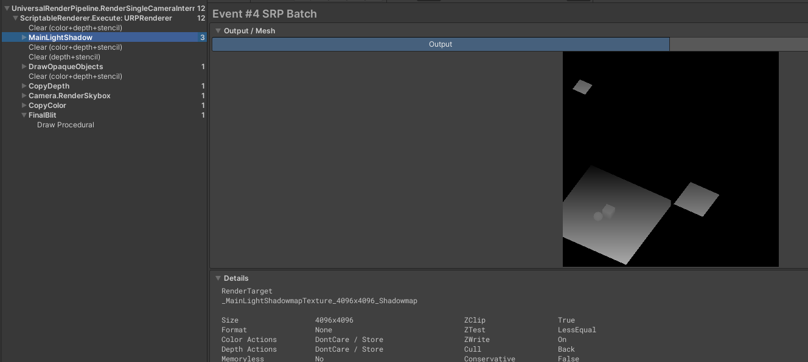
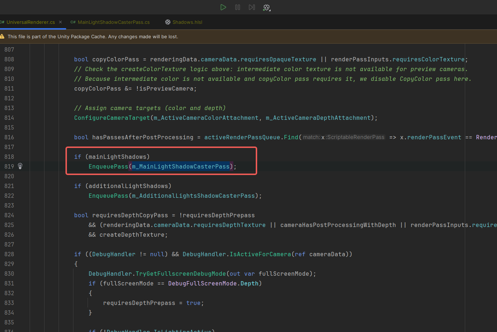
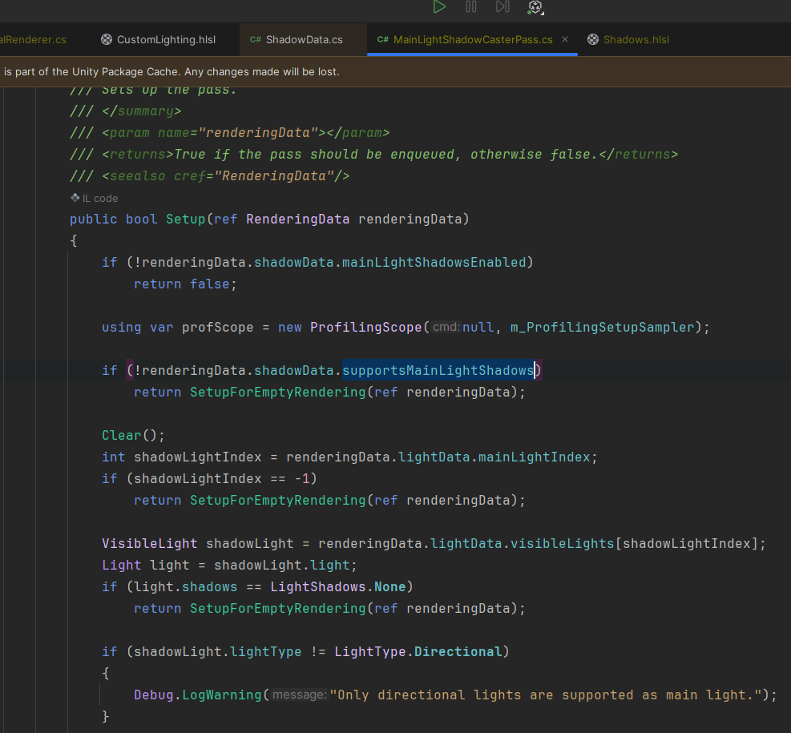
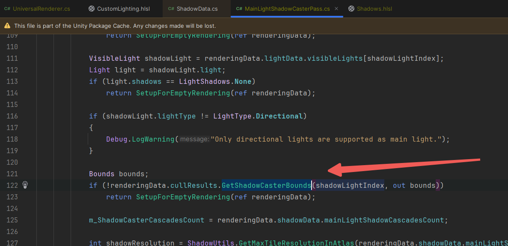
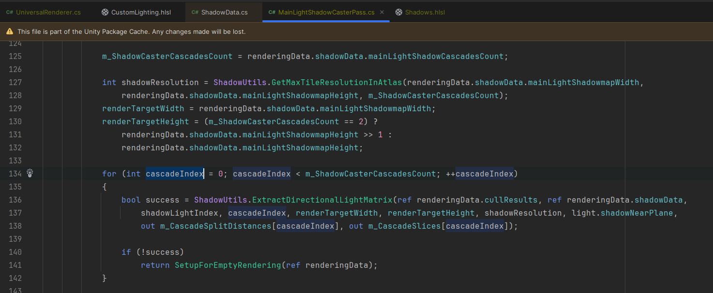
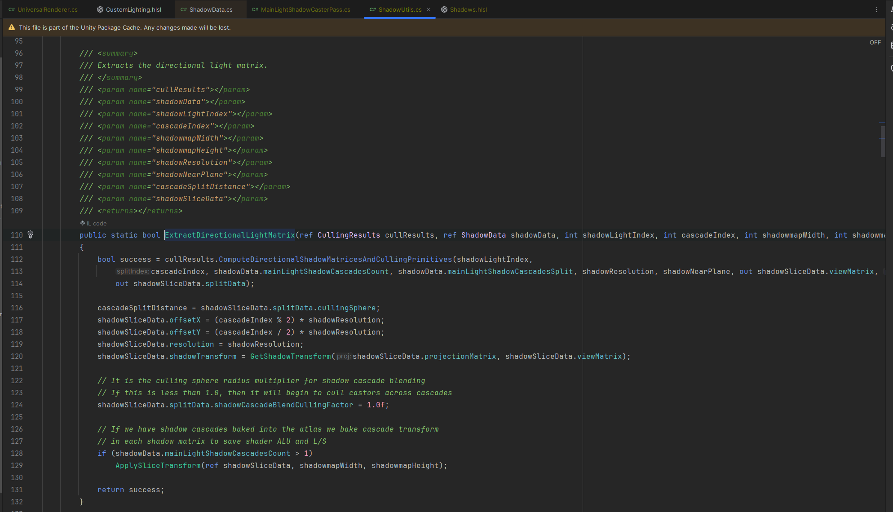
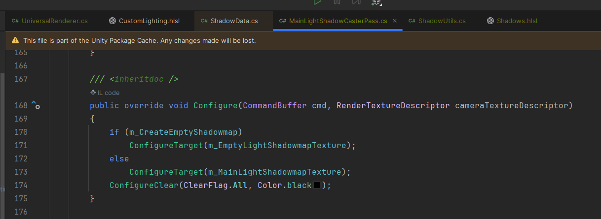
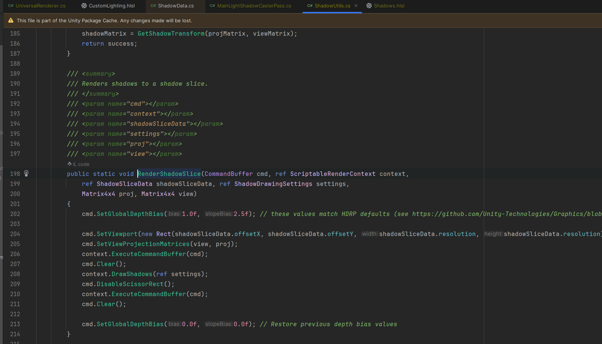
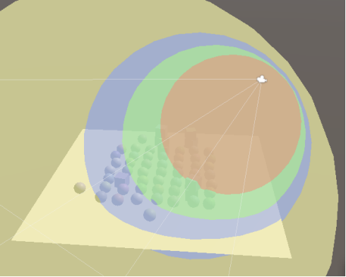
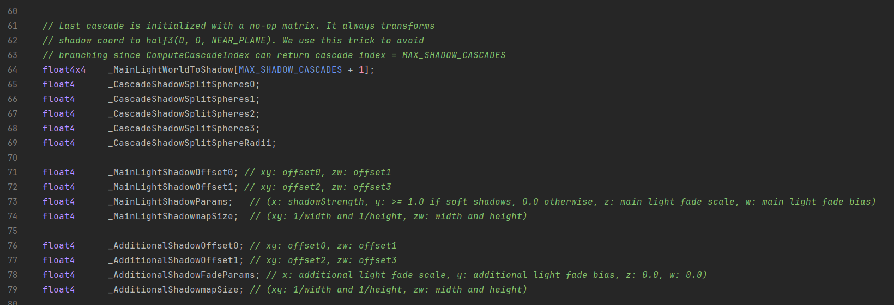

# 关于MainLightShadowCasterPass

AdditionalLight同理

## 一、为什么使用级联阴影

Unity内置的方向光实时阴影技术是Cascaded Shadow Mapping(简称CSM)。这是因为使用基本的Shadow mapping在大场景下存在阴影图精度问题：

1.主相机整个视锥生成一张阴影图，会导致单个物体占用阴影图的比例太小，读取阴影图时出现采样精度不够（多个像素采样一个图素），产生锯齿。使用尺寸更大的阴影图可以改善这个问题，但会导致内存使用增加。

2.相机近端和远端物体对阴影图采样精度一样，会导致近端物体采样精度不够，远端物体采样精度浪费。

级联阴影贴图(Cascaded Shadow Maps)是解决此问题的方法。这个想法是阴影投射器被渲染了不止一次，因此每个光在图集中会得到多个图块，称为级联(Cascaded )。第一个级联仅覆盖靠近相机的一小部分区域，而连续的级联会缩小以覆盖越来越大的具有相同像素数量的区域。然后，着色器对每个片段可用的最佳级联进行采样。

Unity的阴影代码每个定向光最多支持四个级联：


## 二、具体使用情况

FrameDebugger：




mainLightShadows的代码：



## 三、代码分析

-------------------------------------------变量-----------------------------------------------

```text
        const int k_MaxCascades = 4; //最大阴影级联级数
        const int k_ShadowmapBufferBits = 16; // DepthBuffer位数
        int m_ShadowmapWidth; //ShadowMap宽
        int m_ShadowmapHeight; //ShadowMap高
        int m_ShadowCasterCascadesCount; //配置的阴影级联数
        bool m_SupportsBoxFilterForShadows; //时候支持BoxFilter(Mobile和Switch支持)

        RenderTargetHandle m_MainLightShadowmap; //只是用来存储"_MainLightShadowmapTexture"这个id
        RenderTexture m_MainLightShadowmapTexture; //渲染的目标贴图

        Matrix4x4[] m_MainLightShadowMatrices; //用来存储shadowTransform然后赋值给GPU中的"_MainLightWorldToShadow"
        ShadowSliceData[] m_CascadeSlices; //存储各级阴影的ShadowSliceData数据
        Vector4[] m_CascadeSplitDistances; //存储各级阴影的剔除球数据
```

ShadowSliceData中存放的是各级阴影的矩阵、偏移和分辨率等数据：

```text
    public struct ShadowSliceData
    {
        public Matrix4x4 viewMatrix;
        public Matrix4x4 projectionMatrix;
        public Matrix4x4 shadowTransform;
        public int offsetX;
        public int offsetY;
        public int resolution;

        public void Clear()
        {
            viewMatrix = Matrix4x4.identity;
            projectionMatrix = Matrix4x4.identity;
            shadowTransform = Matrix4x4.identity;
            offsetX = offsetY = 0;
            resolution = 1024;
        }
    }
```

-------------------------------------------方法-----------------------------------------------

### 1.MainLightShadowCasterPass.Setup方法

当MainLightShadowCasterPass.Setup方法返回为true的时候就会进行MainLightShadowCasterPass的渲染：


当Setup方法返回true，则会进行MainLightShadowCasterPass渲染

如果配置中不支持主光源阴影或者没有主光源，或者可见的光中，设置的阴影类型是None，都不会进行主光源阴影的渲染：



除此之外，可见光最终可能不会影响任何投射阴影的对象，这可能是因为它们没有配置，或者是因为光线仅影响了超出最大阴影距离的对象。我们可以通过在剔除结果上调用GetShadowCasterBounds以获得可见光索引来进行检查。它具有边界的第二个输出参数（我们不需要），并返回边界是否有效。如果不是，则没有阴影可渲染，因此应将其忽略：



最后按级联Index进行了遍历，调用了ShadowUtils.ExtractDirectionalLightMatrix方法：



这里面主要调用了cullResults.ComputeDirectionalShadowMatricesAndCullingPrimitives方法：



ExtractDirectionalLightMatrix方法

Api文档：

[Rendering.CullingResults.ComputeDirectionalShadowMatricesAndCullingPrimitivesdocs.unity3d.com/2019.1/Documentation/ScriptReference/Rendering.CullingResults.ComputeDirectionalShadowMatricesAndCullingPrimitives.html](https://link.zhihu.com/?target=https%3A//docs.unity3d.com/2019.1/Documentation/ScriptReference/Rendering.CullingResults.ComputeDirectionalShadowMatricesAndCullingPrimitives.html)

阴影贴图的原理是，我们从灯光的角度渲染场景，只存储深度信息。用结果标记出，光线在击中某物之前会传播多远。但是，定向光被假定为无限远，没有真实位置。因此，我们要做的是找出与灯光方向匹配的视图和投影矩阵，并为我们提供一个剪辑空间立方体，该立方体与包含可见光阴影的摄像机可见区域重叠。这个不用自己去实现，我们可以使用culling results的ComputeDirectionalShadowMatricesAndCullingPrimitives方法为我们完成此工作，并为其传递9个参数。

第一个参数是可见光指数。接下来的三个参数是两个整数和一个Vector3，它们控制阴影级联。稍后我们将处理级联，因此现在使用零，一和零向量。然后是纹理尺寸，我们需要使用平铺尺寸。第六个参数是靠近平面的阴影，我们现在将其忽略并将其设置为零。

这些是输入参数，其余三个是输出参数。首先是视图矩阵，然后是投影矩阵，最后一个参数是ShadowSplitData结构。

cullResults.ComputeDirectionalShadowMatricesAndCullingPrimitives返回的bool值就是表示这项转换能否成功完成。

因为每个级联都需要其自己的变换矩阵，所以需要根据每个级联Index进行遍历计算。

### 2.MainLightShadowCasterPass.Configure



创建了一个临时的Texture，并将其设置为Target。

### 3.MainLightShadowCasterPass.Execute

```text
        public override void Execute(ScriptableRenderContext context, ref RenderingData renderingData)
        {
            RenderMainLightCascadeShadowmap(ref context, ref renderingData.cullResults, ref renderingData.lightData, ref renderingData.shadowData);
        }
```

RenderMainLightCascadeShadowmap用来完成MainLightCascadeShadowmap Texture的绘制工作：

```text
void RenderMainLightCascadeShadowmap(ref ScriptableRenderContext context, ref CullingResults cullResults, ref LightData lightData, ref ShadowData shadowData)
        {
            int shadowLightIndex = lightData.mainLightIndex;
            if (shadowLightIndex == -1)
                return;

            VisibleLight shadowLight = lightData.visibleLights[shadowLightIndex];

            CommandBuffer cmd = CommandBufferPool.Get(m_ProfilerTag);
            using (new ProfilingScope(cmd, m_ProfilingSampler))
            {
                var settings = new ShadowDrawingSettings(cullResults, shadowLightIndex);

                for (int cascadeIndex = 0; cascadeIndex < m_ShadowCasterCascadesCount; ++cascadeIndex)
                {
                    var splitData = settings.splitData;
                    splitData.cullingSphere = m_CascadeSplitDistances[cascadeIndex];
                    settings.splitData = splitData;
                    Vector4 shadowBias = ShadowUtils.GetShadowBias(ref shadowLight, shadowLightIndex, ref shadowData, m_CascadeSlices[cascadeIndex].projectionMatrix, m_CascadeSlices[cascadeIndex].resolution);
                    ShadowUtils.SetupShadowCasterConstantBuffer(cmd, ref shadowLight, shadowBias);
                    ShadowUtils.RenderShadowSlice(cmd, ref context, ref m_CascadeSlices[cascadeIndex],
                        ref settings, m_CascadeSlices[cascadeIndex].projectionMatrix, m_CascadeSlices[cascadeIndex].viewMatrix);
                }

                bool softShadows = shadowLight.light.shadows == LightShadows.Soft && shadowData.supportsSoftShadows;
                CoreUtils.SetKeyword(cmd, ShaderKeywordStrings.MainLightShadows, true);
                CoreUtils.SetKeyword(cmd, ShaderKeywordStrings.MainLightShadowCascades, shadowData.mainLightShadowCascadesCount > 1);
                CoreUtils.SetKeyword(cmd, ShaderKeywordStrings.SoftShadows, softShadows);

                SetupMainLightShadowReceiverConstants(cmd, shadowLight, shadowData.supportsSoftShadows);
            }

            context.ExecuteCommandBuffer(cmd);
            CommandBufferPool.Release(cmd);
        }
```

RenderMainLightCascadeShadowmap方法中，首先调用ShadowUtils.GetShadowBias方法获取shadow的bias值。之所以需要bias，是为了减轻阴影痤疮的现象。具体的可以参考下面的文章：

[https://learnopengl-cn.readthedocs.io/zh/latest/05%20Advanced%20Lighting/03%20Shadows/01%20Shadow%20Mapping/learnopengl-cn.readthedocs.io/zh/latest/05%20Advanced%20Lighting/03%20Shadows/01%20Shadow%20Mapping/](https://link.zhihu.com/?target=https%3A//learnopengl-cn.readthedocs.io/zh/latest/05%20Advanced%20Lighting/03%20Shadows/01%20Shadow%20Mapping/)

然后调用ShadowUtils.SetupShadowCasterConstantBuffer进行shader参数的配置。最后调用了关建方法ShadowUtils.RenderShadowSlice：[阴影映射 - LearnOpenGL-CN](https://link.zhihu.com/?target=https%3A//learnopengl-cn.readthedocs.io/zh/latest/05%20Advanced%20Lighting/03%20Shadows/01%20Shadow%20Mapping/)然后调用ShadowUtils.SetupShadowCasterConstantBuffer进行shader参数的配置。最后调用了关建方法ShadowUtils.RenderShadowSlice：



ShadowUtils.RenderShadowSlice是真正进行MainLightCascadeShadowmap绘制的方法。

流程如下:

a.计算该级联阴影级别在Atlas对应的Viewport

b.通过CommandBuffer设置好ViewPort和View&Project矩阵

c.绘制ShadowMap到Atlas上

4.球形剔除

Unity通过为其创建一个选择球来确定每个级联覆盖的区域。由于阴影投影是正交的且呈正方形，因此它们最终会紧密契合其剔除球，但还会覆盖周围的一些空间。这就是为什么可以在剔除区域之外看到一些阴影的原因。同样，光的方向与球无关，因此所有定向光最终都使用相同的剔除球。



使用透明的球体来让剔除球可视化

还需要这些球体来确定从哪个级联进行采样，因此我们需要将它们发送到GPU。为级联计数和级联的剔除球体数组添加一个标识符，并为球体数据添加一个数组。它们由四分量矢量定义，包含其XYZ位置及其在W分量中的半径。

MainLightShadowCasterPass中使用m_CascadeSplitDistances来存储剔除球信息。

```
Vector4[] m_CascadeSplitDistances;
```

存储剔除球信息

跟踪代码可以发现，级联的剔除球是ComputeDirectionalShadowMatricesAndCullingPrimitives输出的拆分数据的一部分。


ComputeDirectionalShadowMatricesAndCullingPrimitives计算剔除球数据

m_CascadeSplitDistances的数据计算好后，会在RenderMainLightCascadeShadowmap时将数据传递给ShadowDrawingSettings，用于context.DrawShadows时使用。

```c#
# MainLightShadowCasterPass.cs
void RenderMainLightCascadeShadowmap(ref ScriptableRenderContext context, ref RenderingData renderingData)
        {
            var cullResults = renderingData.cullResults;
            var lightData = renderingData.lightData;
            var shadowData = renderingData.shadowData;

            int shadowLightIndex = lightData.mainLightIndex;
            if (shadowLightIndex == -1)
                return;

            VisibleLight shadowLight = lightData.visibleLights[shadowLightIndex];

            var cmd = renderingData.commandBuffer;
            using (new ProfilingScope(cmd, ProfilingSampler.Get(URPProfileId.MainLightShadow)))
            {
                var settings = new ShadowDrawingSettings(cullResults, shadowLightIndex, BatchCullingProjectionType.Orthographic);
                settings.useRenderingLayerMaskTest = UniversalRenderPipeline.asset.useRenderingLayers;
                // Need to start by setting the Camera position as that is not set for passes executed before normal rendering
                cmd.SetGlobalVector(ShaderPropertyId.worldSpaceCameraPos, renderingData.cameraData.worldSpaceCameraPos);

                for (int cascadeIndex = 0; cascadeIndex < m_ShadowCasterCascadesCount; ++cascadeIndex)
                {
                    settings.splitData = m_CascadeSlices[cascadeIndex].splitData;

                    Vector4 shadowBias = ShadowUtils.GetShadowBias(ref shadowLight, shadowLightIndex, ref renderingData.shadowData, m_CascadeSlices[cascadeIndex].projectionMatrix, m_CascadeSlices[cascadeIndex].resolution);
                    ShadowUtils.SetupShadowCasterConstantBuffer(cmd, ref shadowLight, shadowBias);
                    CoreUtils.SetKeyword(cmd, ShaderKeywordStrings.CastingPunctualLightShadow, false);
                    ShadowUtils.RenderShadowSlice(cmd, ref context, ref m_CascadeSlices[cascadeIndex],
                        ref settings, m_CascadeSlices[cascadeIndex].projectionMatrix, m_CascadeSlices[cascadeIndex].viewMatrix);
                }

                renderingData.shadowData.isKeywordSoftShadowsEnabled = shadowLight.light.shadows == LightShadows.Soft && renderingData.shadowData.supportsSoftShadows;
                CoreUtils.SetKeyword(cmd, ShaderKeywordStrings.MainLightShadows, renderingData.shadowData.mainLightShadowCascadesCount == 1);
                CoreUtils.SetKeyword(cmd, ShaderKeywordStrings.MainLightShadowCascades, renderingData.shadowData.mainLightShadowCascadesCount > 1);
                ShadowUtils.SetSoftShadowQualityShaderKeywords(cmd, ref renderingData.shadowData);

                SetupMainLightShadowReceiverConstants(cmd, ref shadowLight, ref renderingData.shadowData);
            }
        }
```

将剔除球信息传递给ShadowDrawingSettings，用于绘制shadow

在RenderMainLightCascadeShadowmap方法的最后会调用SetupMainLightShadowReceiverConstants方法，用于将计算所得的各种数据传递给GPU：

```text
void SetupMainLightShadowReceiverConstants(CommandBuffer cmd, VisibleLight shadowLight, bool supportsSoftShadows)
        {
            Light light = shadowLight.light;
            bool softShadows = shadowLight.light.shadows == LightShadows.Soft && supportsSoftShadows;

            int cascadeCount = m_ShadowCasterCascadesCount;
            for (int i = 0; i < cascadeCount; ++i)
                m_MainLightShadowMatrices[i] = m_CascadeSlices[i].shadowTransform;

            // We setup and additional a no-op WorldToShadow matrix in the last index
            // because the ComputeCascadeIndex function in Shadows.hlsl can return an index
            // out of bounds. (position not inside any cascade) and we want to avoid branching
            Matrix4x4 noOpShadowMatrix = Matrix4x4.zero;
            noOpShadowMatrix.m22 = (SystemInfo.usesReversedZBuffer) ? 1.0f : 0.0f;
            for (int i = cascadeCount; i <= k_MaxCascades; ++i)
                m_MainLightShadowMatrices[i] = noOpShadowMatrix;

            float invShadowAtlasWidth = 1.0f / m_ShadowmapWidth;
            float invShadowAtlasHeight = 1.0f / m_ShadowmapHeight;
            float invHalfShadowAtlasWidth = 0.5f * invShadowAtlasWidth;
            float invHalfShadowAtlasHeight = 0.5f * invShadowAtlasHeight;
            float softShadowsProp = softShadows ? 1.0f : 0.0f;
            cmd.SetGlobalTexture(m_MainLightShadowmap.id, m_MainLightShadowmapTexture);
            cmd.SetGlobalMatrixArray(MainLightShadowConstantBuffer._WorldToShadow, m_MainLightShadowMatrices);
            cmd.SetGlobalVector(MainLightShadowConstantBuffer._ShadowParams, new Vector4(light.shadowStrength, softShadowsProp, 0.0f, 0.0f));

            if (m_ShadowCasterCascadesCount > 1)
            {
                cmd.SetGlobalVector(MainLightShadowConstantBuffer._CascadeShadowSplitSpheres0,
                    m_CascadeSplitDistances[0]);
                cmd.SetGlobalVector(MainLightShadowConstantBuffer._CascadeShadowSplitSpheres1,
                    m_CascadeSplitDistances[1]);
                cmd.SetGlobalVector(MainLightShadowConstantBuffer._CascadeShadowSplitSpheres2,
                    m_CascadeSplitDistances[2]);
                cmd.SetGlobalVector(MainLightShadowConstantBuffer._CascadeShadowSplitSpheres3,
                    m_CascadeSplitDistances[3]);
                cmd.SetGlobalVector(MainLightShadowConstantBuffer._CascadeShadowSplitSphereRadii, new Vector4(
                    m_CascadeSplitDistances[0].w * m_CascadeSplitDistances[0].w,
                    m_CascadeSplitDistances[1].w * m_CascadeSplitDistances[1].w,
                    m_CascadeSplitDistances[2].w * m_CascadeSplitDistances[2].w,
                    m_CascadeSplitDistances[3].w * m_CascadeSplitDistances[3].w));
            }

            // Inside shader soft shadows are controlled through global keyword.
            // If any additional light has soft shadows it will force soft shadows on main light too.
            // As it is not trivial finding out which additional light has soft shadows, we will pass main light properties if soft shadows are supported.
            // This workaround will be removed once we will support soft shadows per light.
            if (supportsSoftShadows)
            {
                if (m_SupportsBoxFilterForShadows)
                {
                    cmd.SetGlobalVector(MainLightShadowConstantBuffer._ShadowOffset0,
                        new Vector4(-invHalfShadowAtlasWidth, -invHalfShadowAtlasHeight, 0.0f, 0.0f));
                    cmd.SetGlobalVector(MainLightShadowConstantBuffer._ShadowOffset1,
                        new Vector4(invHalfShadowAtlasWidth, -invHalfShadowAtlasHeight, 0.0f, 0.0f));
                    cmd.SetGlobalVector(MainLightShadowConstantBuffer._ShadowOffset2,
                        new Vector4(-invHalfShadowAtlasWidth, invHalfShadowAtlasHeight, 0.0f, 0.0f));
                    cmd.SetGlobalVector(MainLightShadowConstantBuffer._ShadowOffset3,
                        new Vector4(invHalfShadowAtlasWidth, invHalfShadowAtlasHeight, 0.0f, 0.0f));
                }

                // Currently only used when !SHADER_API_MOBILE but risky to not set them as it's generic
                // enough so custom shaders might use it.
                cmd.SetGlobalVector(MainLightShadowConstantBuffer._ShadowmapSize, new Vector4(invShadowAtlasWidth,
                    invShadowAtlasHeight,
                    m_ShadowmapWidth, m_ShadowmapHeight));
            }
        }
```

总结一下渲染流程：

a.Setup()方法判断是否需要绘制阴影，以及调用ShadowUtils.ExtractDirectionalLightMatrix进行各级阴影数据的计算。

b.Configure()方法配置渲染Target和Clear的参数。

c.Execute()方法调用RenderMainLightCascadeShadowmap()方法，用于阴影贴图的绘制。其中最核心的绘制方法是ShadowUtils.RenderShadowSlice。绘制结束后会调用SetupMainLightShadowReceiverConstants方法将一些数据传递给GPU，用于阴影贴图的采样。

四、MainLightShadow的采样

1.先看一下Shadow.hlsl中定义的变量，他们存储了MainLightShadowPass中传递给GPU的数据：



2.MainLightShadow的采样从LitForwardPass的LitPassFragment阶段开始，其中会调用**InitializeInputData**方法：

```
#elif defined(MAIN_LIGHT_CALCULATE_SHADOWS)
    inputData.shadowCoord = TransformWorldToShadowCoord(inputData.positionWS);
```

这个方法位于Shadow.hlsl中，里面主要是调用ComputeCascadeIndex方法来计算级联index：

```
float4 TransformWorldToShadowCoord(float3 positionWS)
{
#ifdef _MAIN_LIGHT_SHADOWS_CASCADE
    half cascadeIndex = ComputeCascadeIndex(positionWS);
#else
    half cascadeIndex = half(0.0);
#endif

    float4 shadowCoord = mul(_MainLightWorldToShadow[cascadeIndex], float4(positionWS, 1.0));

    return float4(shadowCoord.xyz, 0);
}
```

ComputeCascadeIndex的代码如下：

```
half ComputeCascadeIndex(float3 positionWS)
{
    float3 fromCenter0 = positionWS - _CascadeShadowSplitSpheres0.xyz;
    float3 fromCenter1 = positionWS - _CascadeShadowSplitSpheres1.xyz;
    float3 fromCenter2 = positionWS - _CascadeShadowSplitSpheres2.xyz;
    float3 fromCenter3 = positionWS - _CascadeShadowSplitSpheres3.xyz;
    float4 distances2 = float4(dot(fromCenter0, fromCenter0), dot(fromCenter1, fromCenter1), dot(fromCenter2, fromCenter2), dot(fromCenter3, fromCenter3));

    half4 weights = half4(distances2 < _CascadeShadowSplitSphereRadii);
    weights.yzw = saturate(weights.yzw - weights.xyz);

    return half(4.0) - dot(weights, half4(4, 3, 2, 1));
}
```

**InitializeInputData**方法计算除了InputData.shadowCoord，然后调用UniversalFragmentPBR方法进行光照计算：

```
# Lighting.hlsl
half4 UniversalFragmentPBR(InputData inputData, SurfaceData surfaceData)
{
    #if defined(_SPECULARHIGHLIGHTS_OFF)
    bool specularHighlightsOff = true;
    #else
    bool specularHighlightsOff = false;
    #endif
    BRDFData brdfData;

    // NOTE: can modify "surfaceData"...
    InitializeBRDFData(surfaceData, brdfData);

    #if defined(DEBUG_DISPLAY)
    half4 debugColor;

    if (CanDebugOverrideOutputColor(inputData, surfaceData, brdfData, debugColor))
    {
        return debugColor;
    }
    #endif

    // Clear-coat calculation...
    BRDFData brdfDataClearCoat = CreateClearCoatBRDFData(surfaceData, brdfData);
    half4 shadowMask = CalculateShadowMask(inputData);
    AmbientOcclusionFactor aoFactor = CreateAmbientOcclusionFactor(inputData, surfaceData);
    uint meshRenderingLayers = GetMeshRenderingLayer();
    Light mainLight = GetMainLight(inputData, shadowMask, aoFactor);

    // NOTE: We don't apply AO to the GI here because it's done in the lighting calculation below...
    MixRealtimeAndBakedGI(mainLight, inputData.normalWS, inputData.bakedGI);

    LightingData lightingData = CreateLightingData(inputData, surfaceData);

    lightingData.giColor = GlobalIllumination(brdfData, brdfDataClearCoat, surfaceData.clearCoatMask,
                                              inputData.bakedGI, aoFactor.indirectAmbientOcclusion, inputData.positionWS,
                                              inputData.normalWS, inputData.viewDirectionWS, inputData.normalizedScreenSpaceUV);
#ifdef _LIGHT_LAYERS
    if (IsMatchingLightLayer(mainLight.layerMask, meshRenderingLayers))
#endif
    {
        lightingData.mainLightColor = LightingPhysicallyBased(brdfData, brdfDataClearCoat,
                                                              mainLight,
                                                              inputData.normalWS, inputData.viewDirectionWS,
                                                              surfaceData.clearCoatMask, specularHighlightsOff);
    }

    #if defined(_ADDITIONAL_LIGHTS)
    uint pixelLightCount = GetAdditionalLightsCount();

    #if USE_FORWARD_PLUS
    for (uint lightIndex = 0; lightIndex < min(URP_FP_DIRECTIONAL_LIGHTS_COUNT, MAX_VISIBLE_LIGHTS); lightIndex++)
    {
        FORWARD_PLUS_SUBTRACTIVE_LIGHT_CHECK

        Light light = GetAdditionalLight(lightIndex, inputData, shadowMask, aoFactor);

#ifdef _LIGHT_LAYERS
        if (IsMatchingLightLayer(light.layerMask, meshRenderingLayers))
#endif
        {
            lightingData.additionalLightsColor += LightingPhysicallyBased(brdfData, brdfDataClearCoat, light,
                                                                          inputData.normalWS, inputData.viewDirectionWS,
                                                                          surfaceData.clearCoatMask, specularHighlightsOff);
        }
    }
    #endif

    LIGHT_LOOP_BEGIN(pixelLightCount)
        Light light = GetAdditionalLight(lightIndex, inputData, shadowMask, aoFactor);

#ifdef _LIGHT_LAYERS
        if (IsMatchingLightLayer(light.layerMask, meshRenderingLayers))
#endif
        {
            lightingData.additionalLightsColor += LightingPhysicallyBased(brdfData, brdfDataClearCoat, light,
                                                                          inputData.normalWS, inputData.viewDirectionWS,
                                                                          surfaceData.clearCoatMask, specularHighlightsOff);
        }
    LIGHT_LOOP_END
    #endif

    #if defined(_ADDITIONAL_LIGHTS_VERTEX)
    lightingData.vertexLightingColor += inputData.vertexLighting * brdfData.diffuse;
    #endif

#if REAL_IS_HALF
    // Clamp any half.inf+ to HALF_MAX
    return min(CalculateFinalColor(lightingData, surfaceData.alpha), HALF_MAX);
#else
    return CalculateFinalColor(lightingData, surfaceData.alpha);
#endif
}

// Deprecated: Use the version which takes "SurfaceData" instead of passing all of these arguments...
half4 UniversalFragmentPBR(InputData inputData, half3 albedo, half metallic, half3 specular,
    half smoothness, half occlusion, half3 emission, half alpha)
{
    SurfaceData surfaceData;

    surfaceData.albedo = albedo;
    surfaceData.specular = specular;
    surfaceData.metallic = metallic;
    surfaceData.smoothness = smoothness;
    surfaceData.normalTS = half3(0, 0, 1);
    surfaceData.emission = emission;
    surfaceData.occlusion = occlusion;
    surfaceData.alpha = alpha;
    surfaceData.clearCoatMask = 0;
    surfaceData.clearCoatSmoothness = 1;

    return UniversalFragmentPBR(inputData, surfaceData);
}
```

UniversalFragmentPBR中使用InputData.shadowCoord的是GetMainLight方法：

```
# RealTimeLights.hlsl
Light GetMainLight(InputData inputData, half4 shadowMask, AmbientOcclusionFactor aoFactor)
{
    Light light = GetMainLight(inputData.shadowCoord, inputData.positionWS, shadowMask);

    #if defined(_SCREEN_SPACE_OCCLUSION) && !defined(_SURFACE_TYPE_TRANSPARENT)
    if (IsLightingFeatureEnabled(DEBUGLIGHTINGFEATUREFLAGS_AMBIENT_OCCLUSION))
    {
        light.color *= aoFactor.directAmbientOcclusion;
    }
    #endif

    return light;
}
```

GetMainLight方法会调用MainLightRealtimeShadow方法，来采样_MainLightShadowmapTexture：

```
# Shadows.hlsl
half MainLightRealtimeShadow(float4 shadowCoord)
{
    #if !defined(MAIN_LIGHT_CALCULATE_SHADOWS)
        return half(1.0);
    #elif defined(_MAIN_LIGHT_SHADOWS_SCREEN) && !defined(_SURFACE_TYPE_TRANSPARENT)
        return SampleScreenSpaceShadowmap(shadowCoord);
    #else
        ShadowSamplingData shadowSamplingData = GetMainLightShadowSamplingData();
        half4 shadowParams = GetMainLightShadowParams();
        return SampleShadowmap(TEXTURE2D_ARGS(_MainLightShadowmapTexture, sampler_LinearClampCompare), shadowCoord, shadowSamplingData, shadowParams, false);
    #endif
}
```

SampleShadowmap方法：

```text
real SampleShadowmap(TEXTURE2D_SHADOW_PARAM(ShadowMap, sampler_ShadowMap), float4 shadowCoord, ShadowSamplingData samplingData, half4 shadowParams, bool isPerspectiveProjection = true)
{
    // Compiler will optimize this branch away as long as isPerspectiveProjection is known at compile time
    if (isPerspectiveProjection)
        shadowCoord.xyz /= shadowCoord.w;

    real attenuation;
    real shadowStrength = shadowParams.x;

    // TODO: We could branch on if this light has soft shadows (shadowParams.y) to save perf on some platforms.
#ifdef _SHADOWS_SOFT
    attenuation = SampleShadowmapFiltered(TEXTURE2D_SHADOW_ARGS(ShadowMap, sampler_ShadowMap), shadowCoord, samplingData);
#else
    // 1-tap hardware comparison
    attenuation = SAMPLE_TEXTURE2D_SHADOW(ShadowMap, sampler_ShadowMap, shadowCoord.xyz);
#endif

    attenuation = LerpWhiteTo(attenuation, shadowStrength);

    // Shadow coords that fall out of the light frustum volume must always return attenuation 1.0
    // TODO: We could use branch here to save some perf on some platforms.
    return BEYOND_SHADOW_FAR(shadowCoord) ? 1.0 : attenuation;
}
```

SampleShadowmapFiltered方法：

```text
real SampleShadowmapFiltered(TEXTURE2D_SHADOW_PARAM(ShadowMap, sampler_ShadowMap), float4 shadowCoord, ShadowSamplingData samplingData)
{
    real attenuation;

#if defined(SHADER_API_MOBILE) || defined(SHADER_API_SWITCH)
    // 4-tap hardware comparison
    real4 attenuation4;
    attenuation4.x = SAMPLE_TEXTURE2D_SHADOW(ShadowMap, sampler_ShadowMap, shadowCoord.xyz + samplingData.shadowOffset0.xyz);
    attenuation4.y = SAMPLE_TEXTURE2D_SHADOW(ShadowMap, sampler_ShadowMap, shadowCoord.xyz + samplingData.shadowOffset1.xyz);
    attenuation4.z = SAMPLE_TEXTURE2D_SHADOW(ShadowMap, sampler_ShadowMap, shadowCoord.xyz + samplingData.shadowOffset2.xyz);
    attenuation4.w = SAMPLE_TEXTURE2D_SHADOW(ShadowMap, sampler_ShadowMap, shadowCoord.xyz + samplingData.shadowOffset3.xyz);
    attenuation = dot(attenuation4, 0.25);
#else
    float fetchesWeights[9];
    float2 fetchesUV[9];
    SampleShadow_ComputeSamples_Tent_5x5(samplingData.shadowmapSize, shadowCoord.xy, fetchesWeights, fetchesUV);

    attenuation = fetchesWeights[0] * SAMPLE_TEXTURE2D_SHADOW(ShadowMap, sampler_ShadowMap, float3(fetchesUV[0].xy, shadowCoord.z));
    attenuation += fetchesWeights[1] * SAMPLE_TEXTURE2D_SHADOW(ShadowMap, sampler_ShadowMap, float3(fetchesUV[1].xy, shadowCoord.z));
    attenuation += fetchesWeights[2] * SAMPLE_TEXTURE2D_SHADOW(ShadowMap, sampler_ShadowMap, float3(fetchesUV[2].xy, shadowCoord.z));
    attenuation += fetchesWeights[3] * SAMPLE_TEXTURE2D_SHADOW(ShadowMap, sampler_ShadowMap, float3(fetchesUV[3].xy, shadowCoord.z));
    attenuation += fetchesWeights[4] * SAMPLE_TEXTURE2D_SHADOW(ShadowMap, sampler_ShadowMap, float3(fetchesUV[4].xy, shadowCoord.z));
    attenuation += fetchesWeights[5] * SAMPLE_TEXTURE2D_SHADOW(ShadowMap, sampler_ShadowMap, float3(fetchesUV[5].xy, shadowCoord.z));
    attenuation += fetchesWeights[6] * SAMPLE_TEXTURE2D_SHADOW(ShadowMap, sampler_ShadowMap, float3(fetchesUV[6].xy, shadowCoord.z));
    attenuation += fetchesWeights[7] * SAMPLE_TEXTURE2D_SHADOW(ShadowMap, sampler_ShadowMap, float3(fetchesUV[7].xy, shadowCoord.z));
    attenuation += fetchesWeights[8] * SAMPLE_TEXTURE2D_SHADOW(ShadowMap, sampler_ShadowMap, float3(fetchesUV[8].xy, shadowCoord.z));
#endif

    return attenuation;
}
```

SAMPLE_TEXTURE2D_SHADOW宏定义：

```text
#define SAMPLE_TEXTURE2D_SHADOW(textureName, samplerName, coord3)  textureName.SampleCmpLevelZero(samplerName, (coord3).xy, (coord3).z)
```

