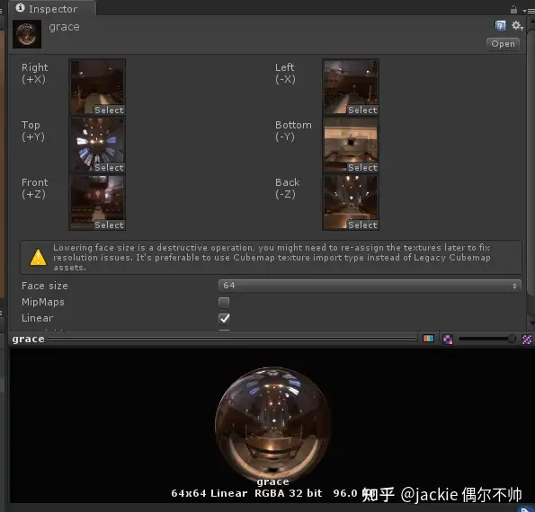

# 从应用层掌握unity的probe(球谐数据)

从应用层掌握unity的probe(球谐数据),言外之意就是放弃从底层原理真正的理解他掌握他.因为看了几遍文章做到后者非常困难.所以打算写一篇不需要从底层开始也能创造出虚拟的掌控感.这里有一篇文章说明彻底掌握他需要的大量门槛.而且即便掌握理论后 到工程实践中又有很多的路要绕,也不能很快做具体应用,所以这篇从工程角度浅显但真实的掌握他.

先来一张 原理劝退图

[要完全理解球谐函数，需要什么基础的数学知识？216 赞同 · 3 评论回答](https://www.zhihu.com/question/393223995/answer/1710057781)

------

**真实需求**

开放大场景要做户外GI了,痛苦的过往告诉我 一定不能运行整个场景的烘焙流程.否则迭代超级慢.所以需要实现 一种轻量的独立的快速创建probe数据的做法.也就是在几万个位置,拍摄低分辨率的cubemap,然后对这个cubemap快速转成 球谐数据.最后稀疏八叉树存储.

但是从cubemap 到sh的算法,跨度非常大.不利于理解他,所以需要慢慢分段推进这个过程.

------

**核心推演逻辑**

1. Randiancemap 直接 半球采样N次就行了
2. 为了 1采样性能提升,预计算出 Irradiancemap 来只采样一次
3. 为了2 数据量小,把Irradiancemap 低频数据投影到SH得到 27个SH数据
4. 为了2 生成数据的过程更快,让Randiancemap 直接投影SH,再做diffuse trans投影SH,再让2个SH卷积

------

**RadianceMap 方式照明**

这是IBL中 最简单 最直接的照明计算方式,所以从他开始.

unity的cubemap是个有些含糊和容易混杂的概念.想展开讲讲它.

**1.legacy cubemap**

legacy cubemap

很多文章用这种早期的 cubemap做例子,导致现在的测试效果不对,因为这种格式手动创建出来是 写死rgba32的 不支持HDR,代码创建的才能设置float32类型 实现支持hdr.但这样就不支持贴图压缩了所以一般不用这种或临时中间数据用下.

**2.HDR cubemap**

cylindrical 图真实内容

这种是unity最常见的cubemap资源,支持多种摆放格式,其中最常用的是 cylindrical模式(圆柱投影),因为substance painter 或其他类似软件都是提供这种格式的资源.所以做一致性验证时常常用到.

其中 **Convolution Type** 关键参数常常被人忽略.选择 specular 时用作 反射球资源.选着 diffuse时用作 irradiancemap照明.(后面我们会自己实现这个算法),一般情况下选择none模式,然后利用unity的烘焙工具,会创造出一份specular 的cubemap作为反射球资源.同时 创造出一份SH,作为 ambientProbe数据.当然也参与lightmap的计算但直接创造出的2份数据是这些.

**3.代码创建的cubemap类型**

这类cubemap数据内容不能直接转为2 类型,需要自己实现某种坐标映射才能存储为2类型.这里有3种 分别是Texture2D 和RenderTexture 的dimension为 TextureDimension.Cube的类型,和一个直接叫 Cubemap的类型.

介绍完cubemap类型,再说说 最简单 RadianceMap 照明. cubemap是贴图存储方式的分类.这种存储的数据才决定他的本质是什么.比如可以是 6个方向的 场景环境,可以是6个方向的各种光照数据,所以cubemap具体是什么是不固定的.

RadianceMap 在这里就是 specular内容的cubemap,因为这张图里每个像素都可以看作一个带方向带强度的小光源,这种从固定方向来源的照明就是 radiance的定义.所以 RadianceMap 非常简单,只要暴力的做半球范围内,每个角度的单独照明累加即可.

2维球坐标下遍历半球范围

unity probe (左) vs RadianceMap 照明

可以看到效果比unity自带的probe好多了,没有尾巴漏光问题,过渡也更柔和.如果我们已经实现了共同富裕,那么这篇到这里就结束了,完全不需要irradiancemap与sh的后续推进.因为我们都拥有无敌算力的显卡.看看上面2个帧数 直接从 100+调到7.所以没有人会这样用,这只是演示ibl照明 漫反射部分的本质计算.我们分清要干嘛 和哪些活是为了更快的干嘛 .是理解技术的一个关键点.

------

**IrradianceMap 方式照明**

既然RadianceMap 原理简单,效果好,那么我们的思路就很简单,给他优化下性能就好了.优化性能最简单的思路就是预计算.所以我们发现,既然每个朝向要对 RadianceMap 的半球 遍历累加.那么我对每个方向提前累加好,用的时候 根据法线方向取一次不就很高效了吗?单位面积上所有方向光照明的总和 就是 Irradiance的定义了,所以这张图叫 IrradianceMap. 大致思路是把 RadianceMap 实时运算的半球累加代码 放在cpu或computeshader离线做好对应的IrradianceMap.

RadianceMap 与IrradianceMap 关系

所以shader内采样就得到了千万倍加速了 只需要采样1次 ,就得到了与 RadianceMap 一样的精确效果且不掉帧.

IrradianceMap 模式的采样

IrradianceMap 效果

------

**球谐模式照明**

饶了一圈终于进入正题了,但有这些前因后果,才会觉得出现球谐顺理成章.如果说 IrradianceMap 是解决 RadianceMap 的:"快",那么 球谐的动机就是为了解决:"省".图形开发也是围绕 多快好省总方针进行的.

球谐为什么能省?

还是那句话直观而全面的理解球谐很困难,但是可以把他想成是一个 对于 方向性很好的拟合函数工具.拟合的意思就是知道个大概.方向性比较直观的例子其实是2d,不是3d.

我们看个球谐能省的 最简单2D例子加深直观印象.

首先每1秒 创建360个随机的点.这些点分布在圆心的 360°上.但每个点到圆心的距离是随机的.但这种随机不是跳跃的是连续的.连续与随机是 非常重要的概念也是自然界常态.因为随机所以不能用公式简单表达,因为连续所以可以拟合+插值表达. 这些是逻辑与规律的基础.

这是距离数据 按2d方向 投影到球谐后 得到的 25个参数.(我选了5阶球谐,unity probe用3阶).

然后 绘制原始的360x3个float数据 (白色部分),和 利用 25个float 利用球谐还原的图形(红色部分)

00:14

可以看到 用2.3%的数据量就能模拟出原始信号,在计算量存储量很大的地方非常有优势.而且漫反射是低频的 也就是白色线框会很圆滑.这样就更靠近红色线框了.

这样我们知道要将数据投影到球谐,获得系数,运行时在根据系数 重建数据.这样一个流程.

但怎么投影是个问题.

一般会这样想.既然IrradianceMap 够快了,那么只要 让 IrradianceMap 投影到球谐得到系数.运行时再获得 IrradianceMap 就可以了.这样确实没问题的.但是生成速度太慢.虽然经常用离线生成,但如果可以更快谁希望工具卡半小时呢?为什么慢,假设RadianceMap 有N像素,IrradianceMap 有M像素,球谐要9个float,因为每个IrradianceMap 像素都需要遍历一半的RadianceMap 像素(半球空间),所以总计算量是 N*M+9M;而NM的量是巨大的.看到有文章提到,然*IrradianceMap 与RadianceMap 分别投影到球谐,再让2个球谐卷积.就能实现类似结果.但没说怎么实现.道理很好懂 这样就变成 9N+9M了,计算量肯定会大量下降.

查了很多资料无果,然后灵机一动 SphericalHarmonicsL2类里记得有个 AddDirectionalLight API,会不会是做这个投影的 一测果然如此.这样就可以避免创建中间数据 IrradianceMap 而直接创建球谐数据了,速度又快了不少.

RadianceMap 直接投影球谐

当然对于这个API如果不满足,比如想知道实现,或想改到gpu加速工具,那么还是需要知道具体的算法的,这个我实在猜不出来,偷瞄了一眼源码 大概是这样 (最后有完整工程)

https://github.com/jackie2009/CustomUnitySH