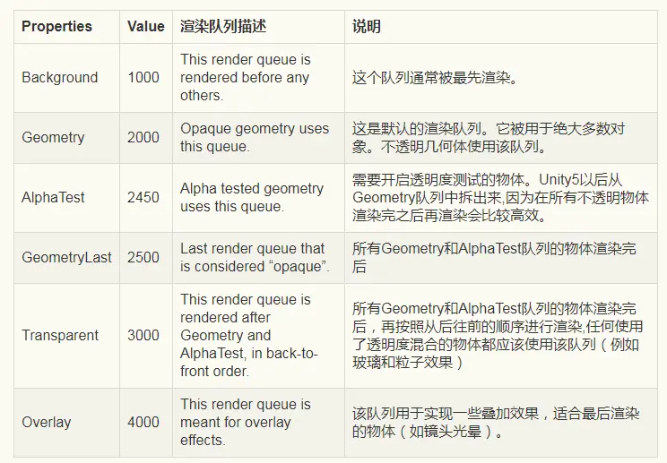

# Unity中的渲染顺序问题

## 概述

Unity中的渲染顺序自上而下大致分为三层。 最高层为Camera层，可以在Camera的depth那里设置，设置之后，图形的渲染顺序就是先绘制depth低的相机下的物体，再绘制depth高的相机下的物体，也就是说，depth高的相机会覆盖depth低的相机（具体的覆盖关系有don't clear， solid color等等几种）

比Camera层稍低一层的是sorting layer层，随便找一个可以设置sorting layer的地方，选择sorting layer，点添加按钮，就可以看到当前所有的sorting layer，并且可以更改sorting layer的顺序，排位靠后的sorting layer会覆盖排位靠前的sorting layer。设置好sorting layer的相互关系之后，就可以给任何一个继承于Renderer类，或者有renderer的子类作为field的对象设置sorting layer了。注意这些sorting layer的遮挡关系是在同一个camera的层级下的。不同camera下的renderer渲染顺序以camera的depth为准。有的component的sorting layer可以直接在unity editor里面设置，比如Sprite Renderer。有的则需要用代码来设置，比如设置Particle system的sorting layer，就需要在代码中取到 ParticleSystem.Renderer.SortingLayer 来进行设置。

比sorting layer再低一层的是sorting order，这个数字指代的是在同一个sorting layer下的渲染顺序，用法很明显就不赘述了。

需要注意不要混淆的是gameobject的layer，和renderer的sorting layer。 gameObject的layer个人理解是一个逻辑上的分层，用于camera的culling mask等。而renderer的sorting layer则用于渲染。只有继承与renderer或者有renderer作为filed的component才需要设置sorting layer。

另外需要指出的是，常用的NGUI的widget depth其本质也是一个sorting layer下的sorting order。 NGUI好像用的是一个叫做“UI"的sorting layer。由此大家如果有需要，也可以自己取Hack NGUI的代码，把NGUI的sorting layer暴露出来供自己定制。

简单总结一下，决定Unity渲染关系的层级顺序是：
 Camera
 sorting layer
 sortingorder

## RenderQueue

但是这些还不够，因为还没有说到比较让初学者头疼的（笔者一开始就很头疼）RenderQueue ，RenderQueue 其实就是shader中tags中的Queue

```bash
Tags { "Queue"="Geometry" }
```

默认情况下，Unity会基于对象距离摄像机的远近来排序你的对象。因此，当一个对象离摄像机越近，它就会优先绘制在其他更远的对象上面。对于大多数情况这是有效并合适的，但是在一些特殊情况下，你可能想要自己控制对象的绘制顺序。而使用Tags{}块我们就可以得到这样的控制。

Unity提供给我们一些默认的渲染队列，每一个对应一个唯一的值，来指导Unity绘制对象到屏幕上。这些内置的渲染队列被称为Background, Geometry, AlphaTest, GeometryLast,Transparent, Overlay。这些队列不是随便创建的，它们是为了让我们更容易地编写Shader并处理实时渲染的。

同时需在SubShader中显示声明ZWrite Off，通知Unity我们会重写物体的渲染深度排序。



好了，最后给出一个最终的总结：
 依次按条件先后顺序进行排序渲染处理。先按大项条件排序，后按小项条件排序

### Camera Depth:

越小越优先

###  RenderQueue 2500以下

1. Sorting Layer/Order in Layer

- ​       按照Sorting Layer/Order in Layer 设置的值，越小越优先
- ​       无此属性，等同于 Sorting Layer=default ,Order in Layer=0 参与排序

​    2.RenderQueue 越小越优先
​    3.RenderQueue 相等，由近到远排序优先

###  RenderQueue 2500以上

​    1. Sorting Layer/Order in Layer

- ​        按照Sorting Layer/Order in Layer 设置的值，越小越优先
- ​       无此属性，等同于 Sorting Layer=default ,Order in Layer=0 参与排序

​    2.RenderQueue 越小越优先
​    3.RenderQueue 相等

**由远到近排序**

说明一下：2500是关键值，它是透明跟不透明的分界点，因此我们考虑层级的时候要注意着点：renderqueue > 2500的物体绝对会在renderqueue <= 2500的物体前面，即渲染时renderqueue大的会挡住renderqueue小的，不论它的sortingLayer和sortingOrder怎么设置都是不起作用的。知道了这点，其他的就很好理解了。当两个的RenderQueue都在同一侧时，在SortingLayer高的绝对会在sortingLayer前面，无视renderqueue跟soringOrder，只有在sortingLayer相同的前提下，soringOrder高的会在sortingOrder低的前面，无视renderqueue。当sortingLayer跟sortingOrder相同时，才看renderqueue的高低，高的在前面。

**注意：半透明物体的渲染顺序时越远越优先渲染，与不透明物体正好相反**

UGUI中的ui默认使用的是UI/Default 材质，对应的shader中的渲染队列是Transparent，所以正常来说，无论贴图是否透明，ui都是在渲染Transparent队列时进行渲染。

```bash
Shader "UI/Default"
{
    Properties
    {
       ...
    }

    SubShader
    {
        Tags
        {
            "Queue"="Transparent"
            "IgnoreProjector"="True"
            "RenderType"="Transparent"
            "PreviewType"="Plane"
            "CanUseSpriteAtlas"="True"
        }
        ...
    }
}
```