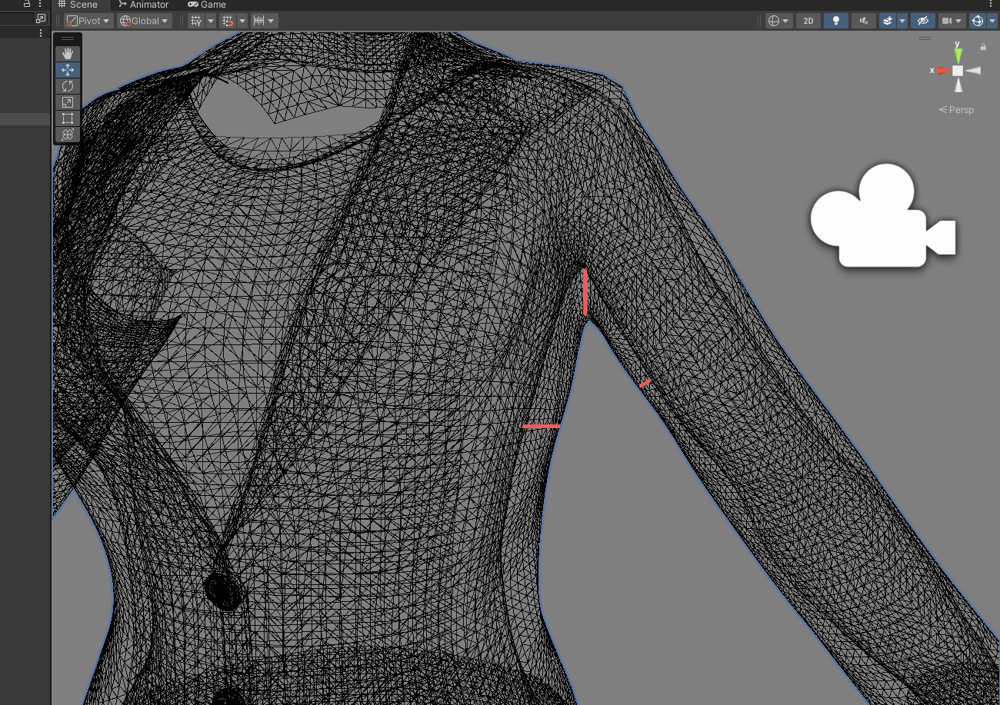
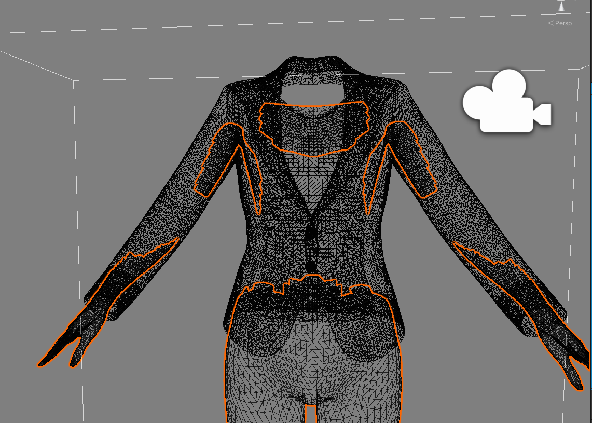
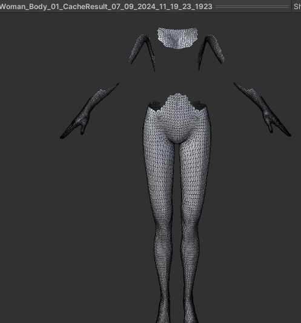

# 穿模问题总结

**问题背景：**播放生成式动作时，数字人素体和衣服的穿模、换装穿模。因为是人体骨骼驱动，衣服并没有制作骨骼动画。播放手k动画时衣服加上物理效果也有可能穿模

**解决方案：**

### 1.离线裁剪（程序或手动）

解决思路：当衣服和人体离得比较近时会比较容易穿模，所以只需要把容易穿模的地方裁剪。



程序裁剪：让衣服的每个顶点向法线反方向投射射线，检测击中位置的距离，设置阈值裁剪掉距离过小的人体素模的三角面，并把这个新mesh缓存到本地，运行时调用。整个遍历过程建议使用JobSystem，或ComputeShader来加速。

```c#
/// <summary>
/// 主要部分。运行射线模拟并隐藏mesh中被遮挡的部分。
/// 注意必须是 IEnumerator，否则创建的碰撞mesh不会在同一帧中提供任何射线投射结果。
/// </summary>
public IEnumerator RunClippingSimulation(Action OnSimulationComplete = null)
{
    //确保使用的是原mesh，而不是已经剔除的mesh
    ResetMeshesToOriginal();

    //检查缓存
    if (CacheResults)
    {
        List<Mesh> CheckValues = new List<Mesh>();
        foreach(SkinnedMeshRenderer smr in Meshes)
        {
            if(smr == null || smr.sharedMesh == null) { continue; }
            CheckValues.Add(smr.sharedMesh);
        }
        ClippingGeneratorSetup Check = new ClippingGeneratorSetup
        {
            OutCheckDistance = OutwardCheckDistance,
            InputMeshes = CheckValues,
            MarginDistance = MarginDistance,
            InCheckDistance = InwardCheckDistance,
            LowerChain = PreventLowerChainItems
        };
        if (CheckCached(Check)) { yield break; }
    }
    if(DebugLevel != CharClipDebugLevel.None) { Debug.Log("Could not find cached simulation. Running clipping check."); }

    //创建碰撞 mesh
    for (int i = 0; i < Colliders.Count; i++) { DestroyImmediate(Colliders[i]); }
    Colliders = new List<GameObject>();
    CreateColliders(Colliders);
    yield return null; //REQUIRED

    //每个mesh检查occlude
    int Index = 0;
    List<Mesh> FinalMeshes = new List<Mesh>();
    foreach (SkinnedMeshRenderer smr in Meshes)
    {
        if (smr == null || smr.sharedMesh == null) { continue; }

        //进行设置，以免触发自己或索引链的任何网眼
        if (PreventLowerChainItems)
        {
            Colliders[Index].gameObject.SetActive(false);
            yield return null;
        }
        //if(Index > 0) { Colliders[Index - 1].gameObject.SetActive(true); }
        OriginalMeshes.Add(smr, smr.sharedMesh);

        //射线结果
        bool[] Results = RaycastToFindOverlap(Colliders, Index);

        //如果没有改变
        if (!Results.Contains(true)) { FinalMeshes.Add(smr.sharedMesh); continue; }

        //找出不需要的三角面并删除它们
        CalculateNewTrisJob newJob = new CalculateNewTrisJob {
            NewTris = new NativeList<int>(Allocator.TempJob),
            OriginalTris = new NativeArray<int>(smr.sharedMesh.triangles, Allocator.TempJob),
            Results = new NativeArray<bool>(Results,Allocator.TempJob)
        };
        newJob.Schedule().Complete();
        if (RunAsynch == AsyncHarshness.Harsh) { yield return null; }

        //实例化mesh，并替换
        Mesh newm = Instantiate(smr.sharedMesh);
        newm.triangles = newJob.NewTris.ToArray();
        newm.name = "Clone_" + smr.sharedMesh.name;
        smr.sharedMesh = newm;
        FinalMeshes.Add(newm);

        //清除，并执行下一个
        newJob.Cleanup();
        Index++;

        if (RunAsynch == AsyncHarshness.Soft) { yield return null; }
    }
    //垃圾colliders清理
    for (int i = 0; i < Colliders.Count; i++) { DestroyImmediate(Colliders[i]); }

    //缓存结果
    if(CacheResults)
    {
        LastSetup = new ClippingGeneratorSetup
        {
            OutCheckDistance = OutwardCheckDistance,
            InputMeshes = OriginalMeshes.Values.ToList(),
            MarginDistance = MarginDistance,
            InCheckDistance = InwardCheckDistance,
            LowerChain = PreventLowerChainItems
        };

        CachedResults.Add(LastSetup,
        new ClippingGeneratorResult
        {
            FinalMeshes = FinalMeshes
        });
    }

    //发送完成通知
    if(OnSimulationComplete != null) { OnSimulationComplete.Invoke(); }
}

/// <summary>
/// 射线检测重叠，从外向内
/// </summary>
private bool[] RaycastToFindOverlap(List<GameObject> Colliders, int Index)
{
    //获取mesh，以防变形，从MeshCollider获取
    Mesh M = Colliders[Index].GetComponent<MeshCollider>().sharedMesh;
    //初始化
    List<GameObject> OurCollideGOs = new List<GameObject>() { Colliders[Index].gameObject };
    if (PreventLowerChainItems) { for (int i = 0; i < Index; i++) { OurCollideGOs.Add(Colliders[i]); } }
    Color MeshCol = MeshCols[Index % MeshCols.Count()];
    //raycast准备工作
    var results = new NativeArray<RaycastHit>(M.vertexCount, Allocator.TempJob);
    var commands = new NativeArray<RaycastCommand>(M.vertexCount, Allocator.TempJob);
    for (int i = 0; i < M.vertexCount; i++)
    {
        Vector3 Position = Colliders[Index].transform.TransformPoint(M.vertices[i]);
        Vector3 Normal = Colliders[Index].transform.TransformDirection(M.normals[i]);
        commands[i] = new RaycastCommand(Position + (Normal.normalized * OutwardCheckDistance), Normal.normalized * -1, OutwardCheckDistance + InwardCheckDistance, UniqueLayerMask.value);
    }
    //等待批处理job完成
    JobHandle handle = RaycastCommand.ScheduleBatch(commands, results, 1, default(JobHandle));
    handle.Complete();

    //检查job执行
    bool[] Results = new bool[results.Length];
    for (int i = 0; i < results.Length; i++)
    {
        if (results[i].collider == null) { Results[i] = true;  }
        else if (OurCollideGOs.Contains(results[i].collider.gameObject)) { Results[i] = true; Debug.Log("Triggered " + results[i].collider.gameObject); }
        else { Results[i] = false; }
    }

    //Debug,显示射线和hit点
    if (DebugLevel != CharClipDebugLevel.None)
    {
        for (int i = 0; i < Results.Length; i++)
        {
            //Hit something that isnt us?
            if (!Results[i])
            {
                if (DebugLevel == CharClipDebugLevel.ShowAll) Debug.DrawLine(commands[i].from, commands[i].from + commands[i].direction * commands[i].distance, Color.white, DebugLineTime);
                if (DebugLevel == CharClipDebugLevel.ShowHits) Debug.DrawLine(commands[i].from, commands[i].from + commands[i].direction * commands[i].distance, MeshCol, DebugLineTime);
            }
            else
            {
                if (DebugLevel == CharClipDebugLevel.ShowAll) Debug.DrawLine(commands[i].from, commands[i].from + commands[i].direction * commands[i].distance, MeshCol, DebugLineTime);
            }
        }
    }

    //检查是否接近边缘，放在最后检查
    CheckVertPassedTests CheckTest = new CheckVertPassedTests
    {
        PassedIndividual = new NativeArray<bool>(Results, Allocator.TempJob),
        Margin = MarginDistance,
        Origins = commands,
        FinalPassResult = new NativeArray<bool>(Results, Allocator.TempJob)
    };
    CheckTest.Schedule(Results.Length, 1).Complete();

    //检查结果
    Results = CheckTest.FinalPassResult.ToArray();

    //Cleanup
    CheckTest.Cleanup();
    results.Dispose();
    commands.Dispose();
    return Results;
}
```

```c#
[BurstCompile(CompileSynchronously = true)]
private struct CheckVertPassedTests : IJobParallelFor
{
    [NativeDisableParallelForRestriction]
    public NativeArray<RaycastCommand> Origins;
    [NativeDisableParallelForRestriction]
    public NativeArray<bool> FinalPassResult;
    [NativeDisableParallelForRestriction]
    public NativeArray<bool> PassedIndividual;
    [ReadOnly]
    public float Margin;
    [ReadOnly]
    public float OutwardCheckDistance;

    public void Cleanup()
    {
        //Dont dispose commands as coming from somewhere else
        FinalPassResult.Dispose();
        PassedIndividual.Dispose();
    }

    public void Execute(int index)
    {
        //没有击中任何东西
        if (PassedIndividual[index]) { FinalPassResult[index] = true;return; }
        //Else 如果我们足够接近依然算是通过
        else
        {
            for (int i = 0; i < Origins.Length; i++)
            {
                //如果已经通过，而这个射线又足够接近，则还是要通过
                if (index == i) { continue; }
                if (!PassedIndividual[i]) { continue; }
                float Dist = (GetRealOrigin(Origins[i]) - GetRealOrigin(Origins[index])).magnitude;
                if(Dist < Margin) { FinalPassResult[index] = true;return; }
            }
        }
        //All Fail
        FinalPassResult[index] = false;
    }


    public Vector3 GetRealOrigin(RaycastCommand Command)
    {
        return Command.from + (Command.direction * OutwardCheckDistance);
    }
}


[BurstCompile(CompileSynchronously = true)]
private struct CalculateNewTrisJob : IJob
{
    public NativeArray<int> OriginalTris;
    public NativeArray<bool> Results;
    public NativeList<int> NewTris;

    public void Cleanup()
    {
        OriginalTris.Dispose();
        Results.Dispose();
        NewTris.Dispose();
    }

    public void Execute()
    {
        for (int t = 0; t < OriginalTris.Length; t += 3)
        {
            //If all three tris are inside the "Zone"
            if (!Results[OriginalTris[t]] &&
               !Results[OriginalTris[t + 1]] &&
               !Results[OriginalTris[t + 2]])
            {
                //Is not allowed
            }
            else
            {
                //Is allowed
                NewTris.Add(OriginalTris[t]);
                NewTris.Add(OriginalTris[t + 1]);
                NewTris.Add(OriginalTris[t + 2]);
            }
        }
    }
}
```





也可以在建模软件手动删除易穿模的面。

**缺点：**不适用于换装的情况；只局限于贴身衣服，裙子无法通过这种方式判断是否容易穿模；多层衣服的情况下表现较差。

### 2.Stencil Buffer控制显隐

类似一些特效（传送门、地裂坑洞）

思路：在衣服和身体或衣服和衣服之间

可以解决多层布料和裙子的问题。

### 3.对最上面的衣服绘制深度图

RenderFeature里每一帧对最上面一层的衣服绘制深度图。对超过它深度的面进行实时裁剪，或在shader里对顶点进行偏移（消耗较高）


