# 关于深度图

为了解决渲染场景时哪部分可见，哪部分不可见的问题（即可见性问题，也被称为隐藏面移除问题，hidden surface removal problem，从术语这个角度看，技术的发展有时也会带动心态向积极的方向的变化），计算机图形学中常使用画家算法或深度缓冲的方式。

这也是在处理可见性问题时的两个大方向上的思路：Object space方式和Image space方式。在后文的描述中，各位应该能够体验到这两种方式的异同。

下图就是在Unity引擎中将深度缓冲的数据保存成的图片。

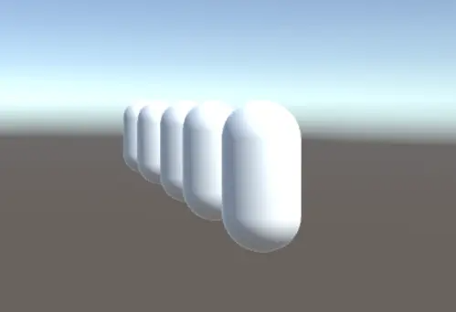

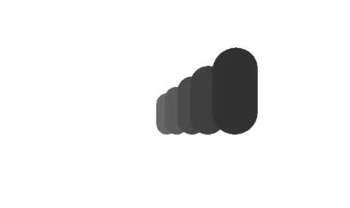

而利用深度图我们又可以实现很多有趣的视觉效果，例如一些很有科幻感的效果等等。

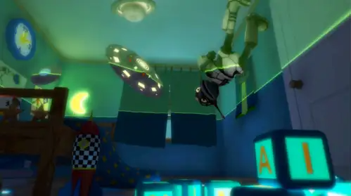

不过在说到这些有趣的效果之前，我们先来看看所谓的可见性问题和深度图的由来吧。

## 人类的本能和画家算法

在计算机图形学中，有一个很重要的问题需要解决，即**可见性问题**。因为我们要将一个3D模型投影到2D的平面上，这个过程中哪些多边形是可见的，哪些是不可见的必须要正确的处理。
按照人类的天性，一个最简单的解决方案就是先绘制最远的场景，之后从远及近，依次用近处的场景覆盖远处的场景。这就好比是一个画家画画一样。


（图片来自维基百科）
而计算机图形学中的画家算法的思想便是如此：

- 首先将待渲染的场景中的**多边形**根据深度进行排序。
- 之后按照顺序进行绘制。

这种方法通常会将不可见的部分覆盖，这样就可以解决可见性问题。
但是，世界上就怕但是二字，使用画家算法这种比较朴素的算法的确能解决简单的可见性问题，不过遇到一些特殊的情况就无能为力。例如下面这个小例子：

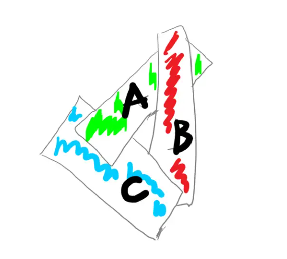

在这个例子中，三个多边形A、B、C互相重叠，那么到底如何对它们进行排序呢？此时我们无法确定哪个多边形在上，哪个多边形在下。在这种情况下，多边形作为一个整体进行深度排序已经不靠谱了，因此必须用一些方法对这些多边形进行切分、排序。

我们可以看到，这种方式是以场景中的对象或者说多边形为单位进行操作的。因而常常被称为Object space 方法或者称为Object precision 方法，我个人更喜欢后者这个称呼，因为这是一个关于操作精度的区别。这种方式主要是在对象或多边形这个级别的，即对比多边形的前后关系。除了画家算法之外，背面剔除也是Object Space的方法。它通过判断面的法线和观察者的角度来确定哪些面需要被剔除。

## 切分多边形的Newell算法

既然作为整体互相重叠导致难以排序，那么是否可以对多边形进行切分呢？Newell算法早在1972年就已经被提出了，所以算不得是什么新东西。但是它的一些思路还是很有趣的，倒也值得我们学习。

和画家算法一样，Newell算法同样会按照深度对场景内的对象进行排序并对排序后的多边形从远及近的依次绘制，不过有时会将场景内的多边形进行切割成多个多边形，之后再重新排序。

简单来说，首先我们可以将参与排序的结构定义为各个多边形上顶点的最大Z值和最小Z值[Zmax，Zmin]。

我们会以多边形上距离观察者最远的顶点的Z值对场景内的多边形进行一个粗略的排序（因为此时只是依据每个多边形距离观察者**最远的那一个顶点的Z值**进行排序），这样我们就获得了一个多边形列表。


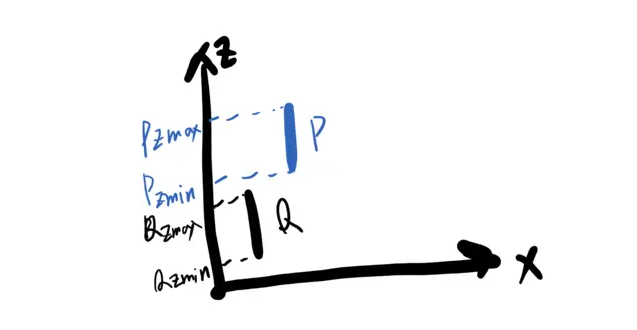

之后，取列表中的最后一个多边形P（它的某个顶点是距离观察者最远的顶点）和P之前的一个多边形Q，之后通过对比来确定P是否可以被写入帧缓冲区。
这个对比简单的说就是是否符合下面这个条件：

> 多边形P的Zmin > 多边形Q的Zmax

如果符合该条件，则P不会遮盖Q的任何部分，此时可以将P写入帧缓冲区。

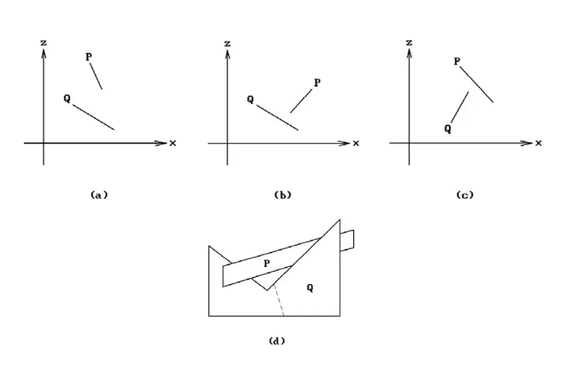

即便答案是否，P和Q也有可能不发生遮盖。例如它们在x、y上并无重叠。但是，Q还是有可能会被分割成若干个多边形{Q1，Q2...}。此时有可能会针对下面的几条测试结果，对最初的多边形列表进行重新排序（也有可能生成新的多边形，将新的多边形也纳入最初的列表中）并决定渲染的顺序。

- 多边形P和多边形Q在X轴上是否可区分？
- 多边形P和多边形Q在Y轴上是否可区分？
- 多边形P是否完全在多边形Q的后方？
- 多边形Q是否完全在多边形P的前方？
- 判断两个多边形的投影是否重叠？

如果这几条测试**全部**都没有通过，则需要对Q或P进行切割，例如将Q切割成Q1、Q2，则Q1和Q2将被插入多边形列表代替Q。

但是，我们可以发现，这种对深度进行排序后再依次渲染的方式会使得列表中多边形的每个点都被渲染，即便是不可见的点也会被渲染一遍。因此当场景内的多边形过多时，画家算法或Newell算法会过度的消耗计算机的资源。

## 有趣的Depth Buffer

正是由于画家算法存在的这些缺点，一些新的技术开始得到发展。而深度缓冲（depth buffer或z-buffer）就是这样的一种技术。Depth Buffer技术可以看作是画家算法的一个发展，不过它并非对多边形进行深度排序，而是根据逐个像素的信息解决深度冲突的问题，并且抛弃了对于深度渲染顺序的依赖。

因而，Depth Buffer这种方式是一种典型的Image space 方法，或者被称为Image precision方法，因为这种方式的精度是像素级的，它对比的是像素/片元级别的深度信息。

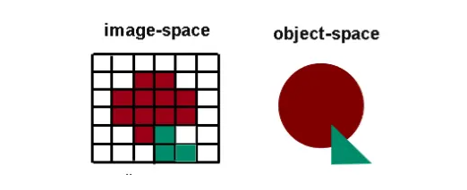


这样，除了用来保存每个像素的颜色信息的颜色缓冲区之外，我们还需要一个缓冲区用来保存每个像素的深度信息，并且两个缓冲区的大小显然要一致。

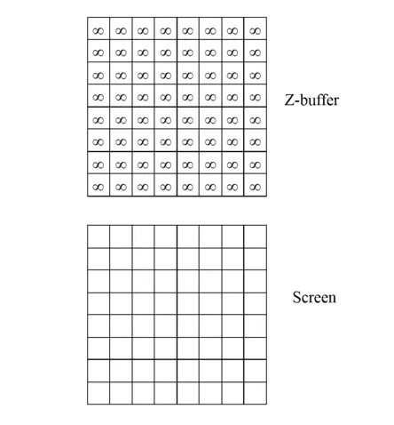

该算法的过程并不复杂：

- 首先，需要初始化缓冲区，颜色缓冲区往往被设置为背景色。而深度缓冲区则被设为最大深度值，例如经过投影之后，深度值往往在[0，1]之间，因此可以设置为1。
- 经过光栅化之后，计算每个多边形上每个片元的Z值，并和对应位置上的深度缓冲区中的值作比较。
  如果**z <= Zbuffer[x][y]**（即距离观察者更近），则需要同时修改两个缓冲区：将对应位置的颜色缓冲区的值修改为该片元的颜色，将对应位置的深度缓冲区的值修改为该片元的深度。即：**Color[x][y] = color; Zbuffer[x][y] = z；**

下面是一个小例子的图示，当然由于没有经过标准化，因此它的各个坐标和深度值没有在[0-1]的范围内，不过这不影响：

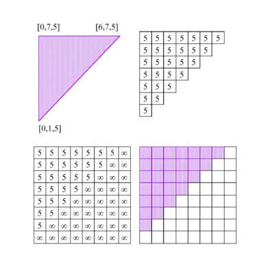

第一个多边形，深度都为5。

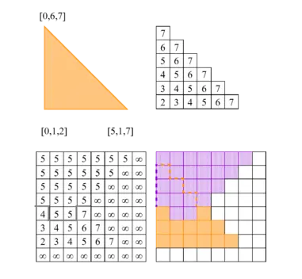

第二个多边形，它的三个顶点的深度分别为2、7、7，因此经过插值，各顶点之间的片元的深度在[2-7]之间，具体如右上角。我们还可以看到右下角是最后结果，紫色的多边形和橘色的多边形正确的互相覆盖。

## 计算顶点的深度值

众所周知，渲染最终会将一个三维的物体投射在一个二维的屏幕上。而在渲染流水线之中，也有一个阶段是顶点着色完成之后的投影阶段。无论是透视投影还是正交投影，最后都会借助一个标准立方体（CVV），来将3维的物体绘制在2维的屏幕上。
我们就先来以透视投影为例，来计算一下经过投影之后某个顶点在屏幕空间上的坐标吧。

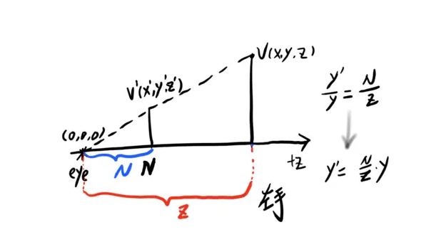

由于我们使用左手坐标系，Z轴指向屏幕内，因此从N到F的过程中Z值逐渐增大。依据相似三角形的知识，我们可以求出投影之后顶点V在屏幕上的坐标。


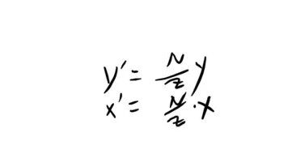

我们可以通过一个实际的例子来计算一下投影后点的坐标，例如在一个N = 1，v的坐标为（1，0.5，1.5），则v在近裁剪面上的投影点v'的坐标为（0.666,0.333）。

但是，投影之后顶点的Z值在哪呢？而在投影时如果没有顶点的深度信息，则两个不同的顶点投影到同一个二维坐标上该如何判定使用哪个顶点呢？

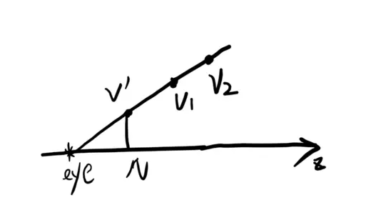

（v1,v2投影之后都会到同一个点v'）

为了解决保存Z值的信息这个问题，透视变换借助CVV引入了伪深度（pseudodepth）的概念。

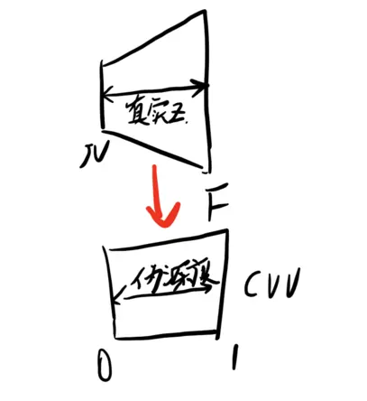


即将透视视锥体内顶点的真实的Z值映射到CVV的范围内，即[0，1]这个区间内。需要注意的是，CVV是左手坐标系的，因此Z值在指向屏幕内的方向上是增大的。

为了使投影后的z'的表达式和x’、y‘的表达式类似，这样做更易于用矩阵以及齐次坐标理论来表达投影变换，我们都使用z来做为分母，同时为了计算方便，我们使用一个z的线性表达式来作为分子。

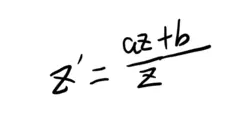

之后，我们要做的就是计算出a和b的表达式。

在CVV中处于0时，对应的是透视视锥体的近裁剪面（Near），z值为N；

```text
     0 = (N * a + b) / N
```

而CVV中1的位置，对应的是视锥体的远裁剪面（Far），z值为F；

```text
     1 = (F * a + b) / F
```

因此，我们可以求解出a和b的值:

```text
     a = F / (F - N)
     b = -FN / (F - N)
```

有了a和b的值，我们也就求出来视锥体中的Z值映射到CVV后的对应值。

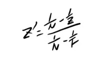


## Unity中的深度

由上文

Unity中的Depth，它的值在[0，1]之间，并且不是线性变化的，我们刚刚已经推导了一遍。


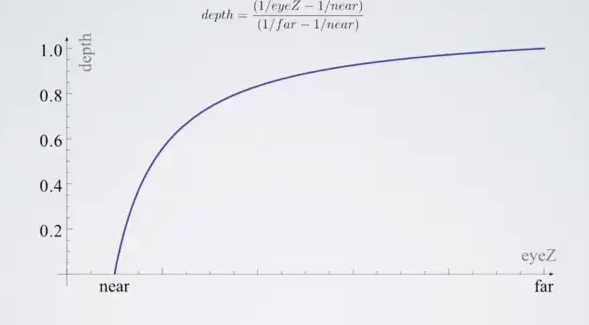

因此有时我们需要在Shader中使用深度信息时，往往需要先将深度信息转化成线性的：

```text
  float linearEyeDepth = LinearEyeDepth(depth);
```

或

```text
  float linear01Depth = Linear01Depth(depth);
```

我们根据Unity场景中的深度信息渲染成一张灰度图，就得到了本文一开头的深度图。


### Unity 4.X

在Unity 4.X和更早的版本中，由于市面上的设备尚没有普遍提供对深度纹理的支持（SM2.0+），Unity使用了一个叫做`Hidden/Camera-DepthTexture`的函数，通过替换着色器的方式，在渲染时根据其渲染类型使用对应的深度渲染器，**手动生成整体的深度图**。

```glsl
#if defined(UNITY_MIGHT_NOT_HAVE_DEPTH_TEXTURE)
    #define UNITY_TRANSFER_DEPTH(oo) oo = o.pos.zw
    #if SHADER_API_FLASH
    #define UNITY_OUTPUT_DEPTH(i) return EncodeFloatRGBA(i.x/i.y)
    #else
    #define UNITY_OUTPUT_DEPTH(i) return i.x/i.y
    #endif
#else
    #define UNITY_TRANSFER_DEPTH(oo) 
    #define UNITY_OUTPUT_DEPTH(i) return 0
```

> 这个叫做`UNITY_MIGHT_NOT_HAVE_DEPTH_TEXTURE`的宏是一个是否支持深度纹理的声明。

在确定支持DepthFormat格式的设备，这个函数不会做任何操作，只是一个空实现；在不支持深度纹理的设备上，将深度纹理编码为RGBA格式，在采样时再解码信息。这么做是为了充分利用RGBA的四通道优势以提高精度（8*4 =32位）。

```glsl
// Encoding/decoding [0..1) floats into 8 bit/channel RGBA. Note that 1.0 will not be encoded properly.
inline float4 EncodeFloatRGBA( float v )
{
    float4 kEncodeMul = float4(1.0, 255.0, 65025.0, 160581375.0);
    float kEncodeBit = 1.0/255.0;
    float4 enc = kEncodeMul * v;
    enc = frac (enc);
    enc -= enc.yzww * kEncodeBit;
    return enc;
}
inline float DecodeFloatRGBA( float4 enc )
{
    float4 kDecodeDot = float4(1.0, 1/255.0, 1/65025.0, 1/160581375.0);
    return dot( enc, kDecodeDot );
}
```

[^SM]: Shader Model，即渲染器模型，旧称优化渲染引擎模式。

### Unity 5.X

在Unity 5.X后，除了 Depth Normal Map以外，深度纹理均不再通过替换着色器手动生成，而是转为使用Shadow Caster Pass进行渲染，顶点和片元渲染阶段的宏也就全部改为了空实现。

```csharp
// Legacy; used to do something on platforms that had to emulate depth textures manually. Now all platforms have native depth textures.
#define UNITY_TRANSFER_DEPTH(oo)
// Legacy; used to do something on platforms that had to emulate depth textures manually. Now all platforms have native depth textures.
#define UNITY_OUTPUT_DEPTH(i) return 0
```

Shadow Caster本身实现也相当简单，顶点渲染阶段就是MVP变换（前提是不考虑Shadow Bias），而片元渲染阶段也直接做了空实现。

```glsl
#define SHADOW_CASTER_FRAGMENT(i) return 0;
```

为什么会这么做？正如注释所言，现在所有平台均支持原生深度图格式，因此手动生成并编码再解码的这一套流程也就没有再使用的必要了，直接申请一个Depth Format格式的渲染纹理即可。

> Shadow Caster 其实同时也负责对Shadow Map中光方向的深度进行渲染，这二者的主要区别在于VP矩阵的不同。阴影的深度基于光空间进行计算，而屏幕空间深度则是相对于摄像机而言的。

随之而来的则是另一个问题：既然如此简单，为什么不直接使用帧缓存中的Z值，而要额外使用一个独立的缓存进行复制和写入？

很简单，因为现代GPU使用了Early-Z技术对Overdraw进行优化，而Early-Z技术正是建立在Depth Pre-Pass的基础上。

> Early-Z就是指将原本在像素/片元阶段之后进行的深度测试**额外**提前到像素/片元阶段之前进行一次，从而避免那些原本会被深度测试剔除的顶点的光栅化计算，实现优化性能的目的。**原本的深度测试流程依然会被保留，以确保经过像素/片元阶段后的物体的最终遮挡关系是正确的。**

不过，现在对深度纹理的处理方式与最初形成标准渲染管线概念时已经有了很大的差别。下面我们将对各渲染管线中深度纹理的渲染方式进行简单的介绍。

[^Shadow Bias]: 即阴影偏移，为解决shadow map产生的shadow acne（自遮挡阴影瑕疵）问题而使用的一种算法。

### 各渲染管线下的深度

#### Built-in Render Pipeline（BRP)

> 这个Pass的目的仅仅是为了把模型的深度信息写入深度缓冲中，从而剔除模型中被自身遮挡的片元。因此，Pass的第一行开启了深度写入。在第二行，我们使用了一个新的渲染命令——ColorMask。
> 当ColorMask设为0时，意味着该Pass不写入任何颜色通道，即不会输出任何颜色。这正是我们需要的——该Pass只需写入深度缓存即可。
> ——《Unity Shader入门精要》冯乐乐

在固定渲染管线中，Zprepass(深度预测试通道)的纹理生成方式与冯女士使用的方式类似，即使用一个专有的pass将深度写入渲染纹理，并在完成不透明物体渲染时再渲染一次。两次深度渲染各自独立，互不干扰。


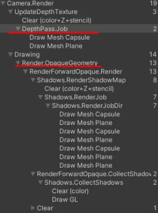

虽然这一pass并不输出任何颜色，也不做任何计算，但CPU依然需要向GPU传输相关的顶点信息。这实际上并不符合Zprepass的规范，是一种在不改动原有方式基础上的取巧用法，而代价则是渲染命令次数的增加。

#### Universal Render Pipeline（URP）

> · Why isn't the depth prepass actually used for depth testing? Will this change in the future?
> Long story but generally it comes down to our tech not quite being there for handling all the possible combinations of GPUs that we can expect URP to run on and being able to cleanly fallback when not. The answer is yes, we will support it being a true depth prepass in the future, but it is not too high up on the priority list ATM. In saying that I look forward to the speedup gains a lot of projects will get once this work is done.
> —— [Andre Mcgrail](https://link.zhihu.com/?target=https%3A//forum.unity.com/members/andre_mcgrail.1230277/)，Unity Technologies, Nov 13, 2020

URP推出后，原有的depth prepass被整合到Shadow map中（具体而言，与光照模型的LUT信息各占据两个相邻通道）。由于Unity依旧不具备对真正的prepass的支持技术，为了满足提取深度信息的需求，提供了一个深度复制通道，即Copy Depth。

Copy Depth，顾名思义，就是从前面已渲染的pass中复制深度信息，从而在不增加Draw call渲染命令消耗的情况下提取屏幕深度。由于Unity的prepass本身并不是符合规范的prepass，Copy Depth实际上复制的是Opaques Render Buffer中的深度，并因此将渲染次序置于在Opaques之后。

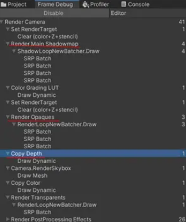

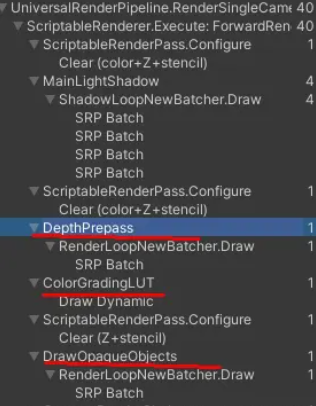

可以看到URP中Zprepass后面均做了Clear清除处理，实际上并没有参与深度测试。

Copy Depth在BRP时代就已出现，但由于这一技术的实现需要硬件设备的支持，出于兼容性上的考量，业界依然使用prepass方案作为深度获取的主流方案。新一代管线URP提供了一个名为`CanCopyDepth`的方法来自动检测环境是否支持Copy Depth，若结果为否，则进行回退并改为使用原有的Zprepass方案，从而实现了对Draw Call的部分优化。

```csharp
bool CanCopyDepth(ref CameraData cameraData)
{
    bool msaaEnabledForCamera = cameraData.cameraTargetDescriptor.msaaSamples > 1;
    bool supportsTextureCopy = SystemInfo.copyTextureSupport != CopyTextureSupport.None;
    bool supportsDepthTarget = RenderingUtils.SupportsRenderTextureFormat(RenderTextureFormat.Depth);
    bool supportsDepthCopy = !msaaEnabledForCamera && (supportsDepthTarget || supportsTextureCopy);

    // TODO:  We don't have support to highp Texture2DMS currently and this breaks depth precision.
    // currently disabling it until shader changes kick in.
    //bool msaaDepthResolve = msaaEnabledForCamera && SystemInfo.supportsMultisampledTextures != 0;
    bool msaaDepthResolve = false;
    return supportsDepthCopy || msaaDepthResolve;
}
```

不过，直到URP 12（随Unity 2021.2版本推出）之前，URP中的Depth Prepass实际上都不支持直接用于深度测试，均会在prepass后重新进行渲染。

#### URP12 （Unity2021.2+）

在URP 12中，这个“优先级并不高”的问题终于得到了解决。Depth Prepass的渲染结果现在可以被Render Opaques直接提取，用于深度测试。URP12提供了一套全新的方案，称为Depth priming（暂译深度启动）。

深度启动，顾名思义，就是从深度开始的渲染方式。通常情况下，shader的各个pass独立决定是否开启深度写入和深度测试，只有运行至该pass时才能得知是否使用；而Depth Priming则使用了一个独立的通道`DepthOnly pass`处理深度写入和测试，将其他pass的写入关闭，比较方法设为equal，从而使任何pass执行的shader计算均是最终显示在屏幕上的结果所需的计算，几乎完全消除了Overdraw现象，而代价只是增加`DepthOnly pass`所带来的一倍drawcall，计算量极小。

> unity的测试结果显示，使用Depth priming后，Mac提升16%GPU耗时，windows vulkan提升3%CPU和7.5%GPU。对CPU的提升在于不需要对不透明排序，对GPU的提升在于消除不透明物体的overdraw，对半透渲染没有做修改。

当然，Unity同样提供了自动识别功能，用于判断当前环境是否支持Depth priming，并提供了一个类型参数供开发者自行决定是否强制启用该技术。当Depth Priming不启用时，Unity将回退并使用传统Shadow map方案，且该深度不会被深度测试读取。

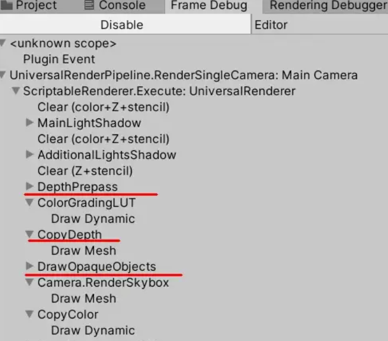

可以看到，启用了Depth priming的Frame中，Depth Prepass之后不再进行清除操作，Copy Depth也不再依赖于Opaque的深度渲染结果，转而直接提取Depth Prepass中的深度，渲染次序也重新回到Opaque之前。

## 总结

unity中，使用深度很简单，能做很多效果，深度的概念也不难理解，但是深度有一些容易忽略的细节，深度缓存和深度图的概念容易混淆，造成混乱，所以总结一下，做个备忘。

**先看看深度的作用，有两方面**

对GPU层减少计算量，并且保证正确的遮挡关系，不渲染不可见的像素，通过深度缓冲实现。逻辑层可以利用深度实现各种后处理效果，通过深度图实现。

也就是说深度会存储在两个地方，分别被GPU和引擎使用。

**GPU使用深度缓冲**

由GPU管理，存储每个片段的信息，由窗口系统自动创建，深度值可以存储为16,24或32位浮点数。在vulkan接口中，深度附着和颜色附着一样都是VkImageView对象，精度通过VK_FORMAT_设置，可带模板值，在unity中没找到设置的地。

深度值保存为非线性，相机近裁剪面精度高，远处容易出现zfighting。

使用深度缓冲时，渲染效果不依赖物体渲染顺序，就可以实现正确的遮挡关系，但在实际渲染中，还是从近向远渲染的，原因是每次更新深度值，也要更新对应的颜色buffer，先渲染近的，颜色buffer更新的次数就少了，相当于降低了overdraw，并且显卡还有early-z的功能，进一步减少overdraw。

unity中不能设置精度，只要开启zwrite，顶点shader计算坐标，深度值由GPU自动计算并存储。

**引擎使用深度图**

很多后处理效果都需要深度，但是深度缓存是不能直接用的，如果硬件支持可以拷贝到texture。在延迟渲染时可以直接从gbuffer获取，不需要额外操作。

深度图和深度缓存不同，zwrite off可以关闭写入深度缓存，但还会写入深度图。_CameraDepthTexture本身是渲染得到的屏幕纹理，和zwrite并没有直接联系。

默认管线通过camera的depthTextureMode自动设置精度和格式。URP copyDepth的方式下，在CopyDepthPass，Configure时设置了depthBufferBits为32位，depthOnly方式也是32位。

**深度冲突**

原因是精度的问题，可以说精度是图形学的一个大问题，硬件限制，没有完美的解决方案。

几个解决方法

远近平面设置的范围小些，变相提升了精度

物体之间不要靠的太近，人工处理，能解决绝大部分问题。

设置offset指定片段深度的偏移量，没用过这个方法。

------

## **看似简单，实际并不简单的深度值**

**第一个需要注意的点，深度存储时不是线性的。**

本质上来说，深度值就是坐标z值，但是坐标要显示在屏幕上，经过了好几步变换，最终，大佬们选择了NDC下的z值，因为使用深度的目的，是表示出像素在摄像机远近裁剪面内，距离相机的远近，用0~1之间的比例就可以，其他坐标系并不适合。这就带来一个问题，3D场景通常都用透视相机，而坐标经过透视投影后，并不是线性的，细节和推导看这里，https://zhuanlan.zhihu.com/p/66175070。简单的理解，就是透视投影下，3D场景变成2D图片时，相当于把远平面上每个像素压到近平面，是个缩放的过程，那自然近平面没有缩放，越远缩放越大，精度也就越低，比如远平面是2*2，近平面是1*1，那远平面压缩后，坐标都变换到1*1的范围，相当于远平面丢失了一半精度。

**提升精度的一个方法Reversed-Z**

非线性的存储方式，带来一个好处，就是离相机近的精度高，这也符合我们的需求，但是坏处是远处精度就低了。

之前在不同API，对精度的存储范围不同，DX1~0，OpenGL-1~1。为了提升精度，提出了反向z的方法。完整的解释看这里[https://cgvr.cs.uni-bremen.de/teaching/cg_literatur/Depth%20Precision%20Visualized%20-%20NVidia.pdf](https://link.zhihu.com/?target=https%3A//cgvr.cs.uni-bremen.de/teaching/cg_literatur/Depth%20Precision%20Visualized%20-%20NVidia.pdf)。实现的效果就是让精度分布更平滑，远近平面都达到比较好的精度。

unity对不同平台的处理，[https://docs.unity.cn/cn/2019.4/Manual/SL-PlatformDifferences.html](https://link.zhihu.com/?target=https%3A//docs.unity.cn/cn/2019.4/Manual/SL-PlatformDifferences.html)。

这个博客也对反向z有比较清楚的解释https://zhuanlan.zhihu.com/p/75517534。

还有这个博客，[https://outerra.blogspot.com/2012/11/maximizing-depth-buffer-range-and.html](https://link.zhihu.com/?target=https%3A//outerra.blogspot.com/2012/11/maximizing-depth-buffer-range-and.html)太复杂了先收藏。

这部分推导有点复杂，记住结论就好了，unity也给封装好了。

------

## **early-z的一些理解**

看名字就知道，提前进行深度测试，那提到多前呢。正常情况下，深度测试在ps之后，也就是ps里那一堆代码已经执行了，只是最后没显示，那如果可以在ps执行前就判断出是否需要执行，就可以提高效率，所以就出现了early-z的方案，这是由GPU执行的，在光栅化之后，只要得到了深度值，就可以执行了。

这个功能是GPU提供的，不同厂商实现还不完全一样，也在不断改进，用的时候还是要多测试。

高效的使用方法，是结合pre-pass，只计算深度，会增加drawcall，但对于vs和fs都复杂的shader，性能有提升。但是多pass会打断动态批处理。

有两种情况会打断early-z，一是深度值在fs之前不能确定，比如fs中修改深度。二是最终像素是否显示不完全由深度决定，比如开启alpha test或clip等，或是关闭了深度测试。

这样看起来如果开启了early-z，那么对不透明物体的排序似乎就没什么必要了，vs是一定会执行的，fs执行不执行和排序也没关系，查了一些资料，发现排序的好处好像只有减少了写入深度缓存的次数，但是这个和排序相比，哪个消耗更小，还没想到方法确认。但是在实际项目中，很难保证没有打断early-z的情况，所以排序还是应该有的。这部分不知道理解的对不对，没找到特别准确的资料。在unity中，如果硬件支持HSR，就不排序，否则排序，这么说来排序的消耗应该是小于多次写入深度的。

------

## **生成深度图的几种方法**

因为延迟渲染下，深度从gbuffer获取，没什么要点，下面说的都是针对forward渲染。

**内置管线默认实现**

是否开启通过Camera.depthTextureMode。如果shader中有依赖深度的计算，则会自动开启，如果要用自定义的深度图，一定要确保不会开启默认的方法，否则自定义的计算就没意义了。

实现方式是利用shader Replacement将RenderType为Opaque、渲染队列小于等于2500并且有ShadowCaster Pass的物体的深度值渲染到深度图中。

缺点是消耗很大，不透明物体drawcall翻倍。在移动平台不是很实用。

**基于shader Replacement自定义**

和默认管线类似，但是更可控，可以只给大的物体写入深度图，减少一部分drawcall。缺点依然是drawcall会比较多。

**从framebuffer取深度**

实现看这里，https://zhuanlan.zhihu.com/p/61563576，原理是设置Camera的buffers，让camera把color和depth渲染到我们指定的rt上，这样drawcall不会翻倍，但缺点也有很多，unity推出SRP后，用SRP的方法更高效。

URP也实现了一个从framebuffer取深度的方法，需要硬件支持，效率比较高。之前博客做过总结，这里不重复了。

------

平时写代码，只需要设置zwrite，shader里读几个texture就完了，在背后，一个深度就有这么多细节，这也是图形学的难点所在吧。